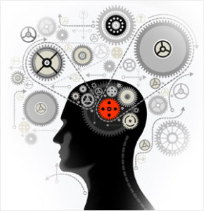

Systems thinking helps tackle complexity in various projects: it allows you to focus on all the important aspects while temporarily discarding the unimportant ones, yet maintaining the overall integrity of the situation by considering the interrelationships of these separately thought-out important points. Systems thinking occurs through model-thinking (with texts in formal languages or data in tables) and writing (with texts in natural languages, but with tracking object types and object relationships in these texts), thus attention is not only drawn to important subjects but is also maintained throughout the project: what is written down is not easily forgotten in the hustle. Furthermore, systems thinking allows for creativity: in its informal part, it enables guessing possible solutions to improve the world, while in the formal part, it critiques these solutions so that those surviving criticism can be taken seriously, as a foundation for collective actions. Systems thinking manages the attention of many people in complex collective projects, focusing the collective attention on important matters and saving time by excluding the unimportant from consideration.

For students of various specializations, systems thinking allows retaining in mind and recordings their projects in all their vibrant complexities, linking theory and life. For experienced engineers, managers, technological and corporate entrepreneurs, researchers, creative professionals, and public figures, systems thinking organizes their life knowledge. This thinking is a cheat sheet, reminding of forgotten matters, and quickly burying bad projects to avoid wasting resources.

Ours is not a systems analytics course (often confused with systems thinking), as systems synthesis is equally emphasized. Systems thinking is practical, cultural, stylish, and active, because the creation and development of systems occur through various methods, practices, cultures, and work styles, types of activities/labor/engineering, but we discuss all these work methods using the concepts of systems thinking. This is fundamental, universal thinking.

The course also shows how systems thinking allows thinking more or less the same way about objects of various complexities, such as inanimate matter, living beings, cyber-physical systems, personalities, organizations, communities, societies, and even humanity as a whole. This happens because systems thinking, on one hand, pays great attention to the scale of objects, and on the other hand, system reasoning itself is scale-independent, just scales are its subject matter. Systems thinking is universal and scale-free, allowing one to consider different objects of various scales in a single discussion: it is precisely for such coordination of different objects in complex projects that systems thinking is intended.

Systems thinking does not depend on which powerful intelligent agents are engaged in it—humans, AI-agents, or even collective agents (organizations of many people, AI-agents). It is non-anthropocentric, and our course takes this into account.

Taking the systems thinking course implies some experience in complex collective projects from real life (not simple "training projects" for one person, but "real," collective working projects, where results are valued enough for someone to pay for them!), experiencing complexity face to face in life—the complexity examples in systems thinking mainly relate to life examples, not “textbook cases,” as “textbook cases” are weakly linked to real-life situations. In the online systems thinking course, you will do a lot of modeling (unfortunately, there are no modeling assignments in the book), i.e., not only ‘learn systems thinking’ but also practice it, ‘think systematically through modeling.’ Further in your work and even ‘just in life,’ you will do exactly the same as in the course: fill in tables, which will be your systems thinking. We hope you won’t even notice that you are ‘thinking systematically,’ it will be just ‘filling in fairly simple tables, though each time this filling will require some thought.’

The course lays ‘rails’ for thinking, which after some training allows quickly and automatically evaluating situations in real-life collective projects. Systems thinking avoids ‘reinventing the wheel’ in dealing with complexity, substituting difficult and slow ‘thinking off-road’ with light and quick ‘thinking on rails,’ quickly utilizing the best thought techniques devised by civilization. Much of what seems like creativity to others for a systems thinker is the fluid application of thinking patterns, saving time for inevitable real creativity. There will always be situations in life that are not covered in textbooks for the subject area you are engaged in. The systems thinking course helps in precisely these situations. Just as mathematicians do not reinvent the idea of integration each time, systems thinkers do not reinvent the idea of differentiation between functional and constructive system descriptions, distinguishing a target system from a creation system, and a couple of dozen other useful ideas. And this is done in various projects for different systems, connecting situations described in various specialized textbooks.

The main task of the course is to gather concisely in one text (a "body of knowledge," analogous to an "aggregated body of laws" that accounts for the current configuration of normative texts with all updates, additions, exclusions, suggesting some completeness of coverage of the subject area and official status—handled by a methodologist, which is methodological work) and to explain (to bridge the "conceptual distance"^[<http://wiki.lesswrong.com/wiki/Inferential_distance>] for understanding, work of a curriculum designer) the "minimum thinking" on systems thinking, usually scattered across various sources of knowledge. The specificity of our course is that its content is based not so much on traditional academic literature of the last century on general systems theory or traditional management textbooks but on modern engineering and scientific literature of 2017–2023, as well as, to a slightly lesser extent, on international standards and public documents of systems engineering and enterprise engineering developed or updated in the last five-six years (ISO 15288:2023, ISO 42010:2022, ISO 15926-2:2003, IEC 81346-1:2022, OMG Essence:2018). The course considers the latest research on the physical foundations of biology, including explanatory theories of evolution occurring at different system levels. This is presented in the course not very thoroughly ( more thoroughly, it can be found in the "Intellect-Stack" course), but all necessary references are provided for curious students to explore further on their own. The course material presents a scale-free (from molecules to humanity as a whole) version of systems thinking and a de-anthropomorphized (no assumption that a rational agent is necessarily an individual human) version of methodological thinking.

The course is based on the experience of teaching systems thinking both in numerous universities (annually since 2012) and in qualification enhancement systems for engineers, managers, technological entrepreneurs, teachers, and people of various other professions, particularly in the School of System Management^[<http://system-school.ru/>], where the author serves as the scientific director. The online course contains many questions with the author's answers, as well as modeling assignments (modeling situations in students’ work projects), so the course serves as something like a “help” to these assignments. Our experience shows that merely reading a textbook does not teach systems thinking, but systems thinking itself (in the format of model-thinking with structured texts and writing-thinking with unstructured texts in natural languages) does, if it is based on reading course materials and completing assignments.

The exposition of the systems approach is given universally for engineers of "hardware" and software systems, managers and business owners, cultural figures, politicians, and people engaged in a variety of other applied labor roles. However, knowledge of methodology, systems engineering, personal engineering, and system management must be obtained from separate courses, the systems thinking course is a prerequisite for these courses. Additionally, separate applied courses must be taken on various applied work methods. “How should I deal with this problem in my project” is usually resolved using systems thinking, organizing the application of applied skills in various types of work, but not replacing the applied skills themselves. Systems thinking will allow you to quickly solve your piano playing problems, but you will still have to learn to play the piano—and the same applies to robotics system engineering. You will solve problems faster, but you will still have to learn how to create these systems, miracles do not happen.

To enhance your intelligence, you need to take many courses, as one systems thinking course does not cover all the fundamental methods of thinking included in the intellect stack (systems engineering, methodology, rhetoric, ethics, aesthetics, cognition/research, rationality, logic, algorithmics, ontology, theory of concepts, physics, mathematics, semantics, composure, concept-formation). But the "Systems Thinking" course touches on large chunks of these methods, so the course can be attributed to the courses on enhancing intelligence.

The course text in this edition has been practically rewritten for the ninth time: the first two versions were in 2014 and 2015 for the “Systems Engineering Thinking” course, then the "Systems Thinking" book was published in February 2018 in Ridero (and simultaneously a course was released on Coursera), a fourth revision was made in July 2019 (around 120 new pages were added, and the terminology was simplified), and an online course was launched at the School of System Management. The fifth revision was in August 2020, considering the experience of conducting lessons and releasing the "Education for the Educated 2020" course, where the place of systems thinking in the general intellect stack with other fundamental methods of the intellect stack was clarified. In the sixth version of 2021, the terminology was simplified again, and changes were made to keep the material relevant.

In the seventh edition of 2022, the main change was the separation of the material about "non-life cycle" into a separate methodology course, as well as adding the course materials on scale-free and de-anthropomorphized thinking, supported by modern findings not only in engineering and management but also in physics and biology. The course was named "Practical Systems Thinking" to reflect the proactive/enactive nature of the agents changing the world. This exposition was already based on the third generation of systems approach. Activity/labor/practice/engineering in this course version became synonyms, referring to the work of creation systems on target systems.

After the release of the seventh edition in 2022, courses "Methodology," "Systems Engineering," and "System Management" were developed, reflecting changes in systems engineering and management methods that occurred in recent years: first of all, the shift toward “continuous everything,” the disappearance of requirements engineering, and the final separation of architecture from development (including the separation of the concept of the system and architecture). Therefore, in January 2023, the text of "Systems Thinking" was rewritten for the eighth time to align it with the new methods of systems engineering and management. The shorter title "Systems Thinking" returned, the section "Requirements and Architecture" was removed, and a new section reflecting the third generation system approach ontology instead of the glossary was added. The ontology of the service was clarified.

In May 2023, further changes were made, effectively starting the ninth rewrite: it was strictly forbidden to consider the behavior (processes) of any system as systems (but if necessary, it was recommended to gather a new system from all the interacting systems during these processes, thus acquiring new properties, and it will behave differently due to emergence). The example of social dance was rewritten (the word “dance” was tabooed, now the dancer dances). The theatrical metaphor became a role-playing game metaphor. Many typographical errors and small mistakes were corrected. The course titles “Ontologic and Communication" and “Composure” were corrected to the combined “Modeling and Composure.” And even the old course title "Systems Thinking" returned (for a couple of years the course was called "Practical Systems Thinking"). In December 2023, the rewrite continued aiming to improve understanding, adding many questions, exercises, assignments. The appearance of the "Personality Engineering" course was considered. The course was divided into smaller sections, increasing from 8 to 12. The course “Modeling and Composure” was renamed to “Rational Work.”

Many clarifications and explanations were made: the concept of affordance was clarified, a "systems mantra" was given, warning about the potential confusion of different types of relationships for sub-roles—specialization and composition, the main term instead of "practice" became "method" and added synonymy of method (culture, style, strategy, and even service), the concept of "method/service subject" and its synonymy with alphas was introduced, the term "technologies" was tabooed and replaced with "tools," synonymy of disciplines/theories/explanations/knowledge/algorithms was added, the intellect stack is now the stack of thinking methods (rather than disciplines), the concept of techno-evolution was clarified, four main alphas instead of three were proposed. The text volume increased during the rewrite mainly due to additional explanations and examples. New assignments were also added. The "doctoral" section "12. Instead of a glossary: third-generation systems approach ontology" offers a hypothesis that the fourth generation systems approach will appear after the emergence of unified classical semantics based on semiotic (sign, local) representations and distributed (as in neural networks) representations.

The course introduces the concepts of the system usage concept and system concept, architecture, success justifications, configuration, work management, other traditional and relatively new systems engineering and system management concepts directly following from the systems approach. But the course does not cover how to develop high-quality system concepts and architecture, how to thoroughly justify system success, i.e., the course does not contain descriptions of modern systems engineering methods and applied engineering methods of cyber-physical systems engineering, software engineering, systems management, cultural construction, technological entrepreneurship, and social engineering. Studying such methods, even at a broad level, typically requires additional extensive efforts and separate courses. The "Systems Thinking" course is part of the educational program "Organizational Development," where the student learns how to:

- **focus their attention** and that of other **agents** on objects from an explicit specification (ontology), i.e., focus attention conceptually, not spontaneously, and also **maintain** conceptually focused attention on various time scales, including collective attention in agents such as a team or an entire enterprise through leadership, or influence on a community or society (course "Modeling and Composure"),
- focus attention on **systems** (our course "Systems Thinking," which we are currently discussing),
- focus attention on **methods** by which **systems creators** conduct work (course "Methodology"),
- structure **activities and roles**, necessarily maintained within attention during **systems engineering projects** (course "Systems Engineering"),
- teach the **skill** of performing activities (course "Personality Engineering"),
- direct their and **organizations’** (teams, groups, enterprises) attention to objects described by a **specialization** of the systems ontology for such systems creators as organizations (course "System Management"),
- enhance their **intelligence/thinking skill**, using the best current methods of thinking (SoTA, state-of-the-art) (course "Intellect Stack").

The course requires readers to know English. The text of the course is in Russian, but most references are to English-language materials: there are many primary sources (about 400 literature references), and they are modern, not yet translated and published in Russian.

The course follows a presentation method in which the material is repeated several times in different parts of the text—with varying levels of detail. The principle of "said once in one place" (as in encyclopedias and reference books) is deliberately not followed; this is an educational course, not a reference book. This increases the text volume but significantly facilitates understanding and memorizing the material through spaced repetition. The total volume of the course, including assignments, is about 2.5 million characters with spaces, shorter than the quite manageable for many generations of schoolchildren (even not in the final grade) novel "War and Peace," which is 3.0 million characters^[<https://otvet.mail.ru/question/54668490>].

After mastering the systems thinking course material, we recommend continuing education by studying the "Methodology," then courses on engineering methods—“Systems Engineering,” “Personality Engineering,” “System Management.” This direction can be called **“the devil in the details”**: delving into studying specific engineering, managerial, creative, social work methods, i.e., studying specific applied work methods. This is traditional training in engineering, management, and other specializations linked to real life. Systems thinking will allow maintaining the integrity of the studied set of broad and applied work methods and transferring accumulated experience from project to project. This is the education of an engineer, manager, entrepreneur/founder of companies, cultural figure, public figure/politician, etc.: a person who has mastered systems thinking and uses it to improve the world.

But an alternative option can also be proposed, **“angel in abstractions”** ("knowledge of principles frees from the knowledge of facts"): generalizing the proposed systems thinking to increase fluency in using its techniques and extending it to various types of systems—for expanding systems thinking to new work methods, new classes of systems (e.g., machine learning and artificial intelligence systems, youth subculture systems, etc.). In this direction, you can deepen your knowledge of fundamental thinking methods of the intellect stack, for which we recommend taking the course "Intellect-Stack." This is the education of a person engaged in endless cognition, endless development. A good support on this path will be studying the literature mentioned in the course, especially the literature from the last section of the course (this section is “doctoral,” not “master’s” level).

Active participation in the course material preparation was taken by teachers, graduate students, and students of the MIPT Department of Technological Entrepreneurship, teachers, students, and graduates of the School of System Management, the Directorate of the Russian INCOSE Section. Without their active participation, this course would hardly appear in its current form.

Many thanks for the principled questions reflected in the course, to participants of educational programs on systems engineering at Ural Federal University, MIPT, MEPhI, Siberian Federal University, MIET-RTU. Course materials were repeatedly discussed at meetings of the Russian sections of INCOSE and SEMAT, the author expresses gratitude to members of these international organizations for numerous comments and suggestions. Many valuable remarks were presented by readers of the author's blog ([http](http://ailev.livejournal.com)[://](http://ailev.livejournal.com)[ailev](http://ailev.livejournal.com)[.](http://ailev.livejournal.com)[livejournal](http://ailev.livejournal.com)[.](http://ailev.livejournal.com)[com](http://ailev.livejournal.com), the blog is mirrored on Telegram, Facebook, VKontakte, Freefeed). Thanks to Roman Varyanko for prompt proofreading and valuable substantial comments, Viktor Agroskin for help in debugging the course ontology, Yulia Tchaikovskaya for proposing successful terms.

A support chat for the course exists on Telegram, common for the courses of systems thinking, methodology, systems engineering, personality engineering, and system management: <https://t.me/systemsthinking_course>

A two-volume version of the course (due to its large volume) has been published by Ridero^[Volume 1: <https://ridero.ru/books/sistemnoe_myshlenie_2024_tom_1/>, Volume 2: <https://ridero.ru/books/sistemnoe_myshlenie_2024_tom_2/>], which can be used as souvenir products for lovers of electronic and paper books, as well as a gift option. The text of the books changes less frequently than the course text (it's impossible to quickly replace a book), and the book does not contain questions with the author's answers. We recommend taking the online version of the course.