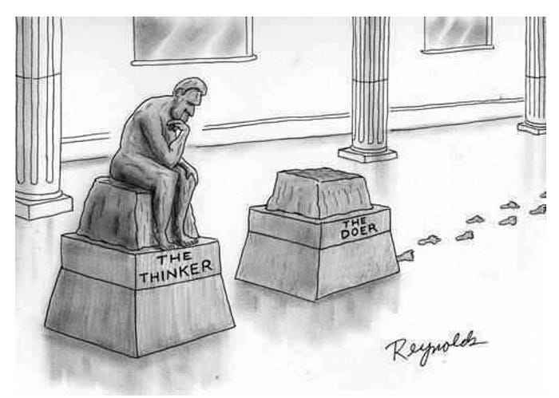

In this world, intelligence solves problems concerning inanimate objects, living beings, intelligent beings (humans), organizations of these people, communities and societies in this world, as well as models of the world in humans and computers. Thinking here is quite active and initiative: it involves the actions of people and robots and their organizations and communities with the world and models of the world. To think about something, one needs to look at it, and for that, to turn the head. These actions "turn the head and look," and sometimes even "fly to the Moon and look" or even "send a robot to the Moon and look through its instruments," we also include in thinking. Thinking as proactive cognition includes bodywork as well as exo-bodywork.

Thinking is the behavior of intelligence at the moment when it tries to find ways to solve problems it has not encountered before^[François Chollet, On the Measure of Intelligence, <https://arxiv.org/abs/1911.01547>]. Thinking is a practical/active calculation/reasoning that can lead to changing the physical world. Intelligence is thinking craftsmanship, a part of a personality. Intelligence is embodied in the brain and body or even jointly working brain and computer (exocortex), body, and tools (exo-body), a generalized computational device, a "brain with eyes, ears, legs, and arms, computers and tools.” We shall further call such a computational device "creator/constructor." A computer primarily processes information using some algorithms/knowledge from methods/ways of calculations, while a creator uses some algorithms/knowledge from methods and tools/instruments/equipment, ultimately not only "reasoning" but also "acting," i.e., changing the physical world. If we talk about a part of the creator that implements the computational part of the algorithm, we call it **mastery** in the method of work. Intelligence is sometimes considered solely as mastery in thinking, working with information about the surrounding world, and sometimes as mastery in changing the surrounding physical world (i.e., it includes not only the functions of creating applied methods but also the functions of these applied methods themselves). We will often talk about intelligence as mastery working with world information/descriptions to create other skills, and when it comes to changing the world, we will talk about a whole agent (including the personality consisting of numerous skills, including intelligence within these skills, and also the body/organism with tools). Nevertheless,---a computer— is also material, information processing takes place in the physical world.

We consider Intelligence::computer to consist of two parts:

- **Innate/hardware**, determined by the biological features of the human brain and body or the design features of computer hardware implementing artificial intelligence (AI). The brain and body provide significant capabilities (compare human intelligence and that of a chimpanzee, a pocket calculator and a datacenter with an AI program), but they also significantly limit these capabilities (compare a human’s intelligence in tasks like multiplying and dividing large numbers and a completely non-intelligent electronic calculator; a well-trained artificial neural network can communicate well but poorly multiply and divide large numbers unless it refers to a separate calculator program).
- **Learned/acquired/software/“virtual computer”** during familiarization with human culture. This also pertains to AI, since AI learns from vast arrays of knowledge accumulated by human civilization. In more or less intelligent AI implementations, it’s about text collections with a total volume of tens of trillions of characters. This “learnable” part of intelligence includes proficiency with a limited range of thinking methods, having as their subjects the surrounding physical world.

We do not make assumptions about how intelligence is physically structured, from which parts of the brain and body it is composed, and how they are connected, although we do speculate here about the fundamental thinking methods of the intelligence stack. This is discussed in more detail in the first section of the course "Intelligence Stack."

The ability to think using thinking techniques from the fundamental methods of the intelligence stack distinguishes the intellect of a modern highly educated person (and not only a person but also AI) from the intellect of a savage or the simplest AI systems of past generations. The “hardware” of intelligence in the bodies of a prestigious American university professor and a jungle savage from the Amazon is the same. But as explanations of how the world is structured accumulated, people (and AI as well) gained the ability to enhance intelligence through learning: both knowledge/explanations/algorithms of thinking and tools changed—thinking is now performed not by just the bare brain (just as work is not performed by bare hands), but with the use of models and other means expanding the brain's hardware capabilities.

The intelligence of an uneducated savage is significantly lower than that of an educated person precisely because of the lack of training in the intelligence stack’s thinking methods. If the savage is educated, he too will be smart! Without education, a savage cannot **quickly** solve even one-hundredth of the tasks an educated person can solve. Moreover, an educated person will also have time to use means to speed up problem-solving: laboratory equipment for obtaining experimental data, Google, or ChatGPT for “loading” the missing knowledge.

The key word of the previous paragraph is: **quickly**, because while solving a problem, time can be added for the savage’s education, which the educated person received. If an educated person solves a problem in 10 minutes, the savage can solve it within 10 years of education plus those 10 minutes. **Intelligence** is **largely** **learnable** **and can be enhanced instrumentally; a small part is innate!** This largely explains why high IQ as a measure of the biological brain's capabilities for calculations/reasoning does not strongly affect productivity in business, engineering, and science^[<https://www.quora.com/What-was-John-von-Neumanns-IQ-Was-he-smarter-than-Einstein>
--- the comparison of Albert Einstein and John von Neumann, both were geniuses. Neumann was recognized by everyone as very smart and fast, clearly smarter and faster than Einstein, with an obviously higher IQ. He also had countless scientific achievements. But Einstein was recognized as a slower but deeper scientist by everyone. Depth and novelty of ideas were taken into account, not the speed and quantity of produced ideas, which often would not pass the test of criticism and experiment. The IQ of another physics genius, Richard Feynman, was 125, <https://www.quora.com/Was-Richard-Feynmans-IQ-really-125>. It turns out it’s not about having a high IQ, but about how you use your brain! If you use your brain correctly, a small IQ is enough to make a mark in history. If not, even a high IQ won’t help change the world for the better. And IQ certainly does not determine how good a person you will be.].

And remember, as a savage becomes frighteningly formidable when holding a grenade, so too can he enhance his intelligence if he has a computer artificial intelligence and other tools obeying him. But a savage will not be able to work with a complex computer and challenging tools, so he still has to study to enhance intelligence—you won’t become smart just by using a computer, you simply won’t be able to use it. To enhance human intelligence, both human education and a powerful computer with AI are needed!

In the course of human civilization development, it became clear what useful properties we demand from thinking produced by someone's intelligence: **thinking must be** **systematic,** **abstract, adequate, conscious,** **rational, and this is not the entire list!** As already mentioned, there is a quite large list of thinking methods; some techniques can be selected from these methods, giving desired useful thinking results and avoiding techniques that do not provide these useful results.

**Systematic thinking** means that the whole world is thought of using system approach concepts as consisting of interacting systems nested within each other in "part-whole" relations, and several different ways of distinguishing parts from wholes can be proposed (functional parts, structural parts, spatial parts, value parts, etc.). If we agree on how exactly the world is divided into which systems, we can change the world collectively, and if we don't agree, there is a high chance everyone will change the part of the world they like, but together these changes won't yield the desired result. The concept of the system is discussed in the intelligence stack in physics, the part-whole relationship in ontology, ways of dividing into parts needed for activity in methodology, engineering work techniques in scalp-free systemic engineering. This system engineering further specializes for systems of various system levels/organization levels/evolutionary levels: management as organization engineering, personal engineering, social engineering as community and even society engineering. All these different kinds of engineering need to present their target systems as well as creating systems as systems, requiring systematic thinking.

**Abstractness** is the main criterion of thinking. In thinking, we need to abstract from the unimportant and focus on the important. Thinking models the world, not reflecting it with all unnecessary details. Thinking must separate the wheat from the chaff and deal with the wheat. Thinking must know how to disconnect from individuals and think in types, prototypes, abstract concepts: we require some generalization leaving out details unnecessary for the subject of thinking, substantially simplifying mental calculations and learning to think. We need abstractness in complex situations; we want to be able to plan and design ahead, we want to work with whole classes and types of situations. Without abstractness, we cannot transfer experience from some situations to others, we cannot effectively learn, we cannot create languages serving collective thinking—languages allow us to exchange the most important ideas about contemplated situations, clearing communication from irrelevant details. Abstractness is discussed in concept formation, mathematics, ontology, logic.

**Adequacy** is the ability to check whether our abstract thinking and the descriptions of situations it generates are connected with the real world or if it was detached from the tangible/physical world, and we lack ways to verify its results, relate its results to reality. Are our mental representations of situations adequate to the real (i.e., existing independently of us, material/physical) world? Or does thinking deceive us and offer some inadequate representations? We need practical thinking applicable for action, we want to be adequate and not detach from reality. Adequacy is discussed in semantics, physics, ontology.

**Consciousness** is the ability to understand how we think, how we reason. If we simply "have intuition," this won't satisfy us. We won’t be able to teach others to think, to teach them to repeat our reasoning. We won’t be able to notice an error in our thinking, we won’t be able to improve or change it, or learn another way of thinking since we won't notice it, won't be aware of it. We won’t be able to focus attention on thinking since one cannot focus attention on what one is unaware of. We won't be able to present our unassumed thinking for critique from logic and rationality, we won’t be able to consciously decide that in a particular situation, an intuitive guess from thinking is enough, instead of strict rational reasoning. We want to know what we are thinking about and how we do it, we want to be able to choose—to think about something or not, we don't want to be unconscious thinking automata. We want to be conscious in thinking; we must consider not just thinking but also the existence of the thinker themselves as an intellect generating thinking::calculation. Consciousness is discussed in concept formation, collectedness.

**Rationality** is the ability to make decisions based on reasoning by rules, logical reasoning. It is the ability to detach from one's biological and social nature, avoiding related mistakes. Rationality is the ability to verify results of fast intuitive thinking generating guesses for errors and rule violations, the ability to use human experience in reasoning. It is the ability to explicitly (at least in a dialogue with oneself, being aware) discuss these rules of good thinking developed by civilization, discuss the logical bases of thinking, discuss the permissibility or impermissibility of using certain thinking techniques. We do not want thinking errors, so we must be rational; we must be able to recognize thinking errors in ourselves and others; we must be able to express thinking results so as to minimize errors in the perception of our results by others. We aim to be rational, we need to be able to divide tasks into parts (ra·ti·o after all means "division"), we do not want sheer intuitiveness or sheer emotionality-spontaneity, though we do not deny their necessity, but above all, we need civilization in thinking, using the best achievements of civilization in how to think. Rationality is discussed in logic and also in a thinking method called "rationality." Rationality as a thinking method studies generating guesses-options in decision-making based on some models, and also includes decision theory studying making the best activity decisions. All decisions are about changes in the self-model, world model, degree of confidence in the accuracy of the self and world models, self, or world changes, which is studied by the active inference approach^[<https://ailev.livejournal.com/1611838.html>, <https://ailev.livejournal.com/1612513.html>].

All other **criteria for strong thinking** are usually particular variants or combinations of the presented criteria. Thus, **"strong thinking"** is generally reduced to high characteristics by all criteria (thinking of strong intelligence), **"wisdom"** is simply other words for adequacy and systematicity, **"creative thinking"** is correct abstracting and making hard-to-criticize guesses about important objects, **"reflection"** is consciousness, but not in the current situation, but the past.

It’s easy to come up with some other selection of "thinking" as particular thinking methods from the full set of intelligence stack methods—similar to how "systems thinking" was selected. Remember: method/practice/culture/style is theory/knowledge/algorithm/ "academic/scientific discipline" as thinking techniques about some important objects, with thinking techniques supported by mastery calculations and also by tools, such as modelers for recording representations of thinking objects and operations with them.

You can easily imagine such a selection of thinking techniques from the complete set of intelligence stack methods as "actionable thinking." **"Actionable thinking"** will mostly include rational thinking with an emphasis not so much on cognition as on going into (engineering) projects for changing the world, using applied methods of systemic engineering in its application to some specific types of systems. It can also be called **“entrepreneurial thinking,”** in the common sense of the word "entrepreneur." In actionable/entrepreneurial thinking, one system decides how to change the world, including itself—"undertake something," create or change some system, undertake an engineering project, or "explore the possibility of beneficially changing the world," which can also be described as **"research thinking."** Actionable thinking can also be called **"labor thinking,"** it will also be **"practical thinking,"** **"proactive/enactive thinking"** and even just **"engineering thinking,"** because every engineer takes a step into the unknown, planning a useful future world change
(entrepreneurial/proactive/creative/research/action/cultural step), then performing the actual change ("working" part of engineering, "manufacturing"). Why all this is more or less synonymous will become clear while studying the course; these are all references to the discipline of methodology, the doctrine of action.

Thinking is not "passive" or "analytical"; the result of thinking is not a "computer output" in the form of an "analytical report on thoughts." No, thinking is proactive/actionable/practical/labor/engineering, and this also applies to systems thinking. **We don't have a "systems analysis," but a "systems thinking"; thinking changes the world, not just "understands the world"!** **If your systems thinking is not aimed at changing the world for the better, then it is hardly systems thinking!**

(image by Dan Reynolds^[<https://en.wikipedia.org/wiki/Dan_Reynolds_(cartoonist)>])

We do not mean that an agent (a person or AI, or human-computer cyborg, or even an organization) with strong intelligence, capable of thinking abstractly, adequately, consciously, rationally, and systematically, can solve any task. No, for this, they need to have not only the thinking mastery of the intelligence stack but also the mastery of **subject-specific/applied** (domain-specific) **reasoning**—for applied (i.e., used in work projects) methods/“types of (engineering) labor.” To survive, both as an "organism" and as a "species," an agent needs to be practical/actionable/entrepreneurial/creative/proactive/enactive. This reasoning can also be applied to the whole ecosystem since all species evolve interdependently; this applies to both Darwinian biological evolution and techno-evolution.

Each type of labor/activity has its specific subject-specific/applied reasoning and actions performed by that functional part of the brain and body we would call applied mastery in relation to thinking mastery. Applied mastery is important; it allows reasoning quickly and without typical errors for beginners in these types of labor.

In general, systems thinking gives a small set of types, which allows quickly orienting in a situation. It is such a high-level (high level of abstraction, meta-meta-model) model of the situation, a “map.” The map does not tell where to go, but knowing the map helps not to get lost, not to step into a swamp. The map, of course, can be used to look at it before bed, many people like this, they collect atlases. From a meta-meta-model perspective, these are analysts, who do not act, do not change the world. They are just “couch analysts.” No, systems thinking is used differently:

You focus attention on some objects in the world, the types of these objects are set by the meta-meta-model. Essentially, you have a map, and you “navigate the terrain”: identify the objects in the terrain with objects on the map. Hooray, now you know where you are (and if some objects are not found, but they are on the map—you know where to look for them).

But now you should know where you actually need to go. And you can generate a dozen routes, criticize them, and choose the best. This is rationality.