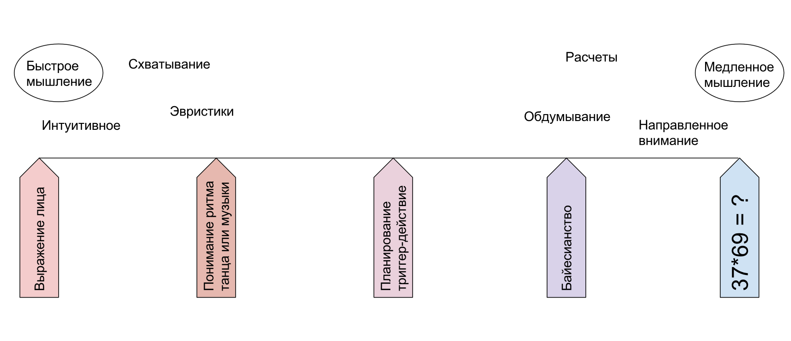

**Knowledge**, unlike "just facts", is something that can be used in different situations, something that can be taken from project to project. Most often, these are some explanatory theories. **Facts** can characterize specific projects and objects within them. Knowledge about meters as units of measurement is common to all projects. The length of a path in a certain project is 14 meters — this cannot be applied to other projects, so it is not "knowledge", it is just a "fact".

**Logic** (rules of reasoning leading to plausible conclusions from plausible premises) in science and engineering is not necessarily boolean/discrete with values of "true" and "false". Modern logic is probabilistic, and when using logical reasoning in rational thinking, it has recently been about Bayesian probability, not frequentist. And now it turns out that even Bayesian probability is not the last word here, but it is about "quantum probability" from the mathematics of quantum physics, although this probability has nothing to do with the behavior of particles in the micro-world, but characterizes completely different scales in thinking (sometimes called quantum-like)^[A small review on modern rationality: <https://ailev.livejournal.com/1619025.html>].

Modern logic uses probabilistic (Bayesian and quantum-like) reasoning, and experiments ultimately do not prove or disprove anything but only shift the probability of plausibility^[See literature in points 1 and 2 <http://ailev.livejournal.com/1311261.html>.]. Life does not consist of "truths" and "falsehoods", it is assessed by statements about probabilities, and even more: life consists not so much of statements as of actions chosen in a rational way — statements here are auxiliary! We have already discussed that "a building consists of bricks" — this is an absolutely true statement in logic, but in life, this may lead to you having to discuss the construction of the building by indicating the position of each brick. It will be much simpler to combine the bricks into walls, and then discuss the position of the walls in the building — and Systems thinking works precisely with this, "convenient grouping." Not everything that is logically true will be appropriate in Systems thinking; a connection with life is required — with some methods/practices/cultures/styles of work for which reasoning is conducted.

But now we will consider another branch of discussion about the connection between Systems thinking and logic. Is Systems thinking formally/strictly (expressed in symbolic form, available for strict logical inference through values "true" and "false") or informally, i.e., intuitively, with a higher probability of error? Another formulation of the same question: can it be considered that Systems thinking requires strict/formal typing of its objects, as in mathematical logic?

The main thing to discuss here is the presence and importance for transdisciplinary thinking (and Systems thinking is transdisciplinary) of informal, intuitive, and inexpressible in words and other signs knowledge in distributed (for example, neural network — in the living brain or computer AI systems) representations, including distributed knowledge about systems. This is the knowledge of fast thinking S1 according to Kahneman. Today, such knowledge can be possessed not only by people with "wet neural networks" (Kahneman studied them) but also by computers programmed to work within the connectionist/neural network paradigm. Modern achievements in artificial intelligence are associated with the development of precisely "computer intuition" (and not the development of logical programming languages) within the framework of machine learning in general and the field of deep learning in particular.

In the **connectionist** **(connectionism)** **paradigm**^[See more in <http://ailev.livejournal.com/1228029.html>.] knowledge is represented not as a set of discrete concepts connected by some relationships from formal logic, but as distributed across many specific simple homogeneous elements (today these are usually "neurons" in neural networks, both artificial and natural). This is a rather powerful concept of **distributed representations** in contrast to local/symbolic representations. Semiotics within semantics deals with symbolic representations, while distributed representations are still being studied within AI research projects, most of all in the field of **deep learning**, which deals with hierarchical distributed representations (for example, in the form of multi-level/deep neural networks).

The idea that knowledge/information can be represented within the framework of distributed representations through theories of informational physics can be easily generalized to recognize the scale-free knowledge distributed throughout the universe (including human knowledge), see more detailed works on representing the universe as a kind of neural network, where an eternal process of cognition is taking place^[Most clearly, this can be seen in the works of Vitaly Vanchurin in the last couple of years, <https://scholar.google.com/citations?hl=en&user=nEEFLp0AAAAJ&view_op=list_works&sortby=pubdate>, there is a special website for the "world as a neural network" project, <https://artificialneuralcomputing.com/wann>].

The human brain uses a neural network for thinking and therefore works to a significant extent with distributed, not local representations, although on a neural network it can also organize a "virtual logical machine operating with types and relationships between them,” that is, the brain can slowly and with errors work as a classical logical calculator.

The human brain works poorly with formal/mathematical/strict/symbolic representations of knowledge and facts, its computations are probabilistic and require checks. The brain of animals practically cannot work with symbolic/local representations, the skill of working with signs distinguishes humans and animals.

Modern machine learning and artificial intelligence systems use principles for their work similar to the principles of the human brain. Today, knowledge is understood far from being only as formal/strict mathematical models. The combination of methods of formal, "scientific" work with knowledge and methods of "informal" intuitive work in neural networks (artificial or natural, in the human brain — it does not matter here) represents a scientific and technical frontier, we will not touch on these issues in our course. In any case, we can sharply reduce the number of errors in informal probabilistic reasoning if we simply give more time for calculations. This is now a hot topic in research on large language models — can we refer to the answer several times to a slightly modified question to get a more reliable and error-free answer? Yes!^[<https://arxiv.org/abs/2311.16452> with a description of automatic query selection variants, Jason Wei's intuition <https://twitter.com/_jasonwei/status/1729585618311950445>].

Daniel Kahneman states^[Daniel Kahneman, "Thinking, Fast and Slow", [https://en.wikipedia.org/wiki/Thinking,_Fast_and_Slow](https://en.wikipedia.org/wiki/Thinking,_Fast_and_Slow)], that a person has two thinking mechanisms: fast low-cost intuitive S1 and slow laborious conscious S2, triggered when there are problems using "fast" intuitive thinking. Here S2 represents the possibility of sequential engagement of S1 thinking acts, thus providing the possibility of logical sequential/step-by-step thinking.

In fact, it is about a whole spectrum of thinking from intuitive informal through probabilistic (with some estimates of these Bayesian or quantum-like probabilities from various sources of prior evidence and experimental data) to classical formal based on mathematical logic. Here is a diagram by Pralion Medvedeva, illustrating this full spectrum (this was explained in more detail in the "Rational Work" course):

Usually, intuitive guesses at the level of "feelings" are pulled out as explicitly formulated heuristics, and heuristics are checked by critique: logical (including probabilistic Bayesian logic or quantum-like logic). In the case of confirmation of guesses, formal slow thinking S2 about a certain type of task can then be trained (through the solution of many tasks) so that it becomes automatic and "intuitive" S1, not requiring special mental efforts, solving this class of tasks moves from the part of the spectrum with "reflection" and "focused attention" into the zone of fast intuitive without special engagement of the expensive resource of concentration. Physicists develop "physical intuition," mathematicians develop "mathematical intuition," systems thinkers develop "systems intuition." The brain is plastic, the neural network of the brain is well trained (and recently these "intuitive" reasoning has begun to be gradually transferred to neural networks in computers).