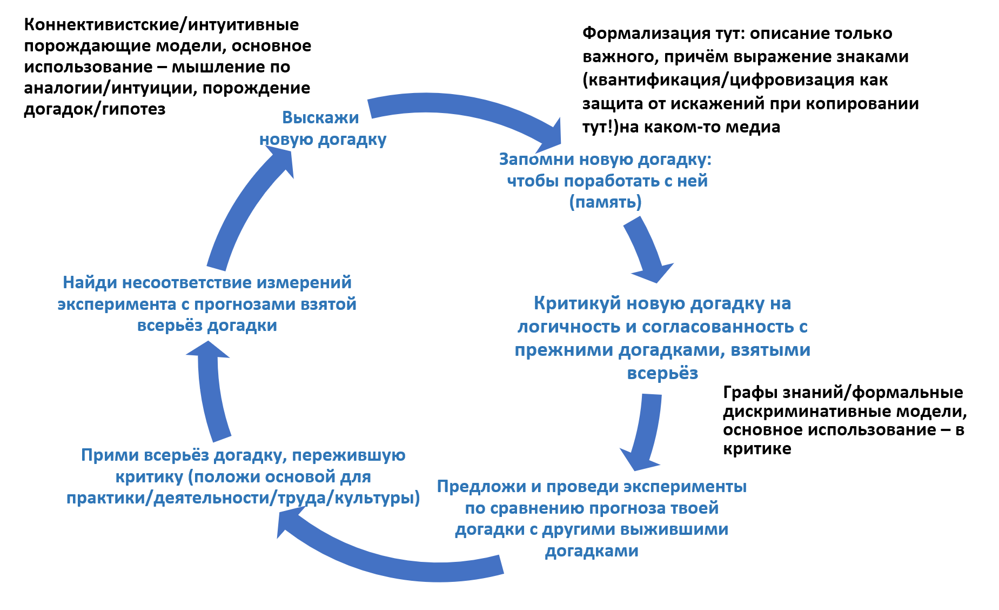

Slow, "formal," rational thinking, despite its merits, may encounter substantial problems, even when people are willing to spend adequate time on it. A well-formulated problem typically contains an explicit formal contradiction that needs to be "resolved" --- it's only at this moment that **creative** **thinking** is engaged, only then that one needs to "sit and think" (as opposed to "recall and apply," which is routine, automatic thinking). Sometimes it's said that thinking emerges when problems need to be "translated into tasks," i.e., to create a list of tasks that are clearly actionable and collectively solve the problem, resolve the contradiction, eliminate collisions.

**Problem-solving through formulating and resolving contradictions** is inherent in both Eliyahu Goldratt's Theory of Constraints ("evaporating cloud"^[<https://en.wikipedia.org/wiki/Evaporating_Cloud>]), Heinrich Altshuller's TRIZ methodology^[<https://ru.wikipedia.org/wiki/Теория_решения_изобретательских_задач](https://ru.wikipedia.org/wiki/Теория_решения_изобретательских_задач)], and the systemic thought-activity methodology of Georgiy Shchedrovitsky's school^[<http://www.fondgp.ru/>]. All these schools of thought claim to be based on a systemic approach, hence the commonality of thinking techniques.

Where do contradictions come from? They can be of two types:

-   **Contradictions in the sense of logical contradictions, formal incompatibility of statements within some logic.** It could be Boolean logic with two conflicting statements (x=3 and x=5, where both statements are simultaneously true!), but it could also be probabilistic Bayesian logic, where according to E.T. Jaynes' works, Boolean logic is a special case^[<http://www.med.mcgill.ca/epidemiology/hanley/bios601/GaussianModel/JaynesProbabilityTheory.pdf>]. Furthermore, irresolvable Bayesian-logical contradictions might also exist in Bayesian logic, in which case one has to compute using quantum-like logic as detailed in the works of Andrey Khrennikov^[<https://scholar.google.com/citations?hl=en&user=wdhkzPMAAAAJ&view_op=list_works&sortby=pubdate>, see a brief discussion on quantum-like rationality in <https://www.preprints.org/manuscript/202103.0395/v1>].
-   **Contradictions/conflicts in the interactions of systems at different levels, leading to "disorders" and consequently to the complexity of systemic organization at these levels.** A good overview of how this is structured in biology can be found in the work by Wolf, Katznelson, and Kunin "Physical foundations of biological complexity"^[<https://www.pnas.org/doi/10.1073/pnas.1807890115>], 2018 --- and it’s best to read it along with the referenced literature for complete understanding. In 2022, these authors, along with physicist Vanchurin, suggested that these contradictions/conflicts between systemic levels, which lead to disorders at these levels and generate evolution, make the world/things/universe sort of a physical neural network that "learns itself." More precisely, parts of the world (systems) learn some other parts of the world (systems), and the thermodynamic balance is maintained because knowledge in these well-learned parts of the world can be "unlearned/forgotten," but evolution still prevails and other parts of the world acquire a lot of knowledge^[<https://artificialneuralcomputing.com/wann>]. Evolution primarily occurs with non-ergodic systems, i.e., systems with memory. At the slowest evolutionary levels, memory becomes digital, as it involves exact replication (without error accumulation), for instance, DNA is such "digital memory." In the case of memetic evolution in humans, speech and writing serve as instruments to ensure memory and precise copying, allowing for the accumulation and infinite copying of knowledge without distortion. The same happens in technological evolution: principles underlying devices are reflected in their construction. The central dogma of molecular biology, stating that information flows from genotype to phenotype, from informational models in KB (design bureaus) to product samples in one direction, but in the opposite direction absolutely different ways of transmission (not "biological growth" or "factory manufacturing," but mutations, engineering design, and other methods altering the genotype --- definitely not through copying phenotypic adaptations) was confirmed by ideas from physics-mathematics in the 2022 work "Toward a theory of evolution as multilevel learning"^[<https://www.pnas.org/doi/10.1073/pnas.2120037119>].

Thus, creativity can also be diverse: if it's about a logical/mathematical contradiction, one can re-describe the world within a single mathematics/logic framework, rather than multiple ones (by highlighting other objects of attention, other concepts --- switching to another "logic"), thus resolving the contradiction. For example, if you conclude that x=3 and x=4, you might consider the physical meaning of the statements and find that different units of measurement were used in the first and second cases. This is a simple case: describe the world using the same units of measurement to avoid contradictions! Another simple case: if you find out that the same person is both a physicist and a manager, it doesn't necessarily mean two different objects, but just two different descriptions. Describe skills as professional competencies, i.e., as role capabilities (mastery here will be part of the functional decomposition of personality, and personality --- a functional part of a person, their "software," and there is also the organism, their "hardware"). People are described as agents performing roles --- and the contradiction is resolved.

If it's not a logical/mathematical contradiction but a conflict between systems at different levels, the behavior of these systems has to change. Much depends on how reasonable these systems are as agents. If it's a mechanical part, its design needs to be mechanically altered. If it's a cat --- with a stronger intellect, the higher reasonableness, it can be trained. If it's a human with strong intellect, high reasonableness, they can be "convinced" with rational arguments, change the "software" rather than "hardware" through neurosemantic programming (text!). This is detailed in the "Intelligence Stack" course. Changing the description won’t help here. If the conflict is that a virus, in its survival behavior, conflicts with the organism's need to survive, the solution will be the emergence of an immune system in the organism and variability in the virus, and a vast variety of implementations of immune systems and ways of virus variability to deceive the immune system. This is still an evolutionary solution, done by evolution, though it takes many years (sometimes billions), the immune system emerges as a "mental-like brain"^[<https://www.frontiersin.org/articles/10.3389/fnint.2023.1057622/full>]. This is all life, Darwinian evolution, where the genome is in each cell.

An alternative solution is engineering, in the course of techno-evolution. If you're an engineer and find a contradiction in the surrounding world, you can create a new mechanism or alter an existing one, propose a smart mutation to a meme. A meme --- is like a "general kind of genome," a meme/meme --- like a gene/gene, but not necessarily in DNA. These solutions are thought of not only by people; they can arise spontaneously, evolutionarily in the course of memetic and techno-evolution. For instance, meme-viruses (ideas that people consider interesting to spread) can be similar to regular viruses: controlling human behavior (such viruses in nature, changing host behavior, are called "zombies," and there is rabies --- a virus changing the infected individual's behavior towards aggression, increasing the virus spread). John Doyle says humanity needs to think engineeringly about the memetic immune system issue before memetic viruses destroy humanity^[<https://www.youtube.com/watch?v=Bf4hPlwU4ys> and more links about his ideas in <https://ailev.livejournal.com/1622346.html>].

An example of an engineering solution that reduces mortality is democracy. When democracy (elections aiming for bloodless change of dictator) didn't exist, power either didn't change at all (autocracy of some kind), or the issue of power was resolved by civil war --- as "God is always on the side of the big battalions" with equal armaments and knowledge level. Power changes occur, but many people perish in the process. There came an engineering solution: instead of combat, conduct voting to determine who holds more power^[<https://ailev.livejournal.com/1616855.html>]. This can be considered "evolution," but the solution was conceived and approved by people, hence it can be seen as one of the social engineering solutions. However, there can be many different options for solving a problem; societal complexity increased, and problems haven't vanished---the problems are just different with democracy! But with power changes, people no longer die just for the power to change; monarchies on Earth have significantly decreased, and in many cases, monarchs no longer wield real power, as power is elective. Sure, this "virus of bloodless power change" hasn't reached all brains on the planet, but progress is evident. Why change power at all? Karl Popper provides an answer: if power suits everyone, that's fine. If it no longer suits, there was a mistake in the previous choice, then democracy provides a bloodless way to rectify the mistake. The error correction mechanism of public choice --- that's the essence of democracy!

Engineering solutions as "smart mutations for techno-organisms" rely on the knowledge that contradictions/conflicts at systemic levels are inevitable, but optimizing these contradictions/conflicts for all systemic levels, leading to an overall reduction of disorder/frustration through increased complexity of systems, can be achieved through engineering design, not trial-and-error evolution.

Systems thinking doesn't dictate how to resolve contradictions. Our course contains no "creative thinking methods," no solution tables, ways to conduct brainstorms, or imagination development techniques (they might be in other courses. For example, creative imagination development techniques are used within the applied methods of systems engineering under the general name TRIZ).

There are no miracles; solving problems here requires no less and no more thinking than any other school of thought. Systems thinking allows understanding and accepting the inevitability of problems due to disorders/frustrations from conflicting interactions at different systemic levels and addressing these problems without losing sight of the entire system, both a few levels above and within it. Systems thinking helps not to lose the forest for the trees, the tree for the leaves, and the leaf for the plant cells.

Systems thinking allows purposeful identification of contradictions, demanding their resolution, documenting these solutions. Pointing out important contradictions, not missing them, and not ignoring them --- that's the task of systems thinking. Afterward, one needs to take the head (and often a modeller in a computer), and think, using various other methods.

How does it work? Agents in the real world don't clearly understand how to dissect it into objects. Here's a metaphorical example --- try naming the objects you see and identifying the important ones:

Then the cycle of rapid hypothesis generation and slow, labor-intensive critique works. Hypotheses/explanations/knowledge/theories generation proceeds in the form of generative models --- such models can predict the future state of the world, and the critique comes via discriminative models, where one can discuss class membership (thus finding a "logical contradiction"). The picture shows the cycle of cognition/creativity, which is detailed in the "Intellect Stack" course, even without this picture. However, different elements are discussed in various ShSM courses; we note here that at the formalization step, systems are taken as significant objects, the essence of the systems approach mainly influences this step in the cycle:

This all means that systems thinking implies not only informal reasoning within connectivist/neural network/S1 representations and their expressions within prototype theory (metaphors), but also quite formal reasoning using symbolic representations of theoretical concept theory, where we talk about objects and relations, all of which have types. Don't be misled by the natural language text of our course: the text of the course has quite strict typing. Thus, we don't confuse "method of work" with "work," "system" from the systems approach and "system" from Stanislavsky's system. In systems thinking, the primacy lies in dealing with objects and relationships using logic, not metaphors and analogies using artfulness. **Follow the types of objects and relationships, they are important!**

Sometimes in systems creativity, "invention" is particularly highlighted --- a system is dissected into parts (different systemic levels are distinguished within it) in various ways, one of which necessarily includes a functional description (behavior expected from the system when used), and the other --- a constructive description (those material/constructive objects from numerous objects of the physical world, which can be adapted to embody functional objects from the functional description: affordances/fittings) under constraints from the spatial location of these parts and the cost of assembling affordances into a working system.

This is sometimes called systems creativity, "modular synthesis" (affordances --- these are modules), and invention. In any case, systems thinking allows for detailed discussion of these "inventions," thorough discussion of the essence of creativity.

Interestingly, engineering also discusses "foolproofing": the impossibility of incorrect use of certain items. Systems creativity then includes ensuring that the "fitting" not only fits the necessary function but also doesn't fit the unnecessary one^[<https://sketchplanations.com/affordance>]:

Anyway, systems thinking is primarily creative thinking. Of course, it's not reckless creativity or random ideas. No, there is a place for randomness (mutations are the basis of evolution) in systems thinking, but we strive for these to be smart mutations, the ones most likely to lead to a system’s success^[<https://arxiv.org/abs/2206.08896>].