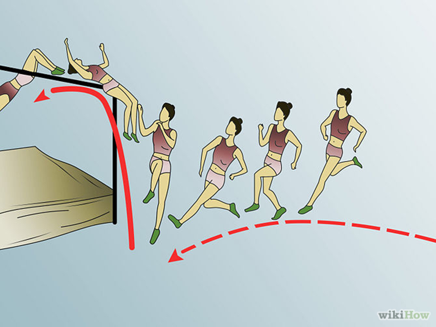

Let's call this property of passing some threshold of understanding, after which it is difficult to remember the difficulties, **metanoia**. The word is amazing, try to write it in different cases, and even in the plural, you will get very interesting effects. This term came from religious practices and means "a change of mind," a complete break with past and current thinking. You study and study in some seminary, and it seems like your thinking is not set up as expected by the priests. Then suddenly at some point, click—and you show everyone that you have the same thinking as is accepted among priests, from this moment you are "real" and not pretending. This was called "metanoia," a small western variant of enlightenment. The word "metanoia" was recommended for use instead of the word "learning" by the guru of systems management Peter Senge^[<https://sardertv.com/metanoia-peter-senge/>], because the word "learning" in his view is already quite worn out and does not mean a fundamental change in the way of thinking as a result of education. He borrowed it from psychologists, who used it to denote fundamental positive changes in personality^[<https://en.wikipedia.org/wiki/Metanoia_(psychology)>]. We do not like the religious connotations of metanoia, but the phenomenon described by this word—"forgetting the difficulties of learning"—is quite secular.

When metanoia has occurred, then in the new state of thinking, with "new tracks in the brain," it is completely unclear to the person (or, more generally, the agent of different nature) what the problem was earlier, with "old tracks of thinking." Imagine: I know that the Earth is flat, I argue for a long time that the Earth cannot be round, but at some point, I am convinced otherwise. And I, in my projects, initially automatically act as if the Earth is flat, then by willpower remember that rationally it should be round, then do it at the reflex level, and in the process see thousands of evidences of this roundness of the Earth. And at this moment I can no longer understand why I thought the Earth was flat. Rationally remember that I once thought the Earth was flat, I can. But to understand how I moved from the state of knowledge of the "intuitive theory" to the state of mastering the "counterintuitive theory," I can no longer. And therefore, I cannot realize the educational actions necessary for me to achieve this metanoia of the roundness of the Earth in my students. But the very fact of paying attention to this passed metanoia (bringing it into consciousness) gives a chance to figure it out. The work of creating the correct exercises to achieve such metanoia in students is hard work but possible. Creating an adequate training course based on already existing theory can take a couple of tens of years, and if in addition to the exercises, a new theory needs to be created, then hundreds of years, like it was in the transition from the Ptolemaic to the Copernican understanding of planetary motion. All these discussions about the difficulty of creating a theory/explanations/knowledge and a training course to achieve fluency/metanoia in students' thinking fully apply to systems thinking, and to all methods of the intellect stack, and to applied engineering methods.

Special attention needs to be paid to the fact that in the case of metanoia, it usually involves learning not any methods of thinking and action, but "counterintuitive" ones, which the brain resists strongly; it "intuitively knows" how things should be and actively resists the new knowledge! It is much easier to teach something anew, but if you have already caught somewhere "folk intuition," then it will be very problematic to teach you something more effective and new: you will have to go through metanoia, and this requires a documented model of target thinking, organized into a sequence of exercises training course, time to pass these exercises, and considerable **concentration**—because all the intuition of the students will show that they are being taught some kind of madness! The chances of going through this metanoia "self-taught" are practically nil, unless you are a genius. Thus, you will not by any means be learning from a self-instruction manual the explanation of the roundness of the Earth if you adhere to the flat Earth theory. Your chance here is only to attend some courses where you will literally be forced to familiarize yourself with the arguments about the roundness of the Earth, and then also be trained (against your will! Simply forced!) for fluency in using this knowledge.

Counterintuitiveness can await in the simplest actions. At school, they taught to jump over a bar "scissors style"— you run up and jump. But if you need to jump very high, then after the run-up to the bar, you need to turn your back and jump backward-upward (Fosbury Flop, invented in 1968^[<https://en.wikipedia.org/wiki/Fosbury_Flop>]).

This is absolutely non-intuitive but allows you to fly over even a two-meter bar. You need enormous trust in the coach to start training such a jump—because at that moment it seems that many, many trainings will give the chance to overcome additional tens of centimeters "scissors style" or "rollover," which is not the case at all. And then there will be metanoia: you will not understand why people still elsewhere jump over a bar not using the Dick Fosbury technique—even if you no longer remember that it was Dick Fosbury who started such jumps, and people began to jump this way just a year before the Moon landing in 1969. And it is about what people did for thousands of years: high jumping!

In thinking, there are such counterintuitive ways that allow thinking according to the sports motto: "faster, higher, stronger," leading to "high-performance sports." **Systems thinking** **is a set of specific** **counterintuitive** **thinking techniques invented by different people that allow thinking to be** **stronger (more universal and** **effective) than its previous,** **"folk"** **variants.** **In particular, systems thinking is primarily an effective way to manage attention in a project, it allows to template-like highlight in a project objects worthy** **of immediate** **attention.** **You will know what is important in a project even before you begin working on it!** **The concepts of systems thinking define types** **of important** **objects that you then need to find in** **the project, this allows you not to wander hoping that sooner or later you** **will come across something important, but actively look for and find this important thing.**

The main substantive metanoia of systems thinking is that you start to think of the world as consisting of nested systems in relation to part-whole, which also interact with each other, and some systems are created and developed by other systems, this is a creation relationship. In the third generation, this also includes the understanding of the evolutionary time scale and the inevitability of conflicts between systems of different levels.

If you understand the system not as "any object that we consider," but as "system from the systems approach," this turns out to be extremely counterintuitive, so it requires special training and subsequent long-term practice of such systems thinking.

Thus, "intuitively," when trying to tell something (for example, about borscht, the Ministry of Attack, or a quantum computer), people primarily talk about the parts of the discussed subject (the components of borscht, the organization of the Ministry of Attack, the composition of the computer). In systems thinking, it is exactly the opposite: the discussed object-system is immediately declared a part, and the story is primarily about the environment at the moment of functioning/operation of the target system. This is the situation of lunch and digestion when it comes to borscht, the situation of attack in the case of the Ministry of Attack, the situation of using a quantum computer: borscht, the Ministry of Attack, and a quantum computer here will only be parts of their usage situations. And only after clarifying the system environment (what surrounds borscht during lunch and then during digestion, what surrounds the Ministry of Attack during an attack, what surrounds a quantum computer during its use), after the "look outside the system," the subject of interest for the systems thinker will be the "look inside," the system's parts. First—what happens outside the system's boundary, and only then—what happens inside! This is very, very counterintuitive!

In mathematics, the term "intuitive" is often replaced by the term "trivial"—the ability to be repeated by "any" person (AI has not seriously worked with mathematics yet) in a given community, and non-triviality—the inability to repeat (thanks for discussing this issue to mathematician Roman Mikhailov). Demonstration of something interesting due to non-triviality makes this "something" trivial after a couple of cycles of interested training, because the definition of "intuitiveness/triviality" and "counterintuitiveness/non-triviality" implicitly includes the moment of time "right now." Any "counterintuitive/non-trivial" of one generation becomes "intuitive/trivial" for another generation of thinkers. This "triviality" can well be added to the list of synonyms for "intuitiveness." Intuitiveness/triviality and counterintuitiveness/non-triviality are "moving targets," the assignment of these types to some objects is quite dynamic, the result significantly depends on time.

Who knows, maybe today's systems thinking for future generations of people and thinking machines will be "folk," "intuitive," "trivial," and it will need to be overcome, obtaining metanoia in a completely differently structured thinking. But so far, systems thinking is deeply counterintuitive in its current version, mastering it is difficult, metanoia turns out to be inevitable.

In our discussions, we use both the everyday and non-everyday meanings of the word-term "intuitiveness." In everyday life, "intuitiveness" often means not the result of rational logical reasoning, but the use of "gut feeling"—getting the result of reasoning by insight, inspiration, enlightenment, and this result can be very non-trivial. We talk about such results of thinking that they are exactly the opposite—"counterintuitive," that is non-trivial, hard to reproduce by different people, they do not belong to "common folk knowledge," common thinking automatisms, typical intuition of the surrounding people, as well as one's own intuition. But in our course, we often refer to the second "folk" dictionary meaning of "intuitiveness," when we talk about quick "intuitive" S1 thinking. We hope that from the context, students will understand which meaning was intended by the course authors in each case of using the term "intuitive."