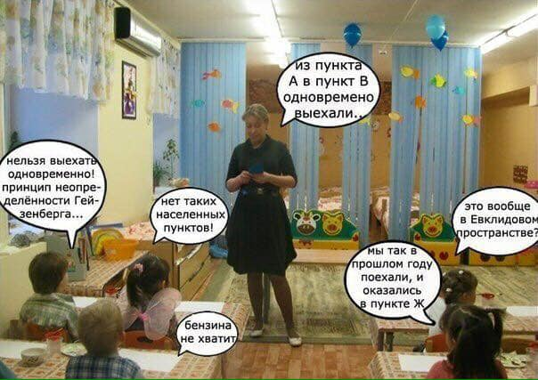

In practice/activity/work/engineering according to some method, an **assumption of an open world**^[<https://en.wikipedia.org/wiki/Open-world_assumption>] is usually made: "that which is not explicitly described is simply not described, but it could exist in the world." Vasya has three apples. Can it be expected that he has four apples? Why not. You know that he has three apples, but nothing is said about the fourth apple. He might not have it, but he might. Vasya might even have a hundred apples; you were simply informed of three.

This is significantly different from the **assumption of a closed world** in textbook problems: "what is not mentioned simply does not exist." Alan has three apples. If he has a fourth one? No, of course not. It is said that he has three apples, not two and not four!

Training questions are most often composed from the assumption of a closed world, while experienced engineers and managers, assuming an open world, when answering these questions, start to invent increasingly unusual and improbable circumstances, logically leading to incorrect answers. Their task in this case is not to train themselves but to point out an error in the author's answer.

At the same time, the power of systems thinking is implicitly used. From the situation described in the question, we think outward, to the environment. But since the environment is not explicitly described, we significantly change it, make up things: "if we are talking about Jupiter, and the rocket pilot is not afraid of the enormous gravity and plays the saxophone in the methane atmosphere, then your correct answer would be incorrect, and my incorrect answer correct."

The desire of an engineer to invent increasingly exotic circumstances, making the most likely answer not too likely, cannot be overcome. He has been trained for this for many years! He must be able to imagine his system working in various environments, to consider various reasons that might lead to the failure of the target system --- and then change the system's design so that it continues to work. The only advice one can give to such an engineer: remember that **course questions** **are composed from the presumption of a closed world, and inventing** **"possible unaccounted-for** **circumstances"** **---** **is developing an open-world assumption, an engineering or managerial task rather than a task** **for brain exercise through answers to training questions/quiz** **from our course in systems thinking.**

Indeed, the small likelihood of circumstances related to the formal correctness of the answer is irrelevant (even an extremely unlikely event can be formally correct, "logical" in mathematical logic) and formally "mathematically" the student can be right. But in educational life (not in the ideal world of mathematics!), generating such additional unlikely conditions from the assumption of an open world does not help to answer training questions, but only hinders this. In working life, on the contrary, accounting for various unlikely conditions can help; it is necessary to be able to imagine the various situations the future system, which you are just designing, might face and want to ensure its operation in various external conditions. It is essential to clearly distinguish these two situations: answering training questions during learning versus designing/scenarioing during a specific engineering, managerial, cultural project.

Special attention should be paid to training questions at the initial stages of learning --- when the correct answer is not intuitively clear, not standard. **When** **a student** **knows the material poorly, they turn on** **a "clever brain"** **to change assumptions in the questioned material.** They look at 2\*2 and start: "It can be any number greater than 1.0 and less than 9.0, since we do not know how and to what extent the initial numbers were rounded. It can be anything in the answer that starts and ends with 2 since an asterisk does not always mean a multiplication sign. Often an asterisk means any number of characters. And it might involve symbolic multiplication, so the answer will be 22. And let's not discuss situations where the number system is not decimal, deal?" Of course, they are smart and knowledgeable enough to suspect answer 4, but not confident enough to not assume additional pitfalls and make up some interfering circumstances.

Two out of ten people studying systems thinking are like this --- they did not read the course text (that is, they skimmed it diagonally from their smartphone screen when they had about five minutes), but they are good engineers or managers, they are articulate, skeptical about the course material (which is not bad, just skeptic thinkers), and they are usually the most active in the group. In exams, such active students with a "clever brain" demonstrate good knowledge of their work project and poor knowledge of systems thinking. Attribution of systems thinking types to work project objects does not occur, and a lively description of the project in the language of the applied systems area without demonstrating typical moves of systems thinking --- it only proves that mastery of systems thinking has not occurred, and there is no understanding of systems thinking concepts.

The result is two points in systems thinking (which does not happen in the School of Systems Management, there are no grades. But at MIPT it quite may be). At the same time, the student's applied knowledge can be excellent! But systematicity, that is, the use of systems thinking concepts in reasoning to manage attention in the project --- does not exist. Hence five points for applied thinking, and two points for systems thinking.

The goal of "experienced engineers" is often not so much to exercise in systems thinking and the use of its concepts, but to try to "bend" the proposed questions along with the very ideas of systems thinking, to test their strength with formal-logical "common sense." These people make good Fair Witnesses from Heinlein: "*Anne was standing on the diving board. Jubal shouted to her: - Do you see that house on the hill? What color is it? Anne looked and said: - It is white on our side. Jubal turned to Jill: ---* *You see, Anne did not say that the house is entirely white. And all the king's men won't make her say that until she goes and looks. But even then she won’t be able to claim that the house stayed white after she left*."^[[https://ru.wikipedia.org/wiki/Чужак\_в\_чужой\_стране](https://ru.wikipedia.org/wiki/Чужак_в_чужой_стране)]*.*

And remember that mathematically and physically correct answers can be systemically wrong: "the house consists of molecules of the house" --- this is absolutely correct in physics and mathematics, but in systems thinking, you will immediately be pointed out a reasoning that ignores system levels, and the error will be noted. "A house made of bricks" will also be bad. "A house made of walls, and walls made of bricks" --- that's acceptable. A "clever brain" will immediately start pointing out that the roof, porch, interiors, and house residents are omitted --- the house consists not only of walls made of bricks. A "clever brain" does not want to deal with what specifically is being trained by the training question. And in vain, one should simply consider: in questions --- a closed "toy" world, training some thinking operation from the systems thinking course, not training wit. Questions on understanding the text, knowledge of terminology and main ideas of the text, rather than on demonstrating ingenuity. Not olympiad problems, but training questions.

How could we fight this? **The obvious** **wrong move** **is to strictly formalize** **the questions, achieving unambiguity of the correct answer.** The more formally the "textbook" questions are posed, the further they are from real life! Life is not formal-logical; life is probabilistic! Interested in general patterns, most frequently occurring cases, not unlikely exceptions and special situations! If we consider the question of what to drive a nail with --- a hammer, a stone, a pillow, a hand, a microscope, the answer here should be "a hammer" (and not "a hammer, a stone, a microscope, and a hand too, because the hand could be in a steel chainmail glove"). But if the task is "what to drive a nail with if you find yourself on the road, and there is no hammer?", then it will have other answers! Questions are situational, they are not absolute, their solutions are probabilistic; in educational tasks, the answer with the highest probability is required, not the absolutely correct single one.

The most reliable way to avoid all these changes in situational assumptions ("task condition adjustments") instead of answering the question for the purpose of training some course point --- is to use the situation in your own project for solving tasks. One cannot easily adjust real life in terms of conditions, so the task will have to be solved, not the situation adjusted to a proposed solution, as happens with educational tasks. Therefore, a significant number of tasks in our course are not answers to questions with "traps" for "folk thinking" but a proposal to model your work projects. Work ones --- those at work, not "educational projects" or "course case studies." All from life, moreover from your life, not proposed by the course.

All the educational **questions** and even work **assignments** **---** **educational/training** **and work-related, not exam-based**. They provide merely an occasion to understand and discuss the course material; formalism of "the only correct answer" is not crucial for them and even incorrect.

Another source of potential "formal illogic" in systems thinking is that the systems approach was presented in standards and public documents, from which we draw its provisions. In each such standard and public document, the set of systems approach concepts is presented not as a whole but as a small piece. These pieces, taken together, do not represent a logically consistent system of concepts and their relations. In various standards and public documents, different terminology was used. This was partially overcome when translating into Russian, but not completely. Each standard has its small set of concepts, not claiming completeness and consistency with other sets of concepts, only "for the purposes of this document," and no more. Often the standard in the terminology section starts like this, "for the purposes of this document, the following terms and definitions apply" --- a warning that the authors of the standard do not claim the all-inclusiveness of the term.

The probabilistic nature of concepts and presentation in a natural (most often English rather than Russian) not-too-formal language only adds uncertainty. Translation into Russian also does not add formality to the presentation. In real "life" projects, it is also very difficult to compile a consistent systems description of the situation (in real projects, different people use different versions of various methods, including different versions of systems thinking methods), so using systems thinking will be much harder than in specially composed training questions. Therefore, the problems are intentionally not too formal; they are training; no "trick" is expected on the specificity and uniqueness of the situation, but good knowledge of the course material is expected.

**If you do not quite understand what is required as an answer to a** **question** **or what the result** **of modeling** **in the table filling assignment should be, ask yourself these questions:** **"What does the course author want to test in my understanding? What does the course author want to train me in?"**