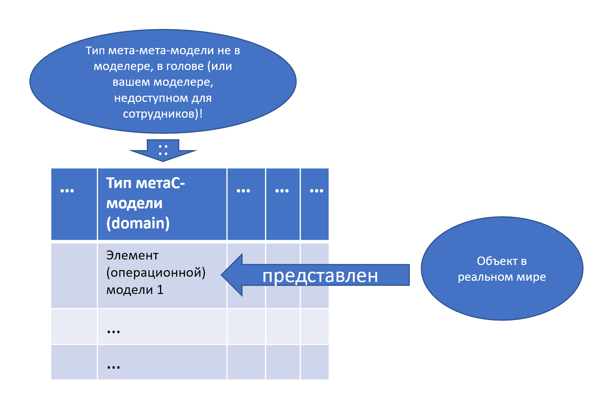

Reading the course material is absolutely insufficient --- it's like reading a textbook on riding a bicycle, without practicing the actual riding on a physical bicycle it doesn't help much. Answering the questions on the simulator/quiz is not enough --- it's like riding a bicycle only on a straight, specially equipped path. You need to immediately practice setting tasks in your work projects and systems thinking in real life (riding a bicycle off-road in the mountains) --- and only then, the blooming complexity of work projects begins to recede and yield to a brain trained in systems thinking.

**First and foremost, engage in** **meta-modeling, that is, 'making tables' and modeling, that is, 'filling tables'. Beautiful diagrams of squares and arrows ---** **this is a pop/household/common understanding of systems modeling. Tables and even texts are more adequate here. This is systems thinking,** **moreover, it is 'thinking by writing', 'thinking by modeling'. Assignments on modeling** **(filling tables)** **in our course ---** **these are the first steps in systems thinking.**

Reading a textbook from the course, reading a book (there is no modeling in it, but there is in the course) --- this is not making 'first steps', this is just reading about 'first steps'. Answering questions --- these are answers to questions about the steps, not taking those first steps! But when you start making and filling tables that are roughly the same and in the same way as in our modeling assignments on the material of your projects --- that's it, this is 'thinking systematically', this is not reading about first steps, this is doing them, already walking down the endless road of systems thinking!

During our course, you will already benefit from your work projects by engaging in modeling, so go ahead and do this modeling during work hours, not just during separate study time! You can still engage in reading the 'textbook' and answering the simulation questions during separate study time, but assignments on modeling your work projects should be done right in work hours, this is the application of systems thinking to work tasks. If you postpone the modeling tasks in our course, then it's procrastination squared: both procrastination of learning and procrastination of strong thinking in the work project.

There are not many basic ideas of the systems approach, each of these ideas is understood fairly quickly. To express the systems approach in one paragraph, it would be something like *'for the success of the system, that is,* *to satisfy the interests* *of the external project roles,* *you need to understand the functions* *of the working* *system in its environment (make a usage concept),* *then* *figure out how the system functions* *within itself and offer a system design, linking it with spatial layout and assessments* *of the total* *cost of ownership (make a system concept).* *Make architectural* *decisions* *(principles of module separation and organization of connections between modules, the sum of such decisions is the 'system architecture'), evaluating a multitude* *of conflicts between system levels* *and choosing the least bad solutions, because there won't be any good ones* *(no equilibrium, all are just unsettlement!). Achieve a detailed system description accurate enough for manufacturing on the chosen production platform ---* *and manufacture it. Gain some evidence-based justification that the system is successful.* *Operate the system, repeatedly revisiting everything to improve some parts of the system or even completely change the system. And for all this, you need* *a system-creator (most often ---* *an organization),* *which does all this, performing various* *tasks by the best-known methods. Thinking about the creator* *is structured similarly ---* *functional parts are project roles there, constructive parts ---* *organizational units. This* *thinking and associated project actions to change the physical world occur* *recursively at many levels* *considering systems* *as parts of supersystems and examining them as consisting of sub-systems, as well as* *building creation chains from creator systems.'*

We will formulate this chain of reasoning about the system several more times, slightly more structured, in our course it's also called the 'systems mantra.'

The problem is not even that these statements in the previous paragraph are entirely composed of terms (like 'usage concept', 'architectural decisions', 'production platform'), the meanings of which need to be known. All these provisions are deeply interconnected and very rarely used individually. So, some **fluency** in their simultaneous and combined use is required --- in much the same sense as finger fluency in playing the piano or typing, or fluency in speaking a foreign language. Each key on the piano or keyboard is clearly understood how to press, any kitten can press a key! There aren't that many keys. The only problem is pressing different keys in time, quickly, and the ones needed to produce music, sometimes pressing several keys at once (a chord). It takes several days of training to master the computer keyboard, but several years to master piano keys. In mastering systems (and any other) thinking, as in mastering playing the piano, there are no royal roads except many repetitions of some thinking operations during modeling in different situations, gaining experience in thinking using systems concepts in life. Thinking operations are practiced primarily when making and filling tables precisely like this, as it happens when completing course assignments.

Each table involves at least three ontological levels of modeling:

1.  type of type, specified in the column name of the table, is not represented in the table at all, kept in the head of the table creator
2.  Type name in the table column,
3.  Object in the table cell of the type specified in the table column.

Usually, in work projects, the type of type in the table column is a type from the meta-meta-model (a set of concepts of the trans-disciplines of the intellect stack thinking methods, given in our courses on strengthening the intellect, including our systems thinking course), the type in the table column is a type from the meta-model (model of the applied subject area of the work project), and in the cells --- objects of the subject area. In our course, many tables come with such a type layout, but since we also teach how to make tables, there can be other options in the assignment.

Unfortunately, training thinking using the types of the meta-meta-model of intellect stack methods takes time. Therefore, it's desirable to enhance the intellect: not only to read fiction literature appealing to fast thinking S1 but also literature with strict/formal typing to develop slow strict thinking S2, and also to get used to writing texts yourself with a strict use of types, as well as not only 'thinking in your head' but also documenting strict models.

Let's repeat once again, this is important: if you're not writing --- you're not thinking, including not thinking systematically! Making and filling tables for a work project --- this is systems thinking, which includes working with a three-level ontology (three-level hierarchy of types, three-level classification), and this is the form in which systems thinking takes place. Of course, there can be many variations, but the most typical variation looks like this:

In this example:

-   types of the meta-meta-model (concepts from our intellect stack courses) as types for table columns, kept 'in the head' and not presented in the table, you don't discuss them with colleagues in the work project if they are not familiar with systems thinking. But you use them yourself for thinking! **Systems thinking is exactly in this: it will be invisible in the table, but it will be present, it is needed for assigning types to objects 'table column'!**
-   types of the meta-model (textbook on work methods in some applied subject area of the project as the metaU-model/'model from the Textbook for everyone', types of some corporate regulations/instructions or even standards as the metaS-model/'Situational model --- like ours', in the picture only the type of the metaS-model is shown) as the type of cells indicated in the table column name --- and thus you make a type assignment for all objects in the cells of this column.
-   values of the model (no 'meta') for some objects in the cell from the rows of this table. It is also necessary to consider the representation relation between the description in the cell and some described project object, which is not in the table, as there is no type of the meta-meta-model. But the described object exists, in the cell only its description!

All this requires fluent work not with systems thinking concepts, but with types --- fluent possession of 'theoretical theory' (theory theory in the theory
of concepts)^[<https://iep.utm.edu/th-th-co/>],
as well as hierarchies of types (ontology). Mastering such type and ontology work is provided for in our training program in the 'Rational Work' course, passing it is a mandatory prerequisite for our systems thinking course.

Fluency in thinking is important. If it's difficult for you to fill tables, and each table is expected to be an adventure for three days, then you just won't think systematically. If filling tables is a five-minute task for you for each table, then you will have systems thinking. The difference? In the first case --- no fluency, in the second --- there is fluency, because the speed difference between 'doing it for the first time' and 'doing it for the hundredth time' can be at least an order of magnitude or more. It's like translating from a foreign language: if you look up every word in the dictionary, translating one page can take several days, but if you already know the language, you just carefully read the source text and write the text in the foreign language in a matter of minutes. In some way, systems thinking is also a foreign language; you need to be able to translate 'from systems to subject, and back' (from talking in types of the meta-meta-model/trans-disciplines to talking in types of the meta-model/'applied disciplines work methods in the project's subject area', and back).

From the materials of the Viewpoint Research
Institute^[<http://vpri.org/>], systems thinking is also hard fun:

We want to help children develop real fluency in many areas of education, including thinking, mathematics, and sciences. Each of these subjects does not lend itself to 'natural learning' (as people learn to walk and talk). Quite a lot of time and energy need to be spent to gain fluency above the threshold. Here is an interesting similarity with art, music, and sports, for each of them it also takes quite a lot of time and energy to gain fluency. These arts could be called 'hard fun'. Mathematicians and scientists know they are engaging in art, as well as hard fun. 'Thinking' is a higher category than 'just' mathematics, science, and arts. It represents a synthesis of intuitive and analytical approaches to understanding the world and behaving in it.

Peter Senge in his book “The Fifth
Discipline”^[<https://en.wikipedia.org/wiki/The_Fifth_Discipline>]
(1990) wrote:

Recently, during a five-day introductory course conducted by the MIT Learning Center, a woman-manager from Ford's design department succinctly described the situation: '*After a couple of days, ---* *she said, ---* *I begin to understand what all this systems thinking and intellectual models stuff is about. It reminds me of the time when I was just beginning to get acquainted with higher mathematics. At first, I felt completely lost. It was entirely alien to me. But then I started* *to 'get it'*. *A year later I was quite proficient in it. Five years later it became the core of my profession.'* Then she added: '*If higher mathematics were invented today, none of our corporations would be able to master it. We would send everyone to three-day courses. Then everyone would be given three months to see if* *'all this stuff works'*. *When it turned out it didn’t, we would start trying something else.'*

If you engage in languages, any of them can be brought to level C1 (sufficient for admission to a European university) in a year, if you intensely engage --- for a language without flexions (English, Spanish) you need to spend 600 hours on this, with flexions (Russian, German) 1100 hours, for languages of a completely different structure (Chinese, Japanese) 2200 hours. If you engage for a year, you need to spend about 1.6, 3, and 6 hours per day respectively, and on the internet, you can find enough examples of how motivated people allocated approximately this time in their schedule and succeeded. To achieve mastery in a language, you need to spend about 10000 hours (this is a very contentious assertion, but the order of magnitude is correct) --- that is, to engage in the language for several years. In the case of a foreign language, this is not even 'thinking' or learning about some new things and their connections, this is just 'renaming already known things with other words'! Systems thinking belongs to the same kind of methods: it needs to be practiced to achieve fluency in life, not 'thinking with a dictionary' in cases where 'decided that systems thinking should be applied in this case'. And remember that besides systems thinking, you need to achieve fluency in other techniques of qualitative fundamental thinking. For example, to present the content of systems engineering methods, and simply to be collected, to maintain attention in lengthy meditations and to handle a 200-page book in three (not thirty-three) sessions of several hours each, not getting distracted by social networks every fifteen minutes and only handle a five-season series in three sessions.

The situation where systems thinking exists at the level of conscious competence ('understood'), but unfortunately, not fluency in possession ('mastered'), and moreover not applied in work projects despite the understanding, will not be considered at all. **The question** **'in which projects to use** **systems thinking?'** **is roughly the same as** **'in which projects should you think?'.** **Managing attention with a set of systems thinking concepts is used in all projects, there are no projects that are better performed with randomly chosen objects from the surrounding world, mindlessly forgetting the various important methods of work needed to complete projects** **--- to forget to check** **the system's embodiment for operability** **(perform works of engineering substantiation method ---** **testing, trials, interpretation of test results), to forget the need** **to gather and organize** **a team** **for project execution** **(surprisingly, but this happens quite often: the project seems to be open, but no one is concerned with the team in it, no resources are allocated for this, it is expected to be done by agents already 100% loaded with other work).**

Although yes, the project of brushing your teeth in the morning can be done without systems thinking. But such projects are available even to children in kindergartens; these projects do not require strong intellect at all. However, where intelligence is required, it makes sense to engage systems thinking. There is no division in life into projects where it makes sense to turn on the brain and where it does not. And once several people participate in the project, systems thinking will help even in minimal doses: it will not tell you exactly where to go, but it will give you a map of the area and thereby prevent you from getting lost or going into the center of a swamp.