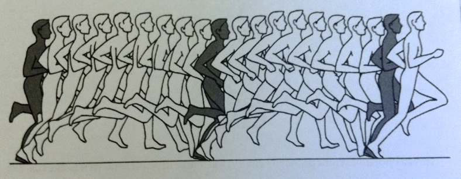
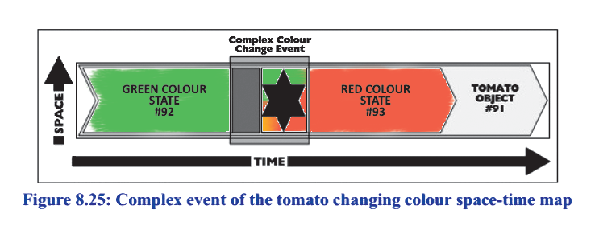

The main relationships in systems (system embodiments, remember physicality!) are “part-whole” relationships (part of), also known as **composition relationships**. Engineers often refer to this as the breakdown of a system. In systems, the main thing is system breakdowns. **The levels of this breakdown** **are the system levels. Breakdowns are made by attention; nothing in the physical world** **is specifically** **broken!** **If you divide a butterfly into wings, body, legs, and antennae, it does not mean you have torn off the body wings, legs, and antennae: no, you just highlighted these parts in the living butterfly with your attention!** Moreover, you also highlighted the butterfly itself with attention as part of its surroundings!

**The main move in breakdowns** **is from part to whole, from system to environment.** The part is well visible, perfectly highlighted, but the whole in the environment often has to be searched for. Hence, system thinking is often called holistic (whole-oriented). Later, we will learn that this is not entirely true --- system thinking is oriented not only towards the whole but also towards the parts, so it is also reductionist (reducing to parts), and pure holism and pure reductionism without each other are evil, delusion, error, dead-end. However, the first thought of a system thinker is towards finding the whole when the part is known (that is, any system evokes the first thought of finding the supersystem outside the system boundary, not inside towards subsystems).

We are talking about "true parts," i.e., physical parts, not everyday talk about "part of the system description," "part of the system characteristics," and other "parts of informational objects." Thoughts on how exactly to extend system thinking to such "informational parts" are emerging now, we will touch on this a bit later. For now, we speak only of spatial-temporal parts, i.e., parts of the physical world, parts of some systems. Systems, recall, are physical/real.

A wing and a fuselage are parts of an airplane, a fuel pump is part of an engine. The wing (all molecules of the wing) occupies part of the total volume of the airplane, i.e., part of the space-time it occupies in the physical world, the fuel pump occupies part of the engine. All molecules of the fuel pump are part of the molecules of the engine --- molecules are defined as such small places in the physical world. When talking about some nanocoatings a few molecules thick, we can reiterate the reasoning, moving to some quarks---quantum uncertainty nuances are irrelevant here, what matters is the principle of reasoning about parts of the material world.

If we assume that all systems exist not just in the physical space but in space-time, then all talk about different states of the system or its different roles turns into a conversation about parts over time. For example, an egg is simply a part of a butterfly over time --- while the butterfly is going through the "egg" stage, there is no other "butterfly" in the world occupying the place of the egg in the physical world.

Thus, states of the system or its roles (those states/periods of time when the system performs some function for its supersystem, i.e., plays its role) can be treated as separate objects, they can receive separate names. A butterfly at the egg stage is called an "egg." Pyotr Sidorovich in a state of illness is called a "patient." And "patient" here is simply the role/state of Pyotr Sidorovich. A microscope, hammer, or stone in the role of a "hammer" for a nail at the moment they are used for this purpose (they are affordances performing some functions).

It is convenient to imagine system embodiments as "worms" in time, where their place in the physical world traces some trajectory over time/"temporal sweep":

With this approach, **simple/instantaneous** **events** are three-dimensional “slices” of the system at a given moment in time, such three-dimensional “systems as they are in moments of their stoppage,” “without time”. Before the event, there was one state/role of the system, and after the instantaneous event, there is another state/role. **Moreover, the system itself** **appears at some moment in time, and at some moment in time, it** **disappears, these are the events of the appearance and disappearance of the system.** An athlete in a photograph goes through different events (take-off, landing), determined by her poses at those moments in time. These poses, like "three-dimensional photographs," are the events dividing different states of "somersault," "preparation for somersault," "aligning after landing."

For example, in pose running^[<https://sportpriority.com/blog/gid-novichka/metod-poznogo-bega-chto-eto-i-zachem-on-nuzhen/>], the event is a "running pose" --- the entire body of the runner at a certain moment in time. The "running pose" is key to proper running, the whole run is based on the event of adopting the correct pose.

Descriptions of very complex systems (from microprocessors with their state diagrams to enterprises with their work regulations) often rely on the associated event structure. **The easiest way to find out something about an unfamiliar system** **is to ask what events are associated with it, that is, which objects change their states from what to what at what times.** In the development of enterprise information systems, this method is called "event storming"^[<https://en.wikipedia.org/wiki/Event_Storming>] (event storming, by analogy with "brainstorming"). It is very convenient to build an ontology/meta-model of the subject area by asking what changes during its operation, "what events occur, what noticeable moments" --- these moments of change will be the events there, and then you are interested in the objects that changed from one state to another, thus finding those objects. Say, everyone is concerned about when the draft finally stops. OK, what happens at that moment? They close the door! OK, the door changes state from "door open" to "door closed," we are talking about the event "door closing."

When talking about events, they are considered in the context of such large time spans where the duration of the event can be neglected. If a simple/instantaneous event is examined "under a magnifying glass," we find a **complex event**, which takes some non-zero time. So, between two hours of "door open" (and a draft in the room, state of the room "room airing") and a day of "door closed" (before the next airing), there is the event of "closing the door." The time of this event can be neglected. But if not neglected, we find 30 seconds during which an agent (human or robot) approaches the door and performs the task using some method of closing the door (suggest three different methods/styles/cultures of performing this task). This task transitions the door from the state of "door open" to the state of "door closed." A project is the execution of tasks according to some methods, the result of which will be translating some objects from one state to another.

First of all, we will be interested in how objects in the physical world change their states --- how the system changes state. For instance, speaking of tomato ripening, we can highlight the tomato itself as a whole, and its three **full parts** **in time/states/temporal parts** --- a green tomato, the event of reddening (turning a green tomato into a red one), and a red tomato. In most cases, when talking about a tomato, the time of the reddening event and all the intermediate states can be neglected; it is simply not considered: our subject of interest will be the green and red states of the tomato, that is, the objects "green tomato" and "red tomato," while the "intermediate tomato" is of no interest, so we consider it a simple instantaneous event.

Here is a **space-time map** (space-time map) from Chris Partridge's book "Business Objects: Re-Engineering for Re-Use"^[<https://disk.yandex.ru/i/2SgjvILB3PqJEZ> (those engaged in data modeling for creating corporate information systems must know this book).], which illustrates this:

All three spatial dimensions are shown on one axis in this diagram, and time on another axis. The tomato (tomato specimen #91, we are talking about individual objects in the physical world, not types) occupies a certain space-time (a type cannot occupy space-time, only specimens from the physical world can occupy space-time), and inside it are individuals-states of the green tomato, red tomato, and the complex event of the tomato's color change.

The event "World War II" also lasted many years, but when considering the "pre-war world" and the "post-war world," this event of war is considered to have occurred "instantly," simply.

The mentioned book contains much curious information about such a 4D (4 dimensions, three spatial and one time) approach to describing the world, where **a huge variety of different relationships between objects are reduced to the key system thinking relationship of part-whole in the physical world**. "State," "event," "role" --- all turn out to be just parts of the system, which greatly simplifies thinking, making it universal and compact. **System thinking** **is, first of all, thinking about parts and whole, composition/breakdown relationships/is\_part\_of.** **The most important thing here is that with such an approach, considering various other** **types of relationships becomes drastically simplified: the description of the world becomes shorter, and reasoning about various phenomena is unified.** **And this approach is well-formalized, which is important for engineering applications**^[<https://ailev.livejournal.com/1653296.html>]**.**

What can be confused when considering the true/physical "part-whole" relationship? Surprisingly, natural language provides a rich source for confusion.

For example, saying that roughness is part of the rich experience of perceiving a table. There are several pitfalls here: roughness is not a physical object. A rich perception experience is not a physical object. Therefore, all molecules of roughness will not be among the molecules of the perception experience. But the word "part" was used, and it does not sound odd! Here is the source of confusion: **inattentive (untrained in system thinking) people do not hold the part-whole relationship in the material world for several levels. They confuse the** **"part-whole"** **relationship with the classification relationship.** Tigers are part of animals. The word "part" here does not indicate that all molecules of tigers as an object are part of all molecules of animals as an object! No, we are talking about abstract objects/mathematical sets/classes.

**Emergence** **of abstract/ideal** **“parts** **of systems”** **must be tracked and eliminated; these are errors in system thinking. Parts** **are always physical parts, physical objects highlighted by attention from the whole-environment of these parts.** I have an unwithering hand and infinite kindness towards students. You can't say that these are parts of me as a system! If you can still say that all molecules of my hand are among my molecules, as a whole, then about the molecules of kindness being part of my molecules as part of these molecules --- this cannot be said. Do not confuse!

A separate source of confusion is **initially misunderstanding the embodiment of a system and its description, and then talking about parts of the description as parts of the system.** So, mustaches in my photograph can be recognized as part of me. But this is not true: all paint molecules that make up the mustaches in my photograph are not part of the molecules that make up me as a whole! This is a confusion between mustaches and the documentation of mustaches, mustaches, and the description of mustaches! Bridge documentation is not a part of the railway bridge! The molecules of the documentation (be they information models on servers in a data center, or traditionally, a couple of trucks of dead trees with paint particles) are not part of the bridge molecules. The bridge and its parts (supports, roadbed, etc.) --- this is one thing, and the documentation on the bridge --- is not part of the bridge, it is just documentation on the bridge. Documentation does not interact with other parts of the bridge as a physical object, it is not a true part of the bridge's construction!

**Check yourself, can you restrain from the everyday use of** **"part"** **and** **"whole"** **words and limit the** **composition** **relationship only to the physical world, keep the physicality of breakdown for several levels up and down from the system in the center of your attention.** If you broke your description into three parts, it is not a system breakdown! It is just that you broke the description into three parts. These parts do not even interact with each other; descriptions are passive; they are not in the physical world. This is not about system embodiment; it is not about system breakdowns; this is about something else.

Modern research in physics discusses that the boundaries of physical objects and their parts are not random; they somehow turn out to be stable: a stone as an object in the world lies in the desert for thousands of years before finally turning into sand, but still, its shape and size in the physical world are more or less stable. This property of maintaining its shape and holding the state within some acceptable parameters for sustainable existence starts with the organization/evolutionary level of "substance" (a stone in the desert, a drop of oil in water --- if you poke them with something not too strong, they remain), but as the level of organization complicates to more or less living objects, maintaining shape in the fight against entropy as physically inevitable destruction becomes more and more surprising. If you poke even a hard object living being and injure it, there is a high probability that a small wound will heal. If you try to poke a reasonable being with a hard object, you may not be able to do so. If you poke even a large hard object like some factory, it will be restored in amazingly short terms!

Even the system boundary turns from "thought"/abstract/ideal to something quite material, also occupying volume: cell membranes, ship hulls, house walls --- they also, in the course of the complexity of the organization of life (and technological life), evolve (and techno-evolve) to become full-fledged systems! More about the fact that the boundaries of systems in the physical world are not entirely random, but reflect fundamental natural laws that determine the stability of systems in the face of destructive time (physicists here mention the inevitable increase in entropy, which only life, learning to overcome it in the course of evolution, can overcome), can be read in works by Fields, Glazebrook, Levin, and other authors^[2021, C.Fields et. al, "A free energy principle for generic quantum systems", <https://arxiv.org/abs/2112.15242>, 2020, Fields, Glazenbrook, "Information flow in context-dependent hierarchical Bayesian inference" <https://chrisfieldsresearch.com/contextual-pre.pdf>, 2018, Fields, Glazenbrook, "A mosaic of Chu spaces and Channel Theory with applications to Object Identification and Mereological Complexity", 2018, <https://arxiv.org/abs/1803.08874>.].