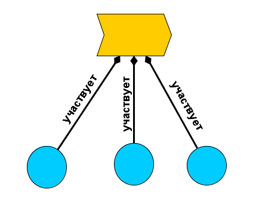

System states change over time, and considering parts and wholes of material objects allows us to talk about changes---that is, to discuss changes/actions/**processes**/behaviors/procedures/activities simply as sets of interacting systems/"system embodiments"/things-in-the-physical-world as parts of a whole change/process. A process/behavior is usually called a verb or a verbal noun. There are many nuances here, and we will discuss them in a methodology course, where we will be concerned with describing methods of work, that is, describing the behaviors of creator systems (describing work according to some methods) in complex chains of creating and developing systems by other systems. For example, creating and developing an AI agent system by a team of engineers in a manufacturing company, and this team of engineers is created by a team of company development managers. During operation, the AI agent created by the engineers behaves in a certain way. The engineering team behaves in a certain way during its operation (i.e., during the creation of the AI agent). The development managers' team behaves in a certain way during its operation (i.e., during the creation of the engineering team). And this is clearly not the end of the chain, as someone also created the managers' team, and that is also a creator system. The methodology discusses the methods of creating and developing systems, and the detailed creation::behavior and development::behavior are examined in the methodology course.

Here we will consider the way we can think about system behavior. It's easy to think about a hammer, easy to imagine it, easy to describe it. But how to describe the hammer's behavior?

A process/process/behavior/behavior---is always changes in some states of systems (events happening), and there are many types of changes.

The most significant distinguishable types of behavior for us are:

- **services as opposed to functions** (for any systems). This is a differentiation between a view of behavior from within the system towards the supersystem (service) and a view of behavior from the supersystem towards the system (function). We will consider this in detail in the current "Systems Thinking" course.
- **works** **as opposed to** **work methods** of creator systems. This is a differentiation between viewing the behavior of creator systems as affordances/constructive objects (resources that could perform work) and creator systems as functional roles that possess certain work methods. This will be discussed in detail in the "Methodology" course.

The most general type of changes, related to a particular system, we will call **behavior** of this system in relation to the changing systems. Behavior is the system's interaction with its environment, that is, "external behavior". We do not consider how subsystems, which also behave in some way, jointly providing the external behavior of the system they are part of, mutually change. The external behavior of an electronic watch is displaying the time, for this, an internal battery works, some microchips and a screen, protected from external influences by the watch case.

Of course, the environment behaves (changes) as well. For example, an agent looking at the watch changes their behavior. Moreover, the agent (e.g., a person) changes their behavior even to look at the watch (observation is an active action, one needs to plan it, then execute it, at least turn the head so that the eyes can see the watch). System behavior itself can be a response to external causes, not "initiated by the system itself." For example, a watch may show the time after someone presses a button---the watch responds to external influences.

Of course, there are many terms in the language to describe changes, many nuances of different behaviors. For example, "if nothing happens, is it formally a change/behavior, or not? A space is also a symbol, right?"

Sometimes all terms meaning behavior (verbs, verbal nouns) are considered synonymous, sometimes their meanings differ and some specialization or even classification is introduced.

In the current course subsection, we will not introduce different types of changes/behaviors/processes. We will leave the distinctions of services, system functions, and "work methods"/activities/"kinds of labor" of creator systems for later (the differences are more terminological there, the concept is the same---function/service/work method, in its difference from actual work). Let's just note that the word "process" is used both as a general name for "all kinds of system changes" (in physics) and as a synonym for methods (in process management). In management terms, "processes"/"work methods"::behaviors differ from "works"::behaviors. Method and work are different kinds of behavior (two ways of viewing behavior, with emphasis on different aspects):

- method/way as a pattern of working with (functional) method objects (an engineering substantive view),
- work---the employment of constructive resources to perform the method (an economic view).

Sometimes this distinction between processes/methods and works is emphasized by adding the epithet "working" to the process, and thus "working process" means a work method, while work is just work, not a "working process", a different type. More details, as we already mentioned, will be in the "Methodology" course. Just be attentive to the word "process": it can mean different things, as indeed any other words used to describe not only behavior but anything at all. Clarify what is meant, bring it down to earth!

"Changes"::method::behavior itself (more precisely, "change of state of some objects"::method) are poorly represented by people and AI agents to discuss them in detail. For example, it's easy to imagine a nail, a microscope, a hammer, and to discuss the nail in detail. But how to imagine "hammering::method of the nail::"object changing its state during hammering""? A gif/mini-movie appears in the mind, where a carpenter hammers a nail. Seemingly "hammering a nail" means just that. But how to discuss this in detail, how to explain it to others, how to introduce types for behaviors/processes/changes?

4D extensionalism, which is the idea of the existence of things occupying space/form/extent in 4D space-time, can help with this. The four-dimensional approach allows reducing the number of relationships because a huge number of relationships turn out to be part-whole relationships, and then changes/processes (changing states of some object) become simply temporal parts.

"Hammering a nail" is easily imagined just as an enumeration of physical objects/systems participating/interacting/mutually changing their characteristics over the time period corresponding to this hammering---i.e., "hammering a nail includes the participation of a nail, a hammer, a board, and a carpenter". Let's list the types: "hammering a nail"::process/change/behavior includes::"indicating a set of" "participation"::relationship "nail"::system, "hammer"::system, "board"::system, "carpenter"::system.

The relationship of **participation** (participation) in changes/actions/processes/procedures/activities---is simply a **specialization** of the **composition relationship** (composition, part_of/whole_to---depending on the reading direction, "consists of"/"broken into"---also depending on the reading direction).

It's very hard to find in real-life a "nail hammering process", the processes/changes as objects turn out to be invisible "in one frame". To imagine changes, one needs to imagine immediately a "movie"/gif, some complex pattern/rhythm unfolding over time, i.e. to find and imagine "repetitions", "similarities over time". If you switch to temporal parts, it is very easy to find mutually changing nail, hammer, board, carpenter. It's a bit harder to find them if a stone or microscope plays the role of the hammer, a wall plays the role of the board, and you yourself act as the carpenter (and therefore forget to include yourself in the process), and only the nail remains the nail---the similarity of all these "hammering a nail" processes undoubtedly exists, but you need to clearly understand how to discuss it. Discuss it like this: "processes" are discussed through the enumeration of physical objects mutually changing during their interaction. This reference to listing "things"/physical objects instead of actual "behavior" as a special object irreducible to things, remains a reliable method for finding works, actions, methods/practices/activities/labor, processes, functions, services, and other behavior in the physical world.

**Look in the world for not actions labeled with verbs** **and verbal nouns** **, but objects labeled with nouns** **in the physical world (systems), which behave somehow in interaction, manifest in the world their** **(outer)** **behavior.**

.

In many graphical modeling languages, **arrows with diamonds at the end** meaning the composition relationship, with the whole where the diamond is, and the part---where there is no diamond. The yellow "chevron to the side" is a stylized arrow, indicates that something changes over time, it denotes a "process". The blue circles mean physical objects participating in this process. The blue circles are parts of the process as a whole. In the end, you can consider that a "process" is simply such a compositional thing consisting of participating things---if the participation relationship is interpreted as simply a classic part-whole relationship.

So, a specific execution (instance, process, work) of dancing performed by a dancer starts to exist at some point in time and ceases to exist at another point---processes are not eternal, like any physical objects. If you enumerate all the objects of this "dancing::dancer's process::system", you describe a dance performance (which can even be considered a separate system that needs to be created to consider the dancer’s dancing in it). The dance performance as a system includes for the time of its execution

- all the four-dimensional dancers whose behavior is dancing
- the supporting segment of the four-dimensional dance floor (the parquet on which the dancers rely. This is important, try spinning on one foot for two turns on asphalt and on parquet---the dance floor covering is very important!), and also
- the volume of air with oscillations in it, because these oscillations carry the music for dancing.

We consciously refuse to use the term "dance", as it is very polysemic, has numerous dictionary meanings, and therefore confuses:

- Dance as dancing, dancer behavior (a dancer is a role of an agent, more about roles will be further in the course). This is exactly what we consider in this section. The dancer dances---that is the dance. The word is used in the most general sense of "agent behavior".
- Dance as work performed by a specific agent at a specific time, "performance"/"execution"/"appearance". The dance of Vasya in kindergarten No. 6, which he will dance on the 4th of Marchember, 2029, from 14:05 to 14:07.
- Dance as a dance style/culture/practice/method of dancing in distinguishing these methods/cultures/practices. Tango or waltz are different, and these are dances ("tango dance", "waltz dance").

So, we will say not just "dance", but dancing, dance performance, dance style---and thereby remove ambiguity. A similar confusion will be with many other behaviors/changes (for example, "life", "rest", "evolution"), implying some changes of some objects (instances and resource consideration of works, types and patterns/styles/methods/cultures/practices of works at least). We want to have these distinctions to:

- be able to discuss different aspects of a situation with changes, for this, have different concepts for different types of behavior, to discuss the various peculiarities of the most different changes in the physical world and changes in descriptions of this world, as well as changes in descriptions of descriptions.
- Not to confuse systems and their behaviors. Although we state here that within the framework of 4D extensionalism, the behavior of a system is the system itself during its changes caused by interactions as subsystems within the system (internal behavior) and the system with some systems in its external environment (external behavior), it is still difficult to think about four-dimensional systems-processes, easy to get confused, and we highly do not recommend doing it. It is better to think about systems and their behaviors, considering behavior a separate type from the type "system" and distinguishing behavior types for the same system.