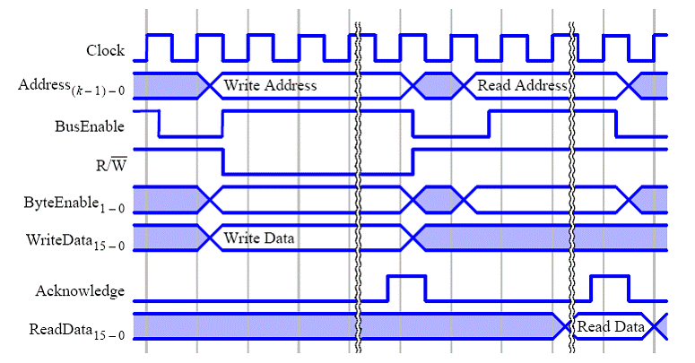

**Program::system** **("systemic" like** **OS or DBMS,**
**software application/application)** **at the moment of** **their**
**operation ---** **it is** **a thing, a physical object**, it occupies space in
space-time, it is material. A running program (the part
of the computer that changes its state during program execution) can be
"knocked on", you can poke it with your finger. A running program ---
the physical part of the computer that carries out the calculations of this program
during its operation. A program is described by its algorithm (description of the sequence
of computations), documented in the form of program code in some
language (machine language in the computer's memory at the moment of program execution, programming
language at the time of program writing). But the algorithm does not change
its state when it "works", because it is a description. However,
the computer interpreting the algorithm changes its state during
the execution of this algorithm --- and the part of it engaged
in executing the algorithm is the program::system. Structured
data changes its state during program execution. The algorithm can also
change during program execution (one part of the algorithm can
compute another part of the algorithm as its data, and then this other
part of the algorithm will also be computed). In any case, a program
(the algorithm and data in memory, "animated" by a computer with some
processor --- if we are talking about classical computer architecture,
though there may be variants with processor and memory separation, they are not always
clearly separable) during its operation --- is an object that changes
its states and thus behaves in some way, it is an object of four-dimensional
space-time, it can be considered a system.

A program as a physical object at the moment of operation has different
states, representing the physical states of RAM and processor registers,
reflecting the current state of the algorithm and the data changing during
program execution. The computer is engaged in
physical processes/changes/interactions of its component parts (memory, processor)
during data computation by the algorithm as a
description of the program. These processes in the computer occupy some place in
the physical world: the space in which the interacting
parts of the computer are located, and the time during which the program
(i.e., parts of the computer within it) performs computations:

Once again, let's emphasize: a program should be considered an embodiment of a system only
at the moment when it is actually running and working,
doing what it was written for. It is quite counterintuitive, but
**the source code of a program ---** **is not the program** **(algorithm and its
data),** **but only a description of the program;** **the source code**
**of the program** **in a version control system** **or just in a file on a
carrier ---** **is only the program documentation.** **Additionally,
there are data that the program will obtain after starting and
output after finishing.** **Do not confuse the "description on the carrier" with
the person themselves. A program ---** **is what reflects the
state** **of the data** **at the moment of its execution, it is what changes its
states over time during execution (not at the moment of creation).**
The source code does not change its states during execution, it does not contain changing
data, it is merely a description of the algorithm and data structures.

Therefore, programmers who think that their engineering work
is done at the moment of writing the source code (algorithm and data structures) --- these programmers are deeply mistaken, and it is a typical error. From acknowledging this error emerged whole movements like
DevOps^[<https://en.wikipedia.org/wiki/DevOps>, there is
a similar movement, SRE and a more modern variant called platform
engineering],
SRE^[<https://en.wikipedia.org/wiki/Site_Reliability_Engineering>]
and platform
engineering^[<https://platformengineering.org/blog/what-is-platform-engineering>,
<https://thenewstack.io/how-is-platform-engineering-different-from-devops-and-sre/>] --- programmers recognized that they must be concerned not only
with developing program code as an algorithm and data structures (time
***Dev***elopment), but also with being operators of the running program on servers
(time ***Op***erations). More about this in the course
"Systems Engineering".

The source code is a description of the program (it is done "in classes", like any design, one source code describes many possible instances of the program). Before using/exploiting the program, it needs to be manufactured, using the source code as an "description with sufficient detail for manufacturing": compiled, assembled, placed in the RAM of the appropriate computer (possibly, before that, formatted into some container) and handed over for execution. Nowadays, even the source code in a language becomes an intermediate internal representation, as does machine code: the program description is done in natural language, and then the program's text is written and handed over for execution by an AI-agent, most often called a Copilot. These nuances of creating a program from some descriptions are not so important now. What is more important is the fact of distinguishing

-   source code::program description (algorithm and data structures),
-   File::document with program description (“information object”),
-   running program::system.

Thus, **the program** **as a system** **leads** **the process**
**of changing both its states and the states of the environment (for example,
input-output devices),** **performing operations on the data recorded on the** **computer/computer** **as** **the** **data carrier.** Execution::process::program behavior::system::“execution object::method” --- this is the work::behavior of this program on some
running instance of a computer (or running instances
of computers --- for example, client-side and cloud-based), at the moment when
part of this computer (or computers) functions as a program,
utilizing the "execution" method, that is, changing during the work the physical
state of those parts (places in space-time), which are
information carriers of the algorithm and data of the program. It is clear that from the source code to such a working program on a computer is usually a long way, which previously was mostly done by the hands of programmers and computer operators, and today is done by the computers themselves (compiler tools, linkers/makers, DevOps tools are used).

The error that programmers make by considering their source code to be
the program is exactly the same kind of error that designers and constructors
make by considering their developed information models (and in the past, drawings) and other design documentation to be their system. The map is not the territory, the menu isn't the meal, you can't fly on drawings, the source code doesn’t store the values of its variables (doesn’t store changing
data) during execution^[There is a nuance related to Von Neumann architecture: the program can be considered both as data on a carrier and as an executable object. The same applies to the "program in the brain": whether it lies in the brain in its neurons as a description, or the neural network is "computing" something now, that is, there "works" a program-as-process in the physical world --- this is exactly the question of "materiality of thought". These are nuances, we do not consider them here. The advice is to consider the likelihood of whether it is a simple documented description of the program/thought or an executing program/thought in the process, taking this likelihood from the standpoint of purpose for some action. Discuss the most probable situation useful for your intended action. But this is a nuance, it is not essential in most situations. We remember that in systematic thinking we are not dealing with 100% formal statements poorly applicable to life, but with probabilistic reasoning, "as in life".].

**So, the first mistake is** **to believe that the source code of the program is the program itself. No! The source code is** **a description of the program!**

**The second mistake is** **to consider the program::system (even not confusing it with the source code)** **as the system that needs to be created and developed.** If you ask a program developer what system they and their colleagues are making, the usual answer is "my target system is the program". This is a mistake: considering the program as the target
system when the program only contains a description of the target system in its data (for example, it is a part of the management system/digital twin, not having separate meaning from the controlled system/physical twin). For example, we have already seen that an ERP system as a program contains in its data a description of the flow of components through an enterprise, it is needed only to somehow cope with this flow, to optimize it.

As soon as the developer forgets that their program is only a digital twin of a physical twin and that they are developing a whole system of a digital twin and a physical twin, the project will fail. It is as if the aircraft developer is not interested in the entire aircraft but only in its control system. No, the operability of the ERP system is checked not by the fact that it itself works, but by how it manages the flow of components through the enterprise, the behavior of the physical twin is important. The operability of the aircraft control system (digital twin) is determined not by itself, but by the operability of the aircraft (physical twin). The behavior of the physical twin is important, and creating and developing a system from the subsystems of the digital and physical twins are crucial. And even in weaker versions **digital shadow** and **digital model**, this also applies: the digital twin is an automatic control system, the digital shadow is an automated control system --- it receives data from sensors of the physical twin, but then simply shows the state to the operator, and they "manually" control the system. The digital model also gets data "by hand" and provides management parameters for "manual" control. For example, a navigator in a car with autopilot is a digital twin, a navigator with a satellite sensor and voice indicating where to steer is a digital shadow, and if the navigator needs to tell you where you are and you will be told where to drive next, but you have to steer yourself, then this is a digital model.
The conversation about software today should take into account that this software is either an agent itself or a digital twin, or a digital shadow, or a digital model of some other system --- the physical twin (or the software is part of a network of software, **digital twin network**, and still, you need to think about the physical twin being controlled by this network of software).

**The third mistake of “program as a system that we develop” is to consider the program itself as the developed system, not some subsystem in a situation where it is about supporting the work of some organizational entity with people or other programs.** If your salary issuance program works wonderfully, but you forgot to train the employees of the enterprise or AI agents (or even other programs within the automation) to master working with this program, then this means the program is not working: the salaries are not being issued! If the payment is only for the program, then you can argue for a long time about who pays for staff training or AI-agent training, or for reprogramming all related programs (which can be much more expensive than developing the discussed salary issuance program itself).

In the case of the error with the digital twin, the program and its data (for example, in databases) are interpreted as a book: we are usually interested not in the book itself, and not even in the content of the book (the book's text itself), but in the worlds described by the book's text. We are interested in the worlds described in the book, not in the beauty of the style (except for "special connoisseurs", if it’s fiction, writing for the sake of writing). It’s the same with programs: we are interested in the fragment of the surrounding world described by the program, not in the program itself (it’s no more interesting than a book and its text). If you have a dry-cleaning ordering program, you are interested in the clothes that will go from dirty to clean, the money that will be debited from your account, and the transport options for sending things to the cleaning and back. The programmer is concerned with the program, but that’s his personal issue: everyone else is concerned with how this program handles the actual dry-cleaning situation, and the programmer should also be concerned with that. If the program is excellent as software, but dry-cleaning is impossible with it --- then it’s a project failure! **Software is tricky if represented as the target system, it usually works with descriptions of target systems,** **look behind them for the physical world, changes in which matter!**

In the case of the error with "our responsibility is only the program, we know nothing about people and organization," the inclusion in the target (or even "our") system is only software,
but not the organizational entity that performs some meaningful service (work that changes something outside this service), supported by the software. In corporate software development, clients expect as a result of this development not so much the correct operation of the computer with application::program, but the correct functioning of the part of the organization that this computer should support: **people in the organization** **must work together with the program according to some organizational algorithm, “workflow”, follow the work regulations, which include the use of the program ---** ** that is, they should have "mastery", and the program will be the tool of this mastery.** Software without people doesn’t work, it is necessary to demonstrate the work of the software-tool with people (although more and more people are being replaced by other software, including AI software), but the focus is not on changing the states of the program itself (program behavior as a development result, “payroll software works”), but on changing the states of something outside the program ("salaries are issued") by which "people issuing and receiving salaries work together with the payroll software", that is, both "people work" and "software works"). They will not accept a working drill. They will accept a worker who will drill holes in the walls with your drill: they need holes, not a drill! And the worker can use a finger if the holes appear! If there is a drill but for some reason there are no holes -- they will not pay for the drill because there is nothing to pay for. The same with software: the results of software work as a tool are needed, for that the worker needs to demonstrate the result of working with the tool.

Such a joint service of people and computers is usually called workflow ("workflow"::behavior), but no less often it is called an organizational process, "work process", drawing attention not to the actual instances of work, but to the method/mode of work necessarily including operations of the program in the total organizational process operations. The program-in-development is usually only part of the target organizational process-in-development. And the delivered running program won't be accepted on its own; its operation is of no interest by itself. The target organizational process-in-operation is needed, in which the program is only a part, and there also participate other programs, people, and sometimes other equipment, and all of them must interact correctly with each other. If the "business travel accounting application" works, but no one can go on business trips because no one knows how to use the program, no one will pay for the program's operation. They’ll pay for business travel, which will only happen when people and the "business travel accounting application" work together. No one will pay for the functionality of only the software! Software is usually only part of the system created and developed by the software development project!

People find it hard to think about processes (including organizational processes, work processes). Therefore, the program here will be part of the organizational entity (department, project workgroup, service, service provider) that will perform the necessary changes in the end (through chains of numerous changes of descriptions and descriptions of descriptions) in the physical world. The program itself will be the personal affair of the programmer or a small programming team; keeping it at the forefront of attention as a full embodiment of some target system is reckless, it is usually only part of some system, like the motor in an electric car or the control system of a washing machine. The motor is an important part of an electric car, but usually, not the motor itself is needed, but the electric car. If the motor works well in the electric car, but the car doesn't run due to the motor being poorly coordinated with its design, no one will pay for the motor, they will pay only for the working electric car in its entirety. The same goes for the washing machine control system: it’s not needed by itself, a working washing machine is, and developers will be paid only for it, while developers of the control system will get a portion of this money to the extent they manage to control the washing machine, not to the extent the control system is operational by itself.

The matter is also complicated by the fact that programs/software/applications as informational objects (information carriers with descriptions of algorithms and data in databases) can form long chains, in which based on some descriptions, programs (or even programs-within-departments-with-people) change other descriptions, then third ones --- and only at the end of such long chains of "descriptions of descriptions" occurs the desired change in the external physical world. You can describe yourself for a long time, where to get your money, your intentions, record intermediate decision results by various other programs and people in a computer and/or phone, but only at the end of a long chain of booking airline tickets and checking tickets, as well as checking the presence of the plane on the tarmac, you will be physically allowed on the plane: hundreds of diverse programs and people, some of whom you are aware of, some even unknown, work to get in the physical world your state "I'm on the plane, which is ready for the flight". If this result does not occur, all these programs and people worked in vain. **Therefore, do not be lazy to unwind all these** **“descriptions of descriptions”,** **all the long chains of programs and programs-with-people ---** **until you reach the changes in the physical world for which everything is done. And make sure everything is in order in the physical world. Yes, it is difficult, but systematic thinking requires turning your attention in this direction. It is important:** **the output** **of software work discussions into** **discussion of changes** **in the physical** **world ---** **this matters, if reliable and expected changes in the physical world do not happen, the software development project might as well not be done at all, because nothing will change in the physical world!**

For example, this connection between software objects and the physical world
is discussed in the DDD (domain-driven design) approach, where it is required that
program objects directly reflect physical world objects in
the company’s domain of work (by the way, it also requires reflecting
objects of the mental world --- the world of descriptions, but this is not so important for us now)^[<https://en.wikipedia.org/wiki/Domain-driven_design>].