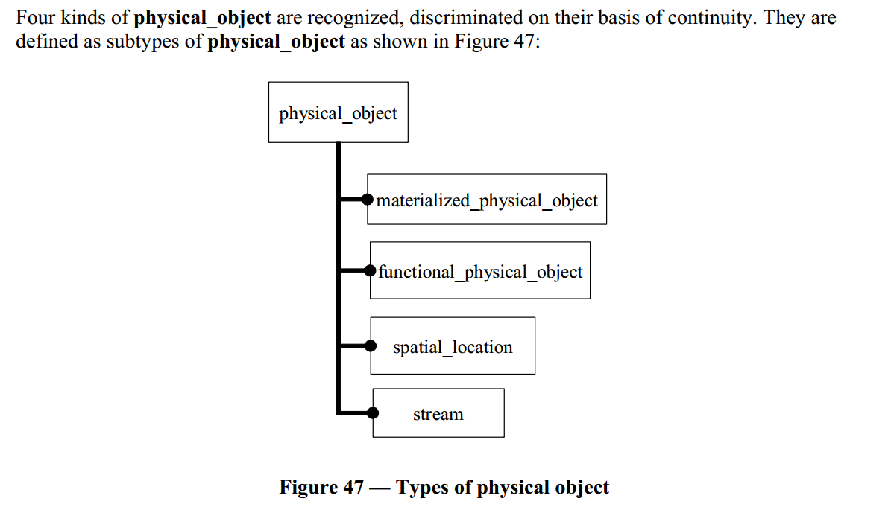
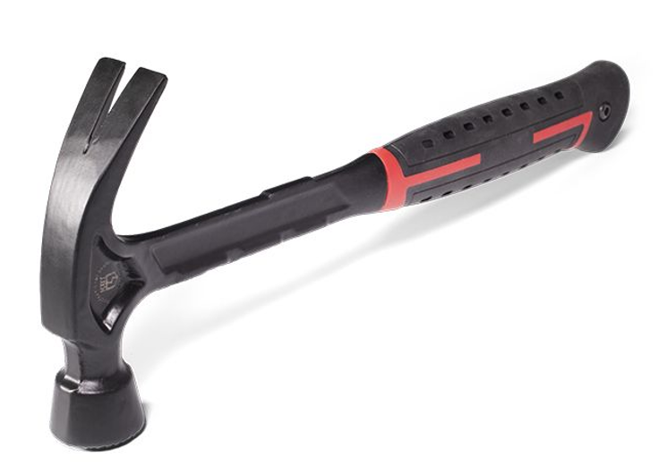

The same system can have numerous descriptions:

-   Functional/role-based: a kettle is needed to boil water. It heats the water poured into it to boiling, then whistles loudly to signal that the water has boiled.
-   Constructive: the kettle consists of a body, heating element, boiling indicator (sensor, controller, speaker), and a cord with a plug for connecting to the power grid.
-   Placement: the kettle is on the window in the kitchen, plugged into the socket to the left of the window.
-   Cost-based: the kettle costs 5,000 rubles upfront, and then you will also pay for electricity depending on your rate, 1.2 kW per hour of operation.
-   ... and there could be countless more descriptions. An artistic description to evaluate how it fits into the interior, a description of potential hazards (burns, electric shocks, etc.) from a safety perspective, instructions on how to perform maintenance (remove scale) and repairs, etc.

Remember, in 4D extensionism, if you describe some objects and these descriptions refer to the same place in space-time, then it's the same object. If you describe a "warm item on the window in the kitchen," your friend describes an "orange item on the window in the kitchen," and I describe a "kettle on the window in the kitchen," and you understand that nothing else is on the window in the kitchen except this kettle, then we are talking about the same warm orange kettle on the window in the kitchen.

All these descriptions seemingly have equal status, but the first four are commonly accepted as the most important, with the first among them being the first among equals. Systems thinking considers systems primarily as having a **purpose in their environment** **at the moment of use/operation/functioning**, meaning they provide behavior that is important/interesting to someone in their surrounding environment in their finished state (not at the moment of creation). This description is usually called **functional** (what function the system performs in its environment during its operation, emphasis on function::behavior) or **role-based** (what role the system plays in the environment, emphasis on the role object::thing, that is, an object that behaves in some way). What is important to someone varies — for different agents from different projects, something may be important for their own functioning, and something else may not. One agent may need the kettle to boil water quickly, while another agent might care about the kettle being orange; the latter agent is concerned with the interior design rather than tea-making. Systems thinking should enable agreement on these important issues so the created system is successful. Here, "important behavior" can be "importantly needed" or "importantly harmful" behavior, the main point being not the positivity or negativity of the behavior itself but its importance to the agents concerned by the system or affecting the system. These agents are system creators, but there are also agents concerned with systems in the environment around the created system and systems involved in system creation projects existing in the surrounding metasystem. All these interests need to be satisfied. Therefore, there could be multiple functional descriptions (the same system may play different roles in different metasystems identified by different agents in their projects related to the target system), and these will have to be reconciled too. And since we mentioned both creator agents and user agents and systems in the environment, it is usually necessary to functionally describe all of them. Systems thinking requires this description first.

First, you need to understand what the system does during operation, what benefits or harms its behavior brings: what the system's role::thing is and what the function::behavior of this thing is (the behavior of the role during its operation). The role is the system itself in its physical form, as the role object is physical when its role is performed by a constructive/material object within the system. A constructive/material/materialized object is important in the time of creation by the creators; it represents the "material" of the role, the substance, and fields. However, the role/functional object is physical, though it is less often called the "physical object." A physical object exists and is stable as long as the material exists over time in some form (NESS, insignificant fluctuations for maintaining stability do not affect it here), and this material is taken independently of its function. But the role/functional system is physical because it remains as long as its function::behavior is performed by some constructive objects. Thus, we consider the system at least twice (and then we find out that we need to minimally consider the system four times, but usually a much larger number of times):

-   **As** **role:** functional/"role object"::"physical object" (physicality is ensured by embodiment with constructive/material objects) performing some function::behavior. The functional thing continues to exist as long as the role is maintained (the same function is performed), and the material can change. The kettle as a functional object exists as long as some construct heats water. If it doesn't heat — it's not a kettle.
-   **As** **constructive:** constructive/"material thing"::"physical object," which continuously exists as long as its physical **material** is preserved, while the role may change. A stone is either a paperweight::role or a nail driver::role, but it is just a stone, "material," "constructive."

These objects are related by the relationship of embodiment: a set of constructive objects embodies some functional system (role).

Different versions of systems thinking treat the physicality of the functional thing/object a bit differently. For example, in ISO 15926, a functional object is considered one of the subtypes (specialization relationship, "subset") of a physical object.

Moreover, in ISO 15926-2:2003, spatial location is also a physical object due to 3D extensionism. As a functional object is defined based on the stability of purpose/behavior, as a constructive/material object is based on the stability of material presence, so a spatial object is defined based on location stability. Another material object is separately distinguished which is important in engineering but difficult to define through the constancy of material, location, and purpose: a flow/stream, where the constancy of its path/flow_path is important.

"Functional physical object" and "material physical object" are linked by the relation "temporal whole part":

-   The word "temporal" here means that the functional physical object exists temporarily, only when its role is played by some physical object. For example, "crane operator" exists only at the moment when this professional/operational role is played by some person or even an AI agent, and "driver" only exists when this role is played by a stone or a microscope.
-   The word "whole" means that at some moment, one constructive object entirely fulfills the role of a functional object (the crane operator entirely consists of the person playing his role, the driver entirely consists of a stone or microscope, and sometimes a hammer, but also entirely).

In other schools of thought, it is said that a functional object is not directly a "physical object" but is "physical when embodied by a constructive physical object." Which is correct? Different engineering schools and schools of philosophical logic give different options.

A number of engineering schools introduce the concept of affordance/"suitability" for a constructive object considered during its role-playing. So, "Vasya, trained in crane operator courses" is an "affordance" for playing the role of "crane operator," and a "microscope" as a material object is an "affordance" for the role of "instrument for examining small objects." However, in some situations, it is an "affordance" for the role of "nail driver."

Pay attention to the nuances and abundance of terms for the same concepts in the proposed ontology, but the general idea remains the same: 4D extensionism will help sort it out. In any case, we cannot discuss systems until we understand:

-   Function: what the system does (what its function is, what behavior we expect from it)
-   Construct: what material performs the necessary behavior
-   Placement: where this material performs the behavior
-   Cost: how much it will cost to create and operate the system (total cost of ownership).
-   ... and there could be many more different descriptions of the same system, each time refining the previous ones and requiring agreement: all of them should consistently describe the same place in space-time so that they describe the same system.

Systems are the embodiments of the system, physical objects. Essentially, it is stated that all systems::"physical objects that we have highlighted with our attention from their physical environment" demonstrate some behavior, changing the state of the external environment in a targeted manner, usually referring to a non-equilibrium steady state (NESS, non-equilibrium steady state, small fluctuations in the state of the target system interacting with the external environment, the target system thus not being destroyed).

**Systems** **represent roles in the environment, performed by constructive objects chosen from material affordance objects and playing the role of this system in the environment, occurring in some place. And it doesn’t matter what terms express this: different words can be used. For instance, the term "function," denoting the behavior of the object considered as a role/functional object/thing at the moment of its use/operation, can be replaced in the case of a system-creator agent with strong (capable of planning its actions in a changing environment) intelligence with words**
**method/activity/engineering/practice/culture/style/strategy, and there can also be nuances related to distinctions of specialization** **or classification** **(e.g., "type of labor," "type of engineering," "subculture," "sub-style," if they want to emphasize the narrow nature of the statement —** **and remember that prefixes "sub-" and "super-," as well as "meta-," can refer to different types of relations, always clarify).**

In conclusion, in the previous text of the subsection, we introduced the following important objects of attention (**ontology** **of functional consideration** **of the system**):

- The system as a physical object
- The system's environment
- The time of use/operation/functioning of the system
- The role (system in some role), functional/role object, which is either a physical object or simply "physical" at the moment of system operation — depending on the school of thought, we take the option where it is a physical object, as in ISO 15926-2
- Constructive/material object of creation time, physical object
- Affordance as a chosen suitable material object from the surrounding world (possibly complex, e.g., a nuclear power plant as suitable for electricity generation) performing the role.
- Function/purpose/"behavior of the system as a role" – this is behavior to bring the system's environment to an expected state during the system's operation/use/functioning. This is a common term for all types of systems, but if the agent is "smart" (agent in a narrow sense of the word), then the term will be "method" (and another dozen others — activity/labor/style/culture/practice, etc.).
- The state of the system (we’re talking about minor "working" state changes that do not lead to the system's destruction) and the state of the environment (including the expected state as a result of the system's function) at the time of use/operation/"performing the function."

Of course, no definitions can express these complex relationships; a lot of text and examples are needed.

To reiterate: different schools of engineering and system thinking have nuances in the use of all these terms, nuances in defining concepts. The use of types and grounding helps to understand.

Function is usually behavior with an emphasis on "purpose as the expected result of behavior at the moment of use: what happened to the system's environment," but functioning is "function work," with an emphasis on the time of work/use and the system itself producing changes in the environment. And you also need to monitor when discussing whether a system instance or a type of systems is being referred to. For example, "the function of an airplane is to transport cargo and passengers by air" — this statement is not about a specific airplane but about "a number of boards with different serial numbers, from different manufacturers," given the general statement about all instances of the type "airplane" (boards with serial numbers), not about the type itself as an abstract object.

You can get bogged down in this ontological work, but you won't be able to build your texts in natural language to be ontologically precise: people will stop understanding you, and the text will be like a text in a programming language. However, in communication with agents based on language models (people and AI agents), you need to use natural language understanding mechanisms, including S1 with its prototype theory of concepts, and S2 with strict logic, but not overdo it: communication in programming and modeling languages is possible but very difficult. You should fully formalize only what is very important: it’s very labor-intensive! To some extent, this explains the limited spread of systems thinking: it clearly requires working with types and formalizing much more than usual, hence being labor-intensive even with training. But systems thinking provides excellent results precisely due to the move towards the formalization of the ontology of the situation, the formalization of system descriptions.

Therefore, in our texts, we will strive to observe strict typing wherever possible but will not fully switch to the formal mathematical language of system modeling. Thus, you will need to somehow deal with the inaccuracies in indicating object types and understanding object types in any case (both in our course and in life). Grounding will help you: always consider the intentions of your interlocutor, including the course author's intentions (what does he want to express, which situations is he talking about? Specific "instances" or types of situations?), and try to concretize with examples from real life, that is, to "ground" the statements. And of course, if possible, ask clarifying questions about the types.

If some subsection of the course turns out to be poorly understood by you, remember: no definitions or clarifications of terms will help, but numerous uses of terms in various situations, this will significantly refine understanding. Highly likely, you will get examples of such numerous uses of terms in multiple situations as you progress through the course since the material presentation in our courses consciously includes revisiting opportunities. So just keep going through the courses, and then revisit the entire chain of courses, which will help more than getting stuck on a small unclear piece of some subsection. We will repeat everything more than once!

Let’s say a physical carpentry hammer[^](https://dnipro-m.ua/ru/news/vidy-molotkov-i-ikh-naznachenie/) used (not being developed or manufactured: the time of system use, not creation) in its environment usually (but not always) plays the role of a nail-driving device. For simplicity, let’s call it a "driver" or "nail driver," but sometimes you might see very general words ("device," "system," "tool") followed by an indication of the function ("driving nails"). Hence, bureaucratic terms like "nail-driving system" or "nail-driving device," "nailing tool" appear.

The role::thing "driver," manifesting the function::behavior "driving" at the moment of use, can be played by a stone, can be played by a microscope — they can both be affordances for a "driver." But more often, it is (a carpenter or even locksmith) hammer. You might even confuse the constructive/material object "hammer" with its role "driver" and call the role itself "hammer," in which case the constructive/material object "microscope" (with the primary purpose in its traditional role of helping examine small objects) will be called "hammer" if chosen as an affordance for the role named "hammer" "driver."

This confusion between the constructive-in-role and the role-constructive leads to funny jokes in situations where everyone is used to some construct embodying some role, and suddenly they need to name the role, but everyone has even forgotten the role's name! "Who will be Vasya today?" they say in a situation where Vasya has long played, for example, the role of "crane operator" and suddenly Vasya does not show up, searching not for a construct for "crane operator," but "construct for the construct," Vasya. The role is simply "implied." It’s funny but not so funny when instead of a "hammer" they look for "another hammer," thereby losing the opportunity to replace one affordance with another. Say, a driver, whose role is played by a hammer, with a driver whose role is played by a nailer (automatic electric nail driver).

We should still differentiate the functional/role naming of the system by its function in the environment and the constructive/material name of the system as a material object "without the intended environment," which is only being considered as an affordance/suitability for its role. Names are not scarce; one object can have many names. The main thing is to understand that if two different names refer to the same place in space-time, it is the same object. If "microscope" and "nail-driving device" refer to the same place in space-time at some moment, then it is the same object. If "hammer" and "microscope" refer to the same place in space-time at some moment, it's the same object, and you can guess whether it's a microscope being used to drive nails or a hammer being used to examine something.

A role/functional name of a system always indicates the purpose/function as the system's behavior in a role. If the role of the system involves driving nails, then the role object's name is "nail-driving device," "nail driver" or something similar. And for a hammer, this consideration seems to end because it is usually clear from the context what driving a nail involves with something like a hammer. But no, the "nail driver"::system as a role object can demonstrate surprisingly different behaviors:

-   Driving a nail by the blow of a hand-driven hammer, mechanically
-   Driving a nail with a nailer on electric power,
-   Pressing a nail with a press,
-   ... invent a dozen more ways.

To change the way/method of the "nail driver" system's work (you see how many different functional names for the system's role came up, more and less bureaucratic, but each time meaning the function "driving a nail") as a simple physical system, it is necessary to reassemble it from other constructive/material objects as affordances. A nailer and a hammer are built in entirely different ways concerning the constructive parts used.