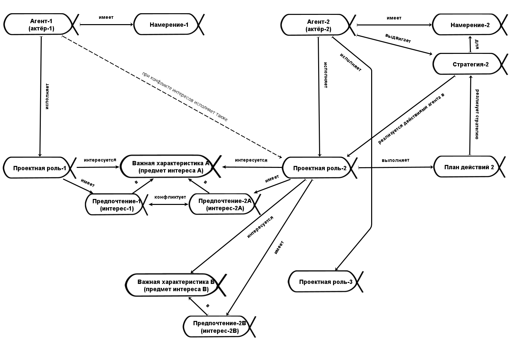

Graphically modeling something in this situation is not possible^[The impossibility of graphical modeling is discussed in A. Levenchuk's book, "Visual Thinking. A Report on Why You Shouldn't Be Deluded by It," 2018, <https://ridero.ru/books/vizualnoe_myshlenie/>]. Here is an example of an attempt at such modeling: we start drawing for agent-1 and his intention, then add the second agent and his intention, mention his strategy/method and action plan, a couple of important characteristics and preferences of his first role, then add the second role of the second agent, and here we understand that the diagram is already complex and continuing in this manner further will only lead to confusion. But we haven't even drawn the methods by which the roles act! And the systems that the methods work with are not yet on the picture! And even with the already touched upon agents, intentions, strategies, action plans, objects of interest, and preferences, we fall back to listing the difficulties from the previous paragraph, realizing that we have just begun modeling!

But these are all important objects in the situation that must be considered. This is how methodological thinking works, which finds objects of missing types in the situation and draws attention to them, forcing us to reason about them. Without that, there will be no systemic thinking either (remember that important characteristics/objects of interest are characteristics of the most diverse systems encountered in the project, all these roles manifesting their interests work with systems).

What is the way out here? Perform all mental operations in the mind? That's not an option either, as you can't keep all the systems and all the agents with their quickly bloating descriptions in attention. Therefore, the solution is in tabular (or even textual) modeling. There are many objects and their relations in the real world, but there are not so many types of objects in methodology (agent, intention, strategy, plan, role, important characteristic, preference, skill, and for now, we will limit ourselves to this set of concepts in methodology. We will consider the method of work as such, work, position, later on), and these types will be mentioned in columns of rather long tables.

How does this look in life? This will be discussed in more detail in the course "Methodology". There, it will be shown how to make lists from graphs, and then present these lists in the form of conveniently editable tables. The key to solving the problem of systemic modeling is to understand that the objects of attention in the project have types, and objects of types from our courses (types of meta-meta-model). From project objects "from life," one must transition to types "from the textbook" and then think using these types from the textbook to understand what to do with objects from life.

In the course, we denote the type with the symbol **::** (double colon). In everyday speech, this would often be either "type of object" ("agent Vasya") or "object-type" ("Vasya-agent"), but we do not rely on entirely everyday language and show the classification relationship with the symbol **::**, first bringing the object, then its type. We do not say "airplane system" or "airplane-system," in life we omit the indication of type; this is the norm. But why use the type indication at all if it is not indicated in life?

A type improves understanding (Ford::car, Ford::President of the USA, Ford::founder of Ford Motors::company—the types significantly ease the understanding of word meanings), but most importantly, types help in modeling. Modeling is creating a model, that is, an object that in some important respects replicates the behavior (often in thinking, in computation) of the modeled object. This means that the model significantly compresses information about the modeled object, pointing only to what is important. Thus, types are used to point to what is important.

In a project, for each object/entity/concept, you need to figure out its type. If it is about some transdisciplinary (i.e., systemic, methodological, etc.) reasoning from our course, then in life you need to find the missing objects, draw attention to them—and do this in writing, "systemic modeling." This is "engagement of systemic thinking" (if you don't write, you don't think! If you don't model, you don't think systemically!).

Methodological thinking, systemic thinking, and all other types of thinking are ways to manage attention in a complex situation, to find objects for which it is convenient to discuss cause-and-effect relationships, to build explanations. All material about methods, roles, and agents is precisely the material about types that are somehow connected in the course text, with relationships written between them.

So if someone in the project is doing something (if they are not doing anything, do not pay attention!), then they are engaged in work by some method. What is this method/practice/culture/style? Are there other ways to perform the work, to get expected results faster and cheaper? That "someone" is thereby an agent in a role! What culturally conditioned role is this? When you found the role, go further in reasoning: the role performing some method of work will have some important characteristics/objects of interest, in which the role will have its preferences/interests, that the work method for this role would like to see implemented.

That is, if you see that someone is selling something (and the sale can be implemented very differently! You still need to guess that some actions of the agent represent a "sale"::"method of work"). Thus, you see the agent/actor/"role performer"/organizational unit as a seller::role. If there is a "seller," then immediately look for the object of interest (price) and preference (the price should be higher). Then you can already propose your strategies (methods by which to act further) and build plans to implement them. For example, look for the second role of the agent (Vasya, playing the role of seller), or go look for another seller, or propose cooperation (discover that you need not to buy from Vasya at such prices but to become his dealer and ditch your previous project, that is, exit one of your roles, or even the project, and implement a completely different strategy).

**If roles with opposing** **preferences/interests** **in one important characteristic** **of the system or project are performed by one** **organizational unit/agent/actor, then such a situation is called** **"conflict of interest,"** and this is a very common situation. Let's recall the proverb "let the goat guard the garden": the goat itself believes that it will balance the preferences of eating the garden cabbage and guarding the cabbage from being eaten. People from the outside will think differently. Conflict of interest is poorly noticeable from the head of the one carrying this conflict but is usually well noticeable to other participants of the project. To oneself (or a representative of the organizational unit—a organization with many people, but in a conflict of interest) one seems like an expert deeply familiar with the various conflicting roles and therefore making "balanced decisions." But no, these decisions do not seem "balanced" to other participants in the situation! The goat, guarding the garden, surely makes "balanced decisions" about how much to eat from the garden and how much to save from any encroachment!

Positive preferences in their objects of interest for project roles are not mandatory. Simply, **preferences** **of "antagonists"** **and "anti-clients"** **are considered in projects with the reverse sign**—thieves are not allowed to steal, killers are not allowed to kill, terrorists are not allowed to commit a terrorist act. At the same time, remember that in one project someone will be "a damned spy and traitor," but the same person in another project—a "brave scout, risking his life in a holy struggle." That is, this "positivity of preferences" is tied to ethical reasoning, more on this in the ethics section of the "Intelligence Stack" course.

Project/work/activity/organizational roles are precisely roles; they are played, not "immersed into." Agents realize role skills: safely enter a role, safely exit a role, stay in a role for a prolonged time. They never forget that they can change roles, that this is "role-playing." **Vasya Pupkin, imagining that he is not playing Prince Hamlet** **in Shakespeare's play but that** **he is Prince Hamlet** **is a madman; when changing** **thinking about** **Prince Hamlet** **for Vasya Pupkin** **to thinking about** **engineer-architect** **or cardiologist for Ksenia Samoylovna, fundamentally nothing changes here.** **If Ksenia Samoylovna forgets that she is playing the role of an engineer-architect at work and imagines that she is an engineer-architect everywhere and always (a character, role), we will consider her insane.**

Pyotr Petrovich plays the role of a husband in the project of one system, a buyer in the project related to another system (and at this moment he can either continue playing the role of a husband if the purchase is related to the husband's role or the husband can disappear for this time—just as Prince Hamlet disappears while the actor playing him plays the role of Othello in another play, or even just sleeps at home, resting from the theater), a patient in the project related to the third system. If Pyotr Petrovich really transformed into Prince Hamlet, this in the acting profession is a sign that Pyotr Petrovich has gone mad and confuses himself and Hamlet. The same applies if a person at work forgets that he is playing the role of an engineer or manager: he has gone mad if he thinks that he is an engineer or manager! Roles are played, not immersed into!

Project role, activity role, functional role, organizational role, work role, team role, cultural role, just role: you specify the role of some agent with different epithets, but this is not so important. These are all synonyms, with different clarifications you will emphasize various shades of meanings, this synonymy is of the same kind as the synonymy of methods/practices/cultures of work. We will remind about this synonymy more than once. And the role itself is not that important. What is important is that the functional object is considered at the moment of its functioning. A role is a system as a functional object, for a functional object it is important what changes the role makes in the environment, that is what this role does, what function/method/practice of work this role performs. The role is always considered at the moment of its work/functioning, we evaluate the changes its behavior makes in the surrounding world (that is, we evaluate, for example, by some checklist, which objects in the environment of the system-role changed from one state to another).