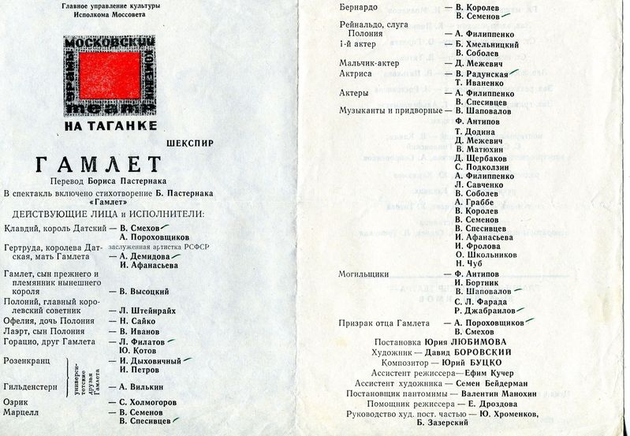

It is easiest to discuss behavior influenced by the execution of a method as a kind of **live-action role-playing game**^[[https://en.wikipedia.org/wiki/Role-playing_game](https://en.wikipedia.org/wiki/Role-playing_game)], played by various groups of players. A live-action game can be thought of as a theatrical performance without prescribed lines and a clear plot, although roles and a storyline outline are given—the rest will be improvisation by the role-playing agents/actors. Another important distinction is that in role-playing games, roles are played not "for the audience" but "for oneself and other actors." The simplest role-playing game would be the game "house" ("let's pretend you are the mom, and I am the dad, and you will be the child," or "let's pretend you are the firefighter and will rescue me"; sometimes these children's games are called **scripted role-playing**^[<https://www.akusherstvo.ru/guide/syuzhetno-rolevye-igry-dlya-detej-pochemu-oni-vazhny/>]), in which young children play, or "war" (where "you’ll be the reds, and I'll be the blues, and we'll fight"). Even simpler are sports games like soccer, where everything follows simple rules that slightly differ for various roles (the goalkeeper can touch the ball with hands, while other team members cannot). Sports games can be both "for oneself and other actors" and "for the audience," but in general, they are distinguished by having a clearly defined game goal and methods to achieve it. In live-action role-playing games, the goals and methods of achieving them are much more flexible and are more akin to professional and personal projects. Here’s what players in a classic live-action game look like:

In a theatrical play, they look just as colorful, except their lines are already prescribed, so the execution of roles in some method in projects is a bit farther from theatrical performance and closer to a live-action role-playing or scripted role-playing game.

The most important aspect here is **role-playing**^[<https://en.wikipedia.org/wiki/Role-playing>] as a change in one's behavior to somewhat resemble the working methods of the chosen role. Whether this transition to "role-playing" is fully conscious to the player/actor in the role-playing game or theatrical performance or passes unnoticed by the agent performing some work in real life, the work is done by some method, thus the agent plays a role in this method. If it is buying a bun in a cafe, you, whether conscious of it or not, are performing the role of "buyer" in the method of exchanging goods, specifically in a voluntary exchange, which is "buying-selling" with roles of "buyer" and "seller" (and you can easily count many other roles: for example, you can buy a bun for a child, and pay not from your account—thus the roles of payer, beneficiary, and buyer may diverge, each performing a part in the buying-selling, without even touching on splitting the roles of the seller. It does not matter whether the agents call themselves something specific (and even if they are people), what matters is what they do—and from these actions (method/way) we recognize their role.

If you are not acting randomly but following some method, then you have started role-playing in some role-playing game, following some plot. It is safe to assume that this is a role from some game (the same "buying-selling" or "course studying" as a "student"), whether you know it or not, whether you call it something or not. Life thus, in systemic thinking, is simply the performance of actions in various methods/ways in different roles, life itself is a "role-playing game," with many roles and many role-playing games.

You come to a pizzeria and order pizza—you play the role of a pizzeria visitor. And once you start playing this role, play it precisely. So, if you ask at the counter for women’s sandals size 37 instead of pizza, you'll immediately see this seemingly hidden role structure, by which people perform work in some method, keeping themselves in some role for this method. Your request for sandals in a pizzeria will cause its staff to deviate from their usual work roles to deal with your role—what method, what result you are trying to achieve (what is your function as a system in relation to your environment in which they find themselves), what is your role, what are your interests? If you do something similar in a project at work, playing "out of role," i.e., showing a deep departure from the method of work prescribed by the role, you will immediately cause an investigation with clarification of roles and the methods used by these roles. If you unexpectedly change your method of work (say, after reading a textbook on operational management, stopped taking ten-twenty tasks at once but started performing no more than two tasks in parallel), the result will be the same: an attempt by colleagues to figure out what is happening, what methods of work you perform in what role, why these methods (which results you want to achieve), why you use this type/variant of the method in this role.

If the departure beyond "work as a role-playing game" is obvious, i.e., you demonstrate behavior in a project role not among the expected project/organizational roles, the outcomes will be very different depending on the roles played by colleagues and the roles they consider acceptable to play during the project work. Try asking a colleague to bring you pizza or scratch your back. The results of the request will clearly show that the work in the project is deliberate, not all requests are possible: the attitude will be akin to the game "house," where the dad suddenly decided to play the role of the granddaughter. Leadership—this is the role returning the player in the father role to fulfilling the taken role. At work, leadership does the same: if an employee is tasked to perform some role in the activity, i.e., conduct work with specific objects by some method, not perform arbitrary actions at arbitrary times with arbitrary objects, leadership will strive to bring him back to this role.

In the work environment of **blue-collar**^[<https://en.wikipedia.org/wiki/Blue-collar_worker>] settings, it may be less colorful regarding clothing, but the principle of dividing collective activity by roles (division of labor) is the same.

In an office environment with roles and projects, it is the same—all are dressed more or less alike^[<https://en.wikipedia.org/wiki/White-collar_worker>], so you have to guess who agent is who role sometimes by the lines chasing the role interests of the agents, and sometimes by their actions (for one can punch in the face, saying polite things about the weather outside—the words do not always match the actions, methods of work are about deeds, changes in the physical world state in the end, descriptions here are extremely important but secondary, they may starkly not match reality, conversations look all alike, yet the situations discussed vary greatly, including differing from what is discussed in conversations)^[Illustration zna-camarada]:

Not only actions of agents may diverge from their lines, but every agent present in a project (some of whom will be absent but available via computer networks, this also needs to be noted) can role-play several roles, and you may not keep up with which role he is playing at any given moment: in a conflict of interests, lines might be from one role (say, the goat-guard of the garden), and actions—from another (say, the goat-eater of cabbage). Clothing as a role identifier in important situations helps clarify. Put on a judge's robe—well, you are a judge while the robe is on. Don a security jacket with tie, put an earpiece in your ear—well, you are a security guard, guarding those in t-shirts and jeans, but only temporarily, as long as you are in uniform.

Despite significant differences in role interpretation by live-action role-playing players and game masters, or even a simplified version (with known and memorized lines, repeatable situations) by actors and directors in different theaters, and even in the same theater on different days, there's much sense in discussing the game scripts or plays and the roles involved (**methodological reality,** methodology realm, activity reality—classes, the general, typical), not just their separate performances/executions (**operational reality** of a specific project, endeavor realm, reality of individual work performances with specific dates and performers).

The role-playing game metaphor sets role-playing by some method and its knowledge/script/algorithm given by the game plot, albeit with possible variations (unlike "variantless" theatrical role-playing). The script/knowledge/theory of the method describes different typical situations in which the agent-player will act in role, conducting **work** (performing tasks with specific resources::construction at specific moments of time), but work based on an algorithm/script/theory, being within their role, achieving various ever-changing and agreed-upon in-game (and in life—project) interests. Importantly, different roles' work methods and interests differ (in role-playing games, theater, work-life, hobbies, and personal life), therefore work methods turn out different: kings maintain their lands and try to conquer others, shoemakers make shoes, wizards cast spells, warriors fight, engineers try to make the world better, managers organize agents to make the world better.

A game/method/practice/activity/function can

be played/executed/involved many times, the work method is repeated many times with different constructive objects, playing the role of functional objects employed by the method. Though each game's performance, or in a more simplified, less improvisational version—each theatrical play execution is somewhat unique, thinking can be economized by "bracketing out" all that is repeatable. The method/way implies employing craftsmanship, similar to software programs following an algorithm/knowledge/discipline/theory of the method and supported by tools—thus the method is applicable to various combinations of inputs and/or materials, and outputs different results for these inputs and/or materials. A good method works with many different objects if they are of the suitable types—just as a computer program works with varied input data if they are of its needed types.

The cultural conditioning of roles and methods, the use of terminology from culture, is important; it provides stability to methodological discourse. Wizards always cast spells, electronic engineers always design, repair, test electronics—no matter if it's in role-playing or even a business game, theatrical play, project work. This is irrespective of the performer being a man, woman, elderly or young person, a large organization, a robot, each performance conducted by the same actor/agent/player or different ones. Though of course, role-playing skill (called acting skills in theatre: a safe entry and crucially exit from the role, maintaining focus on role-playing, avoiding accidental exits from the role, improvising without breaking character) and talent heavily influence, it is assumed the actors/players/workers have mastered role-playing—so the wizard knows how to cast spells, and the electronic engineer knows how to design electronics. **Work, hobby, and personal projects differ from theater and role-playing** **games only by the need for an honest and complete execution of the role,** **even when no one is watching, while in games and plays—only depicting/showcasing this role-playing to the audience, "as if."**

Knowledge of principles frees from knowing facts (here you may refer to the book "The Programmer Stone"^[<http://progstone.narod.ru/reciprocality/r0/index.html>] —in it, people are divided into "mapmakers" and "packers" precisely on this basis: whether they construct a "principles map" or memorize each encountered route, i.e., know many facts and their "twenty-year job experience is one-year experience repeated twenty times"). If you understand the game plot (in life—have read a work method textbook, regulations, instructions, protocol/procedure, standard), thus know what different roles do in this plot—you can abstract from who the agents are and in what particular situation (instance of the situation) playing these roles, you will be able to predict, at least somewhat, the happening. If you realized a buying-selling transaction occurs, you know there are roles of the seller and the buyer, one item of interest—the price, and the parties will haggle over this item of interest, with the buyer trying to drop the price, and the seller trying to raise it. If the buyer raises the price and the seller lowers it, you must realize another method with different roles is at play (say, an attempt to avoid taxes through gifting, "I didn't receive this three-story house as a gift but honestly bought it for one ruble, no gifting, no taxes"—the buying-selling here is fake, covering other roles in other activity/"work by another method").

A theater program contains crucial information: "the cast and performers":

**Cast/roles**—this is the thoughtful Prince Hamlet and the mad Ophelia. They have their designated roles in the play, these are role/function objects.

**Performers/agents/organizational units**—this is the cheerful trainee actor Vasya Pupkin in morning shows and the gloomy national artist Vasily Petrovich Chernomorda-in-the-ass-high-knee in the evening shows, both playing Prince Hamlet, plus the meticulous Elena Efimovna in all shows, and she is not ill and is not substituted. Performers—constructive/material objects, these are system-creators playing roles in the play-project. Thinking here is the same as about a microscope, a stone, or a hammer that plays the role either as a nail-driving device or a paperweight. Constructive objects play the role of functional objects. People play roles; roles are functional objects. Cast—these are functional objects.

In role-playing games, it’s the same as in theater, but with more freedom. The same "program" is called the **roles grid**^[<https://vk.com/@-217236218-setka-rolei>, previously called "role layout" <https://hobbitsi.livejournal.com/3711.html>], with important notes like "until the prescribed roles are filled, applications for roles invented by the players themselves are not accepted. However, proposals for game hooks and role-played professions and hobbies are welcome and accepted by agreement with the master." If in a role-playing game, which has dwarves and firefighters, neither dwarves nor firefighters' roles are filled, it will fail, but the plot might take in some additional roles. Here, you can discuss whether this is needed—the principle of elegance/lean, conversely recommends managing with the minimum number of roles, but other considerations might compel different thinking, for example, if needed to differentiate from competitors, you can add something to the project results that only additional roles can add. Suppose a project to create an AI system requires at least one player/actor/employee who can create AI systems, but if everyone around creates AI, you might also need another player/employee who can play the role of a designer creating convenient interfaces for AI systems, or can do something else that role performers in other projects cannot do, and that might be useful for the project's success. But it is useless to start a project to create an AI system if you have a good specialist for the role of interface developer, but no one in the team to excellently play the role of AI developer.

The question is not in the agents::constructing, who are performers and generally can learn the work by **method/procedure/"work process"/protocol/practice** described by **textbook/"training course"/regulation/instruction/standard**, and acquire skill reinforced by **template/example/blank template** **checklist** for passing the object states. Regulations and checklist templates describe the work method, and the specific checklist instance will reflect the passage of state of specific objects during agents work by the method, this is part of the toolkit enhancing skill—external memory used in skill work. Remember that method::behavior, its skill with toolkit, is discussed as:

- Knowledge/theory/discipline/explanation/algorithm describing the method,
- Skill in the method—a computer, implementing this knowledge/algorithm in the agent's body (human, robot, organization) "hardwarely," "a program running in the brain or computer,"
- The tool kit hardwarely enhances the skill, no one works "bare-brained, bare-handed," the skill of tool-less results is better suited for circus, not work.

Checklists implemented in a computer or even on paper give external memory for the method skill, enhancing the skill.

The main question is in the "cast"—the roles, functional objects performing some functions, changes in the environment. If you don't know what to do, you can't pick performers (casting in theater—this is exactly the pick of affordances for roles: agents able to play the required role without special problems, without special makeup, without special training).

In the projects of creating and developing systems, all roles are occupied by some work methods, and actors (people, computers, teams of people and computers with AI, as well as machines and materials provided to them) matter only to the extent that they can play the required roles for the project, i.e., be able to work by the agreed-upon method, possess the skill and toolkit prescribed by knowledge/discipline of the method. Moreover, it is necessary to check the presence of skill and toolkit with the agents in the project to perform culturally conditioned normative roles.

Say, if an architecture project lacks an architect, the project will definitely be unsuccessful. Further, we take some "Seraphim Vladimirovich, the chief designer"::"agent in a position," who does not know about the modern method of creating system architecture and sometimes makes good architectural decisions "by intuition," and sometimes doesn't: just doesn’t realize that these decisions need to be necessarily made and require developers (with unavoidable disputes outlined directly in the textbooks on architectural work methods, sometimes in engineering standards and sometimes in regulations) to follow these decisions in the order of architectural oversight/governance. Maybe Seraphim Vladimirovich would make these decisions if he guessed at taking this up, and the powers of the chief designer would be enough for governance. But he does not know, that he must play the role of an architect, as well as does not know the modern method content of creating system architecture "hardware" or even software systems. And yet in this method, it even tells in what form to document architectural decisions (not with diagrams, but ADR, architectural decision records, see more in the "System Engineering" course).

Role/function objects and, chosen by affordances from available physical objects, constructive/material objects occupying the same place in space-time—4D extensionism considers them the same object, no matter whether they are conscious or unconscious, sane or insane, live or inanimate. So at the moment of playing a role in the "Prince Hamlet"::role performance, or in the Prince::role game, or in a work project, Architect::role—this is the same object as "Vasya Pupkin::agent." Prince Hamlet will smell like Vasya Pupkin. But we should not confuse them: Prince Hamlet exists only during the performance, when Vasya Pupkin plays his role. Like the electronics engineer exists only during work, when Vanya Shchupkin plays his role. Vasya Pupkin and Vanya Shchupkin exist independently of role-playing, and we are not much bothered by Vasya Pupkin and Vanya Shch