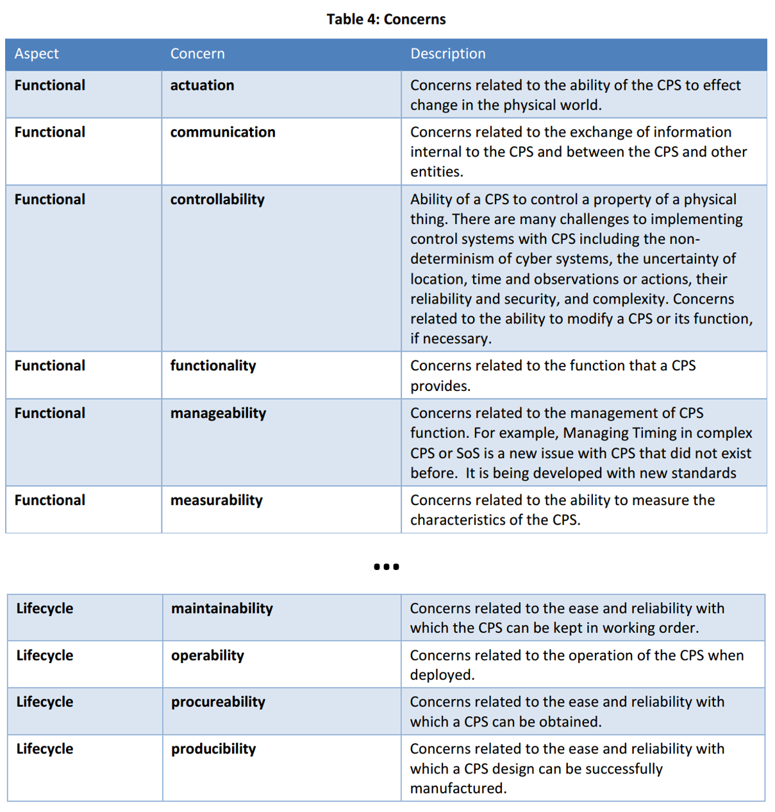

Point of interest/important characteristic we need it so that we can later
say how to describe it --- **point of interest**
**is reflected/framed** **by a description method/viewpoint.** For example,
the description method for cost::characteristic may be rules for estimating
in rubles, or it may be rules for specifying an arbitrarily determined price,
but in dollars or "conditional units." This description method will need to be
used so that whatever is described using it (price) can then be discussed by
different roles (seller and buyer). Thus, **the discussion about the cost
description method** (how to model the cost, how best to describe it, what method
to use to reflect knowledge about cost as a system characteristic) will differ
from **the discussion about the value of cost**, that is, "how to lower the cost"
and "how to raise the cost," although both discussions are significantly related
(the choice of description method usually influences the negotiation position of one
of the parties: different description methods are convenient for promoting different
preferences).

And when we have just **divided one complex discussion about** **an important
characteristic** **into two simpler ones (about the description method and
bargaining preferences)**, the task becomes slightly easier --- this is the goal
of systems thinking. **In the range of** **concepts "method of work,"**
**"role," "point of interest," "preference" we need to add one more concept:
"method** **of description" (viewpoint).**

Separating in thought the methods, their roles, the objects of role interest,
preferences in the values of system characteristics, the method of describing
the point of interest, and documenting the state of all these entities ---
simplifies keeping attention on achieving agreements between roles in the
project, facilitates the collective execution of projects for system creation.

We cannot, after making a list of points of interest/concerns and preparing
descriptions/views based on some agreed description methods/viewpoints, forget
whose these points of interest are: the interests/preferences of different roles
for the found common points of interest/characteristics can significantly differ,
so the prepared system descriptions are merely materials for discussions.

**Systems thinking is collective ---** **it implies continuous alignment of
preferences** **for a wide variety of characteristics, important to the
most different** **project** **roles. Systems thinking is intended to
structure these discussions** **and requires distinguishing within them
actor, role, point of interest, interest/preference (which direction to move**
**the characteristic, which state to prefer), method of description,
description, value of characteristic as the outcome of bargaining preferences.**

In the public document (the public document differs from the standard only
by the absence of a compliance check procedure) CPS PWG Cyber-Physical Systems (CPS) Framework Release
1.0^[<https://pages.nist.gov/cpspwg/>] there is a more complete table
of points of interest for cyber-physical systems, i.e., systems that
include sensors, effectors, and a Turing-complete computer controlling them, than
in ISO 42010. In this public document (released in May 2016) due to the large length
of the characteristic checklist, they are grouped into aspects:
functional, business, human, trustworthiness, timing, data,
boundaries, composition, lifecycle.

Aspects/aspects/area of concerns/”areas of interest” reflect some
substantially grouped points of interest. The long CPS Framework table
in the document looks like this (we give its beginning and end):

How to use the table? This CPS Framework table works as a checklist: have
you discussed all aspects/”areas of interest” of systems (target and further
creation systems) for your project, have you found all points of interest in them?

ISO 42010:2022 says that aspects are a reflection of "best practices"
(sometimes good practices, the best or just good known methods as of today)
in what specialists in their subject areas should be interested in, as it is
easier to agree on them and remember them during the project as somewhat
less detailed points of interest --- and then delve into individual points of interest
based on the specifics of the particular project. Remember that
"objectivity is well-organized subjectivity," so aspects simply reflect
experts' opinions on what is important when creating and developing some systems,
and "best practice" is the "best method of work for today." The list of aspects in CPS
Framework was the “best” (although this could be debated) as of May 2016. Since then,
for example, the term “lifecycle” has often been replaced by “system creation and
development,” as the one-time development from "birth to death" has been replaced by the creation
of an MVP, or minimal viable product, and subsequent continuous development without explicit
consideration of the end of this development.

After you have identified points of interest, you need to select for each
point of interest its description method (a reference to some standard or
self-created and documented method of description). Next, you need to determine: where::software
various project roles can find the current project’s documented current description of the state
of affairs for the selected point of interest.

Say, for the functional aspect (functional aspect) the target system's
functions (functionality) are important. This you are unlikely to forget to
figure out. In the systems engineering course, it will be indicated that
such a description (view) is a concept of use. But you must go further: what
will be the functional description method? Say, for small projects
you have chosen JTBD or customer journey (if you don’t know, then google it
or ask an AI agent! If you are professionally involved in creating concepts of use, 
i.e., describing the functionality of systems, you should know this without googling
or asking an AI assistant, you should have a professional scope), for larger projects 
use case 2.0 (same: google if you don’t know! Although we have already mentioned use cases
in our systems thinking course and will mention in the systems engineering course). Now you need 
to document the chosen description method and indicate the place (modeler--- and the address where 
to find in it) where the latest versions of the functionality descriptions will be kept.
Along the way, you will have to answer questions like “what if two developer teams are working 
on different use cases and creating independent modules to support them--- should this be 
in one place or two?”.

And these questions are asked for all other aspects (which are areas of interest) and all
their key characteristics (which are points of interest). For example, for the area of interest 
of system creation and development (replacing the term "lifecycle" in the CPS Framework), we chose 
the point of interest "operability." If you are an engineering professional, you know what to be 
interested in there. If you are not a professional, you will "reinvent the wheel." But it is better 
to reinvent the wheel than to forget! Warning: this is a very tricky question! For example, you will 
have to somehow include in the considerations the digital twin --- this is precisely for improving 
operability, right? Now you need to choose a description method
("domain-specific language"/DSL/“modeling approach”/framework/ontology--- either take it from the 
literature or create it yourself for the project's needs). Determine the software (not yours, but 
those agents who will change these descriptions for some purpose and view these descriptions for 
some purpose) as the place where the documented description will be stored. Then document this 
description, trying to take into account all preferences regarding operability --- and project 
roles (internal and external) will have very different preferences. And ensure that the description 
is somehow realized, reflected in the physically embodied system (it means not just documented, but
reflect what you described: realizing a described tractor means not documenting the description 
of the tractor, but making a functional iron tractor). You should not create detached-from-reality 
descriptions, unless you are a sci-fi writer.