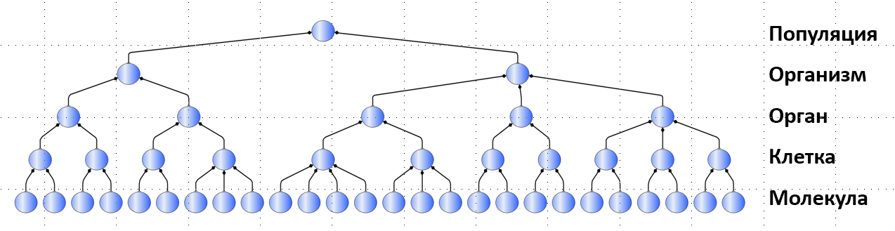

Systems simultaneously act as a whole for some of their internal parts (subsystems) and as parts for a more encompassing whole system (supersystem). Each subsystem is also a whole for its own sub-subsystems (relative to the original system), and each supersystem is part of a super-supersystem. Thus, one can speak of hierarchies of **system** **breakdown** from top to bottom, or hierarchies of compositional (composition) system wholes from bottom to top. If we do not plan to further divide a system into parts, it is called a "system element," emphasizing that there is a whole system somewhere for which this subsystem is an element: "a part that is not further divisible into parts."

**Levels in hierarchies of system partitioning**
**(hierarchies/"tree-graphs" built based on the composition/“part-whole” relationship)** **are called system levels.**
 **System levels are identified in the physical world through attention, for their identification there's no need to “break” the system into parts! Physically breaking functional parts or organs, for example, a living/functional/working organism –** ** it will be dead afterward! Therefore, system partitioning is performed only through attention! No need to dismantle or assemble anything! But shifting attention from larger to smaller parts and back is necessary. Tracking to ensure that no other types of relations (such as classification or specialization) enter the hierarchy relative to the "part-whole" relationship is also necessary. Policing that no mental object accidentally gets included in physical partitioning is necessary as well.

A classic example of system partitioning is the classification from biology into system levels (from smallest to largest) atoms-molecules-cells-organs-organisms-populations-biocoenosis-biosphere. In biology, besides "system levels," terms such as "levels of organization," "evolutionary levels," and "complexity levels of life" are also used.

You see that systems are indicated on the schematic system hierarchy with circles, and **arrows-diamond traditionally indicate composition relationships, where the whole system is on the diamond** **side of the arrow. The diagram shows that cells consist of molecules, but cells themselves are parts of organs. Organs consist of cells, but organs themselves are parts of organisms.

The word "consist" (composed by) does not mean that you can break organs into cells and then reassemble organs from these cells. No, this "consist" refers to the fact that you highlight different organs in a working organism with your attention, in organs you highlight cells with your attention, but you can also focus attention in reverse order: in a working organism, combine cells into organs with attention, and organs into the organism. There's no need to physically disassemble anything, system levels are only for managing attention in situations with many objects that consist of other objects and are themselves parts of other objects. System levels are defined by the work of attention (which agents agree upon in their projects to coordinate their work), they are not "objective," meaning different agents will suddenly find the same system levels in different situations, different projects! On the other hand, systems: "objects of some system levels" are not chosen randomly: in the physical world, systems are usually stable, they do not easily yield to entropy, they are not easily destructible. Also, system levels are often culturally conditioned, and this cultural conditioning is somehow maintained by language. The fact that "a smartphone consists of a screen, case, cameras, battery, and some electronic stuffing" is already common cultural knowledge, no special agreement is needed today (but at the time of creating the first smartphones, it was necessary). What exactly belongs to the case, and what to the screen (say, is the protective glass part of the screen, or is it part of the case?), what will be included in the cameras (a chip supporting exclusively the work of the cameras – is it part of the cameras, or "some kind of electronic stuffing"? Are the mounting rings of the lenses part of the cameras, or part of the case?) – these decisions will depend on the specific project teams even today.

The diagram does not show the system levels of biocoenosis/ecosystem, followed by the biosphere (they are above the population level). There are studies showing the inevitable growth of complexity levels, which means the inevitable unification of parts into increasingly complex wholes on many system levels^[<https://www.pnas.org/doi/10.1073/pnas.1807890115>].

The diagram also does not show the levels of atoms and elementary particles (they are below the molecular level), but this does not mean they do not exist: **assumption**
**of open world**^[<https://en.wikipedia.org/wiki/Open-world_assumption>]**,**
**“what is not said** **in our text,** **just not said,** **but this** **does not mean it does not exist”.** Thus one should read system diagrams that any top level on them is not the highest level (one can always find some supersystem, ultimately all systems are part of the universe or, in some physical theories, part of the multiverse as an infinite set of universes). Molecules are shown on this diagram as elements (no longer divisible subsystems) of cells, but they are also subsystems, their indivisibility is conditional, it simply is not considered in the activities for which this diagram is made. Thus from below, one can always find parts that seem like "elements." For the current project at the bottom of the systems hierarchy, there can be indivisible "elements," but ultimately the division goes down to the "below quarks" level, i.e., those smallest physical objects from which quarks are composed (these objects vary greatly among different physical theories).

The set of system levels at which a system is considered always depends on the project. In another project from this same breakdown, another set of levels might be taken. In one project, you might see a detailed breakdown of a house into separate walls, roof, foundation, and utilities, while in another project – the breakdown of several city blocks into houses, but within the houses, you won't see walls, roofs, foundation, utilities, as "elements" in this project are houses. In a third project (say, a developer company project) both a detailed description of "city blocks"::“system level,” including houses, benches, individual trees, and "houses"::“system level" will be broken down into parts. For the developer company, it's important not only to position houses::subsystems within "city blocks"::system, but also to build them, and for this, to design their structure from subsystems (and further subsystems of these subsystems – to systems of the smallest level, on which the design and manufacturing of houses are carried out, i.e., down to the level of planks, nails, bricks, electrical outlets, etc.). But the details inside an electrical outlet in the course of designing a house are unlikely to be taken into account – but these will concern the design bureau and the factory that will produce electrical outlets for the house).

According to our version of the system approach, we will require that system partitioning be completely physical/material: each system level is distinguished by the part-whole relationship between material items, which occupy some places/volumes in space-time. Students need to remember: if non-material parts appear in their system partitioning, then in system thinking it's like 2\*2=5, and for such an error, they immediately receive two points and are sent for a retake. We can't advise firing adults for such mistakes, but we are very close to such advice.

**There should be enough attention to track the physicality of the part-whole relationships several levels down and up. If there isn't enough attention for such tracking** **(considering that this attention is supported by records – it should not all be kept in mind!), then something needs to be done, for example, re-take the course "Rational Work" (honestly completing the assignments). Working with absent attention is impossible,** **wandering unconsciously in thought into a non-physical world or confusing what is part and what is whole is** **dangerous** **for the project.**

Multi-level system partitioning is fundamental: at the very top level of any such partitioning, potentially, will be the universe and at the lowest level – superstrings, but these extremes interest few, so system partitioning is done for a certain range of sizes of physical objects. For human activities, a very small range is extremely important, somehow proportional to the size of humans themselves. These not-too-big-and not-too-small in cosmic and microscopic scales systems are the subjects of activity – most often from a few kilometers (e.g., construction projects: skyscrapers, dams, bridges) to a few nanometers (transistors on computer chips). Humans (with their tools! Not necessarily with hands!) most often interact with objects/systems within this small range of sizes. There is a lot of interesting stuff outside these sizes in cosmophysics and micro-world physics, but for now, people find it more convenient to change the world within these limits, and not go beyond them.

Explicit indication of the system level is important for managing attention. Formally, touching a flower on a plant (the "organs" level in the partitioning scheme of plant organisms) means I am touching the universe (the flower is part of the universe!), I am touching elementary particles (there are definitely elementary particles in the flower!). Or touching the entire plant, and the cells of the plant as well. It's unclear what I touched, what is the object of my attention! Therefore, it is required to clearly specify the system::“object of attention,” which somehow allows specifying the scale of "touching." In our example, it would be – "flower."

When I wave my hand, I wave all the molecules of my hand – but it's not correct to talk about molecules when talking about waving a hand? And not right to "wave a body" (too big an object). Therefore, "I wave a hand" – I wave a system, which is many system levels higher than molecules, but still lower than the level of the whole body.

System levels are fundamental, they reflect the very essence of the systems approach – at each system level, because of emergence/system effects, new properties appear, which is why most often **discussions are held separately for separate system levels** **by agents who deal with the properties manifested by systems at this system level, as well as** **properties of supersystems that arise from the properties of the systems of the current level. Roughly speaking, cells are discussed by a microbiologist, the human organism as a whole –** **by a medic, collectives of people –** **by a manager. Separate detailed discussions at each system level** **significantly simplify the discussion of complex systems.** If you are discussing an enterprise, then discuss people, equipment, material reserves, buildings, and structures, but usually, there's no need to discuss the planetary system around the Sun, part of which the enterprise is as part of the Earth, or the biochemistry of cells in people, as biochemistry is part of the enterprise.

Remember that discussing a problem at too low a system level is a reductionism error, discussing a problem at too high a system level is a holism error. The right way is to keep the discussion at three levels:

-   the supersystem in its environment and its properties. For example, the computer as a whole, its characteristics (dimensions, weight, power consumption, performance according to recognized tests)
-   the target system as a whole and other systems as wholes at the same system level within the supersystem. How the joint work of systems at this level affects the state and properties of the supersystem. For example, the central processor as a target system, memory, motherboard, power supply, fan/cooling, case.
-   subsystems of the target system: how their joint work (interaction) affects the states and properties of the target system. For example, for the central processor – cores with arithmetic logic units, multilevel cache memory, input-output blocks. And here is a test of attention: if you imagine a "real" (and not from a diagram in a book) central processor, you will see a plastic-encased chip (or several "chiplets") with leads, and already on the chip some zones with those cores with arithmetic logic units, multilevel cache memory, input-output blocks.

It is easy to shift this down a level: considering

-   transistors (subsystem level) within some
-   cache memory in the central processor (target system level) and how the characteristics of this memory and other IPs will affect the characteristics of the
-   central process (supersystem).

In any case, typically they discuss "what we do" (target system), "what it consists of functionally, what is made of constructively" (subsystems), "what will it be part of" (supersystem). In any case, you **usually need at least three system levels for discussing a system, you will discuss various characteristics of objects at these levels, these discussions will involve different roles, and what system level your target system will be on –** **depends on the project. What is a target system for one project –** **a supersystem for another, and a subsystem for a third.**

Engineers typically describe system partitioning through the description of types (e.g., "airplane"), but in reality, these types of objects correspond to physical items categorized under this type (airplane with tail number 128, airplane with tail number 2467, etc.). At the same time, philosophers (but not us in our course) often discuss system levels with arbitrary parts, including abstract ones^[<http://en.wikipedia.org/wiki/Holon_%28philosophy%29>] – and there, the "part-whole" relationships are defined very differently.

We prefer the approach of engineers over philosophers. If a manager (enterprise engineer) or politician (social engineer) thinks like a philosopher, mixing mental and physical objects in the same kinds of hierarchies, they might lose touch with reality, striving for the realization of some highly attractive utopia. Utopias are distinguished by being very attractive, but their flaw is that they are unachievable: the world will change, but not for the better! For example, there might be such "struggle for peace" that not a stone will be left unturned – the result of the desire for peace will be war, the direct opposite!

Utopias (descriptions of an unrealizable physical world) are arranged precisely like this: wanting abundance (communism), but ending up with ration cards, a hungry life. We need systems to be both attractive and realizable in the physical world with the intended characteristics, not "as it turns out." We are not just dreamers, we are doers/practitioners/engineers. Modern system thinking is arranged to keep attention on the physical world at various levels of scale/system levels with the help of the concepts of the systems approach. And mental objects? We will work with them precisely as descriptions, in the extreme case as descriptions of descriptions, but ultimately as descriptions of the physical world.

This keeping attention on objects of the physical world is stabilized (focus!) through documented information models that also help to predict the characteristics of future systems. Physical models (like models of aircraft in wind tunnels) are now used less and less, but information models help to keep attention on objects of the physical world, and prepare detailed and consistent descriptions of these objects. More about how mathematical and physical objects (studied by mathematics and physics, respectively) are related, and how we work with semantically expressed models of these objects, will be discussed in the "Intellect Stack" course.

**Simulated/maintained in attention at different** **“size levels”/“system levels”/“composition/breakdown levels”** **interacting** **physical systems that are created and developed by other physical systems-creators –** **this is the subject of system thinking.**

Due to the division of labor, different roles in a project, for the same target system, may have their own objects of focus at different levels – subsystems or supersystems. “Objects of focus”/”significant characteristics” are emergent, so one can expect them to exist at certain levels and be absent at others – but this is the subject of multi-level consideration, that they all depend on each other, even if they are at different system levels. The precision of a clock's operation is not at the level of gears, there is precision of manufacturing. But the precision of manufacturing gears affects the precision of a mechanical clock. Therefore, the clockmaker has an interest in getting the most precisely manufactured gears. The gear manufacturer, on the other hand, is interested in minimal precision for the received price (no problem to increase precision, but then the price will grow too – up to the unacceptable for the clockmaker). The clockmaker and gear manufacturer negotiate to reach an agreement.

There is no “true” or “objective” as independent from role interests partitioning a system into parts, although usually, more or less stable objects are distinguished as parts, but even this stability can be assessed differently by different roles. **For the same system in the project** **for creating the system** **several options for breaking it into parts are usually considered simultaneously. At minimal, usually, they are fragmented into**

-   **Functional/role parts,** **interest area “how it works”**
-   **constructive/material parts,** **interest area “what it is made of”**
-   **spatial parts (locations),** **interest area “where it is located, how it is composed”**
-   **cost parts** **(cost) (but this already touches both the target system and the creation system fragmentation –** **total** **ownership cost),** **interest area “how much it will cost.”**

**There can be many more such fragmentations, and each of them** **can be** **done differently, depending on the area of interest.** **These different options** **for breaking into parts** **agents (people,** **AI,** **organizations), playing different** **internal and external** **roles in the project,** **agree among themselves to achieve the system's success.**

Even a single agent can use several different fragmentations, distinguishing parts of the system differently for convenience of thinking and acting in various roles – to make thinking and action more convenient in each role. Some roles imply the simultaneous activation of several fragmentations. For example, the developer role works with invention – when choosing affordances (constructive parts) for the system's role parts. One consideration is constructive – creation time, the other is functional, usage time, and no invention will happen without simultaneously holding both considerations. System creativity involves working with different ways of breaking the system into parts simultaneously, and in each of these fragmentations, there will be entirely different parts! For instance, scissors constructively consist of two metal halves and a fastening screw, while functionally – of a cutting block and a handle (and the screw isn't even provided in this view, as are the "halves fastened later with a screw"!).

Different ways of breaking the system into parts (among them are mandatory, primarily the aforementioned four – functional, constructive, spatial, cost) will be considered in more detail in our course later, and this consideration will continue in courses on systems engineering, personal engineering, and systems management.

Agreeing that all these different options for breaking the system relate to the same system is relatively easy