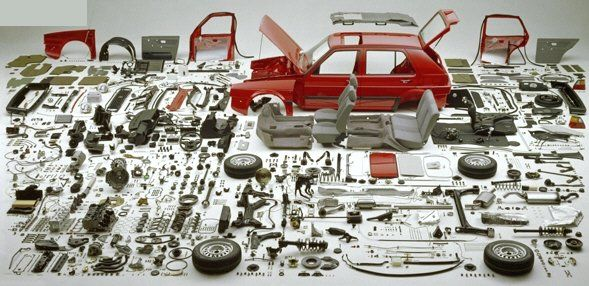
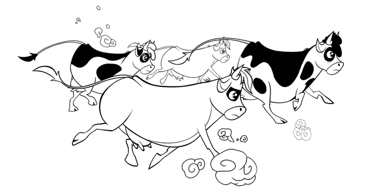

To consider a set of physical parts as a system, it is necessary not only to recognize that this system is part of a supersystem and has its own subsystem parts but also to satisfy one more condition: this system, as a set of interacting parts-subsystems, must exhibit some property that its parts-subsystems do not have, leading to the possibility of a new function of the whole system, which includes the parts-subsystems. This phenomenon is called **emergence** (systemic effect). Moreover, this property and the new function disappear in the supersystem, which includes the considered system (but the supersystem acquires new/emergent properties that the system as its part does not have; this systemic effect manifests at each transition from one systemic level to another).

The display of time is not present in the hands::part of a mechanical clock, nor in its gears::part, nor in the case::part, nor in the spring::part. But the clock::whole, when operating, makes the display of time possible—due to the interaction of its parts. Each part of the clock performs its function as part of the whole clock, and a systemic effect emerges (emergence, new property, new function appears): the clock starts showing time for the supersystem in the systemic environment. However, the room (or even a smaller subsystem of the room, which includes the clock—interior), does not show the time, even though the display of time by the clock is available within it and makes it more comfortable to live in.

Notice: **crossing** **the boundary of** **a systemic level** **(also called a meta-system transition)** **changes everything; it is literally audible in discussions about systems, visible in descriptive texts:**

-   Some roles in clock-related projects specialize in methods that change the state of already assembled and working clocks (using the emergent property of time display, creating an interior of a room, which has different emergent properties than the clock), using the word "time" regularly as something that needs to be seen (for example, whether an additional lamp is needed to see the mechanical clock’s face at night, "check the time"), and they do not even mention materials for clock parts (this is two systemic levels down from the interior: the clock itself and further down to its parts—their materials)
-   Other roles—engage in clock assembly methods (creating a system with the emergent properties of a clock), concerned with the accuracy of time shown, rather than with its utilization.
-   Third roles say nothing about the clock itself but just manufacture its parts, interested in the strength and methods of metal processing—gears, springs, case. These parts also have emergent properties, behaving and being characterized entirely differently from the individual atoms that make up these parts.
-   ... one can go even further down the systemic levels; some roles deal with the materials of clock parts: their strength, expansion when heated, etc. —this is reflected in the speech of agents in these roles as the use of entirely different terminology.

Of course, all these systemic levels are coordinated with each other, and material (its properties affecting the properties of gears and hands) and time (the clock needs to be tuned so that the gears and hands show the correct time!) and even the interior of the house (discussing the mounting of the clock on the wall, the size of the face to be seen across the room) are regularly mentioned in conversations among clock assemblers. But each systemic level differs in its systems, which exhibit certain properties, changing states in operation and during the creation of supersystems from these systems by methods of creating these systems and supersystems from these systems (some systems need to be cast in molds from molten metal, some—assembled from parts, like panel houses, some—trained, like craftsmanship). These methods change the states of system parts to get a whole system and launch it into operation.

Different methods of creating and developing systems are performed by different roles in the creation system, speaking a characteristic language used to discuss systems of one systemic level. As we will see further—even a complete set of languages, since different roles specializing in the discussion of the problems of a specific systemic level use different languages to pursue their interests.

Different roles lead to agents specializing in the mastery of methods of these roles' work. Agents specializing in systems of different systemic levels will also be different. People (or even AI, or divisions) engaged in designing and manufacturing clocks are not the same as those dealing with interiors, nor those dealing with materials for clock parts. This is the division of labor: various work methods are used in projects not just on their own, but due to the emergence of properties and functions in systems when systemic levels change in the attention of roles involved. The creator of interiors—an architectural bureau specializing in interior creation methods, the clock creator—a design bureau (designers dealing with the aesthetics of clocks—there) partnering with a clock factory, creators of materials for clock parts—factories that will be the suppliers of the clock factory.

Transitioning attention from one systemic level to another changes the set of leading creators’ roles, their work methods, and the objects of these methods, changes the terminology of these work cultures/"languages of conversation." This happens due to the change in the set of concepts expressing the objects of attention of the systemic level: when attention shifts from systems of one systemic level to systems of another level, the concepts for parts of the system and their important properties change, so the terminology to express these concepts changes.

An organism::whole of an animal jumps and runs when used, but its organs::parts—do not. Jumps::behavior and running::behavior—are emergent functions of the organism. Organs perform certain actions inside the organism; they have functions in the organism (e.g., muscles contract, the liver cleans the blood, lungs oxygenate it and remove carbon dioxide), manifesting their systemic/emergent properties as whole organs, individual cells inside the organs (parts of the organs) cannot do this on their own, yet it seems that the cells inside the organs do everything in their interaction!

Systems not only consist of parts themselves but exhibit their (subjectively determined!) purpose through the performance of some (subjectively highlighted!) part of their functional role within the supersystem::whole. In the previous sentence, three systemic levels were mentioned: 1. subsystems, 2. the whole system from these subsystems, it exhibits emergent properties, is a part/subsystem, and has a function in 3. the supersystem.

A key feature of systems is that "everything is connected to everything," **the parts** **of the system within the system behave differently than they do outside the system, since they interact with each other.** Atoms outside a molecule behave differently from inside one. Cells outside an organ behave differently from inside an organ. Organs within an organism behave completely differently than organs separate from the organism.

To understand very complex systems consisting of a vast number of elements, they are represented as a breakdown/decomposition, at every level of which a systemic effect/emergence is expected. For example, here are individual parts of a car:

Dealing with these individual parts, it is impossible to understand how a car works and what all these screws and cables are for. To explain where a car's motion comes from, we must consider the engine as a separate subsystem of the car, that is, the engine::subsystem as a whole part of the machine::system (however contradictory this "whole part" sounds), composed of subsystems of the engine, even smaller parts. To explain why a car can comfortably hold several passengers, we must consider (highlight with attention) the interior::subsystem of the car::system as a unified whole from the many parts that make up the interior.

We must consider separately assembled all the parts::"subsystems" of the braking system::"system" of the car::"supersystem" (for braking system developers, the car is a supersystem), to show how the car can brake. All this are emergent properties, it is useless to discuss for understanding the braking system not its parts, but to immediately go down to the systemic level below and discuss the materials from which the parts of the braking system are made. That is, the emergence/systemic effect of braking appears when the materials have already become parts, and braking occurs due to the interaction of already manufactured and correctly placed parts. Although formally "for mathematicians" braking occurs due to the interaction of materials, and even the molecules of materials! **Systemic thinking** **is not mathematical thinking; it is oriented toward managing attention** **for** **discussing some actions of agents, not formal correctness.**

Margarita the cow has a tail as part of her, Margarita the cow is part of the cattle herd.

It is improper to allow saying that the cattle herd has a tail, although this seems correct: all the molecules of the tail (specifically: of Margarita the cow) are part of the molecules of the herd. Moreover, the herd here is not an abstract object "a set of cows," but literally all the molecules of the cows in the corral. Saying "herd's tail" is mathematically, logically, physically correct, but not systemic, and this seems intuitively understandable to everyone: it is hard to assume what you can do with a "herd's tail."

The allocation of systemic levels is subjective and greatly depends on the method by which work is carried out with systems of these levels. It is not intuitively clear whether one can say that a carburetor is a part of a car with an internal combustion engine. Is it a separate part of the car, or is it part of the fuel subsystem, or part of the engine?! What actions should be taken with the carburetor, at what systemic level should it be considered? This will be decided by the engineering team in each project; they must agree among themselves. But it is intuitively clear: it is improper to say that the piston or cylinder of the engine is part of the car. Formally, it is correct, but improper, as in the case of the tail as part of the herd, you cannot discuss the functioning of the piston and cylinder directly in the car.

A good criterion here is emergence: discussing the car as a whole usually requires discussing the properties and functions of the engine as a whole, but whether or not there is a piston and cylinder inside the engine is not important when discussing the car as a whole.

At each boundary of the systemic level, systems change as the primary objects of attention, as well as related "considerations" / "concerns" / "objects of interest" / "important characteristics" / concerns. During a meta-system transition (transition from one systemic level to another—from parts to wholes or from wholes to parts), along with work methods leading disciplines/theories/models of these methods describing the behavior of the system involved in the work methods at a given systemic level, the professional community supporting the language of conversation at this level and using these disciplines/knowledge methods along with the necessary tools change.

On one level, we discuss tails and horns in a cow (with all the problematic allocation of them as parts with specific boundaries!), on another—the whole cows and bulls as part of the herd as a supersystem. On one level, we discuss the engine and interior, on another—the piston and cylinder in the engine. Different systems set different objects of interest, different languages of conversation about these objects of interest, different roles with different preferences in the same characteristics as objects of interest. Often, these roles are even played by different people-actors because different work methods require different mastery, and it is usually impossible for one person to acquire all kinds of mastery to an acceptable degree.

It must be clearly understood that the boundaries of all the mentioned systems are "non-objective”; they are some activity roles in the car development project, for the convenience of their discussions, part of the details collectively (sometimes called “wholecollectivity” in systems thinking, emphasizing that it is not just “assembly,” but the creation of a new whole from parts) called “engine,” another wholecollective/assembled part of the details “interior,” and the third—“brake system.”

**Collecting** **attention** **from** **separate** **parts into a whole to** **discuss** **the** **manifesting systemic effect—** **this is the core of the systemic approach, the most important thing in it.** **In engineering, separate parts are also made separately, and then physically assembled—** **but this is engineering, not thinking. In thinking, these parts are highlighted by attention, and whether there will be assembly, or cultivation, or training, or some other way of manufacturing parts at the most different levels—is discussed separately, when discussing engineering** **methods.**

Emergence in systemic thinking is the main criterion for combining certain objects into a system. If you have assembled certain objects in the system based on domain belonging/domain criteria (replaced the relationship "part-whole" with the classification relationship by belonging) and did not check that their interaction (and they do not interact at the time of operation! They just "belong," are "part" in a common sense, not physically part! Common sense use of "part" does not distinguish between physicalness and mentality!) gives emergence—you have incorrectly identified the system; you just have an object highlighted by your attention, not a system! **No systemic effect—** **not a system!** Three parts on a shelf in a warehouse are not a system; there is no interaction, no emergence, no new property, no need to highlight the system! They are just three parts lying on one shelf.

However, clientele gathered from individual clients is a system. Thus, you can discuss the growth of clientele (number of clients), calculate the values of client churn, choose some "promotion channel" for the clientele as a community. It turns out that customers seem not to interact with each other, but the interaction is there: through the company, of which they are clients and which gathers them into a whole—clientele in interaction with itself. This can be easier to understand by looking at a battery: individual battery cells work each "inside themselves" and do not interact with each other, but together they form a "battery"— and the properties of this battery are determined by the number of these cells. Hence, "battery" from clients is clientele; its properties are different than the properties of individual clients, and generally, you can neglect the interaction between clients, but you cannot neglect what happens "inside the client."

Due to emergence at each systemic level, new properties and functions appear, which must be discussed in detail by agents possessing the necessary mastery in the methods of working with these properties::characteristics and functions::behavior. For example, specialists in car furniture can discuss the comfort of furniture separately from specialists in engines, who will discuss engine power.

All project/activity roles implement preferences in the characteristics/objects of interest important to them, their work methods are deeply interconnected. The concept of the systemic level provides a way to structure the implementation of these preferences. Objects of interest and methods of changing them center around systems at different levels of systemic breakdown, literally "at different levels of granularity of material subdivision." At the center of the theory/knowledge/disciplines/algorithms of these methods/practices/ways/cultures of work are objects of interest in the emergent properties of systems.

Work carried out in projects using a variety of methods of interest consideration gives the maximum manifestation of **useful emergence** or prevents the appearance of **harmful emergence**. Of course, both "usefulness" and "harmfulness" are subjective here, they are determined by roles based on the knowledge/disciplines of the methods they perform: the whole project thereby comes down first to achieving agreements between roles on the values of important characteristics/concerns for them (the project should give a successful system! Everyone needs to agree!), and then to embodying these agreements in the physical world through work by changing different systems using various methods.

Systemic levels are needed to structure the achievement of these agreements, to better understand what is happening: systems from certain systemic levels are always discussed, which exhibit their characteristics perceived by different roles as important/objects of their interest. It is necessary to ensure that the discussion is held by specialists in the objects of this level. Clock accuracy is discussed by clockmakers, the interior is discussed by interior specialists, and the materials of clock parts are discussed by material specialists. At the same time, usually, specialists somehow understand the characteristics of their level, as well as the characteristics of subsystems ("what it is made of") and supersystems ("what it is made for").