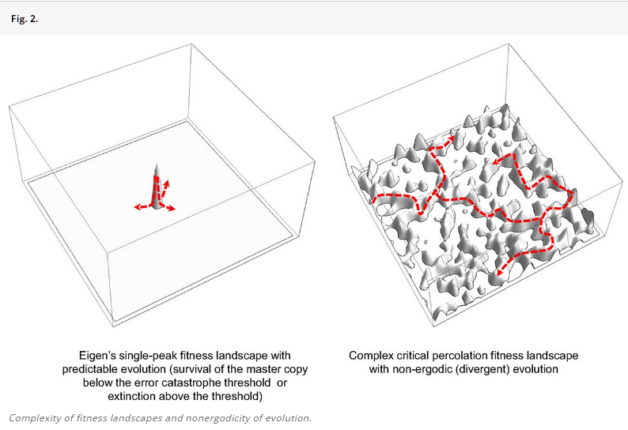

```markdown
---
title: Instability and Meta-System Transition
---

Evolution::"process/change"---"physical evolution of the universe" is
a universal phenomenon, but we will still divide it into separate variants:

-   **Biological** **evolution.**
    The complexity^[<https://www.pnas.org/doi/10.1073/pnas.1807890115>]
    goes from molecules to cells, from cells to organisms, from organisms to
    populations, etc.
-   **Memetic** **evolution.** This is the evolution of concept-memes
    (meme^[<https://en.wikipedia.org/wiki/Meme>],
    formed similarly to gene---gene, and not to be confused with internet memes),
    which exist both in symbolic local representations (one
    place---one symbol) and in
    connectionist^[<https://en.wikipedia.org/wiki/Connectionism>]
    distributed representations (and recently distributional
    representations have been added^[<https://www.frontiersin.org/articles/10.3389/frobt.2019.00153/full>]),
    for example, in neural networks (in people’s heads, in AI systems based on
    large language models---these are all different types of neural networks).
    For example, the concept-meme (sometimes referred to as an "idea" during memetics discussions, sometimes even as a "thought") that "if a cat crosses your path, it's a bad omen." This very strange idea/thought travels
    through minds like a virus (self-replicates), and for some reason does not
    die out completely: there is always another mind in which this idea
    lives. Or Newton's idea that massive bodies
    attract each other by the force of gravity, this idea also does not die,
    although Einstein produced a better idea: there is no force of gravity,
    but rather the curvature of space-time by masses. This idea also lives on, forming the basis for GPS navigation, but it doesn’t completely displace Newton’s idea of gravitational force. The same regularities apply here as in any evolution (since all evolution comes down to the accumulation of knowledge). Modern fish (their knowledge accumulates in the genome) have also not evolutionary displaced the ancient coelacanth fish, although other ancient fish have long since died out. The nature of techno-evolution phenomena as the evolution of ideas is the same as in biological/Darwinian evolution.
    Replication of some information between neural networks (people and now
    AI agents) in techno-evolution is fairly accurate, but sometimes occurs with
    mutations. In one case, genes evolve (resulting in different organisms,
    their complexity and diversity increase, but simple species do not disappear
    entirely), and in another case---memes evolve
    (resulting in different theories/explanations, their complexity and diversity
    increase, but simple theories/explanations do not completely disappear).
    Evolution (Darwinian and techno-evolution) is quite physical, but it is
    related to the accumulation of information on some carriers,
    this information is replicated---and you need to refer to the primary sources
    indicated in our course to understand. This material in the course will not so much be explained as used. At
    some point, students can't stand it and look at the
    primary sources---and thereby form a physical, not a "common everyday" view on evolution.
-   **Techno-evolution.** Mutations of technical systems are primarily made
    by people through inventions (they realize that to achieve
    a function::behavior in functional objects, some structural objects can be
    used as affordances/“suitable items”), and we see the development of electric
    transport, robotics, plumbing, skyscrapers, and smartphones, although the
    fork, spoon, knife, shovel, and hammer have remained almost unchanged for a long time—only significantly improved materials from which they are made, and the manufacturing itself has become significantly cheaper. It is important that techno-evolution now significantly uses digital/discrete (i.e. with accurate replication) symbolic representation of system descriptions.

In our course, we will not address the mechanisms of evolution, although we have
already mentioned in the course section "2. Our version of systems thinking: third
generation" in the subsection "Variants of the systems approach" enough
materials for inquisitive students to understand the physical
nature of what is happening (and it would be better not to delay this acquaintance).

The main idea in the modern view on evolution is that the phenomenon of
**instability/uncertainty/frustrations** leads to an enormous
diversity of quasi-stable **configurations** (sets of variant
subsystems, variant constructions) of evolving systems, with each
of these configurations being quasi-optimal, and the transition between quasi-optimums
is incredibly easy, so the overall set of configurations of various systems
turns out to be unstable, out of equilibrium.

We need the concept of instability to discuss different
variants of evolution (and do not confuse with psychological "frustrations"; in
English, this word has many meanings, and the original
term was geometrical frustration^[<https://en.wikipedia.org/wiki/Geometrical_frustration>]
---and watch the video which very well explains the essence of this
“instability/uncertainty.” This does not relate to mental difficulties; we are talking
about a physical phenomenon).

In the mentioned article "Physical foundations of biological
complexity"^[<https://www.pnas.org/doi/10.1073/pnas.1807890115>]
the concept of instability is explained by the following illustration:





It shows that evolving systems in some sense have memory (physicists talk about systems with memory as “non
ergodic^[[https://en.wikipedia.org/wiki/Эргодичность](https://en.wikipedia.org/wiki/Эргодичность)]”,
they do not wander randomly through all their states), they remember
configuration of "optimum survival." But in a real situation, memory does not
permanently remember the configurational solution found, because
there are a lot of different system configurations with roughly the same
quasi-optimal "niche fit"/fitness, between which there is very
little difference in "optimality." Of course, there are many different
configurations of systems that cannot survive, and they are the majority, but also
there are plenty of configurations in which systems will survive and they differ very little
from each other.

In the provided pictures, it’s not one configuration with unconditional
belonging to a quasi-optimum and everything else not surviving, but rather a huge
number of configurations that evolution can pass in the course of
endless mutations. And none of these configurations will
be final, "the goal and result of evolution"! Consequently, evolution turns out to be
infinite, although it is well-describable as a process of optimizing
the configuration of a system.

Let's say you go to a smartphone store and you see a hundred
very similar models at the same time, all of which find some sort of
market demand. This is a manifestation of evolution: a huge diversity of
more or less surviving in different ecological
niches^[https://ru.wikipedia.org/wiki/Экологическая_ниша](https://ru.wikipedia.org/wiki/Экологическая_ниша)]
(in our case, techno-ecological niches, i.e. techno-cenoses, not
biocenoses) configurations (sets of subsystem variants,
construction variants) of some evolving systems. This
diversity and instability as a set of configuration options,
each of which is quasi-optimal, making the transitions from one variant to
another almost imperceptible in terms of the optimality of fitting into the niche, holds
true for all kinds of evolution—bio, memo, techno. And from time to time,
jumps in the level of optimization occur. Say, mobile phones were
replaced by smartphones—“drawn keyboard” turned out to be better,
small phone sizes were replaced by “phablets” larger sizes—
larger screens turned out to be better. Dinosaurs are no longer around, although
once dinosaurs were the optimum. And today there are no old mobile
phones, although once pre-2007 (when the iPhone was released) they were
optimum.

Meanwhile, one must carefully handle the types of related
evolutionary concepts. For instance, memetic replication in neural networks may be
understood either as genes in the genome, i.e., parts of hereditary material (genes
are physical! These are literally physical parts of DNA molecules), or
as information replicating during neural network training, thus being
non-material. But in this context, meme can be viewed as an
“elementary program” based on the hardware of a neural network (e.g., in the
brain)—this view is close to seeing skills as a
system programmed into the physical part of the brain. In other schools of thought, the meme is
an informational object, a description to be programmed into the brain.

Even with biological genes, there are discrepancies: the classical
understanding of a gene is that it is physical (a part of DNA), but the term
"gene" is often used not as “gene”::system, but
“information encoded by the gene”::description (e.g., similarly, the word "skill"
may be used to denote both what a person can perform
and the “description of the method contained within the person”).

In any case, understand by context, what type you are dealing with:
genome and meme as information or genome and meme as physical
objects. With "skills," "program," and similar objects (algorithm and
universal computer for its execution,
“generalized algorithm for transforming the physical world” from the method
and universal constructor with tools for its execution)—same story, be cautious
in assigning type, understand the context in which the term
is used.

For example, you can easily change a method’s description (e.g., switch a piano lesson book
from classical to jazz music), it’s just replacing one local/symbolic
representation with another. But replacing piano-playing skills is not
so simple, relearning one skill to another (one distributed representation
to another) is not easy. Replacing a gene in "gene descriptions" (replacing
a symbol)—easy. But replacing a physical gene in an organism is not so
simple. A copy of the physical gene will be present in every cell of
the organism, you’ll have to reach each cell, or target
gene replacement in the zygote (remember school biology course, what is
a zygote?).

Another issue is understanding what exactly is evolving, which
system. In biology, this is the problem of the biological individual:
the genome (the set of all genes), the organism with the phenotype (organism with
a set of all traits determined by the genome), the population (since
evolution requires a male and a female, more than one
organism—population), the species (all individuals classified as a species).
There is no exact answer to this question, and there will be an immediate counter-question: what is your
project, how convenient is it for you to discuss which part to change to
improve the world? Modern results also show that it is pointless
to discuss the evolution of a single species, as evolution always happens in the
context of the evolution of all other species.

Individuals of each species of evolving bio, socio,
techno systems consist of numerous subsystems and are part of a
supersystem, like any other systems. And the
complexity of supersystems grows because at some point these
supersystems begin to unite, playing different (functional) roles in a whole new
super-supersystem, i.e., making the next meta-system transition. This
happens in techno-evolution (evolution of tools): hammers, like
microbes, exist independently. But then the television, navigator,
phone, watch, notepad, heart rate monitor, and music center as functional
objects (where function matters, not construction) suddenly
turned into a more complex structural device—a smartphone in which
many smaller devices, “applications”::subsystems, act as organs in an organism.
This is it: some successful systems at one system/evolutionary level scale up to
a supersystem---and the complexity of the biological, memetic, and technical
world grows.

Read about geometrical frustrations and explanations
in the article^[<https://en.wikipedia.org/wiki/Geometrical_frustration>
---and watch the video, which very well explains the essence of this
“instability/uncertainty.”], the increase in complexity
of biological (and social and technical!) systems due to these
frustrations caused by conflicting interactions at different
systemic/evolutionary levels
article^[<https://www.pnas.org/doi/10.1073/pnas.1807890115>],
thermodynamic explanations and mathematics for substantiating evolutionary
processes as learning processes and even as a reason for
the appearance of life in
article^[<https://www.pnas.org/doi/full/10.1073/pnas.2120042119>],
and the methods for multi-level theory of evolution, including understanding that evolution itself is multi-level and driven by these
frustrations^[<https://www.pnas.org/doi/10.1073/pnas.2120037119>].
Here’s how these works define the main principles (understood as the main ontological
guesses, i.e., objects in terms of which
to discuss what’s happening, an “axiomatic approach” in physics) of Darwinian
evolution, that is, the evolution of life, where the genome is inside the
organism. Techno-evolution, where the meme is in the design
office, and the target system is made in the factory and does not
contain the meme, or memetic evolution, where the meme is stored somewhere in video fragments on servers or “ideas” in paper books—this is also evolution; there may be slight
differences in interpretations, but overall the same principles will apply:

1.  **Loss function.** In any evolutionary system,
    there is a loss function from variables/physical quantities
    dependent on time. During evolution, losses are minimized,
    evolution---is an optimization (finding the minimum of the loss function)
    process.
2.  **Hierarchy of time scales.** Evolving systems include
    many dynamic characteristics that change at different
    time scales (with different characteristic
    frequencies: seconds, years, millennia).
3.  **Frequency gaps.** Characteristics
    manifesting at different organizational/systemic/evolutionary
    levels (system/organization levels) are separated by sufficiently wide (three orders of magnitude) frequency
    gaps.
4.  **Renormalizability.** Across all levels of organization,
    statistical descriptions of fast-changing (high-frequency) characteristics
    are obtained through descriptions of slower-changing (low-frequency)
    characteristics.
5.  **Expansion of properties.** Evolving
    systems can add additional characteristics that can
    be used for system survival and exclude
    characteristics that may destabilize the system
    (emergence for positive properties and elimination of emergent properties
    for negative properties).
6.  **Reproduction.** In evolving systems, reproduction/replication
    and exclusion from replication of information-processing units
    (IPU) can occur at every systemic/organizational/evolutionary level.
7.  **Information flow.** Slower “evolving”/changing systemic
    levels pass information to faster-changing levels
    during learning processes so that the faster-changing levels
    can better predict states of both the environment and the system’s surroundings
    as a whole. The central dogma of molecular biology adds that the backward flow of information is arranged differently: from
    the "fast-learning organism" to the slowly changing "genome," information
    flows not through transmission but through another mechanism: mutations and the death of organisms with unsuitable mutations. In
    techno-evolution, mutations are not random due to inevitable replication
    errors but smart (calculated with the highest probability of success, not random).

And here are the life phenomena that follow from them:

1.  **The presence of units processing information** (IPU) as separate systems at all levels of organization,
    meaning some autonomy and stability of existence of molecules,
    cells, organisms, populations, and the biosphere as a whole—they somehow
    maintain their identity, do not dissolve into the environment.
2.  **Instability.** The purposes of maintaining stability (NESS, speaking of
    stability in a non-equilibrium situation, roughly "not to get destroyed, broken, or dissipate in the environment") of systems at different
    levels conflict, and this causes instability.
    Instabilities may be either spatial (geometrical
    frustrations) or temporal. For instance, a neuron in the brain
    functions to react to an incoming signal, meaning it will react not as
    it wants but as required for signal processing by the whole cluster of neurons
    as a supersystem, which includes the neuron-system. This is a spatial conflict
    of goals: to optimize signal processing “as simply as possible” within the
    neuron itself will not work, because it will conflict with
    processing the signal “as needed” by the cluster of neurons, and further
    by systemic levels—by parts of the brain,
    sections of the brain, and eventually the whole brain. On the other hand, the neuron works at a particular frequency, in its own time scale, but this may not
    correspond to the time scale in which it’s supposed to work within a higher
    organizational unit (neural cluster, part and
    section of the brain, whole brain). Both spatial and
    temporal instabilities cannot be completely eliminated, but within some
    optimal balance, a local (not global!) stable non-equilibrium state can
    be achieved—the search for this stable non-equilibrium state (NESS) is understanding/learning/evolution of
    the system.
3.  **Hierarchy of systemic levels.** If a system evolves, it will by
    necessity have many systemic levels (increase in complexity
    during evolution is inevitable).
4.  **Suboptimality** (near optimality). For complex
    multi-level optimizations, only stochastic methods can be used, which do not
    guarantee stability of the solution (meaning attempts
    to repeat will yield slightly different results), nor finding the global
    minimum (only yielding more optimal variants than many others—but
    comparable to other fount variants). In
    biological systems through 4 billion years of evolution, it manifests as
    **everything being more or less optimized; therefore,
    changes usually lead to deteriorations, very rarely to
    improvements, and generally to no effect, because they do not
    deviate far from the already found local loss minima.**
    **Changes leading to a shift to** **a locally (never globally, which is unattainable in principle) new level of loss minima,** **are extremely rare.**
5.  **Diversity of suboptimal solutions.** There is a huge
    constructional/configurational diversity of systems for which
    the loss function is sub