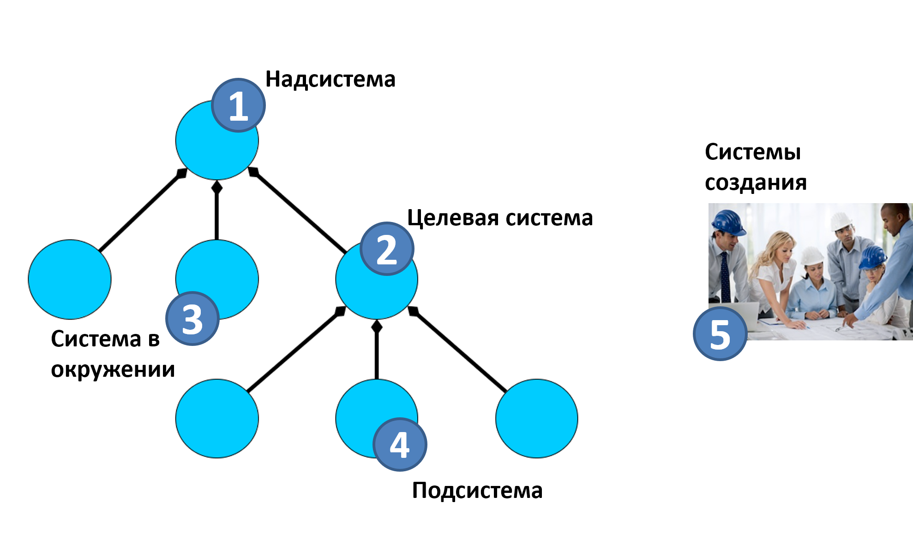

In order to conduct systematic (i.e., using the concepts of a systems approach) reasoning, one needs to learn how to focus their attention on different systems within a multi-level system breakdown --- and on levels above the target system, and the levels below the target system. A systematic thinker views everything in the world as systems, which are themselves subsystems of higher-level systems and have subsystems of lower levels. Therefore, it's essential to identify one among them whose characteristics interest us, and which we attempt to change in the world to realize this interest/preference. This system, highlighted by the agent's attention (subjectively! Convenient for the agent's role-playing method!), will be the **target system** (system-of-interest). This is the future successful system with which "the project team" wants to do something: invent and create it, repair, operate, destroy.

One can then discuss any system level above and below the level of the target system, but the focus of "the project team's" attention remains on this system, and the system effect of this system interests us foremost. One attention camera of each agent involved in the project always holds the target system, other attention cameras for different roles played by these agents might wander across different systems of other levels and systems in the creation chain. But each agent keeps at least one camera fixed on the target system throughout the project, not forgetting about it.

The metaphor here is polar coordinates, all (collective! Not just one role!) thinking revolves around the target system. It's the reference point, attention movement in systems thinking is measured from it. If lost in long discussions among the myriad systems in a project, return to the target system and then proceed along the chains of various relations (primarily composition and creation relations) to all other systems. The target system provides stability of attention for diverse roles in collective projects.

For different roles, target systems represent very different physical objects, but in collective activities, it's assumed that all roles performing methods of continuous creation and development of the target system (everything happening to it from conception through many upgrades to discontinuation of use) **agreed** on what this system is, where its boundaries lie. **Systems thinking primarily supports not the thinking of an individual but supports collective thinking** **in an organization as a group of agents who can** **by a known method** **(this method is** **some type of** **management)** **manage their collective labor and resources**. Organizations are project teams, enterprises/companies/firms, non-profit organizations, clubs, study groups, and others where it's clear "who's the boss". If it's a community, there might not be a boss, and systems thinking around one target system might not happen, and there won't be agreements on what to do (about the target system). But if the community is organized by someone and formal entry into the community means the organizer's requests are met to some extent, systems thinking might be in order (or might not be if people have not been specially trained in it).

Systems thinking helps agents (including people) agree on their actions and primarily on which system interests them, which system is the target, what the boundaries are (what is included and what is not in the target system's composition). Thus, **systems thinking is** **collective thinking, not the thinking of one** **agent, it assumes agreements on the subject of activity, i.e., the target system**. **The target system is not yours::agent, not that of just one role, it's shared by the project team**, and the team agrees on it (including external project roles participating in these agreements). **Indeed, one can imagine one agent engaging in systems thinking, but this agent would have to perform many different roles and therefore couldn't leverage labor division ---** **high expertise in executing specific roles. The creation of complex systems is possible because systems thinking allows different agents, each highly skilled in performing different roles, to agree ---** **visionaries, designers, architects, production platform engineers, etc.**

The target system is usually conceived **at the moment** **of its use** (operations, exploitation, functioning, work) already as a finished system, interacting with its environment and playing its role/performing a function. That is, "airplane" is thought of when it flies, "computer" when it calculates, "skill" when work according to this skill is performed. The target system during its creation is not yet in the state of doing something, performing a function. While creating the system, we think more about the functions of creators in terms of changing the state of parts of the future target system, which change their states during production and assemble into a finished system; this is all "creation time". Whereas when thinking about the target system and system levels, it's the time of use/exploitation/functioning/work of the target system.

The diagram shows a system (by composition relations) hierarchy with three system levels, systems shown as circles, arrows with diamonds indicating composition/decomposition/composition/part-whole relations, and the target system shown as system 2:

The system that includes the target system is called the **supersystem**. In the diagram, this is system 1. The clock will be the supersystem for the gear, the molecule a supersystem for the atom. The target system has its function (behavior with expected outcomes) in the supersystem, allowing the supersystem to ultimately exhibit emergent properties by performing the supersystem's function. The function of showing time in clocks as a target system in an interior as the supersystem helps the interior be convenient for living.

Remember that all systems are defined primarily by their function in the supersystem, playing some role in it. And the supersystem is also a system, needing to perform its role in a super-supersystem (not shown in the diagram, but it always exists!).

If the target system is a gear, the gear is used in the clock (part of the working clock as the supersystem), its role "motion transmitter", function::behavior --- transmission (for functions we use verbal nouns) in the supersystem-clock motion to the hands so that the clock can show the time, i.e., the supersystem (clock) can "perform its function"/work.

All systems at the moment of target system operation, which are not part of the target system, are called **systems in the environment** (environment, operation environment, operating environment --- the term "environment" is preferred, highlighting the central role of the target system, whereas the term "medium" does not imply an explicit center). **The environment is always at the moment the finished system operates.**

**When** **the target** **system** **(likewise, a subsystem or supersystem)** **is created, another consideration applies:** **some systems of creation will be centered while future systems are still in inoperative states of "raw material", "semi-finished products"**. In the diagram, creation systems (conditionally shown as an organizational link of people) are depicted separately from the systemic breakdown hierarchy; it's generally a different time (creation time, not the time of use/exploitation/functioning/work of the target system, its subsystems, and its supersystem).

A common mistake is to consider creation systems (enabling systems, constructor systems) to be in the system’s environment. No, they do not fall within the system levels of the "part-whole" hierarchy to which the target system belongs. Their relationship with the target system (and other systems of the discussed system levels, i.e., supersystem, subsystems) --- is a creation relationship (not shown on the diagram).

In the diagram, one environment system (among many!) is system 3. For example, for a gear in a clock, such an environment includes the hands, also part of the clock. Additionally, systems that do not belong to the supersystem but are essential for discussing the work/functioning of the target system might also be in the environment --- though they belong to a super-supersystem. For instance, the sun heating the clock and influencing the gear (it may change its size when heated, affecting its main behavior --- precisely transmitting movement, influencing the supersystem's behavior --- accurate time display). **The environment includes systems from the supersystem, super-supersystem, and beyond. The main point is that the environment is outside the target system's boundaries and refers to a time when the system operates and performs its function (not when it is conceived, manufactured, tested).**

The fueling station for the target system taxi, part of the taxi fleet as a supersystem, is an environmental system. The road for a moving taxi is an environmental system. Again: it is not necessary for an environmental system to be a subsystem of the supersystem, a "peer" of the target system. Sometimes, all other (except the target system) subsystems of the supersystem are specifically distinguished for the target system, called **near environment**, while systems beyond the supersystem are called **far environment**. For a car engine, part of the car as a supersystem, the car's interior and wheels are the near environment, subsystems of the car. But the road and the scorching sun are systems from the far environment.

**Subsystem** --- a part of the system. In systems thinking, subsystems at the time of their usage are mainly viewed as roles, functional objects, only after considering the environment and defining the target system's function in the environment --- because until we understand what the target system has to do, what function/behavior it carries in the environment, we can't identify its composition, let alone discuss its construction (what structures, involved in creation time, play the roles of distinguished subsystems). In the diagram, an example of such a target system subsystem is shown as number 4.

The problem is that the target system for different projects can be any system displaying an interesting emergent property, a desired systemic effect for them. And then all other types of systems will be defined differently. For instance, if system 4 is declared the target system in a project, system 2 will be its supersystem in that project. If everyone in that project agrees that the target system will be system 4, so be it --- naming different systems in that project will be different, though the composition of systems in the systemic hierarchy will be the same. If a firm designs interiors, they will have the "target system" as the interiors, but if it designs clocks for interiors, the "target system" will be the clocks, and if it mass-produces gears (including for clocks) --- the "target system" will be the gear. All discussions will revolve around target systems. How about interaction between projects? Agreements will be necessary: participants in these three projects will be "external roles" for each other. There might be no interaction between the interior design project and the gear manufacturing project, but the clockmakers will have to communicate both with clients --- the interior design firm, and suppliers --- the gear manufacturing firm.