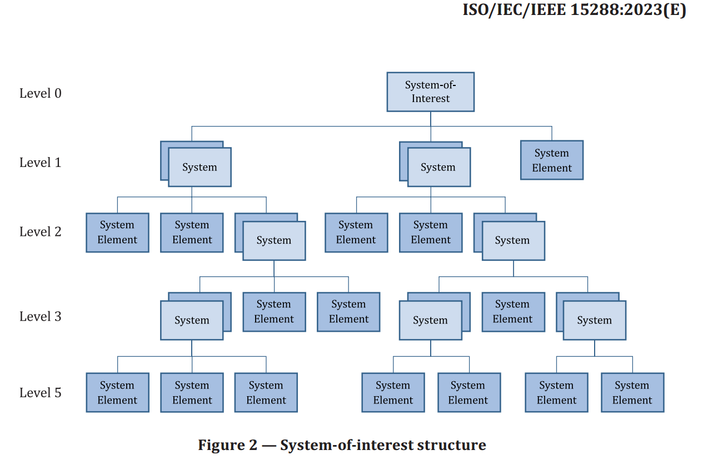

System levels consist of a hierarchy in the part-whole/composition relationship. These hierarchies are seemingly convenient to depict with a "tree" graph, like the one we just discussed in relation to naming systems in relation to the target system. This is suitable for illustrative purposes, not for work. Graphical models are extremely inconvenient for editing and modifying. When developing system breakdowns and coordinating them in the project team, you will need to quickly (this is key) change versions of the system breakdown. For this, we suggest using an "outline," a textual representation of the hierarchy tree, where each level is represented by an indent.

Here is the previous picture as an outline, with the same numbers as in the picture:

Supersystem (1)

System in the Environment

System in the Environment (3)

Target System (2)

- Subsystem
- Subsystem (4)
- subsystem

Of course, these names (like any terminology) are more or less conditional. For example, in TRIZ the supersystem is simply called the supersystem, while English-speaking system engineers usually do not use the word "supersystem" (very rarely non-engineers say suprasystem, but not supersystem), although they do say "subsystem" (subsystem).

In the fundamental system engineering standard ISO 15288:2023, they do not talk about all these types of systems, emphasizing their similarity: only the target system (system-of-interest) is distinguished as the top of the system breakdown. "Higher in the system levels" are immediately "systems in the environment," which are considered separately, including the supersystem itself. In the composition of the target system in this standard, there are only systems (if these systems have parts) and system elements (elements, if a decision was made not to consider their parts but only to limit to the existence of these system elements as wholes, being parts of their supersystems).

Let's give this picture as a multi-level list/outline, simultaneously translating it into English:

Target System

System

System Element

System Element

System

System

- System Element
- System Element
- System Element

System Element

System Element

System

System Element

System Element

System

System

- System Element
- System Element

System Element

System

- System Element
- System Element

System Element

The picture and text here are of roughly the same clarity, as very few elements are presented in the system breakdown. Now imagine having to depict 500 elements (scope of the problem: in an airliner or an ice drilling platform there are 5-6 million elements). A diagram-picture will immediately fit only on many pages that are hard to match with each other; it won’t fit on any computer monitor, and if you break it into parts, it will be completely unreadable. Edits in this diagram will be very long, and many edits will lead to errors.

A text version with an outline is easy to edit; it easily stretches into simply "long text" (people are used to working with multi-page texts using scrolling), long names fit freely into the line (you can even add comments!). So use outlines/outlines/"nested lists"/"multi-level lists" to work with system breakdowns.

An alternative way is to use explicit level numbering as a separate list element. Here's the same structure as in the previous list, but presented in tabular form (for example, in an Excel table). The target system as a whole in our representation does not have a code, and the number of positions in the code is the system level (1.3.1.1 – this will be the fourth level if the target system is at the zero level. Unfortunately, the ISO 15288 standard has a typo in the level numbering on the picture, the fourth level is shown as the fifth!)

+-------------------------------+-------------------------------+
| System Code                   | System Name                   |
+-------------------------------+-------------------------------+
|                               | Target System                 |
+-------------------------------+-------------------------------+
| 1.                            | System                        |
+-------------------------------+-------------------------------+
| 1.1.                          | System Element                |
+-------------------------------+-------------------------------+
| 1.2.                          | System Element                |
+-------------------------------+-------------------------------+
| 1.3.                          | System                        |
+-------------------------------+-------------------------------+
| 1.3.1.                        | System                        |
+-------------------------------+-------------------------------+
| 1.3.1.1.                      | System Element                |
+-------------------------------+-------------------------------+
| 1.3.1.2.                      | System Element                |
+-------------------------------+-------------------------------+
| 1.3.1.3                       | System Element                |
+-------------------------------+-------------------------------+
| 1.3.2.                        | System Element                |
+-------------------------------+-------------------------------+
| 1.3.3.                        | System Element                |
+-------------------------------+-------------------------------+
| 2.                            | System                        |
+-------------------------------+-------------------------------+
| 2.1.                          | System Element                |
+-------------------------------+-------------------------------+
| 2.2.                          | System Element                |
+-------------------------------+-------------------------------+
| 2.3.                          | System                        |
+-------------------------------+-------------------------------+
| 2.3.1                         | System                        |
+-------------------------------+-------------------------------+
| 2.3.1.1                       | System Element                |
+-------------------------------+-------------------------------+
| 2.3.1.2                       | System Element                |
+-------------------------------+-------------------------------+
| 2.3.2.                        | System Element                |
+-------------------------------+-------------------------------+
| 2.3.3.                        | System                        |
+-------------------------------+-------------------------------+
| 2.3.3.1.                      | System Element                |
+-------------------------------+-------------------------------+
| 2.3.3.2                       | System Element                |
+-------------------------------+-------------------------------+
| 3.                            | System Element                |
+-------------------------------+-------------------------------+

Of course, in this table example "system" and "system element" are types (from the meta-meta-model, types of important system approach objects) of those objects that will be specified in such tables or types of the meta-model "from the domain textbook," or even types of the enterprise's meta-model, or even for a specific instance of a system – names of specific physical objects. That is, the table will not have "system," "system," "system," but for a car "chassis," "left wheel," "engine," for a sailboat "boat hull," "mast," "mainsail" and so on.

Each time, use the translation of graphic representations into hierarchies, and then represent hierarchies in tables – otherwise, you will not cope with the maintenance, you will not be able to make numerous changes. Formats should be convenient not for "presentation," but for change: descriptions of systems (including the description of system breakdowns) are the subject of continuous negotiations in the project team, and therefore – the subject of continuous changes. Formats are tailored for the convenience of changes, any "clarity" of simple examples "from the textbook" and "from the standard" should not distract: you don't need to change textbooks and standards, you don't need to break their images into multiple pages. Use table representations (including for working with system breakdowns), it will be convenient.