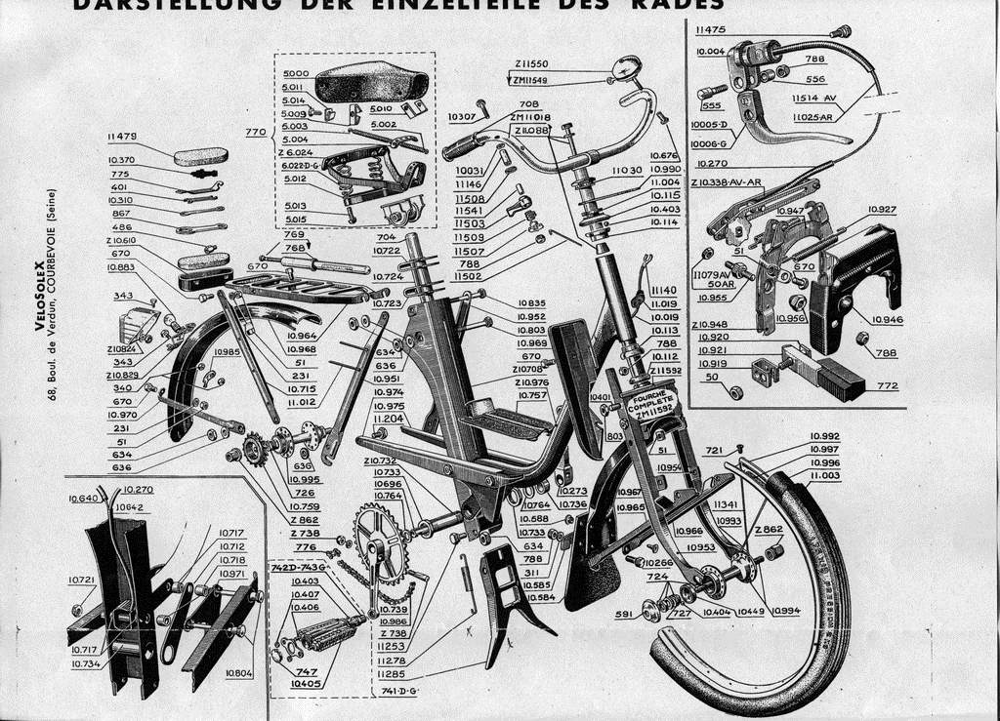
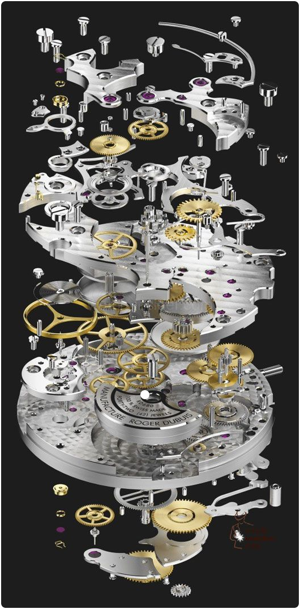
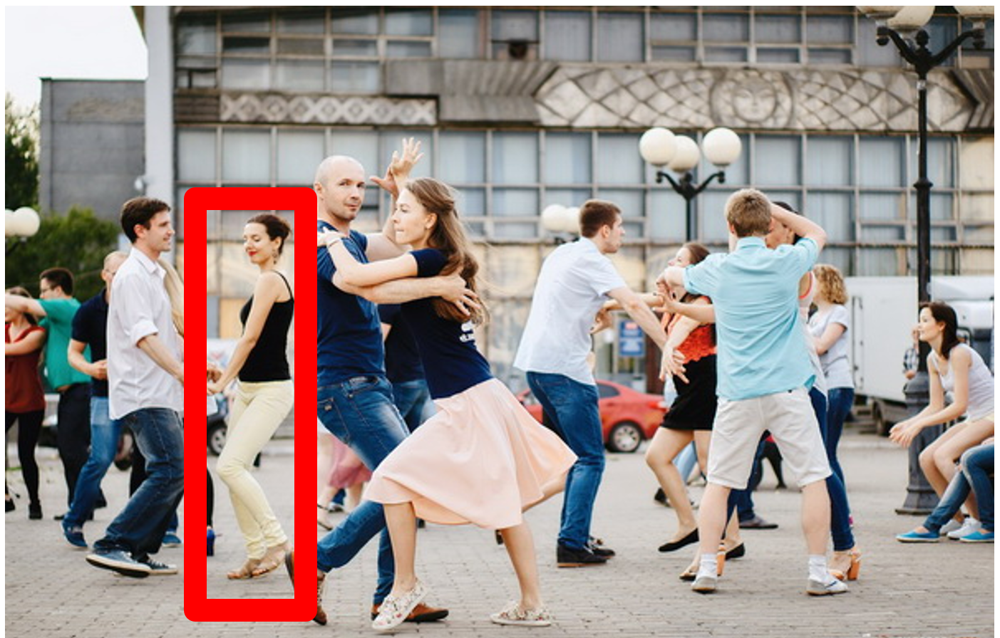
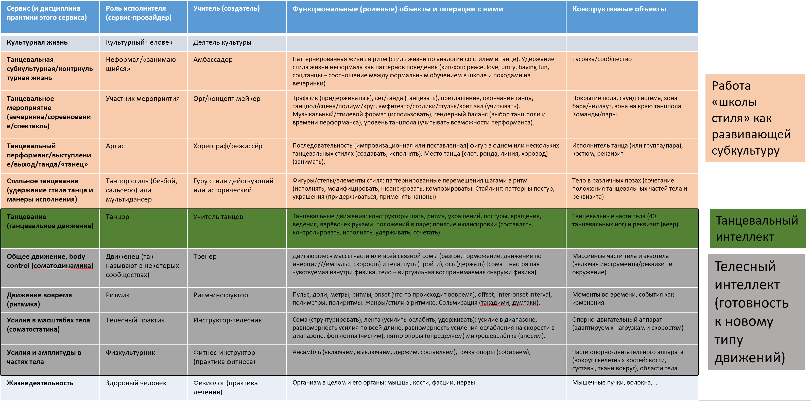

People think poorly about "behaviors," poorly distinguish parts and wholes in dynamic (changing states over time) systems that require 4D representations of parts in space-time. Let's describe the methods/cultures/styles and roles used by the community of dancers practicing **social/partner dances**^[[https://en.wikipedia.org/wiki/Social\_dances](https://en.wikipedia.org/wiki/Social_dances)] as a typical example.

The work of a "dance outing"/performance/"dance execution"::method is interesting because it only lasts a few minutes. The method of this work is performed by artists::role, in which the dancer::"subrole of the artist." In our case, the artist (engaging the subrole of the dancer) — is executing the subrole of "member of the social dance community"::"cultured person"::person, example of other subroles of members of the social dance community roles — event organizer, DJ. One can easily add another systemic level, for example, to take not the entire social dance community but also an additional level of some social dance style community, for instance, the salsa community. To repeat: in these communities/parties it is not only dancing artists but also event organizers, photographers, videographers, DJs, teachers — and "artists" their artists are not called unless they are professionals earning from their dance creativity. The collectively performed behavior style/culture of this style community is a subculture, for the community of all social dances — sometimes this culture is called a "subculture," sometimes just "culture," it depends on the project for which modeling/"type assignment for important objects in the domain area" is being done. The artists::role prefer to call themselves "dancers," but this characterizes their general dance training, we will see later that "dancer" is on a rather deep systemic level, above "dancer" there are still many different roles.

Systemic thinking about a dance community or even an individual artist::role is more complex than systemic thinking about some electronic gadget. You can physically assemble-disassemble a gadget from its constructive parts; the functional parts of a gadget highlighted by attention at least roughly correspond to the constructive parts of this gadget, i.e., to components and their assemblies. It's impossible to assemble-disassemble an artist or even more narrowly an artist with the subrole of a dancer in the mind in the form of an explosion diagram/schema. The problem is that "explosion diagrams" — are not highlighting by attention functional moving and changing state during work parts, but merely physical disassembly (although it can be done mentally) of constructs, which is usually thought of during the system's creation and not during its operation. Here is an example of a bicycle explosion diagram, the diagram does not show functional parts but precisely constructive parts^[<http://solexclubspirales.free.fr/eclates.html>]:

If one imagines a human organism with its functional division into organs::"roles in the organism," it immediately shows an error: such a "physically disassembled organism from constructs" cannot be imagined as alive-working: it would be dead in that form, "disassembly time"! An explosion diagram cannot explain "how it works," changes::behaviors during work. To show changes, you need to somehow display the flows of matter or energy, the difference in potentials. For this, "functional diagrams"/"schematics" are used, on which something flows between functional parts (liquid, electricity, mechanical energy, heat), producing changes in functional parts. More on this later.

The problem is that the explosion diagram often unconsciously appears in the mind during functional consideration, as unconscious representation of functional decomposition. This is a gross error of systemic thinking. Note, the bicycle construct in the picture doesn't ride, it is impossible to describe its movement. Here are the constructive parts of a clock, an explosion diagram image:

These clocks do not tick. But we need to discuss systems primarily during their functioning/exploitation, and highlight entirely different parts within them — this can only be done by attention. The correct way: try to imagine systems in the course of their work not as such static pictures, but as short videos, "gifs"/.gif — even if during the work/functioning of the system there are no moving parts, still imagine heat, electricity flows.

About the artist::role (singer::subrole, dancer::subrole, juggler::subrole, and including subroles of specific genres/styles of the corresponding artistic/artistic culture/activity/method of the singer, dancer, juggler, etc.) we think during the performance/out/& performance, and its functional (i.e., during work/use) parts have to be highlighted by attention directly "in the course of work," not disassembled. Disassembled into constructive parts in reality, not by attention — system no longer exists, for non-living systems it is "still in manufacturing" or "already disassembled," and for living systems — "already dead."

**For a system, there is only one way to think about its functioning — to highlight functional (not constructive) parts of the used/operated/working/functioning system by attention during its work, and mental, even attentive assembly (disassembly) while still (or already) "dead" system at the moment of its creation (or destruction).**

Here is a picture of social dancers, in which even a single dancer we need has to be highlighted by attention, and it might not be the first encountered dancer (who only distracts, as he looks directly at us, also in the foreground, and shown very sharply). No, we need the one we need — for example, the dancer framed in red:

If we are interested in functional consideration, we need to transition to 4D — to see it not as a static picture but to add to the spatial three dimensions also the time dimension: to mentally replay the video, even if it is short.

And now imagine that loud music is playing, you are being pushed from time to time, all dancers move quite quickly, and your attention needs to switch not only to individual people but also somehow to highlight parts of these people (not to disassemble into parts, but to highlight parts by attention!). Thinking in this situation of observing dancing people-artists is hardly different from what happens in some organization as a system-creator. Thinking for describing the work of weavers in the light industry (creators of fabrics) or nuclear engineers (creators of nuclear power plants) will be arranged in much the same way as thinking about dancers: there is no chance to imagine an explosion diagram, you will have to imagine something moving/changing and highlight this "something" by attention.

More about how to discuss working systems with people will be in the course "Methodology," but already now one can notice that talking about methods for living people, strangely enough, helps to deal with highlighting system levels (defined functionally, during the use/work of the system) and for non-living systems. When asking a student to imagine a functional car engine during the work of this engine::subsystem in a moving car::system, the student involuntarily imagines an explosion diagram, and this is an error from the first second of thinking about the functional/role parts of the system. However, it is quicker to figure out an example of such thinking on people precisely because they are difficult to disassemble "in the mind" into composite constructive parts.

The roles/"role objects"/"functional parts" of agents-people, implemented by the constructive/material parts of the organism and working under the control of the "method execution program"/skill::system (considering the skill of involving the method's tools), are not obtained by "constructing assembly," but by learning. Infants do not have much human behavior. Congenital roles in an infant are practically absent, an infant can be called a "personality" only in a general philosophical sense, and the intelligence of an infant is extremely limited, the sanity is minimal (because there is no ability to understand and speak), the methodological horizon is zero. In the early years, people's intelligence grows rapidly (including sanity/persuadability — with the appearance of speech, with the activation of the slow thinking mode S2, which provides the opportunity to understand and accept arguments), and then various roles are mastered/learned, turning the "almost personality" of a child into a full-fledged adult personality.

Let us recall: an agent-person consists of (compositional relationship) the organism and the personality where the organism is the hardware/universal constructor (and calculator/computer as part of the constructor), and the personality is the software/programs/"set of all kinds of skills." The personality gives the agent the skill to perform various methods, that is, to exhibit visible cultural ("by a well-known method in human culture") behavior.

An artist and a dancer are manifested as roles at the moment of dancing, they are recognized in some agent by their behavior through attention. In the agent::the creator, there is a program/software-on-a-neurocarrier/skill of executing the culture/style/practice/method of artistic performance (for the role of the artist) and dancing (for the role of the dancer).

You will immediately distinguish a dancer during a dance from a locksmith or a digger during engineering or ground work by the "demonstrated behavior"/"method of performing work"/"pattern of behavior." The method/culture/style of Vasya's behavior during (work) dancing differs visually much from Vasya's method/culture/style behavior during engineering or ground work. We recall: we recognize the role of the performer of some work method through observation of work performed by this method (observed change in the state of important objects by the work) by some agent, familiarity with the agent's reasoning about his method, and demonstration of the objects of interest of this method by him, there is no other way — what the agent will do (by which method he will work) from the role is most often undeducible, but the role from the work method is deducible. Tell what the agent (person, robot, enterprise) is doing and saying/writing — and one can tell to which behavior culture he belongs, what his role is. The role often gets it the name-term from the method of its work, from the expected behavior pattern of this role. **This we discussed when talking about the systemic thinking mantra: first "in what environment** **what** **does"** **for the target system, then "by what way/method** **creates," and only then —** **"who does"** **for the creator role, and agent-actor of this role..**

Joint dancing of two dancers::role in "social dances"::culture/style/practice/"behavior method" is relatively simple compared to the behavior of a team of some agents-people in a project of creating and developing some system and especially in an organization (an enterprise), where many projects are carried out simultaneously. Why do we write "behavior method" and not "work method"? We use a more abstract type for "work" simply because social dancing is not usually considered "work" in the sense of a job, and the method is a way of working; in the Russian language, it is easy to confuse "work by method as engagement of resources" and "work as occupation on a position". **The important thing is not the used words-terms, the conveyed meaning is important, the understanding important! But apart from words for conveying understanding, we have nothing else, so words-terms are also important!**

In the culture/method of social dancing, usually, two dancers dance, the "dance couple": these are two dancers with predefined specific subroles (leader/lead and follower/follower/follow, often "partner" and "partneress," but these are dance roles, not gender, and sometimes there is a dance for three — double trouble, one leader and two followers^[<https://vk.com/video52259628_456244076> and
<https://vk.com/video73069173_456240091>,
<https://vk.com/video-18525054_456240224>, double hustle methodology
<https://1drv.ms/b/s!Ag1bdTHZ9O7JgQ84GsQZqL_x8m9V>]).
The leader and the follower do not even talk to each other in words, although in some dances they can talk, for instance, in "Carolina shag"::style/culture, the follower can call out the figure for the leader to dance.

During this the, the leader and follower have clear objects of interest (they are taught in dance schools), they play a "clear role-playing game"^[Social dance can be understood as
"playing riddles," <https://vk.com/wall-179019873_1550>].
In most team projects of system creation and development, and even more so in any enterprise with many projects, the number of people with different roles is more than two or even three, with their methods/activities/cultures/practices significantly more diverse, and the interaction more complex.

To think systemically about a project or an enterprise means first of all highlighting there the roles/"functional parts" performing some functions/methods/practices/activities. For this, it is convenient to use the output/performance of social/partner dance as a transitional complex system.

A dancer::role is not even a top-level subrole of a social dance community member. Dancer — it’s the role of an agent performing dance, not everyday movements, whether it be social, solo, or ritual dances (for example, shamanic dances). The whole performance, in general, is done by the artist::role, who is performing actions according to methods (meaning these methods should be taught, not expected them to be somehow picked up from "just watching"):

-   the appropriateness of his "outing"/performance ("was at a funeral, there was music, I didn't get confused — danced")
-   tracking the audience's reaction
-   choice of clothing appropriate to the dance style,
-   implementation of artistic/artistic ideas,
-   beginning and end of dancing (possibly inviting a partner, escorting a partner from the dance floor to a place in the hall, tuning into a specific partner in leading, recognizing the end of the introduction and the end of the track in the music, etc.)

A subrole/subsystem of the artist will be the dancer who performs dance movements; this is a narrower role, a smaller part of the personality (we remember that the personality is realized not so much by the body as by the "program in the brain." The skill (similar to a computer program, implemented by the brain-computer) of dancing::culture/"method of actions" for the role of "dancer" is implemented by a smaller part of the brain than the general program of actions according to the methods of "artistic activity" by the superior role of the "artist."

We do not know exactly how the "brain program" is implemented in the brain, but conditionally it can be considered that "by size" more neurons are occupied by the whole skill of artistic speaking, singing, playing musical instruments, pantomime, dancing, drawing, etc., that is, occupied by the entire artistic part of the personality, than only the skill of dancing, the dance part of the personality. The artist::role not only knows how to dance::"method of performing dance movements to the music," but also knows a lot of other things — artistic activity clearly does not boil down only to dancing. Say, a theater or movie artist usually knows how to dance — but on stage or in the frame, they rarely dance.

Imagine systemic consideration of the culture/"methods of agent's actions" of social dance at the moment of the dancer’s work/functioning (we remember that **work method** **at the moment of its** **implementation in the physical world, i.e., when** **some physical/constructive object-agent is performing the role, playing out** **this method/way/style/type of labor** **—** **this is** **work/actions/functioning**).

Here is a table of systemic levels as levels of roles/"functional/role parts" of a member of the social dance community, which approximately explains what is being told here (and what is written in the table headers will be clear later in the course)^[The full-resolution table
is available in <https://disk.yandex.ru/i/QbcxOA1uuf5AAA>]. This table can also be viewed as a stack of dance methods/cultures/practices.

Let's add artistic details for clarity ("rendering," as in computer 3D modeling when adding lighting effects and placing some additional objects into the picture from CAD, "for vivid perception"). This needs to "ground", objects in the physical world.

In the center of Moscow, in one of the clubs from 22:13 to 22:18, loud music plays, there is semi-darkness, and two "non-conformists"/"members of subcultural communities" in their subroles of "participant of the event" dance::work salsa::"dance style" in the middle of the club's dancefloor. Why is it so important for us to indicate the time and place? To make it clear that we are talking about a physical object that exists not only in space but also in time — and we are considering an instance of executing the method/way of working with "specific resources, occupied specific time," i.e., work/work as understood in operations management. It doesn't matter that the subject area is not such that words from engineering and management sound usual in it. The important is to show that the reasoning is the same for any subject area — the power of intellect is just in this. Systemic thinking allows detailed discussion of the most important happening in a wide variety of subject areas, it's designed for this purpose.

We understand that our dancers::roles are quite physical, but further, we will discuss the culture of dancing as a subculture of general cultural life. In colloquial speech, this culture is called "dance," but we will not use this word-term, for "dance" — it is both "dance culture in general," and "dance performance/out/&performance," and "dance work." Compare: tango::dance — it can be both a dance style and a community of people practicing tango and a particular performance of the tango dance style. When saying "tango dancing" — it is clear that it is about behavior (function/practice/culture/style/method is usually named by gerunds, in English — -ing form of the verb).

**A physiologist**::role glances at this couple and is clearly pleased: the partner::"dance role" is not limping, the person performing this role is **healthy::"state** **of the agent's organism"." All bones, muscles, ligaments, fascia, etc., are intact, this doctor::"superior role of the physiologist" (we use "doctor" purely for stylistic beauty: as "tiger" to be called a more general class "beast") recently fixed (therapy — is "repair" in engineering) everything that concerned the systemic **level of physiology**. Others::roles