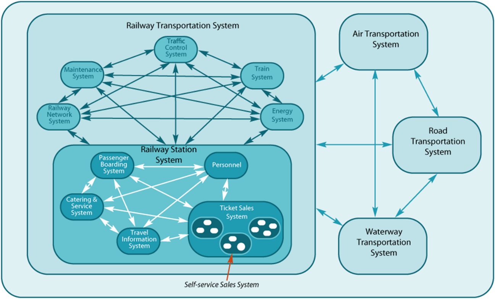
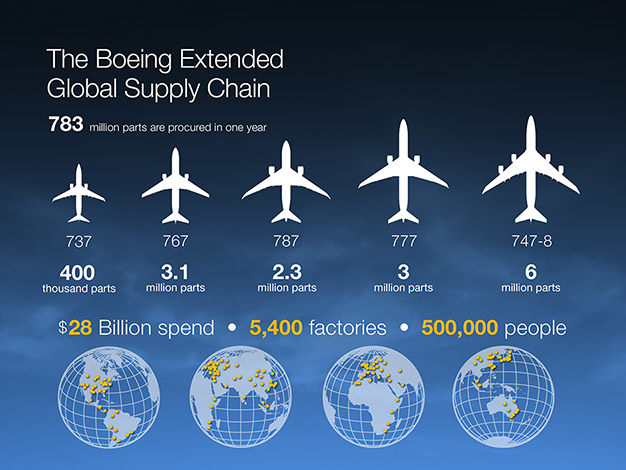

Understanding that any system is part of a system breakdown and belongs to a certain system level allows the systems thinker to apply the same systems thinking recursively: to conduct the same reasoning for each system level, for each subsystem within this system level if descending from the target, and for each supersystem if ascending. It doesn't matter what the system is—for it, complete systems thinking can (and even should!) be deployed (as prescribed in the systems mantra). And then, after thoroughly considering the situation with this specific system under review, one can return to the whole system breakdown (time of use) and creation graph to select the next system for consideration—and so on with various systems of different levels and places in the creation graph.

**Systems breakdown structure is first and foremost a means of managing attention.** Attention selects a single object-figure for detailed consideration, and everything else remains in the background, however huge or diverse this "everything else" may be. Attention allows for drastically simplifying the complexity of the world by temporarily ignoring insignificant details—leaving only the important in the discussion. Systems thinking forces one to always concentrate on the main points, letting go of unimportant details, which is **focusing.** At the same time, it forces one not to forget the whole when focusing on parts—**defocusing.** Remember, the main focus in systems thinking is "up" the system levels: not from the target system to its subsystems but from the target system to its surroundings, to the supersystem! If a figure is in your attention, its surroundings will be in the background! **Defocusing, turning attention to the background, turns out to be even more important than ignoring the background, focusing attention!**

**Mindfulness in attention management is needed:** you consciously focus and defocus attention, consciously move this attention from the object to the background at moments of defocusing (many objects in the field of attention, high alertness to new things appearing in the wide field of your attention), and focus attention by tracking the objects in its focus on the ignored background. Systems thinking manages attention by describing its movement in terms/types of the systems approach (system, function/method, role, construct, emergence, etc.). The concepts/types of the systems approach are types of meta-meta-models for discovery and subsequent maintenance of attention on objects of these types in the surrounding world (physical world and the world of descriptions).

You know that you need to look for objects with the type "system" of different kinds (target, supersystem, subsystem, ours, creator) in the physical world. How these types relate to each other (what types of relations exist among them) is described in our course "Systems Thinking," which is the meta-meta-model expressed in the course text in the natural language.

Next, you actively search for objects of these types in life, as you already have expectations about these objects. Actively—means you inquire about the state of these objects, invent and create such objects if you find out they don't exist, check guesses by rational reasoning and even experiments.

The focus-defocus of attention during systems modeling corresponds to the movement of attention through system levels (levels of system size), and the focus of attention itself is the choice of the specific target system, its subsystems and supersystems, the system in some link in the creation chain, identifying "our system" among them.

A systems thinker is well-oriented in a complex world: they never lose the context/environment of the object of attention, always capable of discussing both the smallest part of the smallest device and hugely large systems of planetary scale. These "scale jumps" don't drive them crazy; for them, it is a very routine procedure of concentrating on smaller and smaller parts of the world, ceasing to perceive details from the surroundings of these parts, or conversely, defocusing on a larger and larger part of the world, losing detailed information about smaller parts of this larger part of the world.

A systems thinker selects/selects a system for each attention camera, considering it within the environment of supersystems and comprehensively in the systemic environment ("in context," in the moment the target system is functioning), then may consider this system in turn as a set of parts—"zooming in" to another level of detail, increasing the details of this part, as in modern cameras. When considering attention, the metaphor used is "attention cameras":

- Attention is active: the camera first needs to be pointed at a piece of the world you are going to consider, then adjusted to the desired zoom level. This is the state change of the meter even before measuring: it requires working through some method to direct the camera at the object! The measurement needs preparation before measuring! To describe what's around the corner, you need to walk to the corner and peek around it, take active steps (the method must anticipate that the important object will indeed be around the corner, not, for example, right above—so you should walk to the corner and peek around, not tilt the camera directly upwards). And there, beyond the corner, you need to understand whether you are looking at the outline of a large mountain or a grain of sand on that mountain, and adjust the focus: this involves knowledge, the meta-meta-model of not only managing the attention camera but also knowledge about the object being captured. If you need to focus on Pete, it’s bad to mistake him for Nick. You need to know the attention object!
- Only after the camera is roughly pointed at the object can you consider what is obtained from this camera and select some objects from its field of view, assign types and check whether we have attention on the necessary objects. Recognition of the presence or absence of objects of certain types can only occur after measurement and with knowledge of these types (knowledge of the meta-meta-model).
- Generally, an agent can have many cameras: attention is "multithreaded," with each camera providing some information flow, and each camera’s work needs adjusting and using the meta-model, and also integrating the camera outputs in the thought process.

A systems thinker can easily select the necessary scale of consideration for each attention camera, choose the necessary systems effects (emergent properties) as subjects of interest at a chosen system level. And the systems thinker does this consciously: they are well aware of navigating system levels and each meta-system transition (from one system level to another) involving new system effects/emergencies in consideration.

Here’s an example of considering system levels for a multimodal transport system^[Leidraadse (2008), Guideline Systems Engineering for Public Works and Water Management, 2nd edition, <http://www.leidraadse.nl/>]:

In a transport system, we can first discuss multimodal^[[https://en.wikipedia.org/wiki/Intermodal_transport](https://en.wikipedia.org/wiki/Intermodal_transport)] transport and the competition of independent monomodal transport systems. For example, pipeline transport competes with rail transport for oil transportation—for their owners, they are enemies-competitors in the operational environment, but for those wanting to transport oil from one part of the world to another, they are parts of one multimodal transport system (remember that different roles highlight systems as they find convenient for their activity. Although for teamwork on a project, they will have to agree). When we discuss transportation systems—these are of planetary scales, or at the scale of a country.

Within one of the subsystems of the transportation system, we can pick the rail system for discussion—trains, railroad energy, train traffic management, etc. If we take one of the subsystems of the railroad—a railway station system, we can further consider its own subsystems—passenger boarding system, station information system, catering system, ticket sales system. Part of this ticket sales system is its subsystem of ticket vending machines. Each of these machines can also be viewed as separate systems. The screws that attach the controller board to the case of this machine are also systems. And even in the screws, different parts can be found—the head with slots for different screwdriver shapes, the thread.

Thus, in a couple of paragraphs and one small picture, we go through the consideration of the situation from planetary or country scales to a small screw, and we don’t go mad, we don’t lose the thread of reasoning, we clearly understand the subject of discussion and the problem's scale each time. This won't change on the reverse path, from screw parts to the transport system as a whole. Moving through different system levels, focusing attention on various systems within them, defocusing attention—this is an extremely powerful thinking tool.

It is pointless to consider a screw in a ticket vending machine as a direct component of the transport system—from a formal logic perspective, this may be correct but utterly meaningless, like "the tail of a herd of cows." The systems approach, introducing system levels, makes reasoning meaningful: all people get the opportunity to agree, discussing problems only at their "own" system level (a level where they have interests, preferences, intentions to act to improve the situation from the perspective of these role preferences), but at the same time, they take into account problems of adjacent levels—higher than their target systems and lower. Such organized collective thinking divided into system levels and different roles is a great achievement of civilization.

We can discuss the creation and development of a multimodal transport system similarly, pointing out its subsystems at different levels: who::creators and how::methods build the rail system, who::creators and how::methods manufacture the screw fastening the controller board to the machine case, who and how fits the screw fastening (this will be a different creator than the one manufacturing the screw). Everything is discussed as "systems," and the systems of creation are discussed in relation to systems in the environment because if you don’t know what::"target system or our system" you are manufacturing—then you don’t know which creator systems are manufacturing it, discussion is impossible. **Environment first, target system and its structure second, creation methods ("how we make the target system") later, and creation systems (who::roles, who::agents play them, who::managers will organize them) last.**

A Boeing 747-8 consists of 6 million independent types of parts (components of the target system), produced by half a million people at 5400 factories (creation systems), with 783 million aircraft parts (components of the target system) ordered per year (the last aircraft was released in December 2022)^[<http://787updates.newairplane.com/787-Suppliers/World-Class-Supplier-Quality>]:

Now the environment of these Boeings, their operational time: airports with air traffic control and passenger boarding systems, air corridors (also systems, equipped with radars and other infrastructure to track them, they take up space in the physical world). The airplane itself is useless outside of this, like a bottle cap without a bottle, like a bottle is useless outside its use situation.

In modern systems, the number of individual elements to be coordinated between themselves (in design), and often created from scratch (in construction), reaches tens of millions in "hardware" systems, and if it comes to electronic systems, trillions: a single Cerebras electronic chip has 2.6 trillion individual transistors, each performing its unique function within the chip^[<https://www.anandtech.com/show/16000/342-transistors-for-every-person-in-the-world-cerebras-2nd-gen-wafer-scale-engine-teased>]. And even these chips are not the highest system level; above them is the circuit board level, above that—supercomputers based on these boards.

Give up hope for creating such complex objects without any hierarchical consideration and management of collective and personal attention through documented systems hierarchy (i.e., hierarchy of systems in compositional relation). **Collective attention management of creators tied to system levels distinguished in systems' composition hierarchy—** **is the most important part of systems thinking**. This collective attention is also directed at creation relations between creators and created systems, here we talk about the creation graph.

System levels emerge as systems grow in complexity, a property of evolution (biological/Darwinian, memetic, techno-evolution). The complexity of systems will only grow, an endless growth. Each creator-team or creator-enterprise may be relatively simple (although they are also systems, complexity of creators also grows—enterprises merge into ecosystems, expand into super-holdings, system levels increase with evolution). But dealing with complex system creation projects (including creation systems themselves) is possible because one creator or even its part (e.g., a project team within an enterprise) doesn’t have to handle the entire system at all levels—instead, each creator works with parts of the system, substantially simplifying creation. Someone makes the rocket engine, someone makes the rocket computer, someone makes the rocket body, but no company does all this—including steel smelting for the rocket body and silicon purification for the computer chip.

Different companies specialize in different crafts, but organized according to a creation graph—they together create astonishingly complex target systems, operating in astonishingly complex environments. All this is possible thanks to systems thinking, implemented by systems engineers and managers of these creator enterprises.