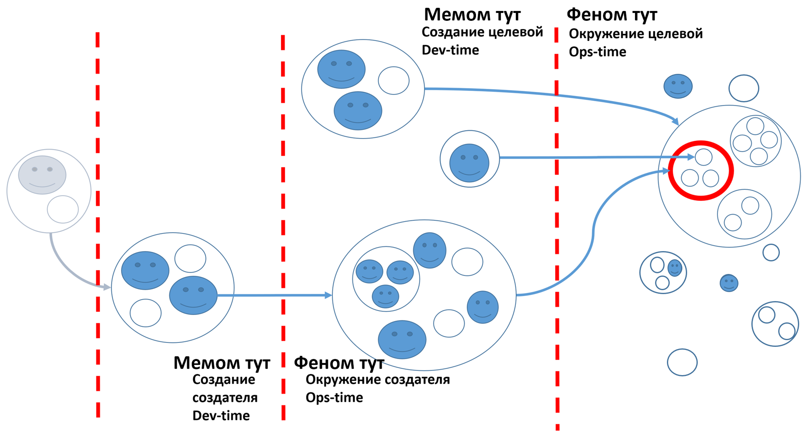

A simple creation graph can be metaphorically (i.e., quite loosely) illustrated with a diagram:

In the diagram, the target system (denoted by a red circle, the "origin" for system descriptions) is located in its systemic environment/surrounding/environment, meaning it is part of a supersystem together with other systems. The supersystem is represented by an encompassing circle in the environment, which includes other circles with circles inside—systems in the environment of the target system with their subsystems. Remember, the target system undergoes techno-evolution. It has its own subsystems (circles within the red circle). Each level of grouping parts in a whole system (denoted as smaller circles within larger encompassing circles, and so on at several levels of nesting) represents a systemic level. The systemic level of the target system's subsystems—three subsystem circles within the target system's circle, two circles around the target system, and the target system itself within the supersystem—is the systemic level where the target system is located. We do not further detail these systemic levels but simply note separate supersystems.

The target system exhibits its external properties in the supersystem "during" its operations, denoted by the words "phenom^[[https://en.wikipedia.org/wiki/Phenom](https://en.wikipedia.org/wiki/Phenom)] here." The word run-time is often used in software engineering to denote the functioning/operation time of a finished system. However, in the diagram, we labeled it with another widely used term—Ops-time, the operating time of system operators when the system is in working condition, functioning.

Target systems are not created and developed on their own (they usually cannot self-develop as they are not quite alive, and in classical engineering, they are often entirely inanimate) but by creators performing visions, development, architecture, DevOps/"internal platform engineering," etc. Creation systems include agents with their tools. Agents in the narrow sense (autonomous intelligent reasonable agents) are depicted as circles with "faces," while their clearly inanimate equipment (from screwdriver to data center) are circles without faces. Organizations are shown consisting (composition) of intelligent agents and their equipment and tools. Note that during operations, some agents enter the environment (for example, user::external-role-from-computer-supersystem::system enters its operational environment, unlike the computer factory, which will be the creator of the computer and will be considered during creation/dev-time).

These creator agents create and develop (meaning they often simply change the state, not create from scratch—say, paint, configure, add functions, repair) target systems, subsystems, and supersystems of target systems. Agents in various project roles are interested in various emergent characteristics of different systems at different systemic levels. They try to design and predict the success of the target system (in evolution—fit/niche conformity) by making "smart mutations" during the system's development. They collaboratively edit the system meme during its creation and development. This is denoted by the words "meme here" during creation time (for brevity, we skipped the words "and development," but development is no less, often more important than the creation of an MVP) opposite the words "phenom here."

Techno-evolution, like biological evolution, includes "species development," not just "growth/manufacturing of one organism/product instance." At each step of techno-evolution, a design of the current generation product::system with a level of detail sufficient for manufacturing (e.g., instructions for CNC machines, as well as instructions for assembly robots in CNC and robot machine language). This design itself is developed by developers from inventive ideas (how functional objects are realized by constructive objects, their spatial arrangement, cost), which in biology are found in the genome, within the target organism (but in genetic engineering, also in the creators' memory, for instance, in laboratory computers!). In techno-evolution, the meme analog of the genome is stored by the creators, and during "smart mutations" (potentially successful changes in meme ideas), a target system is created with a set of its features in a finished form: the meme generates the phenome, just like in biology.

Words for creation and development time from software engineering—dev-time (from "development"), often design time. When considering creators, we are not considering a functioning/exploited target system in the environment. Instead, we are looking at the system at the moment of its creation (conception/"usage strategizing," designing, manufacturing, commissioning the system as an MVP, and then the flow of incremental functional and structural development). Other creation time methods (engineering justifications, architectural decisions) are also present but omitted for brevity; the main thing is clear: it is about the creation time, dev-time, not ops-time. Creation systems and systems of systemic levels inside and outside the target system are considered at different times/realms, reflected by a dashed vertical red line intersected by creation relationship arrows.

There is the time of cooking borscht (creators - cooks, the borscht recipe as a meme), and the time of eating borscht (target system - borscht with its properties as a phenome, the environment here being the dinner situation during serving, mouth-tongue-teeth during eating, and the stomach during digestion. But this is all ops-time, while dev-time is the change of state of fresh vegetables, raw meat, water by the creators of borscht in the kitchen, to the final state "borscht is in the bowl, ready to use"). There is the time of rocket manufacturing, and there is the time of rocket flight. At the same time, the engineers' work on the rocket is utterly different from the astronauts' work in the flying rocket. **In systems thinking, it is customary** **to clearly** **distinguish** **the time being discussed, and the main time here is** **the use/functioning** **of the system** **(all functional descriptions are** **in it). But** **there is also the time of system creation** **(all constructive descriptions are** **in it), it is not the main one, but it also exists!**

Of course, there are problems and the unity of time consideration, the so-called **DevOps issue**, where system developers/creators are in no way connected with operators/users and therefore make a system that is unusable. This problem is primarily solved by organizational measures, but today often involves technical measures: operators and even users are generally excluded as people, replaced by robots, the so-called NoOps^[<https://ailev.livejournal.com/1367897.html>]. In any case, in systems thinking, it is customary to differentiate "logical" creation times (development, design, construction, implementation, enabling—everywhere the creators' work methods are at the center, and the target system is passive, not yet ready to work) and operation times (run, operation, use—functions/methods of the target system itself, while the creators are already passive here).

One can discuss digital twins here, but their primary role is "automated control," replacing an operator for adjusting-setting the parameters of the already working target system with an automation or a composite construct of a human (turning some knobs or replacing unreliable structural elements in the physical world) and an information control system (indicating which knobs to turn, which structural elements have become so unreliable that they should be replaced—software engaged in "predictive analytics," e.g., for "condition-based maintenance"). A digital twin operates during use, not during creation.

Between systems in the environment (target, supersystem, systems within the supersystem from the near environment, etc.—if the word environment/surrounding/environment appears, remember it's "operations environment," i.e., considering working time) and their creators, there is also a creation relationship (development, design, construction, implementation, enabling), where one creator::system describes and/or changes another system. Such systems form a whole chain of creation relationships, and if you look at all such chains, it becomes a creation graph: nodes are systems (target and creators), and edges are creation relationships. Within one time—part-whole/composition relationships, across time/realm boundaries—creation relationships (X::system creates/alters the state of Y::system).

The diagram shows a variant of such a creation graph. For each creator, there was also his creation and his operation/use/work/operations. Therefore, the diagram presents several different "times" of consideration (realms), and what is ops-time for the creator is dev-time for the target system. And what is dev-time for the creator, for the creator's creator is ops-time.

Different creators can be numerous, and the chains can be long. One can move quite far along the creation chains from the target system, as each creator also needs to be created by someone, and in system modeling, we simply stop at the chain length that allows a reasonably confident assessment of the target system's success.

Top managers regularly work with creation chains of six to seven links in their projects—and when they take examples with three or even four links, they are surprised that the model poorly corresponds to reality. Say, you consider sellers, but do not take into account that you are actually in a situation of some dealer network and also with "agents at the client" rather than direct sales—and you call them all "sellers." Everything, you lost one link of the creation chain, the model will be bad.

The diagram shows the gray "creator of the creator of the target system" not to forget about the presence of long creation chains, not just one creation relationship between two systems. The arrows are generally directed from left to right, a usual assumption to show time with the past on the left and the future on the right: first, the creator somehow appears, and only later—the system created by him. Together, all the creation chains form a creation graph, usually a directed acyclic graph^[<https://en.wikipedia.org/wiki/Directed_acyclic_graph>].

**Creation relationships** **are not part-whole relationships!**
**Enabling/construction** **is not** **composition/part_of!**
**A pot in which borscht is being cooked—** **is not a pot as part of borscht, or borscht as part of the pot! It's a pot** **for creating** **borscht!**

Now mark a cross on any of the circles in this diagram, which your small team (possibly just you) will work on as part of the larger project team—this will be "our system" (system-in-hand, engineered system, MySystem, OurSystem). And repeat all the arguments about the target system for our system—without forgetting for a second about the target system and the relationship between our system and the target system!

**Confused? Record all these systems in some text editor or other modeler, like a chess player records a chess game. Think not "in mind," think over the text, or outline, or table!**

**Systems thinking involves the use of models/descriptions, the attention must be held not in the thinker's brain but in documents (today—** **electronic, including information and simulation models, yesterday—** **paper documents).**
**Thinking—** **is always thinking with writing and written modeling!**

Our diagram of the creation graph (a type of image in which squares or circles of object designations are connected with arrows to denote relationships) is used in the course solely for explaining a small set of concepts that are immutable and not tied to projects. It will not be modified during the project; it contains very few details. This illustration is for a textbook, not a working tool for system modeling. **We do not recommend diagrammatic modeling in working projects, but we insist on mandatory systematic modeling in projects in the form of texts, outlines, tables: formats that are convenient to change/edit, search within, increase volume without fear of getting lost in the intricacy of connections**^[For more on system modeling on the example of enterprises, see A. Levenchuk's report, 2022, "How We Organized Teaching Organizational Modeling," video from 6:18:13, <https://www.youtube.com/watch?v=lpgpnCoV14w&t=22693s>, slides <https://disk.yandex.ru/i/ixpCGYY4kROrmA>. On the harm of visual modeling, see A. Levenchuk's book "Visual Thinking. A Report on Why It Should Not Be Fascinated By," 2018, <https://ridero.ru/books/vizualnoe_myshlenie/>]**.**

**Documentation in systems thinking is essential. Managing attention without records is unreliable. People are forgetful, so document/write everything (everything everything!).**

How to model changes of important objects in the project will be explained in detail in the "Methodology" course.