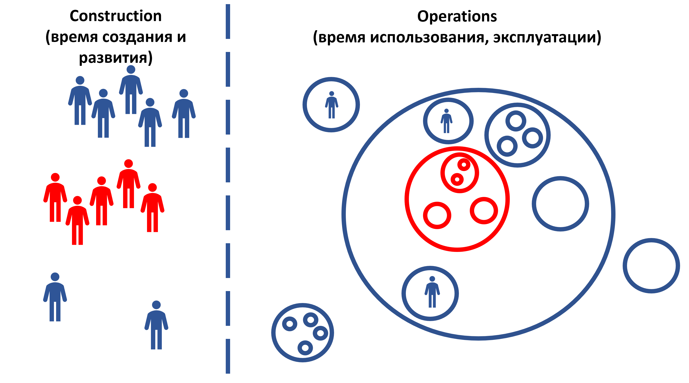

If you consider the supersystem of our target system as a black box, it will be the target for the team of the project's key external roles. And describing the supersystem as a black box will be a concept of using their target system for these external roles, which is the target for the team.

When requirements were still being derived from the concept of use, this description was often called: **stakeholder requirements/stakeholder needs, not to be confused with system requirements, simply called requirements**, omitting the word "system." However, to reduce confusion between this description of the supersystem-as-black-box and the target system-as-black-box descriptions, it is now commonly called **needs** (stakeholder needs, needs of the external project roles), and even more frequently referred to as **role interests or preferences**. For example, if we::team make a gear for clocks, the target system of the team is the gears. Needs/requirements are for the clock::supersystem, and the scenarios in the concept of use will be for the gear::"target system."

Thus, in a project, usually **two "black boxes" are described in the concept of use**:

- **Supersystem** — described by interests/preferences in certain characteristics of the supersystem important for the external project roles (needs, stakeholder needs). Different preferences may exist concerning the supersystem's areas of interest, for which you need to hypothesize values that satisfy everyone and then don't hesitate to adjust it during the project. Assume the supersystem is not just "something given," unchangeable, "descending from the heavens." No, the environment of the target system is also created by creators, constantly changing, and hypotheses can be made on how it should be arranged. Modern engineering bases itself on continuously refining the understanding of the world, the knowledge of the target system's use situation, awareness of the capabilities of teams that create the supersystem to adjust the target system's environment, and how to better meet needs through modifications to the target system so that it improves the supersystem's performance. You need to consider the various preferences of external project roles regarding the supersystem as the environment of the target system and possible changes in these preferences.
- **Target system** — described as a "black box" primarily through gradually detailed usage scenarios. Essentially, the same consideration applies as for the supersystem; in ISO 15288:2023, this is termed **recursive application of systems thinking**.

Additionally, **two "transparent boxes" are described, one in the concept of use and another in the system concept**:

- **Supersystem** — primarily described by the concept of using the target system, with emphasis on the target system's role/function within the supersystem. It shows how the presence of the target system within the supersystem satisfies the interests/preferences/needs of external project roles. This is the important "organization of the supersystem," the transparent box. The concept of use is, to some extent, the concept of the supersystem (recursive application of systems thinking! The same happens at every level) with sufficient precision to describe the target as a black box performing functions in the supersystem, making the satisfaction of external project roles' interests understandable. For wall clocks, the supersystem is the interior and people in the interior. You need to describe what surrounds the clock and how it interacts (e.g., does the loud ticking disturb people at night).
- **Target system** — described by the system concept, including the architecture as additional system construction solutions (with expected architectural decision influences mainly on architectural characteristics/object of interest, rather than functionality). The system concept and architecture demonstrate how the interests of not only external project roles (more described by the use concept) but also internal/team project roles — the visionaries, developers, architects, and engineers of the target system's production platform — are satisfied. For example, for clocks with specified accuracy on their outer edge, decisions must be made on their internal structure: whether to use precious stones in the clock to reduce friction and thus increase accuracy or if using them in wall clocks is a luxury and accuracy will be achieved using hard alloys for axles and pivots. Or, perhaps, making the wall clock electronic to achieve the required accuracy.

In the diagram, the target system and its subsystems are shown in red circles, and the "part-whole" relationship is depicted by the inclusion of circles. The environment — blue circles, nearest supersystem — a large blue circle encompassing both the target system and several other systems. Of course, there are additional systems in the environment that do not belong to the supersystem. There are many systemic levels both inside the target system boundary and outside it.

External project roles at usage time are shown as blue characters, but these are not people. These are roles, which can be played by people, people with computers, teams, and firms with all their people and equipment. In operations considerations, these external roles, such as "users," we recommend always replacing the major type "user" in our meta-meta-model with a role type from the meta-model (the target system’s domain) — in games, a player::user, in accounting systems, an accountant::user and auditor::user. However, external project roles can also be malicious actors/hackers and external inspectors — anyone interacting with the target system in operations time. These roles are shown in circles to emphasize that they are also systems in the environment (a role is a role object played by an agent as a constructive object).

In the creation time consideration (construction time) of creators::system, we do not draw circles and their nested/internal parts.

Across the entire diagram, the relationships of creation (between the right and left parts of the diagram) and interactions between systems of the same level during their operation (between circles of the same level) are not shown. The fact that systems can be divided in various ways (e.g., functionally and constructively: like a spoon — the handle and scoop are two functional parts of the spoon, but the constructive part of a cast or wooden spoon will be a single fabricable "part"-constructive) is also not shown, although multiple coordinated descriptions within a single system description will be critical in the system concept. Different coordinated decompositions (including placement and price decomposition — what we manufacture ourselves and what we outsource) are usually considered. Out of all coherent variations of different decompositions, keep only the "least bad coordinated variant" because "the best option" is unattainable in evolution, always achieving only a local optimum.

What’s essential for this illustrative diagram is that the "blue" external roles during creation and development engage in the "blue" (supersystem) part of the diagram, whereas the "red" part is a "black box" for them. Yet the "red" internal project roles (project team roles) must explore the "blue" area first, then go inside the "red," considering initially the "black box" environment (the nearest supersystem as a "transparent box," but also far supersystems), then make the "black box" transparent — form hypotheses about not only the functionality of the target system as a black box (concept of use) but also about its construction (system concept, including initial architectural solutions).

The project team for creating and developing the target system forms its concept. Concept development often starts with functional division, gaining an understanding of what happens inside the system in terms of subsystem roles (subsystems as role/functional objects), as well as subsystem functions. For example, "to show the time on the clocks at night, we'll make constantly glowing hands, which won’t be visible during the day, but will be good at night" or "to show the time at night, we’ll set the illumination to activate when the surrounding light drops" or "to save costs, we won’t accommodate nighttime viewing, if needed, they can use room lighting to illuminate the dial." These descriptions will be the concept of subsystem usage (recursive application of systems thinking!), with the subsystems yet to be designed, manufacturing methods devised, and materials found (affordances that turn into system constructs). For instance, in the "night clock" example, deciding what to use for dial illumination — LEDs, incandescent bulbs, phosphors. Some options will fit (an affordance is a "suitable thing"), some won’t, to perform an expected subsystem function within the target system.

**Systems thinking is recursive, applied similarly at every system level by every system creators' team. Each team has its own **"system coordinates" **around their target system** **and "their systems,"** **so the most critical thing is to agree on what these systems are!** **Agreements occur by describing the system's behavior regarding the supersystem** **(first upward through levels!), striving to describe the system as a "black box" to later test various system configurations as hypotheses, considering different system "transparent box" options** **(downward through levels — later!).**

In this section, we explain recursion using two levels (system-supersystem), but recursion applies to all levels — systems with subsystems, subsystems with sub-subsystems down to elements, supersystems, and the supersystem’s environment at multiple levels. At any level around any system, a complete system review can (and should) unfold roughly as it does around the target system.

Systems thinking holds that the concept of use (formerly needs and requirements) describes two different systems (supersystem as a "transparent box" and target system as a "black box"). But the techniques/methods to identify external roles' interests/needs/preferences in important supersystem characteristics and form the concept of use, how not to miss these in conversations with external roles, not lose them in collective project participant attention, how to trace (trace, correlate) target system behavior to needs (emergence of new properties), what additional methods are needed for creating and developing systems successfully — that’s covered in the "Systems Engineering" course, beyond the system thinking course's scope. The system thinking course covers understanding that "if you want to describe a system as a black box, you aim to develop its concept of use", setting up important objects needed in thinking.

**How exactly to develop the concept of use, which method to use? What are the results of using different methods/styles (many options)? That's all in the systems engineering course and may be specified in applied engineering courses for various systems (robots, expertise, organization, etc.).**

Our course is about conceptually focusing on systems and system descriptions, not how to make systems (methods/practices/work cultures), but how to think about systems while making them. In our course, we describe types of meta-meta-model objects of work methods, such as "system," "system description," "system concept." The "Systems Thinking" course is about what to systematically model in a project, about thinking via modeling: what objects in life to model and what is important in them (what models are needed).

But how to model, when to model, who (roles!) should model — that's in the systems engineering course and then in applied courses (e.g., if your system is an organization, then in the system management course, if it’s expertise, then in the personal engineering course).

From the systems thinking course, you should only know that **the concept of use** **is linked** **to the boundaries of the target system and the supersystem respectively, and they** **should not be overlooked, they** **must** **be present in the project!** **Also, the concept of use** **must mention** **architectural characteristics (not the responsibility of developers::"internal/team role" creating the concept of use, but architects::"internal** **team role"). All these model::system descriptions** **are documented.** **Of course,** **without** **developing a concept of use** **a system can be made** **(Egyptian pyramid builders built them, unlikely documenting a concept of use), but success may be a fluke** **(e.g., don't ask how long the pyramids were built, their cost, or how many dissatisfied died in the project. Governments still dislike documenting use concepts, unsurprisingly).**

Role performers conceiving (concept of use, detailed throughout the project), designing (system concept, detailed throughout the project), manufacturing (system realization, covering the project's entire time — not only creation but also development), and decommissioning the target system (rarely, but happens) or parts of the existing working target system to get a new feature/capability — that's the "project organization"::creator (people, AI, their equipment and materials). These internal project role performers are often called the project team, project task force, or simply the project. Be mindful of types: here it is not project/design but project/project, and not project::behavior but also project::organization. The everyday confusion between objects and their behavior for roles and functions is traditional for projects. Check: is your "project" a "project team" or "project team behavior"?

An organization is defined by subordination: how it collaborates and works together, but its external roles as a "collective actor" with its props are significant. An organization (team, teams collective, enterprise, cooperation, task force, using different equipment, etc.) is an **orglink, a collective actor.** Commonly for mechanical target systems, the creator is the organization. In creation chains, one organization may create another (often termed as "orgproject," "organizational development project").

External project roles? Those who aren’t directly subordinated while performing their roles to project team role performers. There are intermediate situations: a contractor team from another firm engaged with our target system is internal roles performers because they formally work on our target system (e.g., making a subsystem or providing a service helping the target system creation) but also considered external due to partial subordination under a contract. The client team roles are external, project creation team roles are internal, and contractor team roles lie in a grey area (considered internal, but life often forces careful consideration of their role interests much like external roles — "trust in Allah but tether your camel").

The previous paragraph clearly tied role/agent subordination relations (who’s the boss versus merely a client, inspector, etc.) to what roles are considered internal or external. Yes, **modern systems thinking** **starting with the second generation** **addresses not only** **target systems but also creation systems, including people and** **AI,** **collective creators.** Thus systemic thinking applies in managerial reasoning concerning collective systems of agents (including humans, AI, computers, equipment — enterprises, organized markets, self-regulating organizations, etc.) beyond just technical or software systems.

Systems thinking applies universally, even at any level. However, the higher **evolutionary/system/organizational level, the harder it is to agree even on the** **concept of use, let alone** **the system concept as a means of implementing the use concept.** **Conflicts amongst levels' systems and conceptual discrepancy cause this.

Physical evolution theory says achieving a true/global optimum is impossible. Each attempt hypothesizes reaching a new level of quasi-optimal/"local optimal," acquiring the least bad engineering solution, seldom significantly improved abruptly (require multi-level work — major evolutionary transition), but always aiming at quasi-optimum. Life development is endless; technical systems too, part of techno-evolution — there's always room for improvement, no final fix.**

Systems thinking is fundamental/transdisciplinary: **it productively mediates conflicting (different interests!) roles of target system engineers (visionaries, developers, architects, production platform engineers/internal platform), creation system engineers/managers (businesspeople, organizers, org-architects, administrators), involving various roles from impacted project activities, harmonizing in collective thinking, creating systems collaboratively.**

Projects are universal; it's applicable to every type. System thinking serves in both execution::"teams’ behavior for results", defining project aims, primarily — formulating the target system. For example, system thinking is essential in founding enterprises, unclear target system assigned to a team (market hypothesis), thus engineering a company from scratch ("business engineering", including business model proposition) that designs "iron" or "software" systems, refining an initial guesswork on the system’s nature.