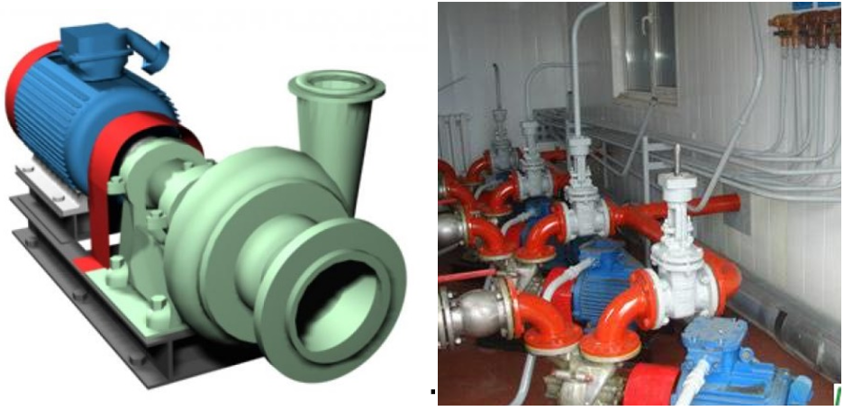
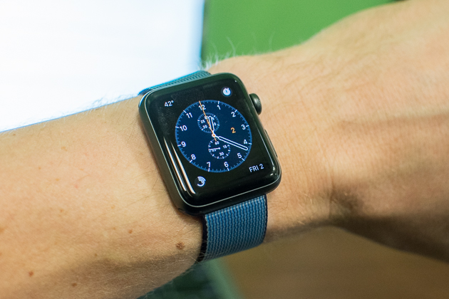
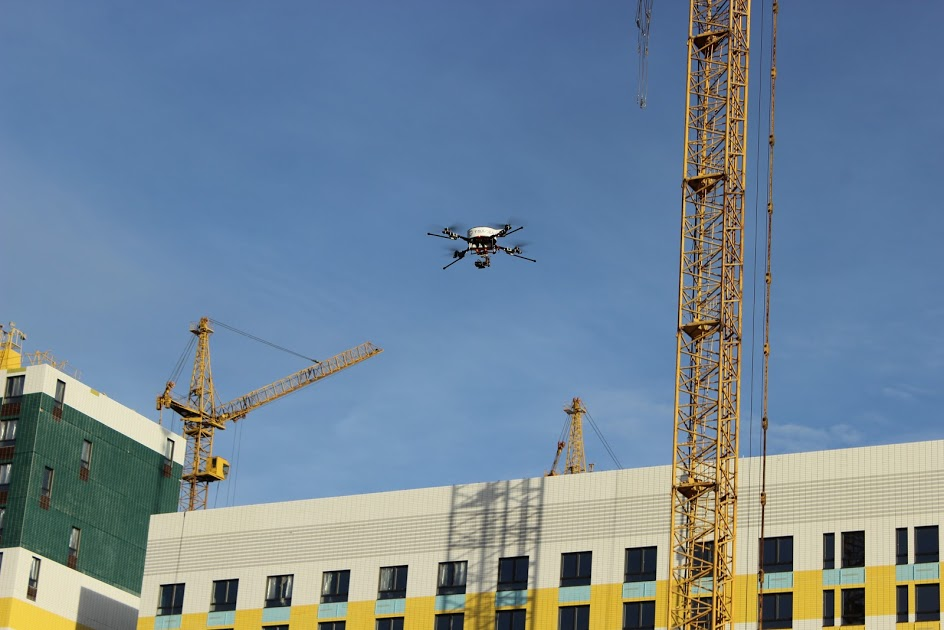

**A narrative about a target system always begins with its description as a black box, but in reality, it is necessary to talk not so much about the target system itself, but about its supersystem.** And this is not by chance: the systemic approach starts with defining the system by its role in the environment (a role/functional object among surrounding systems), by its role behavior/function (changes in the states of systems in the environment, which are carried out by the described system as a "black box").

**From the boundary of the target system through systemic levels upward to the environment, to the supersystem---** **this is the first mental step in systemic thinking, this is the main imperative. No** **"division into parts,"** **no** **"consists of"** **until it is clarified what the whole, in which the parts interest us, is used for---** **first, this whole "is part of" and "enters into" and understanding what this whole does in its "superwhole"!**

Let's give an example of using systemic thinking terminology in describing a simple mechanical system with electrical elements—a pressure pump.

The target system is a pressure pump used in a pump unit (supersystem), which in turn is used in a pump station (i.e., supersystem-of-supersystem—the pump station). Its role is a pressure (to ensure water reaches the upper floors of a building) pump; action/function—raising the liquid pressure. One of its subsystems is the rotor assembly (rotor with blades, it's a centrifugal pump).

One of the external design roles is the owner-operator of the pump station. The need is an uninterrupted water pressure output from the pump station. The need speaks not about the pump as a target system, but about the pump station as a supersystem-of-supersystem. The needs of external design roles most often describe supersystems of some levels. Although they can also describe creation systems, for example, "the need is for you to manufacture the pump in three days," but here too, it is often easy to trace as "needed for the supersystem": "otherwise, our pump station will not be able to start on time."

The need for uninterrupted water pressure output from the pump station is reflected in the architectural characteristic of the pump "mean time between failures (MTBF)" and raises the question of an emergency power source for the pump motor—but remember, the emergency power source, just like the pump motor, will also be in the supersystem for this pump. The pump unit consists of a pump and motor; the picture shows the pump unit, with the pump depicted as the green part. The rest is the pump's environment, part of the supersystem. Here’s a detailed breakdown:

- Pump station (supersystem-of-supersystem)
- Pump unit (supersystem)
- Pump (system)
- Rotor assembly as rotor with blades (subsystem)
- Rotor (sub-subsystem)

Usage concept: the pressure pump delivers up to 40 meters of pressure into the pipe connected to it, with a flow rate (water throughput) of up to 10000 liters/hour. Architectural characteristic: MTBF of 5000 hours. No preferences in important characteristic values ("the flow rate/water throughput should be as high as possible," "maximum MTBF"), as these are already agreed-upon final values, and the preferences of different roles are already considered therein. The usage concept and architectural characteristics describe the target system (referring to different times: operational time "in the moment," total operational time), and preferences describe the "wants" of individual roles. They address different objects: the usage concept reflects the system's success (a "black box" description performed as a reflection of roles' agreements about their preferences), while preferences reflect the roles. Roles are creation systems, and preferences characterize roles, not the target system. Roles will promote hypotheses about system success in a direction beneficial to them. For example, the design engineer demands a higher water flow for the pump "for guaranteed performance with a margin," but the total cost of ownership will then be much higher—and the design engineer and the visionary engineer (responsible for whether it can be sold or the entire project becomes unprofitable) agreed that up to 10000 liters/hour would be sufficient, "the least bad solution."

Some systems in the near environment: motor, frame (they are part of the pump unit as a supersystem, but they are external to the pump), electrical wiring, pipes included in the pump station but not the pump unit.

Some creators: the design bureau (which designed the pump), the factory (manufacturer of the pump), the designer and builder of the pump station (they participated in the creation: chose this specific pump, purchased it, performed installation at the pump station), the wrench (used to tighten the bolts that attach the pump to the foundation). It is unclear whether the pump unit was created by the builders of the pump station or if the pump was delivered as part of the pump unit (i.e., the design bureau and factory provided the pump unit); this needs additional clarification.

Another example: electronics with software islands—smart watches.

To determine the supersystem into which (during operation) the smartwatches are included, we must consider the Western Christian tradition of people's attitude towards property. Personalities-as-immortal-souls are considered to own their own bodies, which are seen not so much as the person themselves, but as simply the carrier::hardware of their personality::software, belonging to the personality. The personality::software owns its body::hardware/equipment, it is its property, it belongs to itself, this is an expression of "free will." A person in the Christian tradition = a personality-as-soul plus the body. This property of people is usually called **self-ownership**. Personal belongings of a person are considered simply an extension of their biological body. No one can take a human's body or damage it, just as no one can take or damage their personal shirt, personal watch—they are considered part of the person, literally (is_part_of/composition relationship). This is "sacred private property." The body = biological body plus other personal belongings and even plus means of production (for example, an engineering plant) owned by the personality.

Thus, with some convention, we can consider the supersystem for the smartwatch to be the person-owner of these watches: we will consider the watches to be literally part of their body. For many personal items and tools, this is confirmed by neurophysiological experiments: personalities treat them literally as an extension of their body^[Brandon Keim, "Your computer really is a part of you," <https://www.wired.com/2010/03/heidegger-tools>. The brain controls the computer mouse as if it is indeed an extension of the hand.], "exobody."

Another interesting system of this kind, which includes people, is the **household**, which can include both the owners themselves, and the house, and household utensils.

In such systems, the people-agents included in them simultaneously play roles as actor-designers and also represent themselves as "just a body/organism," which we deal with just like other materials, i.e., simply taking into account their physical properties—size, humidity, strength, etc. The person as an agent is physical/biological/material, so they consist of muscles, bones, and other tissues. In systemic thinking, both the reasonableness of the person-agent in terms of skillfully playing a labor role and their materiality as a body are considered.

In the example of the smartwatch, the supersystem is the person-owner of these watches, but not as a personality::software, but more as a body/organism belonging to the personality with everything worn on it: shirt, shoes, watch. The biological body of the person will be in the smartwatch's systemic environment.

Needs/interests of the owner's personality as an external role (owner of the body-with-the-watch): they must be informed about the exact time, but this list of interests/needs largely stays open. The role of the watch is difficult to formulate, as it involves a gadget with diverse behavior, i.e., a multifunctional gadget.

The usage concept will relate not so much to the "watch" as "time measuring devices," but to various potential usage scenarios—it can be a watch, radio, player, pulse meter, and also the smartwatch is expected not to chafe the wrist (the wrist skin as part of the body-supersystem is in the environment of the smartwatch), they are expected to be successful if they are in a fashionable color at the time of sale, work at least 20 hours without recharging, weigh no more than 80 grams, work with an app store, and connect with an external computer (smartphone, tablet, desktop).

Systems in the environment—hand, clothing (at minimum, a sleeve of a shirt or jacket), charging device. Subsystem—protective glass (e.g., from Gorilla glass—purchased separately from a contractor manufacturing custom protective glasses).

Smartwatch creators: design bureau, factory in China, retail store in Europe. And if we consider the store as one of the creators in the "seller" role, we can learn a lot about the smartwatch. Expected store behavior ("store with the watch inside," what the store owner wants from the temporarily owned watch, these are stakeholder needs for the target watch)—sales amounting to a considerable sum, easily translating to a hypothesis about the convenience of the watch's packaging for warehouse processing (hypothesis! It may not be necessary, or convenience may be defined incorrectly), colorful packaging and booklets for display, as well as good advertising (i.e., the store considers the advertising service part of the product—without a certain level of advertising, a good store may simply not take the product for sale). And **watch-as-product/packaging-with-watch** thus receives additional usage scenarios for the watch-as-product by the store to extract money from store visitors in exchange for the watch. In fact, we are introducing a new system "watch-as-product," packaging with a watch, distinct from the watch, and a new role "store visitor" (who may or may not become a buyer, and the buyer may later become a user of the watch, but may not). The moment of using the watch::product, i.e., the operation type of using "product"—sale, i.e., "delivery against payment," and the moment of using the watch—we look at it for time, set an alarm, take calls. Do not confuse product usage by the store with watch usage by the user! This mistake is often made by "accelerator entrepreneurs": they are so engrossed in the idea of "selling" that they consider their "product" used not as a product, but as a product! What will happen after the purchase does not concern them, the watch for them may not even operate, just a dummy, as long as it pays off. This is an error: watch::product/system and watch::product—are, in fact, different systems, with different users, referring to different times (creation time, sale time, use time of the watch), different creator roles, different project team roles.

It is very important to identify a variety of external design roles, identify their interests, determine needs (agree on acceptable and desirable properties of the supersystem with external design roles, sometimes even propose these properties—executors of external design roles often don't know what they would like, or don't consider what they want possible, system developers can offer something to them), and then derive a complete usage concept describing the behavior of the target system during use/operation/operations/functioning. Sometimes it is necessary to introduce a new system (in our case, watch-as-product) and not confuse it with the target system (they have different usage times, different functions in relation to the environment, so important characteristics and structure—are different).

The usage concept with various usage scenarios of different capabilities/features of the target (or any other) system will describe the system, helping to define its boundaries: what the system will do and what it will not do. For example, these smartwatches will show the time, and these smartwatches will show the time and blood pressure (then, in the system concept, think about how to organize it so there is an acceptable price for sale). In the case of watch-as-product, it is clear that the target system includes packaging, advertising booklets, and even broadcasted advertising through some channels. Including some additional app software for these watches can also be considered part of the watch itself. The app store for these watches can be considered a creation system for some watch features/capabilities, but this cannot be considered with packaging.

This example shows that for different roles, it is convenient to describe the (existing or planned) target system differently, sometimes introducing additional systems. For the store, this very packaging-with-watch-and-advertising/watch-as-product will be target: it needs to be designed (merchandiser!), manufactured (procurement! Logistics!), used (sold!). And the watch itself? Not needed. Needed is the packaging-with-watch/watch-as-product!

Modern engineering often deals with **cyber-physical systems**, which include sensors, actuators (machines frequently but including lighting devices or electrical switches), and a computer (cyber- managing portion), managing entire system operations. An example of such a system might be an aerial photography drone.

The supersystem—a construction site (an under-construction building plus a deployed set of creation systems around the building, "construction event"). One of the external roles in the project—the developer-customer, whose need is the controllability of construction progress. The drone-photographer (defined by its role)—the target system. Function::drone behavior—producing a stream of high-resolution photographs of construction from angles of interest to the developer-customer. Fragments of the usage concept: flight and photography duration of at least 1 hour, images of the construction site obtained at an optical resolution of at least 20 megapixels, recharging between flights takes no more than 1 hour, the drone approaches for charging itself. Subsystem—camera, sub-subsystems of the drone (camera subsystems as part of the drone)—camera lens and matrix. Systems in the operational/working/operating environment: charging station, construction site with buildings, structures, and equipment (cranes), considered in the air as obstacles (for example, the crane cable).

Drone-photographer creators—design bureau, manufacturing plant, retail store, repair workshop, operational service with drone-photographer operator (this service is more like upgrading the drone before and after flights: checking, refueling, tuning, cleaning, repairing. Therefore, we consider this service not in the systems environment but in creation systems—it works not at the time of use/"benefit"/work/functioning of the drone).

The same narrative would apply to less classical systems than the traditional electromechanical (pump) and cyber-physical (drone, smartwatch) systems.

For example, skills. A separate course, "Personality Engineering" is devoted to engineering skills (personality—a set of agent skills). In fact, this is a course in "skill creation skills," typical for systemic thinking.

For example, let's take **system thinking skills**—this is a target system which, during work, performs thinking::computation with the concepts of the systems approach, and this system is implemented by some constructive parts of the brain or AI program computer, playing a skill role (but we don't even know exactly which parts of the brain or parts of the computer). Subsystems of systemic thinking skills: skills of thinking about systemic levels, skills of thinking about creation chains. Supersystem of systemic thinking skills: intelligence, as general thinking skills across all fundamental methods of the intellect stack (again, we understand they are also implemented by some parts of the brain and/or agent computer, but we do not understand exactly which parts—which does not prevent us from reasoning about this skill as a material object).

Moreover, in case of team systemic thinking, it can be several brains and computers plus communication means between them). Systems in the close environment of systemic thinking skills: ontology thinking skills, concentration skills. Skill creator—a systems thinking course (an online course as a program on data center servers and optionally course instructors—their presence may or may be not necessary). Creators of skill creators, i.e., creators of the systems thinking course—the author of the textbook and model templates (Anatoly Levenchuk), dean's office (managers, programmers, operators) from the School of System Management with their LXP Aisystant.