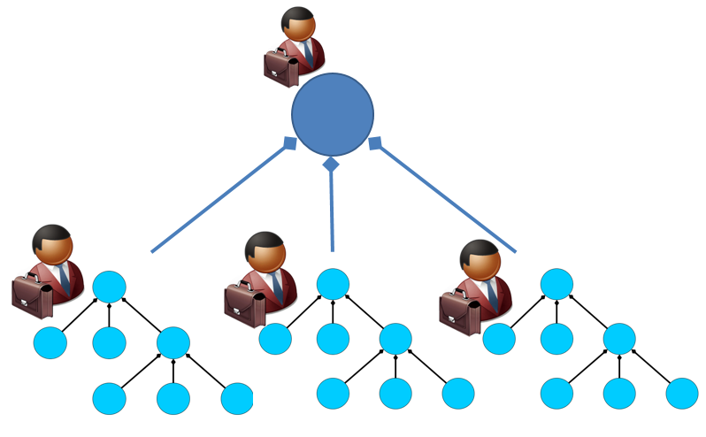

Sometimes a system composed of other systems is called a "system of systems." This is incorrect; it's simply a system, and the other systems within it are subsystems. It seems unnecessary to specifically emphasize the fact that any system consists of systems. Nonetheless, the term **system of systems** (SoS) exists, designated for a special case of distinguishing systems based on social characteristics of their creation and the timing of their creation, rather than purely technical aspects of systems nested within each other in their environment and operations during usage.

**A system of systems is defined as such a system that** **has** (Maier's criteria^[<http://sebokwiki.org/wiki/Systems_of_Systems_(SoS)>]):

-   independent creation/enabling systems for its subsystems (the SoS responsible party does not have the authority to mandate common development/modernization for the systems within the SoS)
-   subsystems that can operate independently of the existence of the target system (no authority to direct the systems' owners on how to operate)
-   emergence/system effect from their integration into a system (creator desires to achieve a function/behavior from the target system of systems that cannot be obtained by working with individual systems within the overall system, requiring collaborative operation of these independent constituent systems within the SoS).
-   evolutionary development (understanding what will happen in the system of systems at each subsequent step of the creation program requires research and additional agreements, as there is no role that knows how the system of systems is organized at every moment—subsystems of the system of systems as autonomous systems change independently. Therefore, there is a sequence of upgrades, not a one-time project action. However, this is not much different today from "ordinary engineering," as evolutionary development is also carried out with "just systems," although in this case, the structure of the engineers' organization is fully known, and subsystems are not autonomous).
-   geographical distribution of the systems within the SoS.

These criteria vary, of course, in different engineering and management schools, but the commonality remains:

-   ordinary "systems" imply centralized "ownership" of the system—having project roles/stakeholders/"interested parties" authorized to make decisions on all parts of the system, authorized to manage everything within their system boundaries. This is the traditional case: a car with an engine and wheels, a railway bridge, and a computer—these are typical "just systems," with their systems engineers fully determining their functions, design, operational capabilities, creating and executing plans for modernization and decommissioning. Each of these "just systems" has one owner, one proprietor.
-   in a system of systems, each system within it has its own owner, and the constituent systems can operate/do/perform independently without being part of the system of systems. Examples include a city, a transportation network, the internet, any company—since the people within it are self-governing and not rushing to follow someone else's orders.

Thus, the difference between a "just system" and a "system of systems" is not determined by the particular structure or design of the system (defined during its use) but by the existence of independent creation systems (defined at the time of creation), describing and embodying the individual constituent systems within the system of systems, and then being able to use them independently. Therefore, metaphorically, we can represent a system of systems with a diagram showing that a system of systems consists of three subsystems ("constituent systems" of the system of systems), each of which is autonomous and in turn consists of its own subsystems, showing two system levels), but most importantly—figures with briefcases indicate the owner-agents who need to agree to combine autonomous systems into an integrated system.

In a system of systems, the owner-agents of part-systems and agents authorized to manage labor and capital resources (people, enterprises) are crucial, making the system of systems a special case.

ISO/IEC/IEEE 21841:2019 defines four types of systems of systems, distinguished by **their degree of autonomy**:

-   **directed**, in which there is an appointed architect (an agent in the role of architect, responsible for dividing the system into constructs and ways of organizing connections between constructs) who can issue their architectural decisions to the constituent system project teams, and a manager (an agent in the manager's role) who allocates common resources.
-   **acknowledged**, in which there is a recognized architect, but they can only persuade the owners of the constituent SoS systems to change their systems according to the architecture they developed (i.e., the architect does not have a governance relationship, just mentoring on their architectural decisions).
-   **collaborative**, in which all constituent system owners agree with each other on "every little detail," but there are no organizational units (agents performing roles) like an architect, project manager, or similar dedicated units engaged in creating and developing the SoS at the system level.
-   **virtual**, in which the owners of the constituent systems of the SoS know nothing about each other, so the project development teams of the constituent systems do not visibly influence each other.

Gradually, through trial and error over a couple of decades, the primary method of working with systems of systems emerged as "best practice": joint step-by-step asynchronous evolution/"continuous modernization" of the autonomous systems within the system of systems—because ensuring consistency and synchronization of changes in these autonomous constituent systems "by a single project from a single center" is extraordinarily difficult.

The approval dates for modernization projects of individual constituent systems will vary, the appearance time of emergent functionalities of the target system of systems is therefore poorly predictable, funding allocated for the modernization of constituent systems will be provided at different times, and ensuring its sufficiency cannot be guaranteed. There was no one to lead the overall reform project both engineering-wise and managerially, not to mention the lack of a common goal-setting/strategy for everyone, as there was no single businessman coordinating it and then authorized to punish deviations from the strategy.

Owners of autonomous constituent systems may have different opinions about the interaction of their systems with other constituent systems within the system of systems; they may resist changes since they may be satisfied with the autonomous operation of their systems in their other supersystems, and the desire of some influential performer of an external project role to combine autonomous systems into yet another supersystem as a whole system of systems might not be supported by them.

Therefore, working with systems of systems requires leadership methods. Leadership is understood as a method of catalyzing cooperation among creators: these are "directorial" methods of staging a play (the time of creating a play!) in a theatrical metaphor, specifically the methods of persuading role performers to perform their roles in the play selected for production by the director. In a gaming metaphor—these are methods of organizing a game by a "game master," concerned with ensuring that all "players" (agents) consistently and ethically play their roles in the scenario culture/style. Leadership is "the method of helping to occupy a position." Of course, it assumes the ability of the "persuaded" to further act according to the method, having mastery of the game/work method that will be performed based on the leadership work results.

Today, the SoTA leadership method is distributed/shared leadership^[<https://en.wikipedia.org/wiki/Shared_leadership>]
(no single "director," everyone performs the leader's role, each around themselves). But in any case, this relies on the humanitarian disciplines/theories of sociology, political science, psychology, conflict resolution, etc. There was hope that distinguishing "systems of systems" as a separate class would contribute to better organizing their creation. But nothing came of it. All achievements of "systems of systems engineering" methods turn out to be achievements of other working methods, mainly management. Partially, results from developing systemic architecture methods, which seek to ensure maximum autonomy of team operation in "ordinary projects," are used. These results are also applicable in the creation and development projects of systems of systems.

No significant breakthroughs in working with systems of systems have occurred, and no specific methods for working with systems of systems have been found. The very concept of a system of systems reflected an understanding that in creating and developing systems, ideas of the second generation system thinking "creator agents are extremely important in considering projects for creating any target systems, systems cannot be considered separately from their creators" are indispensable. Therefore, **we will not dedicate special attention to systems of systems in our course.**

It can be noted that communities (where everyone is engaged in their own affairs, their own projects, unlike in an organization), societies, and humanity ("agency") as a whole are formally also systems of systems. Another matter is that it is difficult to imagine a target system that they create as creators—except for their self-reproduction/replication and maintaining some autonomy from other systems, that is, the conversation here is similar to that about biological systems, with the engineering approach only just beginning to be considered as possible. Furthermore, creators of such systems raise quite justified suspicion: history has already seen enough "fathers of the people," "leaders of the people," and other dictators, who formally declared themselves creators of some large communities and societies, but whether social engineering projects are successful projects is a big question.

The main argument against the engineering perspective on changes in communities and societies: "people in these systems understand nothing, leave it to evolution, as in the case of human beings: do not engage in eugenics, do not improve the human breed, because even if it is safe, it will lead to inequality and other unpleasantness along the lines of justice and ethics." The main counterargument: "evolutionary testing of Darwinian evolution mostly leads to mistakes, the results are extinction. Maybe we should avoid extinction, move to techno-evolution with smart mutations instead of ordinary ones? If we do not let sick and weak people die and cure/teach them, why not do the same with communities and societies, rather than leave their existence to chance?"

Note the impersonal statements in the previous paragraph: who will be the agent capable of engineeringly changing society, "curing/teaching"? A dictator with a change instrument like a "small army"? A sweet-talking politician? And if there are three such politicians, all saying different things, each with a small army—leave all three? But that is precisely evolution, and then only to choose—will it be Darwinian or techno-evolution. Unfortunately, there is no developed theory of collective agents that would allow predicting the results of evolution. Therefore, even the possibilities of system thinking in social engineering projects (systems engineering above the level of organizations, where the structure of labor and capital management is understood) are limited. But they are sufficient to avoid utopias (for instance, not to build socialism based on the claim "all past attempts were bad because I didn't do them, but I will succeed, I am good and love the poor").