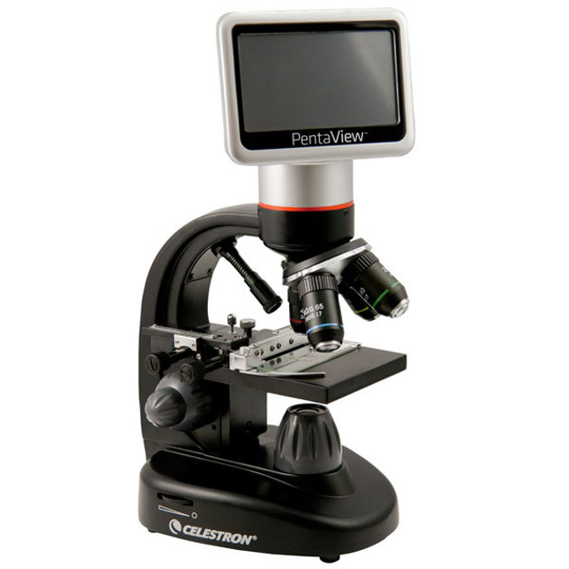

It's not enough to identify the target system; it needs a meaningful name to ensure quick comprehension. If I named the target system Murka, it suggests something large and alive (unlikely a cockroach), and it's a female (cat or human—it doesn't matter, but it's probably not a male). I might suspect it's a name for an instance, not the system type. But if I named the system \#78F3, I'd have to explain—whether I named a type or instance, and what it is: animal, electronic gadget, territory, or not a system at all but just a description, like "document \#78F3."

**A system is usually named** **according to** **the narrow** **type** **of its main** **role, performing some fundamental** **function/service**. This is how the team developing the higher-level system for this system names it. If a product manufacturer, who doesn't fully understand the affordance chosen for their product, names it, they usually give the most general name for the expected role for which the system will be purchased.

If we talk about a creator and his service (method, the creator will use to perform tasks for method instances provided by other creators), then the creator will name his subject in the most general way, as it would be named by the owner of the target system template for whom the service customer is working. The creator will also name himself based on his role as a service provider.

So whether we're talking about a creator or some target system—name it by the role of performer of the function/service by which the system changes its environment (function in the higher-level system, service for the environment), not by construction (i.e., not by reference to creation time, the name refers to use!). Sometimes indicating construction is important, but mainly as a clarification of the name by role/functionality/method/service/practice and added only as a marker of some architectural characteristics—what seems important to the potential system user (an external project role who will want to use your target system, either as part of their tool chain somewhere in the process of creating their target system, or as a subsystem in their target system). But:

-   First, the system should match its role: purpose/function, the main method of operation (initial consideration of the system as a functional object, i.e., role in the higher-level system)
-   Only then—by construction, which affects architectural characteristics (reliability, maintainability, efficiency, etc.).

In other words, a system is named as a role-played object if you use it. But if you manufacture it, then in the manufactured system, you also try to anticipate its function in the expected higher-level system, indicating its role (by type), although sometimes specifying construction to reflect architectural characteristics in the name (they depend on the construction!).

If you have a box in your car that connects various electronic devices (ignition lock, speedometer, etc.) to the internet (some cloud servers), what do you call it? By type, and you can base the type on a prototype type—some other, well-known system type that your system resembles.

In a house, a device that connects various home electronics to the internet is called a router. Great, for a car, an automotive router will connect automotive electronics to the internet! Done, the type (data packet routing device from local devices to the "big internet") is defined, and you'll save many minutes explaining what your target system is. Primary purpose: routing::method "data packets"::subject of the method, clarification—that this routing will be done in a car. The project will fail if you call this automotive router "car electronics," "internet apparatus for cars," or something else, where the function is not apparent: what exactly is involved with the internet, car, electronics—without a verb, it's unclear what it does, there's no traditional system type name to clarify the purpose, if the name is generalization like "electronics" or even "internet." If it's "router, like the one at home connecting home computers and phones to the internet but for car computers," in two minutes, you will explain what you do to both the project team and external project roles. Each conversation will save you five-ten minutes—throughout the project. Identifying and precisely naming the target system is needed for quickly and reliably coordinating collective project work.

Systems are named by primary purpose/function/service, as role-played objects not only for target systems but all others (higher-level system, systems in the environment, subsystems), i.e., naming a system as a functional object, role, "black box" of a given purpose, not as a transparent box with known construction or method of operation, and this naming ties to behavior, playing a typical role. This typical role will be the system's name. Therefore, naming the system depends on the expected environment of the system. Service providers and tools also strive to be named as a generalization of the expected role and function as a system in the higher-level system.

Thus, a microscope is intended to play the role of a tool for examining small objects: view::method micro/small objects::"subject of the method". If it is sometimes used to hammer nails, that's not considered its primary purpose, though it will occasionally be its behavior/function in the higher-level system. This rare purpose is a feature of some usage scenarios. Therefore, a microscope cannot be called a "microscope with nail-driving capability" or "hammer microscope." No, only by primary purpose. But if you use a microscope in your system specifically as a nail-driving device, call it that!

The seller's name and the buyer's name might differ: the expected system function and inclusion in the system's name as a constructive object to highlight a potential role in the client system's architecture are usually done by the seller and express an expectation of possible use. For example: "water pump." But a functional object is bought and named by actual use—"pump for filling tank of the third fire protection circuit on the fifth floor." If you buy a microscope (manufacturer's name) as a nail-driving device (name given by the consumer based on actual use!), don't be surprised by two names.

We name a class/type of systems, not a unique system instance. Often it's a role-played object, "operator of the method's object" (assembler assembles assembly objects, loader loads cargo, cutter cuts), but not only. The purpose of "scissors" (to cut something, derived from "two knives") is well known, so scissors will likely be called scissors—but adding clarifications based on the subject of the cutting method by the scissors tool (e.g., "metal scissors").

Remember that over-generalization in selecting a term for the type is a big mistake. A microscope should not be called an "optical instrument" (as a telescope is also an optical instrument, leading to confusion), and scissors should also be clarified—hairdressing, or metal scissors.
**Clarifying/specializing is good,** **generalizing is bad.** If you called a system a "fruit" instead of an "orange," don't be surprised if there's a fierce backlash, discovering it's not a peach. Because a peach is "fruit," and buyers will think that "fruit" will fulfill any role in that category. If not any—people will rightly get upset. So name it precisely, never generalize. If you bought a "beast," expecting a "tiger," don't be surprised if you get a "mouse"—it's also a beast, what you asked for, received!

The most common mistake made when naming systems is listing all possible functionalities in a long description and also adding the construction. Instead of "bus," it becomes "system for boarding, road transportation, stop notification and driver-passenger communication, passenger drop-offs, and door closing for safety, enhanced with halogen lights." This is unacceptable: any lengthy listing of functions in a name is impermissible. Sometimes, there is already a conventional name—use it—just say "bus." If it's a type, everyone will understand what such a system does.

Another equally common mistake is indicating not a role-played object, i.e., actions/function in the higher-level system (role, performing a method: system "welder" for performing the "welding" method, system "tooth-puller" if it pulls teeth—that's how it should be!), but immediately the construction. The construction usually references the time of the system's creation, "what and how we made this system." Instead of "metal scissors," it'll be "metal system with a screw," an obvious mistake. Instead of "plastic antistatic" (method to remove charge "antistatic" and subject of the method—plastic), it'll be "system for inserting carbon tubes into plastics" (from which the antistatic is made—carbon tubes, purpose of tubes omitted, mistake one, and another—talking not about the tubes themselves, but the "insertion system," i.e., instrument-system with the service "insertion" for nanotubes, meaning we're selling not an antistatic, but seemingly an instrument for inserting some unclear substance "nanotubes" into plastics—but why?!). No, the system name is given by primary/usual/typical system purpose by the role/functionality in the typical higher-level system for such a system type you are naming. And don't confuse—selling a system, service, tool for some method, what's it? The name must be precise by type!

Regarding the "postman principle" violation (primarily indicating a too-general role-play, too-general action/function), we've mentioned it many times but will repeat. "Cutting system" instead of "metal scissors" or "vehicle" instead of a "bus," "fruit" instead of an "orange." The role should be specified precisely, without over-generalization. Immediately think of another completely different system that would fit perfectly under the name you gave your target system. Hard to invent? You have a good name! Easy to invent? For your tiger, called a "beast," did you easily come up with a mouse and a zebra? Then change your system's name to tiger (or Amur tiger, not to be confused with other tigers).

You can't just say "calculations," you need to specify what exactly the calculations are for (not just "calculation," but "mid-term risk calculation" or "order completion date calculation," or strength calculation—and not just strength calculation, but specifying the subject of this method, for example, "strength calculation for the rupture of the mine conveyor belt").

The name of the target system must clearly suggest the subject area from the system level of the higher-level system, no over-generalizations to the level of "engineering in general," "IT in general," "management in general."

Programmers especially stand out for ignoring the subject area: they have everything "calculations," "services," "databases" without indicating what they do in the applied subject area (not in programming, but the area they are programming for!). No words from the subject area where these "calculations" and "services" work—something is named incorrectly, an over-generalization is obvious since a "risk management system" could work with risks of anything, but in life, it turns out deeply different: the risks in it can only be those for which it was designed, but not others. Clarify, conduct DDD^[<https://en.wikipedia.org/wiki/Domain-driven_design>], 
the word "domain" (subject area) for the applied subject area is not accidental there!

Another note is the unjustified use of the word "system" in names: "metal scissors system" should be immediately replaced with "metal scissors." Check if the word "system" is in the name of your target system—immediately eliminate it, name it with a term from the subject area that this system works with.