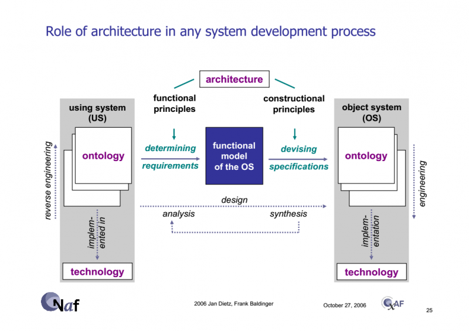

The supersystem (sometimes referred to as using system) should primarily be checked to see if the target system is, at the time of operation (operation, work, functioning), an integral physical part of this system, i.e., literally part of the composition of the supersystem. Unfortunately, most errors occur due to inattention to this feature.

Systems breakdown structure is a hierarchy in terms of composition/assembly/part-whole relationships, not any other kinds of relationships. An error in identifying the supersystem and target system is indicated by the detection of subprogram call relationships, classification and specialization, property belonging, role assignment, creation, and many other relationships besides the prescribed composition relationship for system breakdown structures (composition, is\_part\_of, inclusion as a physical part).

For example, consider a man and a woman. What is their supersystem? Yes, they somehow interact, they have some functionality within a supersystem. What kind? In student audiences, this puzzle is solved in about five minutes, while in older audiences it takes fifteen seconds: the supersystem here is the family (students often say "couple," emphasizing the possibility of a weaker bond), and the woman and man are within each other's operational/working environment, which is "in the family."

The puzzles of identifying the supersystem are usually solved by identifying a missing, unnamed, or unrecognized system in the systems breakdown — and this identified system needs to be given a name (often a name for such a system already exists, like "family," but it just isn't immediately obvious).

If people somehow think about the target system, then the supersystems for it (and there can be several!) are usually poorly distinguishable, and sometimes there are no established names for them. These "missing" systems have to be identified (i.e., describing their roles, functions, boundaries to their environment, taking another step "outside" the target system) and somehow named. How to name them? Just like any other system, i.e., mainly (if there is no clearly established historical name) by the role of this supersystem in its own supersystem and the function/method/service it performs, i.e., by the role in the super-super-system in relation to the target and the function/method/service with its service items in the super-super-system. We just consider the roles from the boundary of any system upwards through the systemic levels, and the roles of subsystems — later.

A sign that some part of the target system actually belongs not to the target system itself, but to the supersystem (and the project team usually has to deal with both these systems) is that the team is not authorized to unilaterally change the supersystem or even its descriptions/models (concept of use, system concept, architecture of the supersystem). However, the team can change the target system and its descriptions, fully authorized to do so!

Again and again, we see that the line between different kinds of systems lies not in their properties as physical objects but in some human agreements: systems of systems (SoS, defined by the different ownership of autonomous systems in the system of systems), services (ownership of systems by creation: performing some method's operations on someone else’s method object), and in this case — the authority to change the construction of the target system and the supersystem, also ownership relationships. Even if we have a service that paints something, we are authorized to change the paint layer, but unlikely to change the system being painted and the systems that then look at the paint (if it is artistic painting) or impact the paint (if it is protective paint from some aggressive chemical environment).

And it should be noted that the situation is not as rigid as it was just a decade ago. It was not supposed that the team could somehow influence the supersystem — they took it as given in the project and had to just interface their target system with the existing system environment. Today it is different: the project team is not authorized to directly change the system environment by their own decision. But the project team can influence the supersystem to be changed — independently by its owners, or by the project team in agreement with the supersystem owners, to match the characteristics of the target and the supersystem. For this, the project team (internal project roles) actively works with external project roles/stakeholders, influencing them, and this process is long since "everything is continuous," the system evolves over a long period, not "manufactured and forgotten." It's about multi-year joint evolution of the target system and its supersystem, with many versions of the target system and supersystem changing. After all, the target system is just a subsystem of the supersystem as a system; they must be engineered to be coordinated, and sometimes it is easier to change something in the supersystem than in the target system.

When identifying the supersystem, remember that in foreign texts the supersystem is sometimes called the “using system.”

This is because the engineer uses the target system as part of the supersystem. This use refers to the moment of creation, not the moment of operation. Although it is often said about the operation/functioning of the system, it refers to the environment that "uses," "engages," "operates" the system. But "often" is not always. So, if you mistakenly say that "a woman uses a man," further linguistic reasoning may lead you to the erroneous conclusion that the woman is the using system. And equate it with the supersystem. That means the man is part of the woman (all the molecules of the man are part of the woman’s molecules), which is absurd. So be careful with the meanings of the word "use," there are two:

- Use of the target system by the engineer of this supersystem as part of the supersystem design in design-time. The clock is used in the interior of the apartment, but there is no "use case" here.
- Use by someone or something in the environment in run-time/operations (it is necessary to figure out what this "use" generally is). The clock is used by the resident of the apartment to check the time (this is about a use case).

When defining the supersystem, it is crucial that this is the nearest systems level (postman principle, the address must be precise — you can't refer to a too general object). The level of the supersystem should be the one where emergent/system effects from the operation of the target system are expected. "I am making a flower that will improve the whole world" — this is a wet dream, professional incompetence. You need to find the supersystem where the flower will change the state, give some property that would be different if there was no flower. The world as a whole is unlikely to change, but if it’s a "date" situation (you can consider it as an "event," as a supersystem for the flower), the flower may improve the mood of the participants. Therefore, if you make flowers to be used for dates, say so. If for funerals, these will perhaps be paper flowers. Or a bouquet with an even number of flowers. Don’t mistake the supersystem, it’s important!

A reliable way to identify the supersystem is to figure out which agents (first of all, of course, people) you have to talk to (remembering that we talk to roles, not the performers of roles!) to make the project happen. They are usually the owners of the supersystem. Let's say you are creating a "system for transporting airplanes," used during airplane repairs. The target system is the repaired airplane that is flying again, carrying cargo and passengers (they will be in its supersystem during operation). What is the supersystem for your "system for transporting airplanes"? The aviation of the country, the Ministry of Industry? No, the postman principle says that while this is true, it is a useless truth. You could equally say "humanity" as the supersystem, or even "the entire universe"! In this case, it is fairly easy to find that mainly people from the operational service of one of the aviation enterprises are interested in the "system for transporting airplanes."

"Operational service of the aviation enterprise"::organization (not even the entire aviation enterprise!) is the supersystem for the airplane transportation system, and there the target system will be the airplane that needs to be transported among other things. The airplane transportation system here is one of the creators for the airplane, a tool for the operational service, used for performing transportation services. The team of the aircraft operational service (external project roles in relation to the airplane transportation system) has needs — they need to repair airplanes that do not fly. Therefore, they have some concept of using the ground airplane transportation system (obviously non-flying). That's it, from this moment (airplane transportation system as part of the operational service of the aviation enterprise = system as part of the supersystem) the project for creating the airplane transportation system can be discussed. Identifying the owners of the supersystem is usually highly productive: you still need to communicate with these owners, they are the most important external roles in your project.

Another mistake is when the supersystem and the target system are named the same (we have already talked about this mistake, but it is repeated over and over again, so let's repeat it once more, in different words). Divisions like "A consists of A and B" are inadmissible, it can only be "A consists of B and C" — and most likely this mistake is not because the division itself is incorrect in life, but simply because the names chosen for the systems in it are wrong. For example, "the cell consists of the cell and the gasket." Detailed discussion shows that it’s about a cell consisting of the body and the gasket. "The living room consists of a room and an interior." Detailed discussion shows that the living room consists of a space (construction part, box without finishing) and an interior (including even wallpaper glued to the walls of the room).

And systematic thinking is that you must understand the structure of the supersystem to understand the role of the target system in it. In the picture in this subsection, taken from the works of Jan Dietz, this is indicated as reverse engineering for the using system (and ontology — these are various descriptions of the supersystem obtained through reverse engineering, identifying the supersystem structure). You will get the target system by straight engineering (but they don’t usually say "straight engineering," they just say "engineering"): you will identify descriptions of the target system in terms of its use in the supersystem (concept of use) and develop (system concept) for the target system to perform the expected function in the supersystem.

How to produce these descriptions (methods for developing the concept of use and system concept) is dealt with in detail within the systems engineering course. In our systems thinking course, we only indicate that **you must understand the role of the target system in the supersystem and the function/method/service performed by this role; to do this you must identify the supersystem and understand its structure and why the target system is needed within this structure.**

If you don't first deal with the supersystem, don't deal with the higher systemic level, and only after that go to the subsystems, you don't have systems thinking. **The project attention shift from the target system to the supersystem and dealing with the nearby system environment first, and with parts of the target system later — this is the main point in systems thinking.**