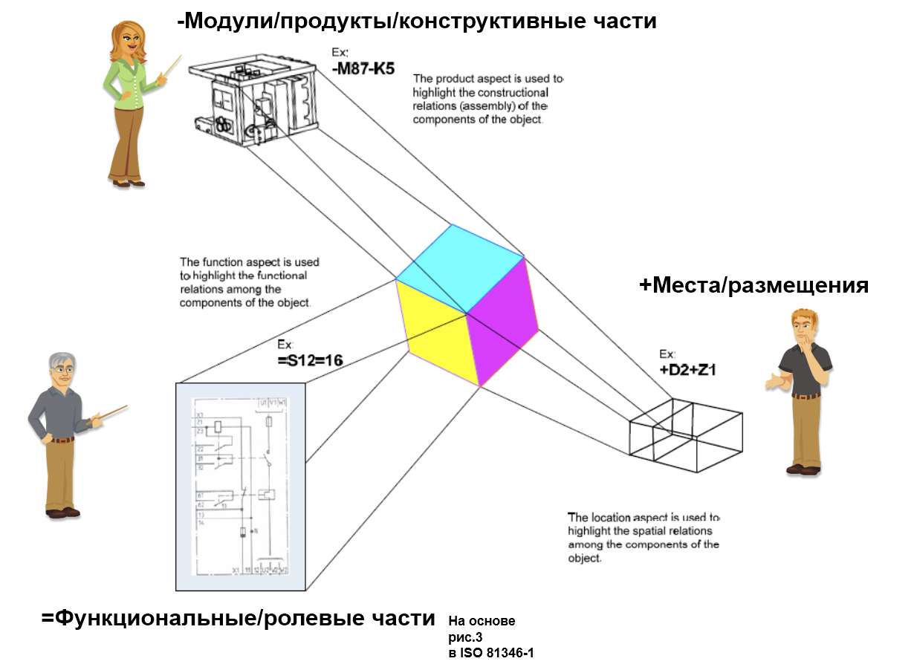

Systems thinking provides multiple system descriptions, similar to the general philosophical/ontological idea of multiple descriptions of a situation by different agents pursuing different goals. However, **systems thinking specifies which descriptions must be made**, which ones should be primary, even though it acknowledges that more types of descriptions are necessary beyond the primary ones.

Today, systems thinking identifies **four main types** of **descriptions reflecting four main methods of dividing the system into parts. For each set of parts obtained through different methods of partitioning the system**, **different descriptions/views are made — modern systems thinking mandates four such types of descriptions, with a fifth one trending. For each type of parts, of course, many different descriptions are made**:

1.  **Functional:** Based on parts obtained through functional decomposition (dividing into functional parts/roles by part-whole relationships, often referred to as systems breakdown, emphasizing the importance of the system's function influencing its external objects, especially for intellectual agent-creators — this influence is the impact of method/service work on external objects). Functional descriptions are made for the system's operation/exploitation/operation time (description "how it works," usage time).
2.  **Constructive,** also called structural, product-based, or material. These descriptions are made for parts identified as constructive/material objects through structural/modular/product decomposition (sometimes referred to as synthesis/assembly from parts instead of decomposition/breakdown). Constructive descriptions are made for the system's creation time, describing "from what and how it is assembled."
3.  **Spatial/placement:** For locations in space (usually space, but it's better to consider space-time), where parts of the system are located. Such descriptions allow agreement on the discussed object: in 4D extensionalism, descriptions relating to the same place in space-time pertain to the same object.
4.  **Cost-based:** Addressing expenses on money and other resources (total cost of ownership [https://en.wikipedia.org/wiki/Total_cost_of_ownership]). This reflects systems thinking's second generation, involving not just the target system but also the creation graph, considering costs during creation and operation.
5.  **Work-based:** Only a trend, not yet standardized, but significant. It involves describing the work of creators, leading to a work breakdown structure. These include project management aspects, focusing on the system creators' work.

These are just the main descriptions, with many more in actual projects. The work description is still a "candidate," and descriptions of work methods are also not standardized yet, but may appear — and we will discuss them in the "Methodology" course, including standards like OMG Essence.

Main and other types of system descriptions rarely occur in pure form, often being hybrids. They should align and be consistent, which is why hybrid descriptions are practical.

The four main (mandatory) types of system descriptions have become predominant in systems approaches over the past thirty years. The cost-based partition became mandatory recently, recognized in engineering projects over the last decade. The fifth (work-based) partition is still under discussion, while creator work methods are described but not yet standardized.

Different types of main descriptions rely on system part descriptions obtained through various decompositions. Misconception is considering systems descriptions as descriptions of partitions, meaning trees of functional, constructive, spatial, and cost-based objects by part-whole relationships.

Partition descriptions (trees) are not the only systems descriptions! Systems descriptions depend on partitions, taking details from respective partitions. For instance, functional system decomposition can be discussed along with functional modeling as 1D modeling results, where functional parameters are determined along flow lines (e.g., electrical, hydraulic circuits, heat transfer pipes, logistics chains).

1D modelers often called "physical modelers," can calculate currents and voltages in electrical circuits, pressures, and flow rates in hydraulic systems. They represent systems more complexly than just partitioning.

Let's delve into breakdowns. These breakdowns exist in reality, but we can also talk about their descriptions. The difference between a real-world partition and the description is often blurred, particularly in conversations about methods and ontologies, requiring context to distinguish, and it's always wise to clarify if unsure.

Here's a modified diagram from the IEC 81346-1:2022 standard, illustrating the first three main types of descriptions based on three main partition types (though it doesn't include cost-based descriptions, imagine a financial calculation like "total cost of ownership"):

The figure depicts three project roles with different system descriptions, represented by little figures. Remember, roles are just roles: they could be played by one person or groups with tools and equipment. The figure shows three people playing three roles, though the IEC 81346-1:2022 standard includes five aspects, plus "type" for arbitrary groupings and "other" for logistics, cost division, administrative subordination.

Each project role sees the system divided into specific interacting parts, represented by colors. **Systems thinking minimally requires attention to** **four main** **types/kinds of parts, and system descriptions are constructed on these parts**:

1.  **Functional/role parts** (functional elements, but we translate elements as "parts" since elements imply indivisibility, which we always consider; role elements^[Components sometimes refer to functional parts, sometimes constructive (e.g., separately purchased products per IEC 81346-1:2022)**). Discussing their interaction answers how the system works to fulfill its function/role in its supersystem, always involving exploitation/work/operation/service time discussions. An electrical schematic illustrating functional/role parts and their **connections** is shown. These parts perform their function by interacting with others, changing states during system operation.
2.  **Constructive/products/modules/material parts** (modules, products, components as order units, assembly units, logistics units, constructs) — this part type answers how to assemble and interface through **interfaces** (interface), discussing creation time. Exploitation time discussions are not allowed for these partitions.
3.  **Spatial objects, locations** (locations) or **placements** (allocations), answering where system parts can be found in space at a given moment, defining system composition. Location/placement is important for runtime-role and physical object merging: if both are in the same place simultaneously, they are the same object. The figure shows compartments for system installation and operation, but it doesn’t explain assembly parts or functioning.
4.  **Cost-based parts** (costs) address the costs associated with the system over its entire lifecycle, including materials, creation work, operation, maintenance, modernization, and decommissioning, considering system development over multiple versions.

The fifth partition — work breakdown structure, is still not fully entrenched in engineering, only a "candidate for essential partitions." Each target system has a creator performing work (during continuous deployment of various versions, conceptualizing, designing, creating with technology considerations, justifying success, mounting new parts, operating them). These works need planning, execution, and distribution among contractors. **So, partitioning work for system creation and development is often considered part of compulsory system descriptions, though not included here. The fact that work description addresses the creator rather than the system isn't crucial — cost description also involves creator services, making it a continuation of the second generation of systems thinking, remembering that the system always has creators.** Besides, discussing work methods follows sensitive work breakdowns.

Work breakdown partitioning isn't predetermined but explored further in courses "Methodology," "Systems Engineering," and "Systems Management." Work breakdown describes the creator rather than the target system, even as it relates to creating system parts.

Recent cost-based parts cover materials and creator work costs, including operational and maintenance expenses. Even so, they represent system parts as per different role interests, shown by colored cube facets: each role discussing an aspect through convenient descriptions:

-   For "how it works," typically schematic/functional diagrams show functional/role parts and their **connections** (though physical system descriptions via differential equations in modeling languages are preferred now [https://ailev.livejournal.com/1549559.html]).
-   For "how to assemble," descriptions include material products/modules and their interfaces.
-   For "where to find or place/install," place descriptions are provided.
-   Cost descriptions reflect system expenses. Recently, total cost of ownership is deemed necessary, though not yet standardized.
-   For work breakdown structures not depicted yet. Descriptions of work methods aren't discussed yet but are common.
-   ... and many more interested in various partitions exist, showing only minimal descriptions, often hybridized!

**System levels are defined by primary functional partitioning in systems thinking!** **Which is why functional partitioning is often referred to as systems breakdown structure.** The other partitions are simply breakdowns.

Terminology of "s                                                                    ystem breakdown" (functional only) isn't always respected. A system is usually both a functional part of a supersystem and a constructive part, occupying a specific space in the supersystem, requiring costs and maintenance. In engineering, systems breakdown often denotes functional partition, not constructive, spatial, or cost-based.

We emphasize the point that a system is part of a supersystem, not dividing it into subsystems. **The key systems thinking approach moves from the system as a part to the supersystem as a whole.** This recursive thinking applies to any system level, including subsystems and supersystems.

**When talking about system parts, it's essential to specify which partition: main (functional, constructive, spatial, cost-based) or others (creation work, manufacturing sequence, assembly sequence, eco-friendliness, etc.).** **If descriptions include several part types (hybrid descriptions, common), ensure understanding of described and missing partitions.**