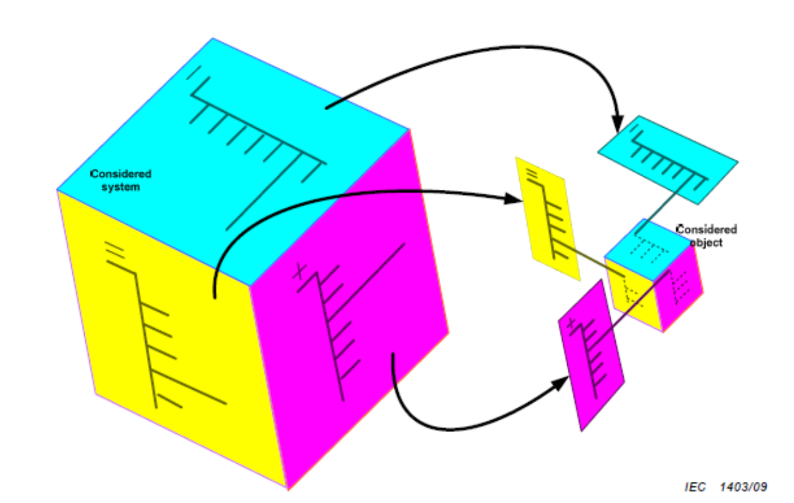
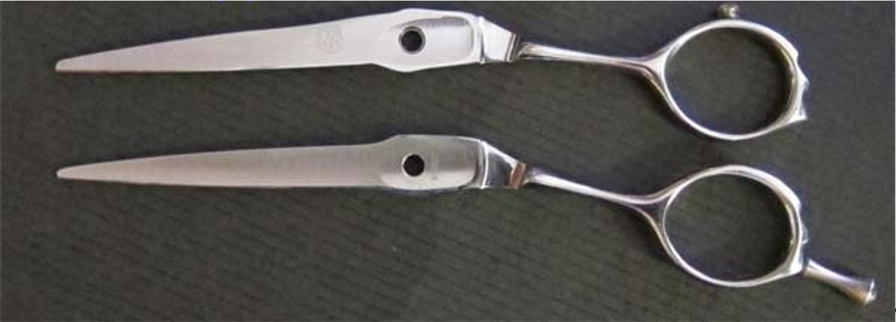
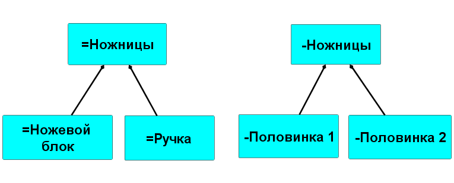

Partitioning a system by different types of parts, which will be the subjects of methods for different design roles, also ends up being different because "the system is in the eye of the beholder," or rather, in the eyes of one not just watching, but working according to the method. Each partitioning with its way of highlighting objects from the world for attention is convenient for discussing some subjects of interest in the role's work by its method, but inconvenient for discussing others.

In working projects, system boundaries are usually chosen so that the functional/role part, product/structural part, and placement occupy the same place in space-time, as shown in the picture as a whole cube. But if you simultaneously start dealing with how such a system works (its roles, functional parts, and their functions), what to make it from (structures/modules, product/structural parts), how it is composed (places/placements), and what the costs are (cost parts), you will find that sometimes the functional parts, product parts, and places in it fully coincide (and they will be called "subsystems" — since subsystems are systems too), but sometimes there will be no such coincidence — and this is intentional, it's normal!

For example, TRIZ (theory of inventive problem solving) enhances the ideality of the systems invented in it by performing several different functions (remember: a function is the behavior of a functional/role part of a system during the operation of its supersystem, that is, the function of a system is the function of the system in the supersystem, the function of a subsystem is the function of the subsystem in the system) with fewer constructs — in an ideal system, all functions are performed by zero constructs (there is no construction at all, but the role functions are performed!). TRIZ directly calls such a situation important, using it as a basis for inventiveness. It's immediately clear that one construct can perform multiple functions as affordances, thus participating in the realization of various roles from the functional partition: "— What is the use of this picture on the wall? — This picture on the wall has great use. It covers a hole in the wallpaper."^[E. Uspensky, "Uncle Fyodor, Dog and Cat," <https://youtu.be/qPeUokgTRik>].

Utility/purpose/function/method (all behaviors leading to results — the transformation of some method objects into some target states) can be performed by various "constructs-in-roles" — you can nail both with a hammer and a stone. But both the hammer and the stone can perform the role of both a "nailer" and a paperweight, even in the same project. For instance, a carpenter nails a nail with a hammer-nailer and then places this same hammer, but already as a hammer-paperweight, on a paper sketch of the construction being assembled so that the sketch is not blown away by the wind. Two functions, one hammer — although these roles are performed at different times. But the case of performing different roles by one construct at one moment in time is also quite common.

It is impossible to guarantee that the system/functional partition, as well as the product/structural partition and spatial partitioning, coincide. In nine cases out of ten, they may coincide, but you will have huge problems in the project with the remaining one case out of ten if you don't take it into account!

**Do not confuse** **roles/"functional parts"** **with** **constructs/products**. Do not confuse the role of Prince Hamlet and the construct of Vasily Pupkin, even if during the performance they are one and the same, coinciding 1:1. If you talk to Vasily Pupkin backstage, calling him "Your Highness," and on stage, address Prince Hamlet with "how are your wife and kids?", people around will look at you strangely, and Vasily Pupkin will be very puzzled in both cases.

We have already considered a teapot, which has only two products/parts/constructs (body and lid) and quite a few functional parts (capacity, spout, filling hole in the capacity, handle of the capacity, lid, handle of the lid, steam vent hole).

It seems that it is difficult to confuse functional and structural parts in a teapot? Alas, it’s easy! For example, you have received a list of functional parts and want to manufacture them all. You might ask one factory to make the handle of the lid and another factory to make the lid if you haven't figured it out. Look at the picture of the teapot — it’s absurd, right? But if you have never seen a teapot and are working with project object lists (unspecified which) and planning deliveries — you will definitely have this sort of mistake.

Let's consider the example of scissors and what happens if people confuse functional parts (operating time roles, working with the environment according to their purpose/function/method) with structural/product/modular parts (creation time, worked over by creation systems for their design and manufacturing).

For scissors, engineers come up with different shapes for the handle and blade block, thinking of the handle and blade block as functional parts. They discuss the handles and blade block as physically existing (the handle is held, its length and diameters of the finger holes and smoothness, as well as the sizes of the finger rest on hairdressing scissors are designed^[<https://mustang-professional.ru/parikmaherskie-nozhnitsyi-s-uporom-zachem-nuzhen-upor>], the blade block cuts — its length, strength, and sharpness, the opening angle are designed). If procurement managers perceive the scissors as consisting of such functional parts as products/modules, they will try to order the manufacture of handles and the blade block separately: handles from a company knowledgeable in ergonomics, and the cutting block from a factory that knows how to make knives (the term "scissors" actually derives from the word "knife"). Engineers will be shocked, as they start thinking about scissors for manufacturing and assembly purposes as consisting of modules/working products: two solid pieces of metal of special shape, connected by a screw. One can only order constructs/products/items/materials, while the handle and blade block of scissors are just role/functional elements — their role is not played if there are no constructs/products/modules assigned to these roles! Constructs in scissors will be only two halves of the scissors (and also the screw). If the handles and blade block are made separately as constructs and then somehow connected, it will be a poor and unreliable engineering solution. Here are the scissors at the moment of "how to make" (the result of modular synthesis: constructs that will perform the functions of the blade block and handles):

Managers in situations of mismatch between functional and structural parts initially heed the engineers' arguments, but then... they look at the assembled scissors, see them in action (operation time) the handle and blade block — and again try to do something separately with them not at the moment of "play/performance/work" (when the scissors are assembled and used — the blade block cuts, and they are held by the handle at that moment), but at the manufacturing moment — the manager does not care about usage time, he considers himself responsible for manufacturing! That's why managers need to keep attention not only on the creators but also on the target system at the moment of its use!

Most often, the manager tries to separate the work of assembling the handle and blade block, although when connecting the scissor halves with a screw, it is fundamentally impossible to separate the work of the handle and blade block. The intermediate mistake here is that the manager's attention (usually an operations manager) is only on "resources and work," not on work methods. Yet work is needed only to implement some work method, and the work method should bring some objects to the desired states. Engineers think this through; managers do not, hence the mistakes, and the image of the manager as a complete idiot in the engineer's eyes.

Or the manager might create a catalog of handles and a catalog of blade blocks and then try to force the engineers to release these supposedly "scissor parts" as spare parts. The list of errors and misconceptions here is endless, and these mistakes will not stop: managers constantly find role "blade block" and "handles" in the engineering documentation and try to handle them as assembly/structural units.

The truth is, in scissors, different design roles observe two different partitionings: one — functional decomposition ("analytical"), and the other — structural/modular synthesis/assembly ("synthetic"):

Note the prefixes before the same names. They denote different types per IEC 81346-1: 2022: "=scissors" is a type of functional object, and "-scissors" is a structural object. If the names coincide, it is impossible to tell from the name alone whether we are talking about functional or structural scissors, discussing usage time or manufacturing time: it is required to either indicate the prefix or infer from the context, and if the context is insufficient, always ask for clarification.

The target system is unified as a functional part, and it is also structural (completely coincides), but further "functional structure"/"system partitioning" and "modular structure"/"product decomposition"/ "structural partitioning" can vary significantly.

In engineering modeling languages, the concept of the "iron" system as a description of the embodiment of role/functional parts by structural parts (formerly called "architecture" before architecture had its own subject of work on optimizing the coherence of constructs/modules to obtain acceptable architectural characteristics of the system) as well as in enterprise modeling languages, functional and structural parts have different symbols, representing different types of these objects. If you do not understand the difference between objects of different types, using modeling languages becomes incorrect and harmful rather than beneficial. Many managerial errors come from attempts to make managerial (logistical, disconnected from functionality) decisions about functional parts when, in fact, their authority is limited to decisions about structural parts (they plan creators' resources for creating and developing structural parts).

If in classic project management you make up-front (that is, predetermined when all manufacturing details are already known) schedules of the embodiment/implementation/manufacturing of constructs/modules (say, finalizing the descriptions of modules-containers in software engineering) and the implementation of functional parts (in programming, for example, they may be called "features") — they will be absolutely different, but both can make sense! **The main thing is** **that these are the creators' decisions** **on which** **construct parts** **realize** **what required functions/work methods for the system's operation, thereby starting to play some roles (i.e., embodying functional objects). Usually, this requires describing** **both functions (behavior),** **and functional parts (role parts that perform the behavior/function), and** **structural parts/modules/products/items, and where all this is located** **(composition), and cost parts (how the total cost of ownership is distributed, and at the same time the cost of creation).**

In complex cases, both functions (behavior) and functional parts (role objects that behave in some way) are modeled separately. In simpler cases, either functions/behavior or functional/role parts are sufficient — but never only structural parts/products/modules, because the subject of interest "how it works" should always be discussed, it cannot be skipped. **"How it works,"** **functionality** **(what benefit the system brings to the supersystem, what service the system provides to the systems in the environment)** **as** **an area of interest** **is the main area/zone of interest** **in** **modern** **systems thinking, the main subject of interest, the most important characteristic of the system!**

The importance of functional partitioning is emphasized in the most modern studies, where systems thinking is used to explain phenomena such as evolution and life. The functional aspect is introduced through the concept of affordance^[<https://en.wikipedia.org/wiki/Affordance>, see also <https://arxiv.org/abs/2110.14602>, <https://www.activeinference.org/>], implying the unity of the agent and the construct object used by it for its purposes (performing some function) suitable for performing the required function from among many objects of its environment. The agent understands what function an external construct object can perform, and the word affordance emphasizes the "subjectivity" of functionality; its assignment depends on the agent, who imparts some desired function to a functionally neutral physical/construct object of the environment in the target system, thus making an **invention**, that is, guessing which constructs can perform the required function — this is "to invent," to select a construct for a known function, modular synthesis — this is "invention."