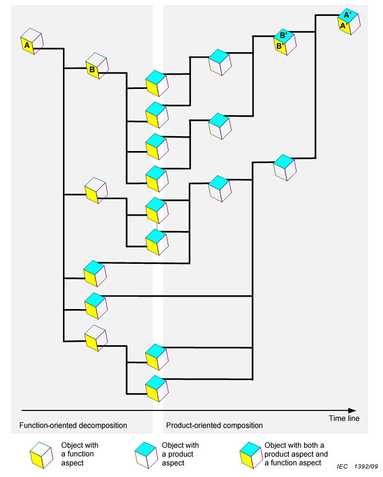

```markdown
---
title: 'Development of the system concept: functional analysis and modular synthesis'
---

**The main solutions for the system's structure are called the system concept.
Typically, the system concept becomes detailed until the precision of the system's description
is sufficient for its manufacturing on a production platform.** Remember, the system concept is "alive," changing as the system evolves with the release of new versions,
which means in the modern world, the system is not simply created and operated in an unchanged state, but is continually modified even after the start of its operation. This is reflected in the transition from the "system lifecycle, from birth to death" to "system creation and development" (creating an MVP system and subsequently releasing multiple versions with new features/capabilities/services that provide new features). In any case, the system concept is initially developed for the release of the MVP (minimal viable product, i.e., a version of the system capable of delivering some utility upon operation) and is then continually refined.

**The core content of the system concept involves describing
the integration of functional ("how it works") and structural ("what it's made of")
breakdowns, considering spatial layout and the resulting cumulative ownership cost.**
But this is only the main content. Further, it should be noted that the work breakdown description is also likely to be included in the primary content of the system concept. In addition, not only are the tasks described, but also the work methods – this extends beyond just the concept of the system to the concept of the system including its creators. Therefore, the system concept in one way or another begins to touch upon the creators, increasingly acquiring traits of the system creation concept during its operation timeline (i.e., describing the system's creators, not the system itself), rather than just the system concept (description of the system during operation, but touching upon some connections with creation – primarily the choice of affordances, "invention"). However, this division between a system concept and the system creation concept does not yet exist in modern engineering.

The boundaries of what is included in the system concept are very vague (more details on how to create a system concept will be covered in the "Systems Engineering" course), but the consensus is that the primary aspect of this concept is showing the integration of

-   functional breakdown considering its passage through the constraints on the line of required functionality (thus, besides breakdowns, functional descriptions are usually included – some engineering calculations of characteristics, 1D modeling)
-   structural breakdown considering its passage through affordance availability constraints (therefore, this often involves investigating the availability of made-to-order structures/components/modules, manufacturing possibilities of structural elements, and characteristics of structures),
-   layout considering spatial constraints,
-   cost breakdown considering expense constraints.

In domestic literature, the concepts of use and system concept are often combined under the name **technical and economic project** (and if the system is, for example, a nuclear power plant unit, the name may be different – OBIN, investment justification, or preliminary project). Engineers still debate whether it's a technical project without an economic part or a technical and economic project. But the obligatory cost description among the main systems descriptions indicates it is necessarily a technical and economic project; a purely technical project does not make sense.

After the technical and economic project becomes detailed, they move on to actually creating more detailed projects – first a **draft** (and sometimes even the draft project is mistaken for a less detailed system concept), then a **working project** (with precision sufficient for manufacturing). In Russian, all of this is called project/design, leading to frequent confusion with project/project. Therefore, the phrase "system creation project" is ambiguous in Russian: either it means project/project::work to create the system, or it means project/design::system description. How to distinguish between them? As always, pay attention to the type of concept denoted by the term "project" and clarify the type from the context or directly re-ask. If you are speaking or writing, try to avoid mistakes due to this inherent ambiguity. "Birdhouse project based on the birdhouse project" – we hear this often; don't forget to specify the type for each "project," they are different types! Also, remember that the word "project" often implies a third meaning – project organization.

But back to the system concept. It starts with agreeing on descriptions of the four (and often more) main aspects of the system, described through parts of the system that we find in the main breakdowns. Therefore, first we need to understand how this integration of breakdowns progresses, focusing initially only on two of them – functional/role and structural/product/module.

In literature, for different breakdowns, the term **"structure"** is often used, but we need to remember that this is not just any "structure" as some graph of objects and relationships, but specifically a hierarchy based on a type of part-whole relationship as the basis of a breakdown. Thus, "structure" becomes a hierarchy based on the part-whole relationship (is\_part\_of, composition, assembly) of functional, structural, spatial, cost objects, and similar (not only the main types of system parts are used in projects, systems are represented not only in their main aspects but in many others!). All other relationships (specializations, classifications, temporal precedence, mutual influence, etc.) in this "structure" of breakdowns are not considered.

If the hierarchy is shown as a breakdown, then the structure of the decomposed object-system is precisely the structure of parts and wholes! And these different types of parts-wholes show not objects of physical disassembly-assembly but merely indicate the focus on different types of parts in the physical system. With one exception: structural/product parts included in the system's composition (affordances/"fitting") are not only focused on during their interaction during operation, where they embody some functional parts, but also indicate actual physical disassembly-assembly, as they are considered during creation, where there is also disassembly-assembly during manufacturing/implementation of the system.

Here is a drawing from the IEC 81346-1:2022 standard (which took this drawing from the earlier IEC 1392/09 standard):





This is the **basic scheme of work** **for creating the system concept** **(and it is also** **the basic scheme of inventing).** **Here, neither layout nor cost is considered, but in actual work, they are inevitably present, along with various other specific breakdowns for one project or another. Still, the main point here is** **the transition from functional decomposition to** **modular/product composition, from analysis to synthesis.**
**The fact that this is a "transition" and that there is a "before" and "after" is set by the time line.**

Let's look at the target system, which initially we view as a functional object A (subsystem::role A in the supersystem for A).
The first step in considering the future system is functional decomposition: functional parts are broken down into smaller ones (in the drawing these are B and four other unnamed ones), and an attempt is made to match them with structural/material objects as affordances that can perform the functions of these functional parts during the final system's operation. This selection (an educated guess as to which of the millions of material/structural objects could perform the required role, and it may be necessary to manufacture such an object, meaning it may be needed to specially create it with the necessary properties) is precisely **modular synthesis**, and if the task seems non-trivial (meaning it is not a task but a problem: unclear what to do if an affordance is not immediately found), this is referred to as **inventing**.

The typical behavior of a hammer is "to hit the object, delivering the energy of the head to this object." This expected behavior is perfectly suitable for the "hammering" function with the functional object "nails" (synonym: method with its method object, but the terminology "method of work" is generally applied to animate objects or robots, while for simple agents like a hammer, functions are more often discussed).

Inventing here means seeing that not only a hammer but also a microscope can deliver the expected "to hammer" function.
Both the hammer and the microscope have the expected behavior "to hit the object, delivering the energy of the solid mass to this object."
Even a "stone" can be used to fulfill the role of a "hammer" for nails, suggesting a stone for hammering nails is also an invention.
In the absence of a hammer, the inventor may choose the stone as an affordance since there is no hammer, the microscope might be large and inconvenient, but a stone is easy to pick by size and shape – considerations here can be varied, and not merely the lower cost of a stone.

This is a crucial point: for an invention to be possible, known affordances for the required function must exist at the current level of civilization.
If invention is impossible, the system will not exist. A good example is the invention of the computational machine.
The function was understandable to Charles Babbage and Ada Lovelace in the early 19th century, but the affordances for the required logical operations were unreliable: mechanics failed (Babbage tried this), pneumatics did not work, electrical relays failed, hydraulics also did not work! In the end, electronics worked after invention: it was proposed to use logical gates on radio tube triodes for building the universal computer, used initially not as amplifiers (their initial use), but in the key mode.
These tubes were available and relatively cheap but were only invented in 1906, while the invention of the computer on the basis of radio tubes occurred in 1945, with the computer being non-functional for about half of the time due to unreliable radio tubes; super-reliable radio tubes emerged only in 1948.
This history is discussed in detail in the "Systems Management" course and is relevant to strategizing: you should not rely on the invention during a project. Rather, you can start a new system project if you make the invention!
If you do not understand the system concept, even in general terms, or do not understand the available affordances, do not start the project! You might be a genius inventor, but you might also be trying to invent an aircraft heavier than air before light internal combustion engines were available (no wonder the Wright brothers, airplane inventors, owned a motorcycle workshop). The system concept indicates that the invention is done and detailed design can begin.

The IEC 81346 diagram shows that in the first step of decomposition, matching constructive/products/modules with suitable expected functions for implementation/realization of subsystems succeeds only for two of the five subsystems (shown in the left part as first-level subsystems with yellow and blue faces simultaneously: yellow face–function aspect described, that is, the function they perform in the supersystem with the name A is clear, and blue face–it is clear from what constructs the subsystems will be made from as shown in the right part of the diagram). In the next decomposition step for subsystems, this succeeds for all subsystems, including subsystems of subsystem B. This part of functional decomposition, when we attempt to break the system into functional parts not just into any subsystems, but such that they can later be implemented by some affordances, is sometimes called **functional analysis.** Analysis (assuming separation into parts, decomposition) is normal if you do not forget its subordination to synthesis (assembly from parts). Analysis is bad only if it is isolated, not subordinated to synthesis goals. The IEC 81346 diagram exactly shows how functional analysis/decomposition supports structural/modular synthesis/assembly from affordances - it is challenging to propose such a one-level set of constructs that realize system A's functionality, much easier to first break functionality into separate subsystems, and then merge constructs into a system in several stages, through assembly units in their hierarchy, rather than one-level.

After (remember the logical timeline arrow on the diagram) functional decomposition, we must synthesize the target system-construct from all constructs, i.e., the final product/item, which will perform the initially stated function during system usage/operation/working.

For the construct/module/node B' in the diagram, implementing the functional part B, it happens only in two steps - first two intermediate constructs are gathered, and only then they are merged. In the next step, the construct/module/node B' is included as part of the construct A' that implements the initially conceived system A (when we say "system" here, we mean its main aspect: functional).

This part of creating the system concept, that is, compiling the system in its constructive aspect (construct/module/product/item/node) from its smaller constructive parts, is called **modular synthesis**. Sometimes the method of modular synthesis (product synthesis from constructs) is presented as a method of "unit disassembly," that is, breakdown into units, but no – logically "disassembled," meaning decomposed, are exactly functional parts (subsystems), while for constructive parts, it is logically the assembly into the final construct, so movement through the diagram goes from the whole system-role to the midpoint as a set of subsystems implementing small functions, then these subsystems are implemented by small modules/nodes, which are then combined into the final system-construct (product/item). So, it is about summation of units, although this term is never used. Why "disassembly of units," not "synthesis of units?" The described method of creating a system concept was realized by engineers not long ago, while the current production terminology emerged much earlier. Engineers thought they were "disassembling in mind" an already made construct, but no – it is units that are assembled as "assembly units."

The system concept is sometimes obvious, no need to invent – you just know what has been done before. The need to use electronics for a computational machine is clear today. But of course, sometimes inventing is necessary (most often, as stated, not during a project, but prior to its inception – inventions form the basis of engineering projects, and are not the result of project work).

In
TRIZ^[[https://en.wikipedia.org/wiki/Theory_of_Inventive_Problem_Solving](https://en.wikipedia.org/wiki/Theory_of_Inventive_Problem_Solving)]
as the theory of inventiveness, it is crucial that a small number of constructs perform many functions (i.e., the degree of system ideality increases: an ideal system is one whose functions are performed without material embodiment, with no constructs/affordances in the system at all, nothing needs to be manufactured). Thus, in TRIZ, the ratio between functional and constructive elements is never 1:1 (as in our teapot and scissors examples). **It is desirable to learn to load many functions onto a single** **construct/module/product/item, reducing their** **number in the system.**

This is best achieved with computers and robots – hence the general trend in engineering is creating universal modules, easily reprogrammed for new functions. In biological evolution, nature arrived at more or less universal and complexly arranged cells, whose various functions (liver cells, brain cells, lung cells) are achieved by minor reprogramming. In techno-evolution, look at the smartphone, computer, and rapidly developing ideas of universal creators, now often designed as (self-)programmable intelligent anthropomorphic robots.

In inventive activity, we solve a program of multi-level optimization, removing conflicts between interests that may occur at different system levels. **John** **Doyle** **and his colleagues point out that contradictions always exist (notably between speed and accuracy: there can be fast inaccurate parts and slow accurate parts), and this contradiction can be resolved using multi-scale constructions with multi-level feedback, it cannot be resolved in one level. Thus, to create a fast and accurate system, it necessarily becomes complex—** **requiring substantial inventive work, supported by mathematics, developed by them**^[<https://ailev.livejournal.com/1622346.html>]**.**

Typically, it is challenging to pick constructs from available or easily manufacturable constructs, which when assembled into a ready-to-use system-construct, realize all necessary functional parts, resulting in a system with all the required functions during operation. This necessitates breaking the logical order of creating the system concept, i.e., changing the already developed functional decomposition to a new one, easier for modular synthesis. Hence, logically one-time method of creating a system concept (first functional decomposition, then modular synthesis) becomes iterative: attempts at functional decomposition, but if modular synthesis fails based on current functional breakdown, returning to analysis – and then trying modular synthesis again, making an invention, selecting affordances based on a new functional decomposition. **Dependence on a different set of functional objects** **effectively means proposing a different device operation method, a different operating principle.** Thus, for different functions, other constructs may be more accessible.

For example, a universal computer can be implemented as a set of functional subsystems of a quantum computer or a classic logical computer. Affordances (constructs) for a well-functioning and reliable quantum computer are unknown. However, affordances for a classic computer are well-known, today they are transistors, which can be mass-produced in electronic chip-microcircuits. Thus, we first set some computer decomposition into subsystems, then check: are there cheap affordances (are they available at all today), and if not – attempt to change the functional decomposition. Or, there is hope someday to make an invention – finding affordances for the current functional decomposition, but such a gap could be a hundred years (as in the invention of computers or airplanes).

Constructs/nodes/modules/products/items need to be designed and manufactured if they cannot be bought ready-made. **Buying is the simplest way of** **manufacturing constructs!** In IEC 81346-1:2022, they even suggest calling the intended product for purchase a "component," so frequent is this scenario. Terminology can vary widely in other literature, a component (or module, "komponenta" in Russian) can refer to a functional part, a structural part might be called "part," and purchase items straightforwardly "purchasable items."
```