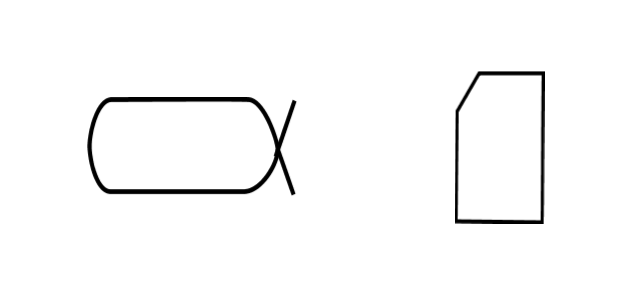

OMG Standard
Essence^[<http://www.omg.org/spec/Essence/>]
offers a special type of functional objects for monitoring the change in project state — **alpha** (ALPHA). If we want to coherently think about how far the creators have advanced in creating and developing the system, then according to the OMG Essence standard, we need to focus our attention on alphas, which they define as method items, rather than any arbitrary objects in the project.

OMG Essence is a standard for describing development methods, one of the latest standards of so-called method engineering^[<https://en.wikipedia.org/wiki/Method_engineering>]
, and later, situational/situational method engineering^[<https://ailev.livejournal.com/750878.html>].
The main difference between OMG Essence and previous standards of method engineering (there have been many, all hopelessly outdated) is that:

-   It is created not for the convenience of method developers (method engineers), but for the convenience of those using the methods described in it. Descriptions of methods according to this standard are convenient to use in work, while descriptions of methods according to previous standards were convenient to develop but not very convenient to use in method work. The key point was that the standard proposes tracking the execution of the method through checklists that control the passing of method items through some expected set of states. It becomes immediately clear to the one applying the method what to do: it is necessary to conduct method items through states according to checklist points.
-   The standard includes not only a set of domain types "methodology" (language in terms of OMG Essence), but also an example of the highest level description of modern software development using these types (kernel in terms of OMG Essence). Previous standards of method engineering were limited only to the set of types (language) and did not provide an example of using these types (kernel).

In our course, we recommend using OMG Essence, but we only take the language from it, not the kernel example described in it — precisely as required by the standard, because for each new development domain you need to develop your kernel, not take the software development method description from the standard.

**Alpha, according to the standard, is an important method item that changes its state during the project. Alpha is needed to explicitly model this important method item as an object of collective attention, requiring state monitoring during the project.** The method is characterized by its knowledge/theories/explanations/algorithms that describe the method items, which will change their state in the course of applying/engaging the method during the work of the craft and toolset of the agent implementing the method.

Alpha was named by the authors of the OMG Essence standard as "ALPHA" because any word was needed for the method item. Therefore, a short word was chosen for the object "something important for the project that changes its state" to avoid confusion. Long after the term “alpha” appeared in the OMG Essence standard project, developers came up with an acronym for ALPHA, but this decryption is absolutely unimportant, we will not even mention it here (just invented to somehow justify the choice of the term, referring to "project health", also an arbitrarily taken metaphor).

**Alpha is a method item whose states are important for the project so much that it is necessary to collectively monitor them throughout the project.** The project as a whole is considered the team's work through the sum of all methods used in it. This cumulative method is called **method/process/practice** **engineering** or **engineering method** (engineering process); sometimes exploitation and even manufacturing are not included and they talk about **method development/development process**. For us, this is a tautology, as engineering is itself and a method, but in language, they often confuse work by method and the method itself, so when they want to emphasize it is the method and not the work by method, they add some synonym of the method or indicate the specifics/specialization of the method, adding "type". So "labor" is a method, but it is sometimes used as "worked" in everyday use. When they want to emphasize it is the method, they say "type of labor" or "method of labor". This is mostly done with terms for which you cannot say "work method", for example, "labor of work", "engineering work", "activity work", "service work". With "process work", "practices work", "culture work", "style work", "strategy work" this does not happen.

The method item can be both an abstract object (description) and a physical functional (the method works with functional objects during the agent’s working time executing the method, and they exist only when their role is performed by constructs), so the OMG Essence standard offers the type **work product/artifact** (work product, artifact, i.e., an object of artificial origin) for material objects generalizing the concepts of the document (material information carrier) with descriptions of the object and construct for the functional object. "Work product"/artifact is what we work on in the physical world, what can be found in the surrounding world. Although the physical realizations of some alphas are hard to imagine as “products” (for instance, the alpha "external project roles" is realized by living people, it is difficult to think of them as "work products" or “constructs”), the sense remains: even if "products" are living people, you need to work on them, change their states during the project. Organizational units (teams and collectives as teams of teams, where there is at least one intelligent agent — human, AI-agent, or robot, or even an organization as internal organizational units) are also constructs.

Also, be careful with words: product/item/system and “work product”/artifact are still different concepts: products are usually physical, and work products, despite the physical nature of documents, can be descriptions. If you receive a lab report on this batch of milk instead of a bottle of milk in a grocery store, you will be surprised, but for a milk creation project, it would be quite a work product. “Work product” is still not “product”.

The peculiarity of alphas is that they track the states of method items with different domain areas of their private methods, as well as various ontological types, and do it very informally. For instance, the alpha of the target system (e.g., a building) in the simplest case can have

-   a state of "conceived" when it does not have even a detailed description, possibly no concept of use, no team assembled, the building project formally not yet started, no resources allocated for development!
-   then comes the state of "design developed" — the building as a physical object does not exist, but only the building description exists, detailed enough for its construction,
-   then it can be in the state of "built", that is, the building is ready (intentionally skipping engineering rationale, sales of building spaces, etc.)
-   then the state of "operated/used"
-   then the state of "modernized". Not specifying any sub-states of items of the major repair project, cosmetic repair, etc., it's just important to emphasize that after the building has entered operation, something can still happen to it, and later it will again return to the state of operation/use — the alpha reflects the states of the method item of creating the system not just as a "chain of transitions between states", it is a full-fledged graph of states, with cycles, conforming to the concept of "continuous everything" (primarily — continuous commissioning, not only creating MVP of the system but also its development).

In alphas, the state names of the method item are given through the names of smaller methods for changing the state, but these methods are given as results of works from these methods — transitional verbs in past tense (“door opened”, “door closed”, where opening and closing are methods of working with the door).

For example, Vasily Pupkin, when being onboarded into a project team by some method (most often this method in terms of bringing people onboard is called onboarding^[<https://en.wikipedia.org/wiki/Onboarding>])
should accept the role of the financier of the customer (an organizational opportunity of the financier of the customer should appear) and say "yes" and sign the documents in response to the question "to be or not to be?". The alpha "customer’s financier" is needed to track the state of the object "customer’s financier" throughout the project:

-   we recognize that "the need for a customer’s financier is acknowledged by the team", the first state is always the hardest, most often it's “nothing was there, and now we know what should be”
-   the "description of the external project role of the customer’s financier is formulated", in fact, this is a description of the financing method of the project by the customer,
-   the "organizational unit for the customer’s financier role is selected", in reality, it will be Vasya Pupkin (when designing states, it’s impossible to write that Vasya Pupkin will be chosen for the role of deputy head of the financial service of the customer, so we speak about the type of the object)
-   "the performer of the customer’s financier role took the role", it’s Vasya Pupkin’s state, who was informed that he is now the customer’s financier, he knows what to do, and agrees to work by the method described in the role description.
-   "customer’s financier cooperates" (here “cooperates” means an important state after performing leadership practices — there's no past-tense transitional verb, as usual), meaning Vasya Pupkin is already working on the project — saying his "yes" and signing off things, not delaying anyone in the project.
-   “all works of the customer’s financier are finished”, Vasya Pupkin left the project.

The project team gradually advances the alpha "customer’s financier" through these stages, applying the onboarding method (it doesn’t matter that the role is external, not internal — external project roles need to familiarize with the project’s accepted work methods), as Vasily Pupkin without the onboarding method team's work will go drinking beer and forget about the project. The team remembers it needs to ensure that both internal and external project roles are played by someone, and conducts work for this — as the work cannot be done "in no way", it defines this method/way and clearly tracks the states of method items: models the project situation as a set of alphas.

What will be work products here? The thing is, the state of an alpha is defined/monitored (in the OMG Essence standard the term is “witnessed/evidenced”) by many work products, i.e., documents with role descriptions while there is still no selected role performer, and later by Vasya Pupkin himself. Work products evidencing the state of an alpha will have to be described when describing the states of a method item — but usually, the alphas correspond to metaU-model (as in textbooks of the domain), and work products significantly depend on the enterprise situation, this is already a description of the metaS-model (as in enterprise standards).

The method description as operations transferring alphas/method items from one state to another as method work is performed splits well: using a method to bring something to a specific state can be thoroughly described as having its alphas. Detailed descriptions will be in the course "Methodology", table forms of modeling work methods in projects (working processes, practices, work culture, etc., the number of synonyms is impressive) and using various information systems for this modeling will be provided.

Work products/artifacts evidencing the states of project alphas are different in all projects, and work methods and thus the items of these work methods with their states (alphas) remain more or less the same, with minor variations — and this greatly saves thinking. The external role of "customer’s financier", responsible for “allocating and executing the target system procurement budget”::method, will be in nearly all projects, but in one project this state will be taken by Anna Pavlovna, in another by Vasya Pupkin, in the third by Vitaly Viktorovich, all working in different positions at the customer’s organizations. The thinking about them will be arranged the same, in functional terms of the method and its alphas/"method items", not in terms of constructs — these different people as role performers. Moreover, even if one project evidences “role description” by the work product "customer’s financier instruction"::document, and another by "standard methods for external work roles"::document, not much will need to change in thinking.

How to know in what state the "nail hammerer" is in the project? Look at the “work product”/artifact performing its role: initially, it will be project documentation, and later (after being implemented by stone or microscope) the physical object embodying the nail hammerer itself. The alpha "nail hammerer" may go through various states in the project:

-   needs identified, usage concept understood (work products here will be in project documentation, and a specific document needs to be indicated where this can be read — in projects, nothing is trusted “from the air, by rumor”! Not recorded — means doesn’t exist! Brain is a poor memory for a project, more reliable information carriers are needed)
-   having specific functionality but still not chosen construct (the work product here is still project documentation, possibly different documents),
-   selected and still not purchased (these can be different documents again, like electronic documents in the procurement information system),
-   purchased, (work product — the nail hammerer itself in the form of a hammer or microscope, stored in a warehouse)
-   issued for work (work product — the nail hammerer itself),
-   tested in work (work product — the nail hammerer itself).

This will be in the attention of project participants, these state changes will be tracked, and alpha states documented in project work products.

Alphas do not necessarily characterize the state changes of the target system during the project. No, they can also witness state changes of the systems of the environment, as well as the states of the creators in the creation graph. Systems thinking — it applies to all project systems (but not detached from the project! If you don’t want to make anything, that is, you don’t have a project, system thinking won’t help you), the target system is just a system at the start of the collective thinking coordinates, the main object of attention for all project participants. But the attention of project participants is also retained on other systems, alphas help model these systems and their descriptions — to monitor their state changes during the project.

Examples of the most important alphas (essentially indicating the kernel in terms of the OMG Essence standard, we here offer a more universal variant than in the standard with fewer alphas):

-   system embodiment (typically this is the target system, emphasizing its physicality, tracking readiness/embodiment level in the physical world, while the alpha is a tricky ontological object allowing to model the system embodiment as existing still in the form of raw materials or unassembled components, untested, not yet commissioned, including indicating the system embodiment as already operating),
-   system description (in real life state changes of the system description can be tracked by various work product documents, including database records),
-   way of working (way of working (W)), functional behavior description of the system (if inanimate system — called "function", if intellectual or collective creator — "method/way of working"), this is operating time of the system.
-   system works (this relates to the operating time of the embodied system, as the system creator works make another alpha! The state of works is evidenced by some Gantt chart or list of works from the project management information system, issue tracker).

These four types of alphas are worked with in enterprises as projects for creating and developing systems (remember that "service enterprises" also have target systems, though they may not be their own) using various methods over various method items:

-   commerce/promotion methods (main item for these methods: clientele::"created and developed system" — as a set of enterprise clients),
-   business methods (main item for methods: investment::"created and developed system" — as a set of enterprise investors),
-   and methods for systems engineering at the proper level (not all of which are even called classical "engineering systems", for example, "craftsmanship"),
-   systems management methods (main item of the method — organization), including organizational management (team engineering tuned to some work method) and operational management (resource load for work and verifying real work progress).

Agents in the organization performing roles for all required project work methods move their works by these main alphas through their states during the project.

Alphas as an ontological object are very complex, in part due to the fact methods work with descriptions, the tie to the physical world is challenging (even documenting different states of a complex method item will be in different documents, they are difficult to monitor), objects in different states can be called differently and even considered different objects (eggs, caterpillars, pupae, butterflies — these are stages of the same butterfly, but alpha can monitor them even before eggs — as gametes and zygotes of parents!). Ontologists here are holding their heads, but overall such an informal approach to monitoring state changes of important project items fully justifies itself. Alphas exist to model the complex graph of state transitions of complex method items — including modeling the states of method items of such a super-complex method as "engineering process" as a whole or even "enterprise work process" as a whole.

In the OMG Essence standard, alphas and the work products/artifacts evidencing them are depicted with different symbols: alpha resembles the Greek α (but this actually means nothing, just a pictogram "alpha", indicating "important method item, state changes of which need to be tracked in the project"), and the work product/artifact — a sheet of paper with a folded corner (the paper sheet is a stylized image of the document, but in real life this is most often an electronic information carrier).

The standard was mainly developed for information systems developers, so for alpha descriptions (e.g., software code as program description) the evidencing/representing/presenting work products — these are documents, including electronic ones, but for other alphas (say, teams as management method items) — these can be quite live people-performers of roles, "organizational units". Graphical representation of them by the standard will also show them as “sheets of paper”, indicating materiality/constructiveness, detachment from the "content on the sheet", emphasis on the logistical aspect during creation, abstraction from functionality in use. The alphas themselves — are method items considered in content (not resource, like work products) terms, passing some states after work on some method operations/receptions (smaller methods. We can talk about functional decomposition for methods here, understanding that method — is still behavior, and decomposition into parts-wholes is with roles as functional items demonstrating behavior).

**Alphas are documented in project work products to agree on state of important attentional objects in a project, they answer the question "in what state are the important project objects".**

The main ability of an intelligent person is the ability to define the set of method items, whose state is important to monitor in a project and document this model of the situation. This set of method items is specified by the types of knowledge/explanations/theories/algorithms of meta-model (domain areas) or even meta-meta-model (general world picture for many domain areas