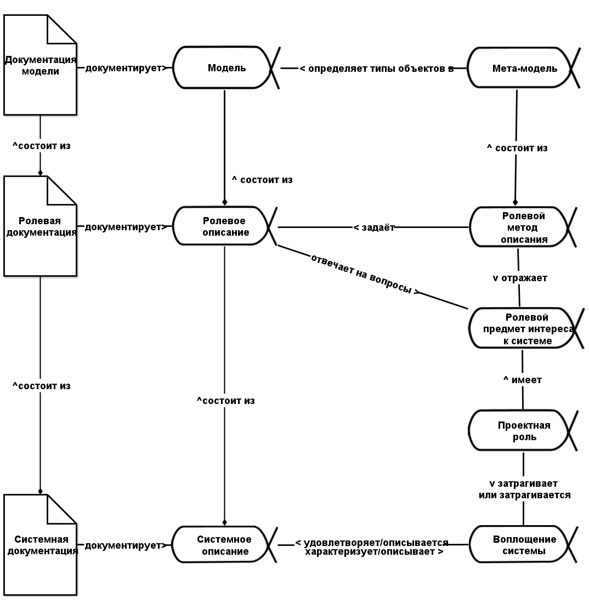
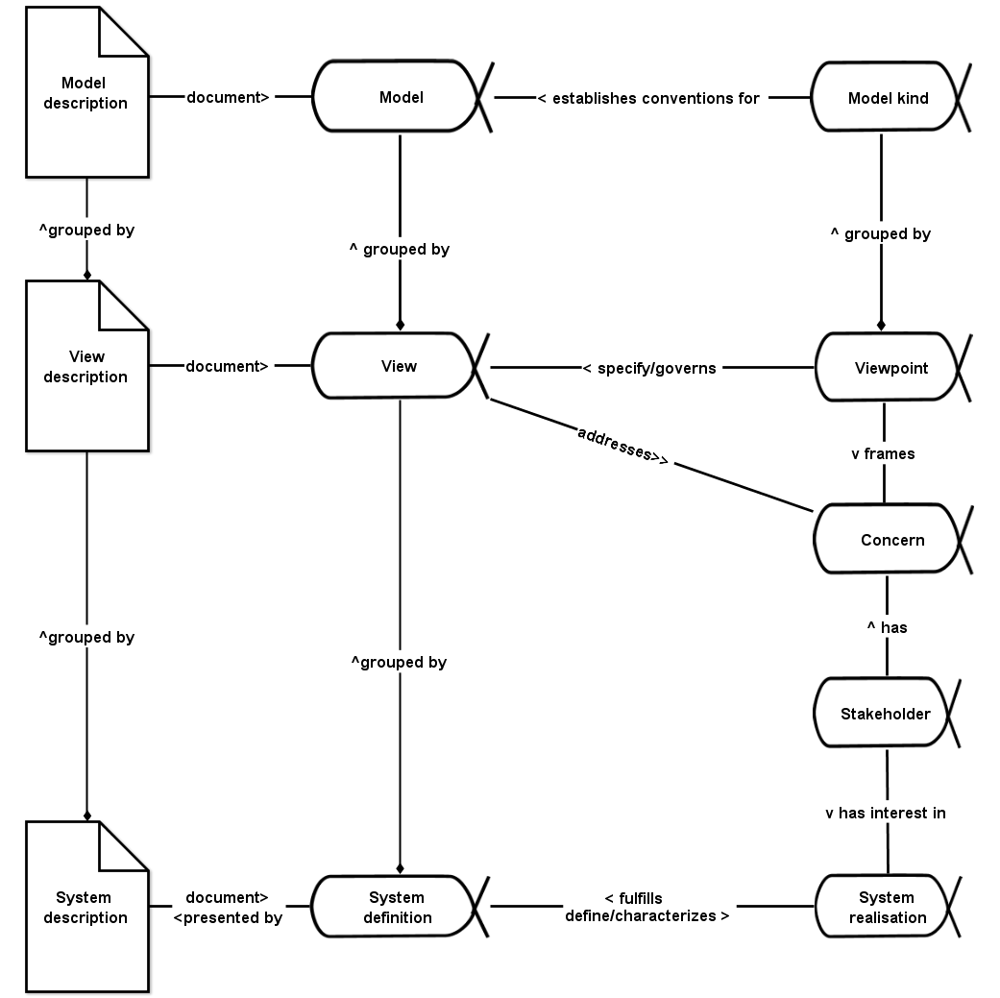

**Systems Documentation/System Documentation** (system description) ---
these are documents/artifacts/work products that implement the alpha **systems definition/description** (system definition). The system description in the previous phrase is given as an alpha type — this means that an ontology is proposed, in which creators will develop the system description using some description methods, it will be the subject of the method, will go through some states that will be tracked during the project, and will be represented by some artifacts.

**If there is a system, it is considered described:** **it has a concept of use** **of the system** **(alpha, not work products!),** **it has its project/design** **(which includes the system concept, architecture as a set of architectural decisions, as well as engineering justifications, manufacturing details, description** **of the manufacturing method/technology, and so on.)** We may simply not yet know this description, although it "logically exists"—the system is in space-time, and time here may be in some future, and we are in the present, and therefore just have not yet thought about these descriptions and have not documented them. Alphas exist, but there are no work products, so we cannot say anything about these alphas. But we consider that they already exist as subjects of some methods, they go through some states, but what state these alphas currently have in the project — we cannot say if there are no artifacts by which we can know these states.

Or we simply have not yet found the executors who will make such descriptions of project roles and have not yet guessed the right question to ask them — and they will give us the missing parts of the description, they know them, it is just us who don't know them yet. In any case: there is a system — there is a concept of use, there is a system concept, there is its architecture, possibly just not yet discovered (either not found already existing, or not yet invented and documented): we already know the types of meta-meta-models, it remains only to receive the objects themselves, and then document these descriptions.

It's not that "we don't know if they exist or not". They do exist, here are their types — which means there must be descriptions, sooner or later, attention to them as alphas (they will change their states during the project) is already there, attention is being drawn by types already known to you! It's just a matter of identifying them or even designing them — proposing a guess as to what they are, agreeing on guesses from various people, trying to create a system according to these descriptions (then such descriptions will be called project/design).

**When you go into a completely new project, you already know a lot about what you need to monitor there,** **what alpha state changes to track,** **you are not in complete ignorance! You already know the** **fundamental** **meta-meta-model, and sometimes even the** **applied** **meta-model (if you are engaged in something in the applied subject area whose practice you have already mastered). Therefore, you already know something about the world, but something (a model** **of the situation, without any "meta")** **you will have to learn in the very project, and also track the state change** **of objects in a rapidly changing project.**

If we're talking about shoes, you already know there will be a sole, a heel, an insole, a form called "style" — just one word "shoes" is enough to start discussing objects of these types. They are definitely there, even if the heel is "heel-less" (a space is also a sign!). If you go into a project, you know that a system is being created there, there's a creator, alphas need to be tracked, and for the many systems of the project, you need to track at least four of them (target system, system description, system work method, system work) and even break them down into sub-alphas (more on sub-alphas later).

To reveal (identify) the system description to the world, it needs to not only be known (or even proposed anew), but also recorded on some media so that systems documentation appears—record all these models (and sometimes texts in natural language, photographs that may not resemble models much but still reflect something important in the real system, they too describe something in it, so we boldly consider them also models, albeit less formal descriptions) in electronic form as entries in a database. We are not even considering paper representation today; it is already outdated. But when talking about the alpha of systems definition, the work product of systems documentation (system description) is largely unimportant—this is more a matter of convenience for work, rather than something fundamental. Today it is convenient to work with database records (local representations on electronic media), later perhaps with some neural networks reflecting these descriptions (distributed representations on electronic media), and back in the last century, they worked with local paper representations (like paper blueprints of mechanical systems).

If there is a system, then someone has identified it from the surrounding world for some purpose ("system in the eyes of the beholder"), has agreed on this system isolation from the world with other creators in the creation graph (collective projects usually), thinks about it, keeps attention on the method of working with the system. Thinking means performing some operations with its description; without this, other works with tools that change the system in the physical world are impossible. We are not considering options for creating and developing systems without any work on its design or recovery of the project/design during "reverse engineering": "if you don't write it, you don't think about it," projects/projects without design documentation have minimal chances of success.

If some role cannot describe some aspect of the system, then the system has not yet been isolated from the surrounding world. **We must clearly distinguish between the always existing description of the system as an alpha** **(possibly in the state of “system description in the scope of a brief usage concept idea”)** **and the not always existing systems documentation as** **a work product/artifact** **(including electronic** **documents).**

Sometimes the description of the system/system definition is translated as "system definition". In this case, it is important not to confuse the term with a "dictionary definition," like "our system is this and that". No, it's various information about system implementation, including various models of the target system, and often it's constructive description (in the sense of constructivism: "to describe an object, you need to define operations for its construction"), so explicitly or implicitly, the creators from the creation graph and their operations are also described — this will all be the system description (system definition). A single phrase "dictionary definition" won't replace it; in system definition, the term "definition" has a completely different meaning, not a reference to "definition as in the dictionary".

In practical engineering life, it usually starts with developing (identifying, inventing, agreeing among each other) and documenting project roles descriptions (usage concepts, system concepts, architectural decisions, and so on), and then the project team moves from project descriptions to implementation::system method in the physical world (manufacturing/producing the system, commissioning it) — and all this is in a continuous cycle of system development, through many versions of the system, assembled from multiple versions of its parts. If it's reverse engineering, then everything is the reverse: taking a system in the physical world and restoring all descriptions for the already ready system. **Usually in projects, reverse engineering is done for the supra-system, and direct for the target system.**

If you joined some organization (client, contractor, or just joined a new project team for you), you do reverse engineering of this organization: understand what's happening in the creation graph. If you need to organize the system creator, on the contrary — you do direct engineering, prepare all these descriptions as project ones, and then convince the agents in the organization to follow these descriptions (the "Systems Management" course is just about this, the whole "Organizational Development" program helps to do this).

Philosophical logic advises always starting with the system's embodiment, even if this embodiment will only exist in the future: **you need to imagine** **(generate/generate** **a description based on your existing generative models/generative** **models** **of the world, knowledge about the world), and then document this description** **of the possible world, in which the system embodiment** **already** **exists!** Do not forget for a moment that the system embodiment is needed, and the description (given to us as information models, blueprints, manufacturing instructions, etc.) is needed only because, without the description, it is very difficult to bring a working system to life. Remember: when the technologist describes the kefir production technology, he makes kefir, not just describes a method for making kefir. In the end, he is required not documents with the description of the technology (manufacturing method, needed tools for this method) of making kefir, he is ultimately required to produce kefir in its physical embodiment — this is his target system. But there is no kefir yet while the technologist describes the technology of its making, and there are no tools for making kefir while the technologist has not described them. Nothing terrible, in the possible world, they already exist in the future! This is what we are describing.

The diagram has no set reading direction (left-right, or right-left, or bottom-top, or top-bottom) of alph diagrams (objects of attention, which will change their state during the project) for the systems description. Different project roles for their purposes read this diagram in different directions. But the main element of the diagram is, of course, the system embodiment. All activity is started for it, it must always be kept in mind.

All such diagrams are checklists of alphas that need to be kept in mind when thinking about the project; for each alpha object, there will also be a checklist of states through which it should pass. Detailed information on checklists will be in the "Methodology" course, which will also provide example checklists for about three-quarters of the main alphas you will encounter in projects. It will also explain how to prepare these descriptions. **Descriptions of alphas and their states** **are descriptions of the alpha** **"working method"** **of the creator** – **these are objects of the method that change during the work of some creator.**

The ISO 42010:2022 standard provides recommendations on how to think about systems description/system definition. The standard itself only speaks about architectural descriptions, in the old understanding of architecture, but its provisions are quite applicable to any description, that is, usage concept, system concept, and architecture.

Here is a diagram determining thoughts about system descriptions from this standard, modified using OMG Essence provisions, and generalized from the architectural description of some entity of interest to the overall systems description:

The system description diagram starts with the familiar differentiation of realization and definition (description) of the system.

For simplicity of the diagram, most of the relationships (except for one: satisfies/is described in one direction and characterizes/is described in the other direction) are shown with only one naming of the connection, but this does not mean that the reverse relation does not exist. This is a common feature of all such schemes: even a "part-whole" relationship is read as "includes" or "consists of" in one direction and as "is part of" or "is included in" in the other direction.

Each connection between objects on this diagram can be read in two directions, for example, "the system description is expressed by the system documentation/systems documentation," "the systems documentation documents the system description." They say both "systems documentation" and "system documentation," and "system description" and "systems description."

**Note that documentation does not fix, but documents** **the constantly changing descriptions during the project** **(systematic, role-based, model-based)! Avoid the word** **"fixes,"** **because people usually think it means not documenting (as you think when you say the word** **"fixes"), but declaring the description as unchanging, "freezing requirements," or "freezing project descriptions."** "Write," – means document, and "fix" – means "stop changing," completely different action! You will definitely be understood with "fixation" as "further discussion ended, now follow".

Fixation or fixing requirements in past engineering (sometimes still used when talking about usage concept fixation, and exception of fixation/freezing of requirements was one of the reasons for abandoning requirement development in favor of usage concept development) for most means not writing requirements on paper or in the database, but declaring the current set of requirements stable and unchanging. But in systems thinking, you better and better describe the system (or describe an increasingly better system, as you understand how exactly it will be used, in what environment), constantly changing the usage concept – documentation does not hinder this, models of the system are not "fixed" at any project's moment! You can administratively declare some version stable. Engineers then use the term baseline, but this does not mean "fixation"! Just the changes in system descriptions will be collected and documented in other artifacts (a "working version" document, not the document of the already approved "baseline"), and later the baseline will be changed by some administrative change management procedure. But even here changes: trunk-based development ^[<https://trunkbaseddevelopment.com/>] implies that all development does not generate separate long-living branches, and in modern engineering (e.g., at Tesla plants, in SpaceX), each individual car or rocket has unique descriptions (project description), produced by a unique project and manufacturing process each, no two identical cars or rockets. But a third generation of systems thinking deals with this, talking about versioning — and how to live when each system instance version is unique, and the systems themselves continuously evolve.

For now, we remember: the diagram does not say that one-time a single version of the system description is made, which will then be used in system manufacturing. No, the diagram just says what objects of attention you have in the project when describing the system and documenting these descriptions. These are alphas, so you must keep in mind not just these objects but changes in the states of these objects (subjects of various engineering and management methods) during the project.

Here is the same diagram in English:

The system description (system definition) consists of role-based/aspect/view descriptions of the system (views), which are defined by important characteristics (concerns, role-based items of interest/concerns) and are set by aspect description methods (viewpoints). **Role-based/aspect/view descriptions of the system** — these are precisely the concept of use (developed by the role of engineer-designer), architecture (formulated by the role of engineer-architect), and so on — descriptions made by various engineering roles, given in the "Systems Engineering" course. But in management, it will be, for example, not just architecture, but org-architecture, and as the "concept of use" of the organization, there will be a business model, where the need for the organization is justified (and the role of a businessman will be responsible for it). Aspect descriptions — it's anything that describes the system in a convenient way for discussing role interests.

Of course, there may be many role-based/aspect/view descriptions. For example, a role may be interested in finance. Then the role-based description is financial, and the models there are the balance sheet, profit and loss statement, cash flow statement. How to make these descriptions? These descriptions can be made using the RAS (Russian Accounting Standards) or IFRS (International Financial Reporting Standards), and the meta-models are the formats of the balance sheet, profit and loss statement, cash flow statement in the corresponding role-based description methods (RAS or IFRS). If the financier is interested in both description methods, he will get two descriptions — both in RAS and IFRS. How will these descriptions be documented? Either on paper, or in Excel spreadsheets, or in the database of a computer accounting program — in any case, the content of the descriptions can be discussed without discussing the format of representation on information carriers.