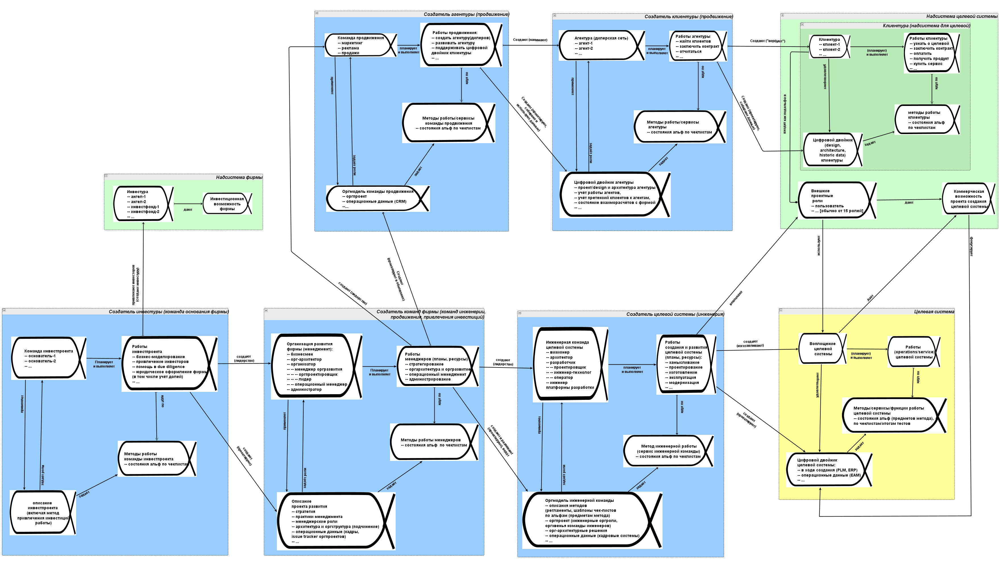

Scheme/schema^[<https://plato.stanford.edu/entries/schema/>] in thinking is not necessarily a diagram, but simply a set of concepts and relationships between them as some template for thinking, a support for attention in thinking (framework, "what to think about", what to keep in attention, checklist of important). The scheme can well be expressed both with natural language text and with formal language text (modeling or programming), but can also be expressed in a diagram. More details about schemes, diagrams, texts, and various other types of description representations are discussed in the course "Rational Work". Lately, people talk less about the scheme and more about ontology (a multilayered set of well-coordinated concepts and their relationships) or ontics (a small and often single-level set of concepts that are convenient for describing objects of a particular subject area, which is commonly called a framework).

The entire text of our course provides some ontology/"large scheme of systems thinking" — a set of concepts of systems thinking linked by relationships. For some parts of this set of concepts and their relationships (systems thinking ontology), we provided not only textual descriptions but also diagrams: graphical representations of the ontology as a graph, where concepts are depicted as nodes, and graph edges denote relationships between concepts. There was a diagram for project roles, and just now we reviewed a system description diagram.

Life has shown that students do not consider separate sets of concepts and relationships on some topics from the systems thinking course as parts of a single connected ontology, a single "large scheme" (again: a scheme here is a term for a set of concepts linked by relationships and can be represented both by text and diagrams. The text of our course is precisely a representation of the set of concepts and relationships of systems thinking).

When you say "project role," students immediately recall preferences but forget that a role performs some method of work (this is in other paragraphs!). When you say "important characteristic," they immediately recall the preference but forget that the role description/view answers questions about this characteristic precisely to understand what happens with the preference, and the subject of interest is reflected/framed by the role’s method of description/viewpoint (this is in a completely different section of our course!).

The problem is that all concepts from theories/knowledge/explanations of fundamental methods of thinking in the intellect stack (including methodology concepts and systems thinking concepts) are applied together in reasoning, not in fragments. If you consider something important while working on a method (remember that concepts for method objects represent a checklist of what needs to be thought through in a given situation), then go further and think about other important method objects that are connected by known theoretical/explanatory relationships to what you just thought of — and you will manage not to miss any important method objects in your thinking.

If you recall some person (or even a larger organizational unit) in a project, who has a "work role"::type (applied a type from our course!), then recall their "subject of interest/important system characteristic"::type, and "characteristic preference"::type, but also recall their "work method of the role"::type, and their "role/aspect description/view"::type, as well as their "description method"::viewpoint::type! What does "recall" mean here? Remember that in reasoning, you need objects of these types and find these objects in real life! And merely recalling the Alphas, whose states change throughout the project, is not enough, you also need to show attentiveness: remember them throughout the project, constantly keep them in focus (i.e., better not just recall but also write down the recalled so as not to forget it immediately).

If important objects in the project do not immediately present themselves for some reason — ask questions to the project participants, you will get unexpected answers! This list of "what to think about, state to track" is not large: so much flashes, howls, and shakes in the project, distracting attention, that focusing on these understandable and usual thought moves on objects-types-subject areas, for which we find objects in life, will save a lot of time by reducing pondering over the unimportant. How to separate the important from the unimportant? The important in unclear situations is what humanity has chosen types of meta-meta-models for (they have undergone quite a lengthy evolution, and intellect stack methods continue to develop), and the important in more or less clear situations is what has types of meta-models for specific subject areas.

Here is an example diagram for the systems description of (subjects) of enterprise activity. In fact, this is a diagram of Alphas because Alphas are the objects of activities, activity being one of the synonyms for "method".

This illustration shows that the considerations of objects of work methods of various org roles in the enterprise creation graph are closely related. For each org role, which acts as a system in the graph of some system’s creation, modeling of its method objects as Alphas is presented, but who creates what (who changes what method objects by their work) — this can be viewed.

We do not encourage using such diagrams in work projects’ modeling because diagrams need frequent changes in work projects, which is usually more than laborious, plus different parts of the diagram usually need to be changed by different people, and moreover, modelers for diagrams are rarely available, not every workplace has one. In the course "Methodology," it will be explained how to model enterprise Alphas not with such diagrams, but with lists (ultra-short form) and tables (convenient form, supported by practically any operational software). We give the diagram here only as an illustration, we need to show how to model a target system and graphs of creating an enterprise using the basic set (kernel) of four Alphas for each system: system implementation, system description, system work method, system work. This diagram is thoroughly discussed in the course "Systems Management," which is dedicated to the creation and development of organizations.

Will scrutinizing this diagram^[Here is this diagram in high resolution — <https://ic.pics.livejournal.com/ailev/696279/247262/247262_original.jpg>, the original file was made in the yEd editor, <https://disk.yandex.ru/d/qMDMgCZTkkT4-w>] (if you can read something there due to the small font, a problem with most large diagrams on small screens!) when the role::"type of some object in the subject area" comes to mind (say, when looking at the screen with "Aristarch Vladimirovich"::agent-AI, it is recalled that he is an engineer-architect::role) now lead to not only the desire to think about his interests and preferences in them but also the desire to think about architectural activity practices? The desire to think about description methods that establish agreements for descriptions used in architecture (for example, ADR as architecture decision records) to support a meaningful conversation with Aristarch Vladimirovich as an engineer-architect? Not a fact. Much text that will demonstrate examples of reasoning (i.e., also performed grounding) here will help more.

The neural grid of people is better trained by using words, not by looking at pictures: humanity achieved civilization after learning to write; pictures are not enough to convey knowledge. For each picture, one still has to write (or if not write, then "narrate orally," which is even worse) many, many words. Pictures are hard to read, hard to edit.

The "picture" illustration of the description of enterprise work objects contains very little knowledge by itself; it still has to be described with hundreds of pages of text from both our course and the "Methodology" course. It is not a fact that such a picture adds any clarity: the more concepts and relationships a diagram contains, the less readable, less understandable, and less usable it becomes. And if it’s broken up into parts, then thinking breaks up into parts, losing the integrality of the whole discipline. And we return to the initial question: how to connect in thinking well-mastered pieces of thinking about the target system, the creator (engineering team) of the target system, the creator of the engineering team (management team), the creators of the management team (investment project team), and also link the work of the promotion service and even the work of clients who must work to buy our product and use it in their supersystems? The problem is also that all this needs to be done by different people, and each will have to deal in detail with their part of the diagram.

The biggest trouble will be if such a diagram is used in organizational work at an enterprise: it will be like a good artist's painting - pleasant to look at, but very hard to correct something in it, so those corrections will not be made, and the diagram will soon significantly diverge from reality, becoming eternally outdated. All models in systems thinking must be easily changeable and placed under configuration management (there should always be an answer to who changed what and when, it should be easy to change, and easy to check for errors in changes). Diagrams for continuous changes are significantly worse than texts in formal languages and worse than tables. Therefore, in life, we use table modeling instead of diagrams: systems thinking with (table) modeling. Examples of such modeling are carrying out modeling tasks in our course.

In any case, it is necessary to understand that the gradually and consistently presented set of concepts in the course as object types from life, specified by the knowledge/disciplines/ontics of intellect stack thinking methods (including the set of concepts of the systems approach), represents some "large scheme/ontics of description method". The absence of a diagram as a graphical representation of such a "large scheme/ontics of the description method" means nothing. You can safely consider that the whole course simply describes the set of types of the meta-meta-model with text, in which all mentioned concepts are connected by some relationships, but there will be no huge diagram-picture (even broken into parts) for them all, such a picture is useless, but other forms of representation (texts in natural language, texts in formal languages, tabular representations) — they work perfectly fine.