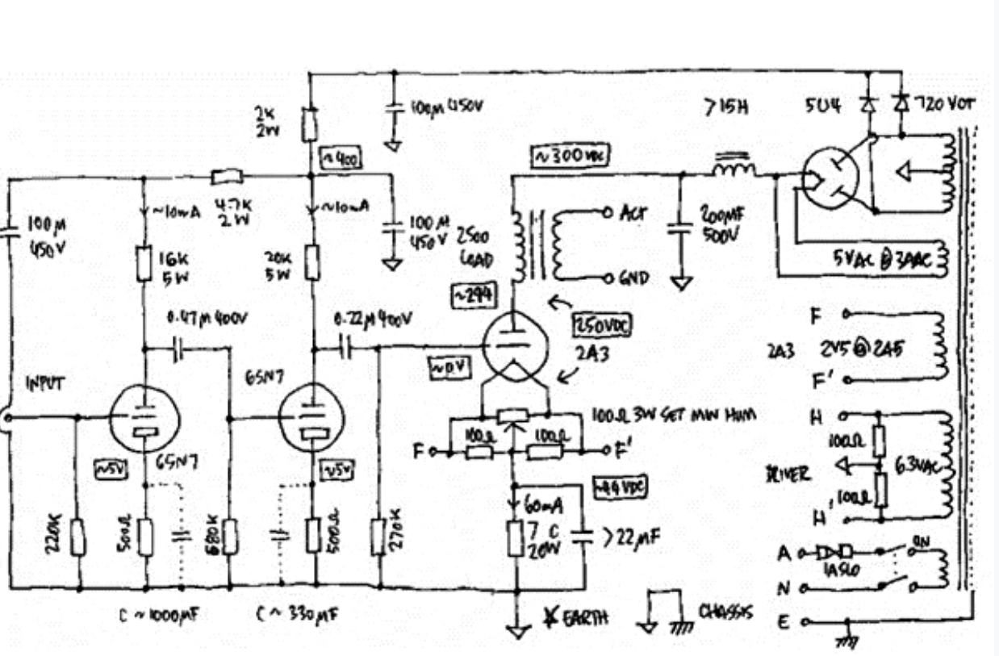
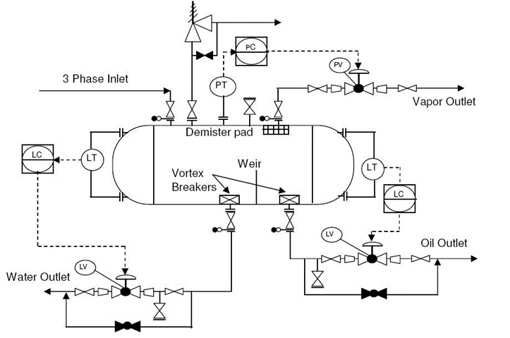
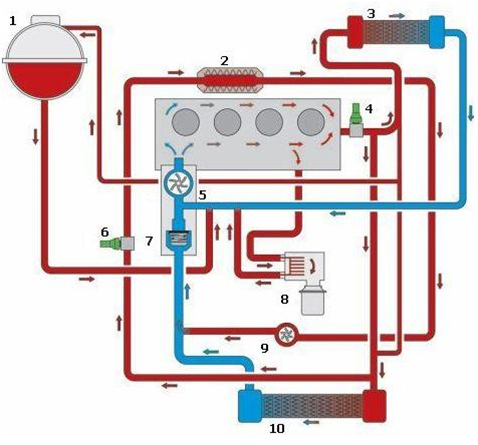
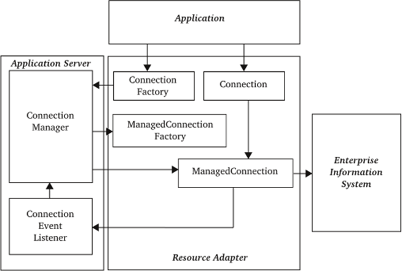
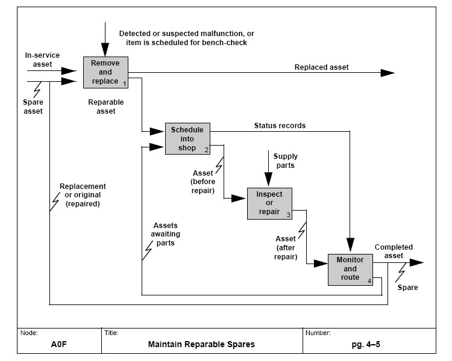
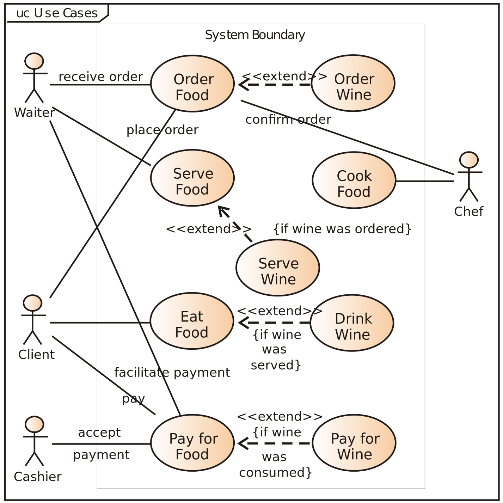

In a large number of project roles, the area of interest includes important system characteristics during run-time/operations, when the system is ready and being exploited. Explaining how the system works (i.e., describing the causes and effects within subsystem interactions) can be done through functional descriptions. In these, we explain the purpose (function/mode of operation) of each functional part of the system and the contribution of this part to achieving the overall system purpose, the overall system behavior in its environment (run-time).

**Circuit diagrams** are schematics that show the connections of functional parts with each other and are convenient for explaining the principle of system operation (answering the question "how the system works" — how the functional parts interact to provide the required system functionality as a whole). Here are some typical examples of circuit diagrams:

During operation, functional parts of the system interact with each other through **flows** passing through **ports** of these functional parts. In circuit diagrams, functional parts are usually depicted with graphical elements of different shapes, and flows are lines between these graphical elements. A port is a connection point where a connecting line attaches to the graphical element of a functional part.

Of course, all these beautiful pictures in a diagram modeler are stored (and most often edited) in some completely different format, for example, in tabular form, and only displayed on the screen as a diagram. Remember that pictures in engineering are good only if they are very simple — and for showing completed work (these are "archival documents") when changes are no longer expected, as changes are difficult to make, and the modelers themselves are unexpectedly expensive in all respects (including expensive to operate — a single change usually requires too many and long clicks somewhere with the mouse, while making a change in text or a table is much faster). That's why our course includes diagrams; they are very simple, usually citing diagrams of other authors, and when it comes to our own diagrams, they are exclusively for illustrative purposes and do not imply changes during any project (remember "constant everything").

On a computer as a source of slides, there is a port for connecting a slide projector, and through this port, the slide data flows into the projector. This is a functional description, shown on the diagram. In the physical world, we see the constructive part "laptop" and in it the constructive part, implementing the outdated USB 3 interface (not yet USB Type-C) or HDMI interface, through which a projector cable is connected.

A constructive/material "laptop" implements/incarnates the functional "slide source" (though the source of slides could be a smartphone), the constructive projector implements the functional slide projector, the cable implements the connection between the slide source and the projector, the interface implements port-to-port connection. "Implements" here means that the constructive (physical) object performs the role of a functional object. In a functional description, there are usually terms from the operational domain ("presentation", "slides"), while in a constructive description, these words are absent. A hammer and a microscope don't know they will be driving nails, so the descriptions do not contain words related to nail driving, just as there are no words about "slides" in the domain of laptop computers, but a slide projector might well contain such a word if it is specialized for presenting slides, or it might not if it can also show videos. And here we described a small part of the system concept — how we imagine dividing the system into different types of parts and how these parts are linked, with what is constructive and what material implements. Further, we would need to add spatial and cost descriptions, but for now, we will be concerned with the functional description of the system — yet, as always, we can’t talk about an object (in this case, a functional description) without discussing its connections with other objects (e.g., other types of descriptions), clarifying its meaning ("the meaning is the use") and grounding (providing examples of physical situations, sets of uses) so as not to become overly abstract in our explanations. Thus, this paragraph's inclusion in the course is just a norm for description (here we describe the functional description, a part of the meta-meta-model, the material of our course).

Functional parts are physical (when embodied by constructive/material objects), chosen for the system's operation to conveniently explain the system's work during its exploitation/operation (run-time, operations). Flows are mostly logical/role/functional objects, extracted from the world based on the constancy of the path, not the substance (for instance, in a river, the path of water is the same, but the water at any cross-section is different at each new moment), through which functional parts influence each other. Flows can be of various objects passing the same path: light flows, electric current, energy-mass transfer flows (in thermal machines), and even data flows (in software systems).

Flows are extracted from the physical world based on the constancy of the path over time, functional objects based on the constancy of function over time, and constructive based on the material constancy during changes, spatial based on place constancy. These are ideas from the ontology/meta-meta-model ISO 15926-2, which we discussed in our course in more detail in the methods/functions/practices section, under role objects/roles and “role-play”/function/purpose in the environment.

In any case, we always bring our thoughts back to the physical world, but remember that **flows** are depicted in circuit diagrams, not constructive/material objects serving as flow conductors: for instance, electric current can flow through a conductor, chassis, bolt connection, but in a circuit diagram, this diversity of mediums will not be shown. In an electrical circuit within a device/product, it's not necessary to have exactly the same number of wires as depicted in the circuit diagram of that device/product. But the current must still have a path to flow between products/modules implementing functional parts, so the system works, the “wire” is just one of the possible ways to implement flow/connection/interaction.

Similarly, a "pipe" in a **hydraulic diagram** (a circuit diagram where flows are liquid flows) is just one way of implementing the flow/interaction — the constructive components playing the roles of functional parts of the system can be connected directly, flange to flange, without a pipe, or instead of a pipe, the liquid can flow through some kind of chute, with myriad other possible options. The main point is that the diagram shows connections of functional parts with each other via ports so their interaction can be traced through flow transmission of some substance or energy or data. However, in the end, data will also be transmitted through the transfer of substances, such as transporting a truckload of magnetic disks, or energy, e.g., through fiber-optic communication or through electric current between computer parts — all this boils down to flow being an object with the constancy/consistency of path during inevitable changes.

Remember, functional descriptions can show not only the functional/role parts of the system but also the behavior/functions of these parts — and this behavior will also operate on flows: items in methods, passing along a constant path. In methods (by the way, functions too, they are synonyms — remember functions are often used for inanimate simple agents, and methods for intelligent agents that can plan something), they usually talk about input (input flow), processing/function/process (converting input flow into output) and output (output flow). In this case, they talk not about **circuit diagrams**, as for technical devices, but "functional diagrams/process descriptions." Of course, a diagram is a description in the language of typed objects (object type is often determined by their shape — oval, circle, square, or drawing a picture next to it, in the simplest such diagrams, only one type of objects is used) and relationships, indicated usually by arrows (they too can have different ends and fletchings, in the simplest variants — one type of arrow). "Process descriptions" can be not only diagrammatic but traditionally are expected as diagrams. Here, we provide diagrams exclusively for illustration; today, this is not the main presentation. Expect to see texts and tables in real life rather than pictures.

Here is an example of such a functional diagram (function model^[<https://en.wikipedia.org/wiki/Function_model>]) in the long morally outdated but extremely widespread and often encountered IDEF0 notation. To the left of each element are its inputs, and to the right — the outputs, and the arrows indicate what exactly is transferred from the output of the previous functional part to the input of the next. What is the most common type of mistake when reading such diagrams? These are functional parts and “logical time of method operation,” but this is often read as “physical time of operation instance,” and here lies the problem: one can fall into the scissors situation, where the functional and constructive breakdowns are different and “logical/functional time” does not coincide with “physical/material time.” For material time, other diagrams are used, often showing synchronization — for instance, the long outdated IDEF3 notation (and this is the issue, they use IDEF0 instead, nine times out of ten when methods/functions and works are 1:1, it’s OK, but in the tenth situation they diverge as in the scissors example, where the blade block and handle didn’t match with the two constructed halves of the scissors). So, you will inevitably encounter these IDEF0 diagrams, be careful about what they tried to depict — it might not always be functional objects and flows.

Another type of functional description — **scenarios** (scenario), sometimes referred to as **use cases** (use cases, to be translated not as "variants of use," but precisely “use cases” — the original term was coined by Ivar Jacobson in Swedish, and it was exactly a "scenario", the term "case" was recognized by him as a failed translation into English^[More details in the History section <https://en.wikipedia.org/wiki/Use_case>]).

An example of such a diagram^[<https://en.wikipedia.org/wiki/Use_case_diagram>] illustrates the actions of active parts of the system, shown by figure icons. In the picture, these are project roles, but in real life, these can be functional/role parts played by non-humans. These diagrams use "Aristotelian physics" ("the finger presses the table, but the table doesn't press the finger"), i.e., they show not interactions but actions specifically: functional elements are depicted by the role actors/actors/performers, and their actions (functions) are modeled by separate circles, and the whole diagram reflects "logical" scenarios (not in physical time! In the “cause-effect” sequence of explaining what’s happening) as methods/functions performed by functional parts (roles, in use case terms — these are actors). Here, actors can be non-living, they are not necessarily "intelligent agents" making decisions. What is called actor in a use case, is not an "agent performing the role," but the role itself, moreover, disregarding agency (without free will, without the ability to make decisions, a hammer in driving is also an actor). Always keep in mind that there are few words in the language, and each word has many different meanings, and terms like "actor", "actor", "actor" can denote completely different concepts in different disciplines of different methods, although sometimes they appear indistinguishably similar. So, stay vigilant.

Modes of operation/functioning of a system are usually calculated exactly by functional descriptions, as they are tied specifically to the system's runtime, not its creation time. Multiphysical modeling is done precisely for functional descriptions: optimal characteristics of functional objects are sought for given operating modes. Of course, the system is modeled in its environment (it’s run-time/operations-time, and the system's operation depends significantly on the state of its environment). Be careful: multiphysical modeling is sometimes called "system modeling" in engineering and tied to a specific class of software supporting some kind of physical modeler with descriptions in an acausal modeling language for physics, for instance, Modelica. But no, this is not full-fledged system modeling, it's modeling a functional description (e.g., calculating characteristic values of functional objects by some circuit diagram — often this is called 1D modeling because we model only one characteristic given the rest), not all descriptions. How to understand this? From the context, as always: if you hear "system modeling" or especially “system modeler,” just understand from the context — whether they are talking about system modeling in the context of Systems, or just labeling multiphysical (mechanics, plus electrics, plus hydraulics, etc.) modeling of some system.

Sometimes functional diagrams are supplemented by even more process diagrams, where the objects are the functions/behaviors themselves, named by verbs or deverbal nouns — "hauling", "cooling", "lighting". But process diagrams are rarer than "circuit diagrams" with functional objects as diagram elements, rather than functional element behaviors as in process diagrams. For instance, on a process diagram “increasing fluid pressure” behavior might be shown, while on a circuit diagram it will be "pump" (“object-increasing pressure," not its action “pressure increase”).

Of course, remember that most descriptions in real projects are “hybrid”: people (and now also AI) in diagrams, tables, and texts can quite clarify that the function of increasing fluid pressure is implemented by a pump module, not a height differential and a chute module, or even explicitly state the brand and technical characteristics of equipment to be purchased!

The main problem with functional descriptions: they are usually understood only by narrow specialists, functional/role/"by purpose in the supersystem" breakdown of the system into parts — counterintuitive. But **if you are asked how exactly the system works** **(runtime), you won’t** **manage without some simplified circuit diagram** **or process diagram** **. Always prepare for such questions: after all, systems are made to work/be used, and most people are interested in how they work** **(what happens during use,** **what the system changes in its environment, what flows of what** **pass** **during that moment between system subsystems) —** **and only after clarifications on this topic can you discuss how and from what the system is made** **(development time, constructive), how composed, costing.** **If it’s unclear what the system does in its environment (which objects are transferred from one state to another during operation) —** **it’s unclear how to evaluate its construction, composition,** **cost. Good or bad —** **whom to ask, who will be interested in the system? All depends on what the system does! Functional consideration of the system is primary!**

Systems thinking does not teach how to read and build functional descriptions and document them. Systems thinking says that functional descriptions should be made (and documented!). This is a meta-meta-model — not even a map to build a route and then follow that "route on the map," not even the map legend, but the "legend of the map legend." But if you want to go somewhere, the very idea that you will have a map legend, then a map, then plot a route on it — and go, will be helpful. You better do it this way, make a map yourself, than just "take and go somewhere by intuition" (and end up in a swamp after a couple of steps).

How to make functional descriptions (with functional decomposition), how to then do modular synthesis (deciding which modules will implement which functional parts) — this is taught by Systems. And if you want to become a professional, you will need to study also an applied discipline specifically dealing with some engineering subpractice (for instance, mastering a couple of textbooks explaining use cases and how to use them in projects to create use models in some “smartphone application development” or “electric vehicle development”).