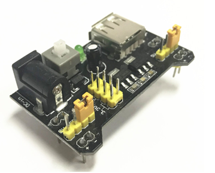
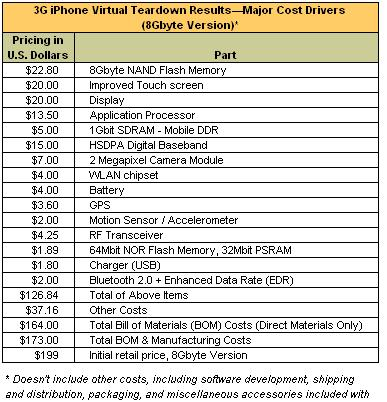

When the subject of interest for some working method refers not to the system runtime but to the system build time—something of interest for modular synthesis, the procurement of constructives/products/modules/items/blocks, the assembly of the system as a **construct** from already purchased constructive parts, the delivery of an already created system/product/item—constructive/product descriptions must be used. These descriptions answer the question "how is the system made" (compare with the functional "how does the system work") and they pertain to creation time (design-time, construction), not usage time (run-time, operations). Remember, in design-time we include not only design but also manufacturing, modernization, and destruction. But we do not include operation/work-time/functioning/usage time.

As in the case with functional parts, there are different graphical (diagrams), textual (in natural language, semi-formal "pseudo-code", formal languages), and tabular formats (for example, in Excel spreadsheets, Coda.io, Notion.so, Airtable) of presenting constructive descriptions.

On product/constructive/module diagrams, **constructives/modules/blocks/items** (in the case of blocks, it is often clarified that these are constructive blocks, because there are also functional blocks as parts of functional divisions) connected through **interfaces** (interfaces, literally—"between faces", "that which is between") are more frequently shown. An interface is usually described by some standard, defining both the properties of the connection and the events that occur during the interaction of modules through the connection. Assembly of constructives for their interaction through interfaces is often referred to as **integration**. Standards describing bidirectional interaction are called **protocols.**

Often constructive parts are named differently depending on their level in the constructive breakdown: parts (if disassembly/reassembly is not planned, an alternative name—element, "further undecipherable"), subassemblies/subassemblies, assemblies/assemblies, sometimes even subsystems/subsystems (but here it is easy to confuse with subsystems in their functional aspect), and further—system (it is also easy to confuse the constructive system with the system in its functional aspect, system-role-in-environment). The practice of fixing separate type names for assembly levels is poor because as the system evolves, you may replace three parts and eight screws with one complex-shaped part printed on a 3D printer, or even print the subassembly entirely—and then, a lot needs to be changed in the naming plan in the project. Remember: if you have a sprawling hierarchy by one type of relationship with one type of object (the same operations with these objects at each level, including thinking operations about these objects), avoid giving different type names to objects at different levels of some divisions: the number of levels is sure to change during the creation and development of the system, you'll have to rename everything for a long time.

Interfaces of constructives resemble the ports of roles in that these are precisely the connection points (and often on diagrams, this indeed looks like "a place in a square where some arrow connects at one end"), meaning **interfaces themselves** **are not constructives, they do not occupy space**, although they may have a form as "a boundary in space". A plug and a socket, a USB cable and a USB socket: for all these pairs the interface—"that which is between" ("between faces/interface"), not the "face" itself.

So, what to call the physical end of an electrical cord designed according to the plug standard, the plug for some socket, the connector in a computer for a USB cable? These will all be **interface** **modules**, whose main purpose is to implement some interfaces in the physical world, that is, to pair with another such interface module. And this module usually has not one interface, but two interfaces: one target, and the other connecting it to some module for which the target interface is needed. Of course, "module" here is just one of the possible synonyms: "product with an interface", "interface constructive": any word relating to constructives, to the assembly time.

**It is quite a common mistake to confuse an interface with an interface module.** Do not make this mistake (including students: do not be surprised being sent for a retake if you didn’t read up to this point in the course and called an interface some part of a construction). For example, is the cell membrane the cell's interface with the outside world, or an interface module? Since the membrane consists of molecules occupying space-time, it is an interface module, a constructive. Membranes, cases—these are interface modules with the environment, not interfaces! They have two interfaces: inward the system and outward the system.

Here is an example of such an old interface module (which is colloquially called a USB interface, which is incorrect—it also has a signal interface to the board, a separate power interface, and even an interface to a human: an LED that blinks when data is being transmitted and a power button, and there is also a mechanical interface for mounting to a case or another board):

What about connections needed for operation—all these pipes, cables, waveguides? These are also constructives/modules/products/items/artifacts, and they have their interfaces: they lie between them and those modules they connect. What passes through these interfaces, and how is it related to the operation of the entire system?

Unknown, because it concerns constructive units in design-time: functions from run-time cannot be determined here, for this you need to step beyond modular description into the field of engineering solutions for modular synthesis implementing functional parts of the system with its constructive parts (the concept of the system just refers to such a correspondence in the part of the internal structure of the system, while the concept of use refers to how things stand with the system in its environment).

Module synthesis solutions (inventions in the course of creating the system concept):

-   determine which functional parts' roles will be played by various constructives,
-   determine what interfaces will exist between these constructives, and through these interfaces, which flows between functional objects will occur (discussed in the previous section on functional descriptions),
-   consider all other aspects of the system (primarily placement and cost aspects, but many others important for considering the interests of numerous other roles. There are many descriptions in system descriptions, not just their main types).

Often, the conversation revolves around a module receiving-processing-delivering some physical flow passing through the input and output interfaces of that module. This physical flow will implement the functional flow from the functional description (for example, a schematic diagram), which passes through the functional/role part appointed to play the role by the module. Thus, data flow can be transferred through a USB interface (to a printer, a slide projector, an external monitor), physically, this will correspond to the passage of some profile of electric current through the contacts of the interface modules—but on a schematic diagram/functional diagram/dataflow diagram, these will be domain data streams from the applied subject area (domain) data between the system’s functional parts, that is, the flow of pages for the printer, slides for the projector, screens for the external monitor.

When integrating (often this word is used) different constructives into a single working system, not just the mechanical assembly from ready-made constructives is important but also the coordination of the work of these constructives after connecting them through their interfaces. The installer/assembler must ensure that the connection through the interface between the pair of interface modules is established, complies with the standard describing the interface, and thus the module will be able to play its functional role during work/functioning/operations/run-time.

The rules for establishing a connection through the interface are known, but it is unknown what exactly and why is transmitted through this interface—this will only be known from the functional description (for example, a schematic diagram). The operation method/mode of the system (functionality) and its subjects appear on the schematic diagram, which arises from dealing with functioning, not dealing with the construction and how exactly the system is assembled. "Bedroom" appears from understanding what is done in the bedroom (working methods), that is, the bedroom is determined not in the constructive but in the functional world. In the constructive world, the world of constructives/products/modules, it will simply be a "room." A "bedroom" is implemented with a "room" (not, for example, a corridor or a balcony), then a bed (whether it be in its various realizations as a bed, couch, bench with a soft cover, sleeping bag) is needed to implement in it (but not needed in a corridor or balcony, but if you equip a bed there, then the constructives "corridor" and "balcony" can also be designated to perform the role of "bedroom").

For example, a printer and a computer are connected through a USB interface, but what information goes to the printer is unknown to the interface. The iron is connected to the power network through the interface between the Europlug and the Euro socket, but it is unknown to this interface what current will go through it and what this current will do in run-time. But the limiting current values that can pass through this interface are known, as is the maximum amount of information that can pass through the USB interface per unit time. **The task of module synthesis** **when designing the system is** **to choose such interface modules,** **whose interfaces** **can handle** **the flows with their operational modes as provided by** **the system's functional description.**

Here is another example of constructive/modular/component (in IEC 81346-1, it is suggested to call a component an ordered product that arrives at the project from other creators) description, in this case it is simply a list of components (another name for the product/component) that need to be purchased for manufacturing the iPhone 2008, with prices provided—and this directly becomes a hybrid description, as it includes cost estimates^[<https://www.zdnet.com/article/isuppli-iphone-3g-costs-173-to-make/>]:

Notice how many different standards are mentioned here: GPS, HSDPA, DDR, Bluetooth—enumeration of interfaces described by standards is typical for constructive descriptions. After all, the essence of modules is replacing the implementation of some functional part of the system by simply replacing the constructive part: a module with a standard interface. Rapid progress in smartphone and laptop engineering is determined by this: thorough description of interfaces.

Instead of one printer through a USB interface to a computer, another instance of the printer of the same brand, or even a different brand printer, or not a printer, but some other device (for example, a scanner, or even an additional display) can be connected—without interface standardization, this would be impossible. Then competition will work: the price and quality of the service/function/working method obtained through the same interface among competing module suppliers will differ, but the module change will happen easily for engineers, nothing will need to be changed in the project if they used a **standard interface**!

**Standard parts** (with standard interfaces) are cheap because their price is driven down by "competition of standard implementations." If you want to increase the price of an item, remove standard interfaces from the item—and immediately you will have a huge amount of work within the project on alignment of interests of the various project roles, which, in case of using standards, was conducted by developers of standards. This is often used in government projects to justify their high cost, simply specifying a non-standard interface in the contract—and the job is done! If a standard part costs 3 rubles in any store, then a non-standard part with the same function will cost a lot: it’s the same as instead of store-bought clothes suddenly taking clothes from an expensive atelier! The problem is that replacement of expensive atelier clothes with store-bought clothes will mostly go unnoticed, and the quality of a cheap item can turn out to be even higher because it is mass-produced and better tested! In engineering, it’s the same.

The method of fighting against inflating the cost of custom development is to require that intermodule interfaces are prescribed not in the contract, but in an open standard, and the contract should just reference the open widely accessible standard. Then there's more chance competition will arise, and the prices of purchased modules will be lower. This method for seeking low component prices is called **open architecture**^[<https://en.wikipedia.org/wiki/Open_architecture>].
But regularly the architecture (decisions on slicing the system into modules with defining interfaces for connection of these modules, i.e., solutions on the modular part of modular synthesis, in which functional decomposition solutions are linked and then a whole system is proposed to be synthesized from modules) is not opened for competition reasons, also for easier configuration management. In a closed architecture, to change the interface of module interaction, fewer people need to agree. But if the interface is written in an open standard, it will take much more time to change the standard. The iPhone architecture falls into the class of closed architectures. And it's not the cheapest device, although Apple's negotiating power is sufficient to keep component prices low: it’s just that there are large volumes of release for each module, and these large volumes are a powerful factor in negotiations.

These considerations apply to enterprises/organizations, but for them, functional parts are org-roles, functions are working methods/modes, and constructive parts are org-links performing work by the methods agreed upon in the functional description. Of course, interfaces must be defined between org-links, and how they should work is determined by org-architecture. Detailed information on this will be provided in the courses "Methodology" and "Systems Management", the concept of architecture is comprehensively discussed in the course "Systems Engineering".