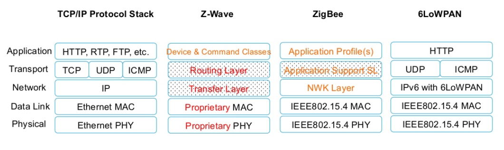
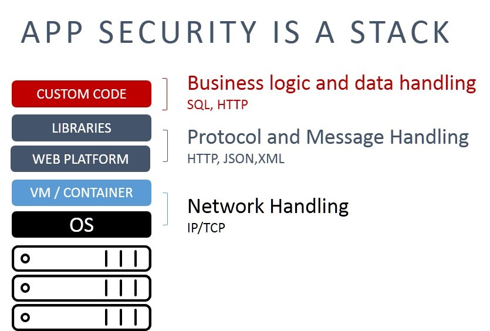

If we consider the constructive/product/modular breakdown (PBS,
product breakdown structure as opposed to functional breakdown SBS,
system breakdown structure), we can see at every level
of the hierarchy in relation to composition some sets of small constructive
"bricks" that provide services through their interfaces to build on top of them
constructive "bricks" of a higher level,
which can potentially offer a vast set of functions when used in some roles. This consistent set of modules by the services they jointly provide (**service** here is slightly
refined as "a function whose functional object's port is accessible at
the moment of use as an interface of some construct”) with their predefined interfaces is called a **platform.**

**A platform is always**
**a constructive/product/modular** **consideration of a system**
**emphasizing the standardization of getting** **the expected service at the time of use** **through a published** **interface.**

The fact that a platform is a constructive consideration, and a service is
a role behavior consideration (a functional object created by the
platform at the moment of use), should not confuse us, remembering about 4D extensionalism: construct and role are one and the same
physical object at the moment of use. And "service" instead of
function/method emphasizes the change of some
external item of the method of work performed by the platform—with a new
clarification: for a platform, a service is performed through a published
interface, and the interface description makes it clear where to find it and how
to access the service.

In engineering

-   interfaces are managed by the architect (the architect decides,
    constructs/components/modules of the application will communicate via program calls,
    or message passing, or will use a “bus”,
    meaning all constructs at the time of their operation will receive all
    messages from all and select the necessary ones themselves,
    if it is computer hardware, the architects will determine, if the
    interface will be USB Type-C or Bluetooth, or something else. Architects
    write out how the interaction will be arranged at the logistic
    level, separate from the ports of subsystems as functional
    objects to be implemented by specific
    constructs using these interfaces. Their concern is the proper assembly of the system from
    constructs, optimization (mainly—minimization)
    of interactions between them.
-   Developers take the interface as a given and determine what ports it
    will implement at the time of use. Their task is to
    implement functionality within the constraints set by the architect
    (not every interface can, during system use,
    ensure the operation of a port of a particular functional object).

It's clear that the roles of architects and developers have completely different
interests (with a common interest in obtaining a successful target system, but they
usually have different views on the best method of working to achieve this
quickly and cheaply, with different optimization criteria). More details can be found in the course "Systems Engineering". It's also understandable that
org-architects and org-planners have such a "working
conflict," more about this in the course "Systems Management".

For software constructs (components, modules, applications,
libraries—the term depends on the preference of the software engineering
school) this interface is usually called **API** (application program
interface), hence an application that publishes the description of its interfaces, through which its services can be obtained via external call,
also becomes a platform.

If it’s not a software system, it can simply be referred to as an
application interface (application interface, not application program
interface).

A platform, if implemented as a program library or "hardware"
modules, can be chosen depending on the project:

-   included as a construct in the composition of the application or product/item during
    its operation, being its subsystem performing some
    roles,
-   included in the environment, providing services for some parts
    of the system (platform provided by the service provider),
-   included in the composition of the creator (and here too, the platform is provided by
    a service provider).

The word "platform" thereby becomes completely universal, thus it
begins to be called anything if it's clear what service on which
interface the platform can provide.

"Internal Development Platform" in platform
engineering^[<https://platformengineering.org/blog/what-is-platform-engineering>].
The platform service provider is created by an internal
development platform engineer (this is one of the roles in engineering), and the platform services,
through the published interface, are obtained by developers—
the platform manufactures from software code a working
program on computer hardware. The term "internal development platform" appeared in software engineering. But in "hardware" engineering,
it’s a factory used by developers. More details— in the "Systems Engineering" course. An analogous
platform would be the company's administration, which provides services (financial, legal, etc.) to the company's manager-organizers, it’s created and maintained
by the administration. More details— in the "Systems Management" course. In educational institutions, the student flow is processed in the dean's office, which
plays the same role as the administration—a platform that creates an "educational organization" from student groups, akin to a
factory where masters are made out of students. More details—in the "Personality Engineering" course.

A marketplace is also called a platform, as it publishes
service interfaces for sellers and buyers, and sometimes for payment
systems. Sometimes creating such platforms is called uberization, and for French
Wikipedia, another synonym is given— plateformisation^[<https://fr.wikipedia.org/wiki/Ub%C3%A9risation>]—
named after the Uber taxi-ordering service, which created the platform
for guaranteed "delivery against payment" with two published
interfaces: a service for taxi drivers and a service for taxi passengers.
In principle, a service for finding all kinds of clients for all kinds
of services or goods—this is primarily a search engine, especially Google. But
in uberization, the main service is carried out by the platform: guaranteeing
delivery against payment, the marketplace platform acts as an
insurer and billing agent both for the client and for the
service provider (and projects where this insurance does not take place are usually more than modest in scale— simply matchmaking does not bring in much profit, without
insurance it's always possible to find a service provider through a search engine, but
then you'll have to deal with insurance and billing).

In the already mentioned social dances (tango, kizomba, forró, salsa, etc.)
there are also interfaces, they are usually standardized at the "base" level:
there are conventional signals given by the leader to the
follower (this is a gender-neutral terminology for the "partner" and
"partneress" that the whole world has now adopted). For instance, the follower's hand
is on your (leader's) shoulder—you can't twirl the follower,
this hand will interfere. You as the leader give a slight nudge with your shoulder to the hand (this is the "leading signal" from the "interaction protocol")—
and the follower's hand flies vertically up. Now turns are possible, this
hand won't get in the way, won’t catch on you. This is one of the
interfaces in social dances (there are others): between the leader's shoulder and
the follower's hand. This paragraph gives a piece of the standard with the
interaction protocol between the constructs of the leader and the follower in a pair of
social dancers.

**Protocol**—a description of possible interactions in the interface, which, when and in what direction
streams (signals, energy, matter) are transmitted and what generally happens in what order. Protocols can be

-   internal to the project (published within the developers' collective),
-   open (published by an official source in
    a **public document**, not implying verification of compliance, or
    **standard**, implying verification of compliance by some
    implementation),
-   transmitted in oral tradition (like ancient epics and fairytales), like
    lead-follow protocols in social dances (they can also be
    published in some usually incomplete form, but publications
    differ and there is no official source) or etiquette protocols
    when eating (they differ in various countries, also published
    partially or even more or less fully in many places, but these publications
    differ in volume and content, and don’t usually have a date with
    a version— there is no official source).

In thinking, this is not much different from invoking a software service
(remember, "service" often refers to both provider behavior and the
provider itself, "service," "server"), or requesting a service from
some equipment. In this sense, both the leader and the follower, by adhering
to the standard "base" of the dance with its signals, represent a platform of this "base" for
each other, they provide services to each other (leader—
a service of issuing interesting leading signals, follower—a service of decoding and
performing these signals, one interpretation of social dances—
this is a joint "game of
riddles"^[<https://vk.com/wall-179019873_1550>]).
And an important feature of social dances: standardization of the interface,
"platformness" leads to the leader and follower, arriving at
some festival party from different countries and dancing with
each other for the first time, being able to interact predictably and
reliably with each other, and also "serve"
multiple partners. This interaction in social dances in systems thinking is described roughly
with the same set of concepts, as the interaction of a smartphone and its cell station,
a tram with its tracks, a web browser with a web server—for all these
cases, thinking is arranged the same way, using the same types
of meta-meta-models (though, of course, everything is named
differently in each subject area. The standard of leading-following in social
dances will never be called an interface there, they don’t know such "smart words."
The problem is that it is not called anything at all, except perhaps "a tacit agreement on leading-following").

When considering the assembly of two constructs/products/modules, think about the
interface, if communication with something external that changes occurs through this interface at the time the constructs are used in
some roles in "servicing" individual instances of items of the method
by the general method, then this method is a service,
if the interface is published and there are several services—this is about
a platform.

The main issue when discussing platforms is the so-called
**interface visibility**. Interfaces of some low-level systems
should not be visible from outside the construct, that is, **it is not allowed
to connect** **constructs** **otherwise than through the provided** **interfaces.** Simply put, if you have a box with some connector,
you cannot plug an external device not into this connector, but somewhere
inside the box, bypassing this connector, even if you really want to. In
systems, everything is interconnected, and through an untracked connection (it will
also be an interface, but "unaccounted") parasitic connections can occur, leading to unforeseen errors. Remember: the architect fights
against these unaccounted parasitic connections between parts of the system, while the
developer, on the contrary, tries to somehow bypass these
architectural constraints, as they believe this will get results faster. If we take a hacker as a
developer, they will first attempt to bypass the published interface and immediately access the
functionality (platform services) through untracked connections. **Security specialists fight this. In essence,** **security specialists** **and
architects are different facets of the same engineering role.**

For example, if in your department, where you meticulously plan employees'
tasks, receiving orders for these works through some tracker,
someone from other departments can come and ask for work to be done "out of order"
— and they won’t be refused, the consequences for
the organization will be fatal: some unexpected work will be done,
some seemingly free employees will be occupied, some important (but importance is determined by the supersystem! Within the
module-department both as the customer and the
performer, the importance may be unknown) tasks will not be completed due to delays caused
by this suddenly appeared "out of nowhere" (bypassing
the planned interface supported by the
tracker) work. The whole tracker here is just an interface
construct/module, providing an interface for the service of ordering works,
it doesn’t matter that it is a fairly large software system, at
the examined systems level it is just an interface module for
work orders, a means of communication of the division with the outside world.

In electrical engineering, there are three types of faults: contact where it shouldn’t be,
no contact where it should be, and poor contact. This is a joke
exactly about interfaces—that must be exactly where they are foreseen by the design!

To discuss interface visibility, a diagram of
constructive/modular/product/platform levels is used. Each
platform level is separated from another level by some
standardized (that is described and documented!)
interface. Implementations/embodiments of the lower-level constructs can
thus be changed in such a way that the supersystems do not notice the replacement
during the use of these
constructs, if they comply with
published (in case of platforms) or even internal (if it's about functionality, not service)
interface agreements.

The resulting multi-level product/platform breakdown is called
**a platform stack** or **tooling**
**stack** (stack, pile—diagrams resemble a stack of trays in a cafeteria
or a stack of paper sheets in a pack). Here are examples of various tooling stacks for
intercomputer communication in the Internet of Things (IoT, internet of
things)^[<http://www.slideshare.net/Techtsunami/cn-prt-iot-v1>]:

The diagram shows that in different communication standards
five platform levels are
described/defined, which can be divided into roles of transmitting a physical signal during use (physical), data transmission (Data Link), etc. The
constructs for data transmission during operation refer to the constructs for physical signal transmission,
using the interface protocols specified in the diagram^[Agreement on interaction,
implying some order/sequence of actions of two
systems, is called a protocol. Standards describing data exchange are often
referred to as protocols as well];
And so on through all levels to
the application level: each level
of the platform/tooling stack gives an interface for service provision upwards and
uses the services of lower-level modules itself. Where does the
boundary between systems and environment lie? It all depends on the project: some of these levels
can be implemented by some system, and some by its environment.

It doesn't matter what these platform stack levels do/how they work. For the
"how they work" part, you need to discuss functionality at runtime, what data will be transferred and with what purpose; this is also about runtime
and should be discussed with developers, but platform discourse is
design-time, "what it's built out of and how connected," system creation time,
to be discussed with architects.

The key in showcasing this tooling stack is that

-   no upper level construct "sees" the lower-level constructs (has no access to them,
    cannot "plug into them," as there’s no interface) other than
    the constructs of the level
    immediately below,
-   the interfaces providing services of these platform levels are standardized—as is the set of
    these levels itself.

These tooling/platform stacks are ubiquitous. In dances, you
transmit a signal from the leader's shoulder to the follower's hand (that is, from part of the body
to part of the body in whole), not from muscles to muscles, nor even
from muscles of the shoulder through the skin, then the skin and further via receptors and nerves to the muscles
of the follower's hand. Muscles are lower-level constructs, and if
"shoulder" and "hand" are intact without needing lower-level repair,
you don’t need to meddle at that level, just use the prescribed interfaces. Universality
thus grows with each level downward. If in social dancing you can transmit the leading-following signal from shoulder to hand, at the level of muscle
work you can discuss not only signal transmission but
many other services. If you're discussing the bottommost level of protocol stacks, various other protocol implementations over
them can be reviewed. For instance, in the connectivity stack for a more or less universal IP protocol, you can propose a higher-level TCP protocol, but
other protocols implemented by other constructs, such as UDP and ICMP,
can also be used. This is depicted in the IoT platform stack
diagram for TCP/IP Protocol Stack. It's visible that the stack is named after a pair
of protocols from somewhere in the middle, not even the topmost level, nor all protocols at the same level as TCP. In the illustration,
just three protocols of the TCP level are shown, but there are 145 different ones^[<https://en.wikipedia.org/wiki/List_of_IP_protocol_numbers>].

There are two ways to depict such diagrams of
platform/tooling/modular/constructive stacks:

-   some diagrams name the "platform" layer with the title of the
    descriptive application interface standard. Application—
    this is upwards in system levels; application is at the stack's top.
    Realizing this standard with an interface construct is
    "between levels" (this method is shown on the IoT tooling stack
    diagram, it's the most common)
-   showing the constructs themselves (naming platforms) will be on
    the labels, then the interface of these constructs either is implied as named
    by the construct itself (for example, the deep learning package/library
    TensorFlow has the TensorFlow API, so it need not be specified separately—the
    type of construct "package" or "library" and assigning the name TensorFlow suffice),
    or it's stated separately.

But if a platform level implements a standard with a different name, it’s
specified somewhere within the module borders as a separate line closer to the
boundaries, or even separately "between platforms" as in the
application security stack illustration^[<https://f5.com/about-us/blog/articles/why-cves-should-be-given-priority-one-for-resolution-27910>]—
standards are listed on the side, and each label
indicates a layer/level of constructs:

The upper bracket for the standard interface in the supersystem from the custom code leads to
nowhere with this depiction approach, so generally
the previous method is used more often, where the platform is named not
by its module/layer designations but its purpose listed on the side.

Often these methods are mixed, yielding a hybrid constructive
diagram of constructive/tooling levels for interface visibility, developed by architects. Here’s an example of a neural network compiler layer
diagram, where top rows are names of software packages/libraries
for services over neural networks (MXNet, PyTorch, ...), and lower ones—interface standards for some hardware (OpenCL, CUDA,
...)^[<https://tvm.ai/2017/10/06/nnvm-compiler-announcement>]:

![](06-platforms-and-platform-instrument-stacks