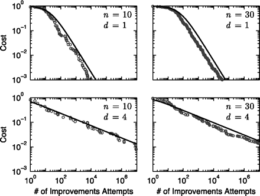

**The system should be assembled from modules on the principle of a submarine,
where all compartments are made** **optimally** **autonomous---** **if
one of them floods, it will not mean the submarine is flooded.** **But if you make complete autonomy (for example, not providing hatches between compartments), then it can no longer be a submarine---** **non-interacting parts of the structure through interfaces will not generate emergence, new properties that were absent in the individual parts (e.g., submarine compartments). An overly connected system "sinks," and a very loosely connected one---** **ceases to be a system altogether, displaying expected properties.** **This is true for**
**"hardware,"** **software, organizational, and all other systems.**

In a system, all parts are interconnected; in the system environment, they behave completely differently than they would without the system environment. If we do not have well-defined and well-described interfaces through which we control all interactions in the system, any attempt to improve a module could not only improve that module but also produce a side effect: degrading the system as a whole through effects on other modules via untraceable links. If there are not enough interfaces, the system won't work at all.

Here are graphs of computer simulations showing the dependence of development cost reduction on the improvement of n individual modules, considering d connections each of them has^[<http://www.pnas.org/content/108/22/9008.full>]:

It can be seen that if there is one connection, the development cost rapidly decreases exponentially with each improvement, weakly dependent on the number of modules. But if there are more connections, errors from local improvements spread through these connections, and the reduction in development costs from improvements in individual modules goes poorly. Each connection has its system price, and without this price, we wouldn't even have "organs," "cells," or other constructs/modules in living nature^[<http://arxiv.org/abs/1207.2743>].

The modularity of the human body is acquired through evolution and does not compare to the modularity of a modern computer or smartphone, assembled from standardized parts with well-defined interfaces. Therefore, it is unclear how to improve or even simply treat the poorly modular human body (although modularity exists here too! Organ transplants work!). Improving and treating/repairing the design of a computer or smartphone is much easier because the modularity of the computer or smartphone is carefully thought out.

Interfaces need management: carefully designing them, accounting for their presence, identifying parasitic (i.e., undocumented) interfaces, and taking measures to eliminate them. Harmful, erroneous interaction can spread through these parasitic interfaces in systems. **Optimal** **modularity,** **understood as an optimal**
**assembly structure of constructs connected** **through quality interfaces---** **this ensures the possibility of autonomous improvement of individual modules and the quality of the entire system.**

An interface is not just a connection but a connection through a specific physical channel/set of interface modules by a specific protocol (preferably defined by an open standard rather than just an internal project agreement, though this is not always adhered to), so that this interaction can be traced, and the error does not spread through the system. Moreover, a module can simply be replaced with an alternative (easier if the interface is standard)---and the system continues to work. Even an accounting unit can be replaced: replace your own department with an external accounting service! However, if some connections (in the case of modules, we talk about "dependencies") bypass the interfaces of the modules and the system uses these connections to realize its function, replacing the module will lead to the loss of these connections and malfunctions in the system.

There are many methods that help reduce the connectivity of modules in the created system. One of the most well-known methods is DSM (design/dependency structure
matrix)^[<http://www.dsmweb.org/>].

Optimal (minimal necessary for normal operation of the system) module connectivity is needed in hardware systems, software systems, organizational systems, and even in dance. Good modularity is addressed by architecture::method, the role of the agent performing the architectural work---the architect (in the case of organizational systems, the org-architect).

Good modularity and minimizing dependencies between them do not mean that system/subsystem parts are not closely interacting with each other. It means that these **interactions** **of parts of the design** **are under strict** **architectural** **control**, and subsystems can be improved, and in the case of interface standardization, even replaced with fundamentally different in design and principle of operation, without risking degrading the overall system operation.

**The Systems approach is usually called holistic because it pays attention to the system as a whole. But there are no other approaches that help so much in dealing with** **the division into various parts like the Systems approach. The essence of the Systems approach is not only to pay attention to the entire system but also simultaneous attention to the parts of the system.** **The Systems approach---** **is about multi-level: consciously holding attention at least** **three levels: the supersystem (where we integrate our system), the target system (what we are doing), and the subsystems (what we are assembling from).** **This is true for
constructive/product/modular division.**

In the "Systems Engineering" course, there will be detailed information about architectural work, its place among other engineering methods, references to literature on methods for optimizing inter-module dependencies, metrics for quantitatively assessing such dependencies.