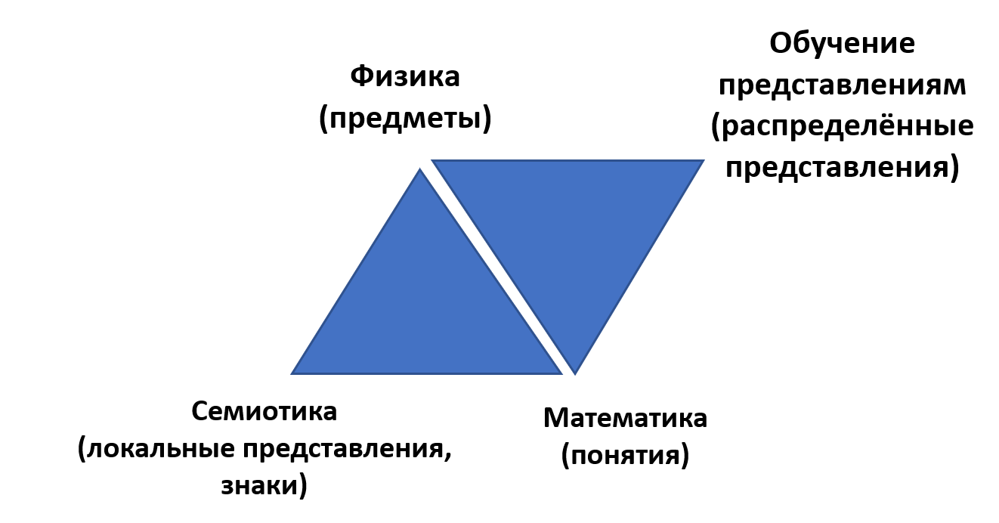

Vanchurin, Wolf, Koonin, Katsnelson noted that reasoning by analogy in classical thermodynamics and information theory, applied to quantities in thermodynamics, **machine learning**, and evolutionary biology^[Vitaly Vanchurin, Yuri I. Wolf, Eugene V. Koonin, Mikhail I. Katsnelson, Thermodynamics of evolution and the origin of life, 2022, <https://www.pnas.org/doi/full/10.1073/pnas.2120042119>] leads to an unexpected common ontology (**framework**) for all of them. In other words, evolution could be described as **learning/learning**, and learning has a thermodynamic nature, i.e., a quite physical phenomenon. Based on these analogies, they formulated a theory of evolution as **multilevel** **deep** **learning**^[Vitaly Vanchurin, Yuri I. Wolf, Mikhail I. Katsnelson, and Eugene V. Koonin, Toward a theory of evolution as multilevel learning, 2022, <https://www.pnas.org/doi/10.1073/pnas.2120037119>] (deep — this is the multilevel nature of representations^[<https://ailev.livejournal.com/1045081.html>]). In this theory, the driving force of evolution is **conflicts** between objects of different system levels, leading to **frustrations**^[Geometrical frustration, <https://en.wikipedia.org/wiki/Geometrical_frustration>]. This concept of frustration was introduced into the systems language based on studies of spin glasses as an example of the behavior of non-ergodic (with memory) systems, where it meant geometric frustrations (the impossibility of stable spin geometry in glasses). Thus, evolution represents a process of learning/learning, which boils down to solving the **optimization problem** of finding the minimum free energy by changing the structure of numerous **system** **levels**. During this, evolution finds **quasiminima** but not the **absolute minimum**. Periodically, there is a **jump in complexity** (a large evolutionary transition, the emergence of another system level, another type of whole systems), which provides a sharp minimization of the free energy of the evolving system, but it still is just another quasiminimum, not the absolute minimum. In this series of works^[Yuri I. Wolf, Mikhail I. Katsnelson, and Eugene V. Koonin, Physical foundations of biological complexity, 2018, <https://www.pnas.org/doi/10.1073/pnas.1807890115>], the **physical nature of the complexity growth of systems** (using biological systems as an example, but the reasoning there is scale-free, meaning the biological nature of systems or the presence of consciousness does not affect the conclusions of the work) was shown. Thus, in the system ontology, there are also conflicts between system levels, and the phenomenon of frustrations due to these conflicts, as well as the conclusion about the inevitability of the growth of system complexity as the increase in the number of system levels.

All these researchers are in contact with each other (for example, there were discussions between Vanchurin and Friston), as thermodynamics and the understanding that all systems adhere to the principle of minimizing free energy during their existence, creation, and evolution form the basis of most of these works. Translating traditional formulas to express this ontology (currently, this ontology is expressed in the familiar formulaic form for physicists, typical for thermodynamic derivations) into the constructive form of category theory is a separate topic, but such a problem formulation is more or less familiar to mathematicians, and the research program on this topic can be discussed. The same can be said about reformulating the **differential form** to the **quantum-like**^[Irina Basieva, Andrei Khrennikov, Masanao Ozawabc, Quantum-like modeling in biology with open quantum systems and instruments, <https://www.sciencedirect.com/science/article/pii/S0303264720301994>], which could increase the accuracy of physical modeling of biological and techno-evolution (memetic evolution) due to the quantized/digital nature of most described phenomena, while also reducing computation time by working in discrete points rather than every point of continuous functions.

The third generation of the systems approach considers that above all, knowledge evolves (including knowledge of systems), not just the systems themselves, which are already closer to biological species. This is close to the shift in biologists' views on evolution as primarily the evolution of the genome, not the evolution of the phenome. Modern biological classifications are already based on the genomes of organisms, not their phenomes.

Thus, the modern/SoTA (third generation of the systems approach) ontology of systems:

-   provides object types for multilevel attention targeting to ensure the evolution of target systems (continuous everything) by creator systems
-   considers at least three times of system existence: operations, construction/evolving of phenome, evolution/development of genome/memome — based on physics, mathematics, and computer science
-   views systems as stable entities within the minimum physicalism (including systems that are active towards themselves and the environment, systems seeking a minimum of free energy through active/embodied inference, regardless of their 'intelligence' level)
-   offers scale-free descriptions of systems (phenomena of quantum physics are thereby taken into account), explains the emergence of system levels (complexity growth) due to multilevel optimization to achieve a minimum of free energy
-   merology is already expressed not through 'eternal classes' and relationships between them, but through morphisms reflecting operations with physical systems during their interactions. It is also considered that operations with abstract objects are performed by creator physical systems with (universal in the sense of equivalence to a Turing machine) a computer in their composition, 'a mathematician reasoning about mathematics is also a physical object.'

The current development of the systems approach is primarily related to the development of knowledge about distributed representations, as all three generations of the systems approach evolved when the nature of distributed representations was poorly understood. These were more generations of the systems approach expressed formally in local representations and therefore convenient for criticism:

To date, the task of creating a common local-distributed semantics, combining the classical semantics of local representations based on Frege's triangle, which unites local representations of signs (semiotics), concepts (abstract objects provided by mathematics), and physics (physical world objects reflected by concepts expressed in signs provided by physics) and the emerging distributed semantics in works on large language models in AI, where representation learning comes in place of semiotics (mainly vector/distributed^[<https://deepai.org/machine-learning-glossary-and-terms/distributed-representation>], disentangled^[<https://deepai.org/machine-learning-glossary-and-terms/disentangled-representation-learning>], continuous^[<https://www.sciencedirect.com/science/article/pii/S2666651021000206>] representations):

It is quite possible that developing a theory of distributed representations and generalizing semantics to include not only semiotics but also representation learning will lead to the emergence of a **fourth generation of the systems approach**, but this is currently only a hypothesis.