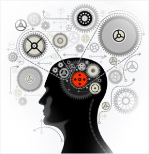

Системное мышление помогает бороться со сложностью в самых разных
проектах: оно даёт возможность выделять своим вниманием всё важное, на
время отбрасывая неважное, но при этом удерживать целостность ситуации,
учитывая взаимовлияния этих по отдельности продуманных важных моментов.
Системное мышление происходит путём мышления моделированием (с текстами
на формальных языках или данными в таблицах) и письмом (с текстами на
естественных языках, но с отслеживанием типов объектов и видов отношений
объектов в этих текстах), поэтому внимание не только наводится на важные
предметы, но и удерживается на них всё время проекта: записанное не так
легко забыть в суете. А ещё системное мышление даёт возможность
заниматься творчеством: в его неформальной части позволяет делать
догадки о возможных решениях по изменению мира к лучшему, а в формальной
части --- критиковать эти решения, чтобы пережившие критику решения
взять всерьёз, то есть положить основой для коллективных действий.
Системное мышление управляет вниманием многих людей в сложных
коллективных проектах, привлекая это коллективное внимание к важному и
экономя время путём исключения из мышления неважного.

Для студентов самых разных специализаций системное мышление даёт
возможность надёжно удержать в голове и записях их проекты во всей их
цветущей сложности, связать теорию и жизнь. Для опытных инженеров,
менеджеров, технологических и корпоративных предпринимателей,
исследователей, людей творческих профессий, общественных деятелей
системное мышление позволяет разложить их знание жизни по полочкам. Это
мышление-шпаргалка, оно заставит подумать о забытом, а плохой проект
похоронит быстро и не даст вложить в него много ресурсов.

У нас не курс системной аналитики (часто путают с системным мышлением),
ибо системному синтезу в нём уделено не меньше внимания. Системное
мышление практично, культурно, стильно, деятельно, ибо создание и
развитие систем происходит самыми разными методами, практиками,
культурами и стилями работы, видами деятельности/труда/инженерии, но
разговариваем мы обо всех этих методах работы при помощи понятий
системного мышления. Это фундаментальное, универсальное мышление.

В курсе также показано, как системное мышление позволяет более-менее
одинаково думать о предметах самой разной сложности, таких как предметы
из инертного вещества, живые существа, киберфизические системы,
личности, организации, сообщества, общества и даже человечество в целом.
Это происходит вследствие того, что в системном мышлении с одной стороны
уделяется огромное внимание масштабу объектов, а с другой стороны ---
сами системные рассуждения не зависят от масштабов объектов, они
безмасштабны, просто масштабы являются их предметом. Системное мышление
универсально и безмасштабно, поэтому в одном рассуждении можно
удерживать внимание на самых разных объектах самого разного масштаба:
именно для такой увязки разных объектов в сложных проектах системное
мышление и предназначено.

Системное мышление не зависит от того, какие агенты с сильным
интеллектом им занимаются --- люди ли, AI-агенты или даже коллективные
агенты (организации из множества людей, AI-агентов). Оно
неантропоцентрично, и наш курс это учитывает.

Прохождение курса системного мышления подразумевает некоторый опыт
участия в сложных коллективных проектах из реальной жизни (не простых
«учебных проектах» на одного человека, а «настоящих», коллективных
рабочих, где результаты кому-то нужны настолько, что за них готовы
заплатить!), опыт столкновения со сложностью в жизни лицом к лицу --- у
изучающего системное мышление «сложность» относится главным образом к
примерам из жизни, а не к «кейсам из учебника», ибо «учебные кейсы»
слабо привязываются к жизненным ситуациям. В онлайн-курсе системного
мышления вы будете много моделировать (увы, в книге заданий на
моделирование нет), то есть не только «учить системное мышление», но и
практиковать его, «системно мыслить моделированием». Дальше на работе и
даже «просто в жизни» вы будете делать ровно то же самое, что в курсе:
заполнять таблички, это и будет ваше системное мышление. Надеемся, что
вы даже не будете замечать, что «системно мыслите», по форме это будет
просто «заполнение довольно простых табличек, хотя каждый раз над этим
заполнением надо будет немного подумать».

Курс прокладывает для мышления определённые «рельсы», которые позволяют
после некоторой тренировки быстро и автоматически оценивать ситуацию в
реальных коллективных проектах. Системное мышление позволяет лишний раз
не «изобретать велосипед» по борьбе со сложностью, вместо трудного и
медленного «мыслительного бездорожья» происходит лёгкое и быстрое
«мышление по рельсам», беглое задействование лучших придуманных
цивилизацией приёмов мышления. Часть того, что для других людей
покажется творчеством, для системно мыслящего человека --- это беглое
применение мыслительных шаблонов, экономящее время для неизбежного
реального творчества. В жизни всё время будут ситуации, которых не было
в учебниках по той предметной области, которой вы занимаетесь. Курс
системного мышления поможет как раз в этих ситуациях. Как математики не
изобретают каждый раз идею интеграла, так и системные мыслители не
изобретают каждый раз идею различия функционального и конструктивного
описания системы, идею различения целевой системы и системы создания и
ещё пару десятков других полезных идей. И это они делают в самых разных
проектах, для самых разных систем, соединяя в мышлении ситуации,
описанные в самых разных прикладных учебниках.

Основная задача курса --- компактно собрать в одном тексте («свод
знаний», по аналогии со «сводом законов» как собрании текущей
конфигурации нормативных текстов с учётом всех обновлений, дополнений,
исключений, подразумевающий также некоторую полноту охвата предметной
области и официальный статус --- с этим разбирается методолог, это
методологическая работа) и объяснить (преодолеть «понятийное
расстояние»^[<http://wiki.lesswrong.com/wiki/Inferential_distance>]
для понимания, работа методиста) «мыслительный минимум» по системному
мышлению, обычно рассыпанный по самым разным источникам знания.
Специфика нашего курса в том, что его содержание базируется не столько
на традиционной академической литературе прошлого века по общей теории
систем или традиционных учебниках для менеджеров, сколько на современной
инженерной и научной литературе 2017-2023 годов, а также в чуть меньшей
степени на международных стандартах и публичных документах системной
инженерии и инженерии предприятий, разработанных или обновлённых за
последние пять-шесть лет (ISO 15288:2023, ISO 42010:2022, ISO
15926-2:2003, IEC 81346-1:2022, OMG Essence:2018). В курсе учтены
последние результаты исследований по физическим основаниям биологии,
включая объяснительные теории эволюции, происходящей на разных системных
уровнях. Это представлено в курсе не слишком подробно (подробней это
можно найти в курсе «Интеллект-стек»), но даны все необходимые ссылки на
литературу, чтобы дальше любознательным студентам можно было разобраться
самостоятельно. Материал курса представляет безмасштабную (от молекул до
человечества в целом) версию системного мышления, а также
деантропоморфизированную (нет предположения, что рациональный агент ---
это обязательно человек-индивид) версию методологического мышления.

Курс подготовлен на основе опыта преподавания системного мышления как в
многочисленных вузах (ежегодно с 2012 года), так и в системах повышения
квалификации инженеров, менеджеров, технологических предпринимателей,
преподавателей и людей самых разных других занятий, в том числе и
особенно в Школе системного
менеджмента^[<http://system-school.ru/>],
где автор является научным руководителем. Онлайн-курс содержит большое
количество вопросов с авторскими ответами, а также заданий на системное
моделирование (моделирование ситуаций в рабочих проектах студентов), так
что курс служит чем-то вроде «хелпа» к этим заданиям. Наш опыт
показывает, что само по себе чтение учебника не учит системному
мышлению, а вот системное мышление само по себе (в формате мышления
моделированием с использованием структурированных текстов и мышления
письмом с использованием неструктурированных текстов на естественных
языках) учит, если оно основывается на чтении материалов курса и
выполнении заданий.

Изложение системного подхода даётся универсально для инженеров
«железных» и программных систем, менеджеров и владельцев бизнесов,
деятелей культуры, политиков и людей, которые занимают самые разные
другие прикладные трудовые роли. Но знание методологии, системной
инженерии, инженерии личности, системного менеджмента надо получать из
отдельных курсов, курс системного мышления к этим курсам обязательный
пререквизит. А ещё нужно будет отдельно проходить прикладные курсы по
самым разным прикладным методам работы. «Как мне быть в моём проекте вот
с такой проблемой» обычно решается с помощью системного мышления,
организующего применение прикладного мастерства в самых разных видах
труда, но не заменяющего само это прикладное мастерство. Системное
мышление позволит вам быстро разобраться с вашими проблемами игры на
рояле, но вот играть на рояле учиться всё равно придётся --- и то же
относится, например, к инженерии робототехнических систем. Проблемы вы
будете решать быстрее, но учиться делать эти системы всё равно придётся,
чудес не бывает.

Чтобы усилить свой интеллект, вам нужно проходить множество курсов, ибо
один курс системного мышления не закрывает все фундаментальные методы
мышления, входящие в интеллект-стек (системная инженерия, методология,
риторика, этика, эстетика, познание/исследования, рациональность,
логика, алгоритмика, онтология, теория понятий, физика, математика,
семантика, собранность, понятизация). Но курс «Системное мышление»
затрагивает большие куски из этих методов, поэтому курс можно отнести к
курсам по усилению интеллекта.

Текст курса в этом издании был фактически переписан в девятый раз: два
первых варианта были в 2014 и 2015 году для курса «Системноинженерное
мышление», затем книга «Системное мышление» с обобщением для
инженерного, менеджерского и предпринимательского труда вышла в феврале
2018 года в Ridero (и одновременно вышел курс в Coursera), четвёртая
переработка была в июле 2019 года (было вписано порядка 120 новых
страниц и упрощена терминология), и был открыт онлайн-курс в Школе
системного менеджмента. Пятая переработка была в августе 2020 года, в
ней был учтён опыт ведения занятий и выхода курса «Образование для
образованных 2020», где уточнено положение системного мышления в общем
интеллект-стеке с другими фундаментальными методами интеллект-стека. В
шестой версии 2021 года была опять упрощена терминология и внесены
изменения для поддержания актуальности материала.

В седьмой редакции 2022 года основное изменения --- отделение материала
про «не жизненный, не цикл» в отдельный курс методологии, а также
дополнение курса материалами по безмасштабному и
деантропоморфизированному мышлению, подкреплённому современными
находками не только инженерии и менеджмента, но и физики с биологией.
Курс получил название «Практическое системное мышление», чтобы отразить
проактивный/enactive характер деятельности агентов, меняющих мир. Это
изложение уже опиралось на третье поколение системного подхода.
Деятельность/труд/практика/инженерия в этой версии курса стали
синонимами, относящимися к работе систем создания над целевыми
системами.

После выпуска седьмой редакции в 2022 году были разработаны курсы
«Методология», «Системная инженерия» и «Системный менеджмент», в которых
были отражены изменения в методах системной инженерии и менеджмента,
произошедшие в последние годы: прежде всего переход к «непрерывному
всему», исчезновение инженерии требований, окончательное отделение
архитектуры от разработки (в том числе разделение концепции системы и
архитектуры). Поэтому в январе 2023 года текст «Системного мышления» был
переписан в восьмой раз, чтобы привести его в соответствие с новыми
методами системной инженерии и менеджмента. Вернулось более короткое
название «Системное мышление», исчез раздел «Требования и архитектура»,
появился новый раздел, отражающий вместо глоссария онтологию третьего
поколения системного подхода. Уточнена онтика сервиса.

В мае 2023 были внесены ещё изменения, по факту начата девятая
переписка: поведение (процессы) какой-то системы прямо запрещено считать
системами (но, если очень надо, рекомендуется собрать изо всех
взаимодействующих в ходе этих процессов систем новую систему, у которой
тем самым появятся новые свойства, и она будет вести себя по-новому в
силу эмерджентности). В связи с этим переписан пример социального танца
(слово «танец» табуировано, танцует теперь танцор). Театральная метафора
стала метафорой ролевой игры. Исправлено множество опечаток и мелких
ошибок. Исправлено название курсов «Онтологика и коммуникация» и
«Собранность» на объединённое «Моделирование и собранность». И даже
вернулось старое название курса «Системное мышление» (пару лет курс
назывался «Практическое системное мышление»). А в декабре 2023 года
переписка продолжилась в целях улучшения понимания, добавилось множество
вопросов, упражнений, заданий. Учтено появление курса «Инженерия
личности». Курс был разбит на более мелкие разделы, их стало не 8, а 12.
Курс «Моделирование и собранность» был переименован в «Рациональную
работу».

Внесено множество уточнений и разъяснений: уточнено понятие аффорданса,
дана «системная мантра», предостережено о возможности путаницы разных
типов отношений для подролей --- специализация и композиция, основным
термином вместо «практики» стал «метод» и добавлена синонимия метода
(культура, стиль, стратегия и даже сервис), введено понятие «предмет
метода/сервиса» и его синонимия с альфами, термин «технологии»
табуировали и сменили на «инструменты», добавили синонимию
дисциплины/теории/объяснения/знания/алгоритмы, интеллект-стек теперь
стек методов мышления (а не дисциплин), уточнено понятие техно-эволюции,
предложено четыре основных альфы вместо трёх. Объём текста увеличен в
ходе переписки примерно вдвое, главным образом за счёт дополнительных
разъяснений и примеров. Добавлены также новые задания. В «аспирантском»
разделе «12. Вместо глоссария: онтология системного подхода третьего
поколения» даётся гипотеза, что четвёртое поколение системного подхода
появится после того, как появится объединённая классическая семантика на
базе семиотических (знаковых, локальных) представлений и распределённых
(как в нейросетях) представлений.

Курс вводит понятия концепции использования системы и концепции системы,
архитектуры, обоснований успешности, конфигурации, управления работами,
других традиционных и относительно новых понятий системной инженерии и
системного менеджмента, непосредственно следующих из системного подхода.
Но курс не рассказывает о том, как разработать качественные концепцию
системы и архитектуру, как тщательно обосновать успешность системы, то
есть курс не содержит описания методов современной системной инженерии и
прикладных инженерных методов инженерии киберфизических систем,
программной инженерии, системного менеджмента, культурного
строительства, технологического предпринимательства, социальной
инженерии. Изучение таких методов даже на кругозорном уровне обычно
требует дополнительных долгосрочных усилий и отдельных курсов. Курс
«Системное мышление» входит как часть учебной программы «Организационное
развитие», в которой студент обучается тому, как:

-   **наводить своё внимание** и внимание других **агентов** на объекты
    из явной спецификации (онтологии), то есть наводить внимание
    понятийно, а не спонтанно, а также **удерживать** понятийно
    наведённое внимание на самых разных временных масштабах, в том числе
    включая коллективное внимание в таких агентах как команда или целое
    предприятие путём лидерства, или влияния на сообщество или общество
    (курс «Моделирование и собранность»),
-   наводить внимание на **системы** (наш курс «Системное мышление», о
    котором мы сейчас говорим),
-   наводить внимание на **методы,** которыми ведут работы
    **системы-создатели** (курс «Методология»),
-   структурировать **деятельности и роли**, которые обязательно
    удерживаются во внимании в ходе **проектов системной инженерии**,
    (курс «Системная инженерия»),
-   обучать **мастерству** выполнения деятельности (курс «Инженерия
    личности»),
-   обращать внимание себя и **организации** (команды, коллектива,
    предприятия) на объекты, описываемые **специализацией** системной
    онтологии для таких систем-создателей, как организации (курс
    «Системный менеджмент»).
-   усиливать свой **интеллект/мыслительное мастерство**, используя
    лучшие на сегодня (SoTA, state-of-the-art) методы мышления (курс
    «Интеллект-стек»).

Курс требует от читающих знания английского языка. Сам текст курса на
русском, но большинство ссылок на первоисточники даётся на англоязычные
материалы: первоисточников много (около 400 отсылок к литературе), и они
современные, их не успели перевести и издать на русском языке.

В курсе принят способ изложения, в котором материал повторяется
несколько раз в разных местах текста --- с разным уровнем подробностей.
Принцип «сказано один раз в одном месте» (как в энциклопедиях и
справочниках) намеренно не соблюдается, это учебный курс, а не
справочник. Это увеличивает объём текста, но заметно облегчает понимание
и запоминание материала за счёт интервального повторения. Общий объём
курса с учётом заданий примерно 2.5 Мзнака с пробелами, он короче, чем
вполне посильный для многих поколений школьников даже не в выпускном
классе роман «Война и мир», в котором 3.0
Мзнаков^[<https://otvet.mail.ru/question/54668490>].

После освоения материала курса по системному мышлению продолжать
образование мы рекомендуем, изучая курсы «Методология», а затем курсы по
инженерным методам --- «Системная инженерия, «Инженерия личности»,
«Системный менеджмент». Это направление можно назвать **«дьявол в
деталях»**: углубиться в изучение отдельных инженерных, менеджерских,
творческих, социальных методов работы, то есть изучать отдельные
прикладные методы работы. Это традиционное обучение инженерии,
менеджменту, другим специальностям в их связи с реальной жизнью.
Системное мышление позволит удерживать целостность изучаемого набора
кругозорных и прикладных методов работы, а также переносить накопленный
опыт из проекта в проект. Это образование инженера, менеджера,
предпринимателя/основателя компаний, деятеля искусств, общественного
деятеля/политика и т.д.: человека, который овладел системным мышлением и
использует его для изменения мира к лучшему.

Но можно предложить и альтернативный вариант, **«ангел в абстракциях»**
(«знание принципов освобождает от знания фактов»): обобщить предлагаемое
системное мышление с целью поднятия беглости в использовании его приёмов
и распространения его на самые разные виды систем --- для экспансии
системного мышления на новые методы работы, новые классы систем
(например, системы машинного обучения и искусственного интеллекта,
системы из молодёжных субкультур и т.д.). По этому направлению можно
углублять свои знания фундаментальных методов мышления интеллект-стека,
для чего рекомендуем пройти курс «Интеллект-стек». Это образование
человека, который занимается бесконечным познанием, бесконечным
развитием. Хорошим подспорьем на этом пути будет изучение литературы,
которая упоминается в курсе, особенно литературы из последнего раздела
курса (этот раздел «аспирантского», а не «магистерского» уровня).

Активное участие в подготовке материала курса приняли преподаватели,
аспиранты и студенты кафедры технологического предпринимательства МФТИ,
преподаватели, студенты и выпускники Школы системного менеджмента,
директорат Русского отделения INCOSE. Без их активного участия этот курс
вряд ли появился бы на свет в его текущем виде.

Большое спасибо за принципиальные вопросы, получившие отражение в курсе,
участникам учебных программ по системной инженерии в УрФУ, МФТИ, МИФИ,
СФУ, МИРЭА-РТУ. Материалы курса неоднократно обсуждались на заседаниях
Русских отделений INCOSE и SEMAT, автор выражает благодарность членам
этих международных организаций за многочисленные замечания и
предложения. Много ценных замечаний было представлено читателями блога
автора
([http](http://ailev.livejournal.com)[://](http://ailev.livejournal.com)[ailev](http://ailev.livejournal.com)[.](http://ailev.livejournal.com)[livejournal](http://ailev.livejournal.com)[.](http://ailev.livejournal.com)[com](http://ailev.livejournal.com),
трансляции блога есть в телеграме, мордокниге, вконтакте, фрифиде).
Спасибо Роману Варьянко за оперативную корректуру и ценные
содержательные замечания, Виктору Агроскину за помощь в отладке
онтологии курса, Юлии Чайковской за предложение удачных терминов.

В телеграм есть чат поддержки курса, он общий для курсов системного
мышления, методологии, системной инженерии, инженерии личности,
системного менеджмента: <https://t.me/systemsthinking_course>

В издательстве Ridero по курсу выпущен двухтомный (ввиду большого
объёма) вариант курса^[Том 1:
<https://ridero.ru/books/sistemnoe_myshlenie_2024_tom_1/>, Том 2:
<https://ridero.ru/books/sistemnoe_myshlenie_2024_tom_2/>.],
его можно использовать в качестве сувенирной продукции для любителей
электронных и бумажных книг, а также как подарочный вариант. Текст книг
меняется реже текста курса (невозможно быстро заменить книгу), в книге
нет вопросов с авторскими ответами. Проходить курс мы рекомендуем по
онлайн-варианту.
