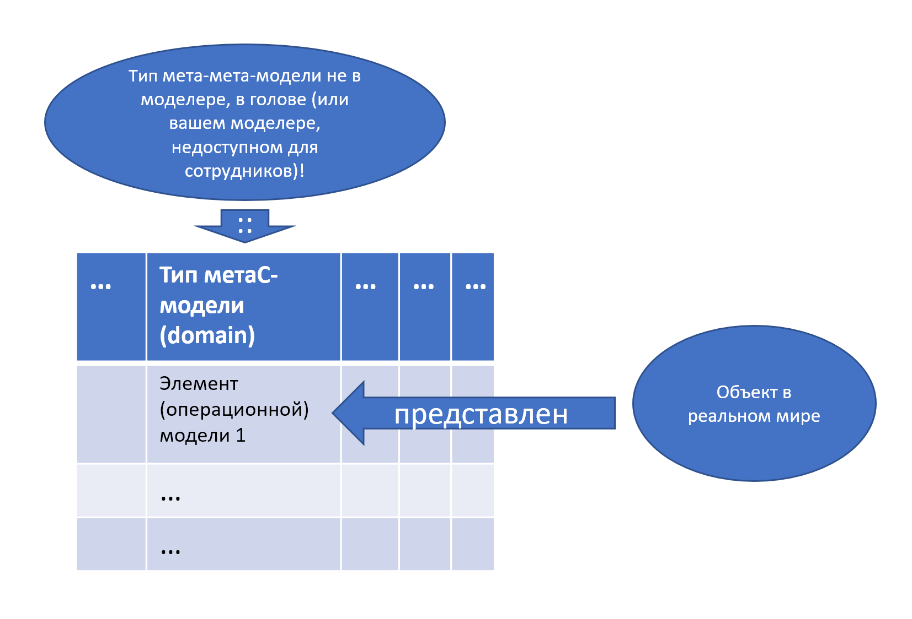

Чтения материала курса абсолютно недостаточно --- это как читать учебник
по езде на велосипеде, без практикования самой езды на физическом
велосипеде не сильно помогает. Ответов на тренажёрные вопросы/quiz
недостаточно --- это как ездить на велосипеде только по прямой, на
специально оборудованной дорожке. Нужно сразу тренироваться в постановке
задач в ваших рабочих проектах и системному мышлению в реальной жизни
(ездить на велосипеде по бездорожью в горах) --- и только тогда цветущая
сложность рабочих проектов начинает отступать и поддаваться
тренированному в системном мышлении мозгу.

**Прежде всего нужно заниматься** **мета-моделированием, то есть
«составлять таблички» и моделированием, то есть «заполнять таблички».
Красивые диаграммы из квадратиков и стрелочек ---** **это
попсовое/бытовое/народное понимание системного моделирования. Таблицы и
даже тексты тут более адекватны. Это и есть системное мышление,**
**причём** **это «мышление письмом», «мышление моделированием». Задания
на моделирование** **(заполнение табличек)** **в нашем курсе ---** **это
и есть первые шаги в системном мышлении.**

Чтение учебника из курса, чтение книги (в ней нет моделирования, а в
курсе моделирование есть) --- это вы не делаете «первые шаги», это вы
просто читаете про «первые шаги». Ответы на вопросы --- это ответы на
вопросы о шагах, а не прошагивание этих первых шагов! А вот когда начали
составлять и заполнять таблички примерно такие же и так же, как в наших
заданиях на моделирование на материале ваших проектов --- всё, это и
есть «системно думать», это вы не читаете о первых шагах, это вы их уже
делаете, уже шагаете по бесконечной дороге системного мышления!

В ходе нашего курса вы уже получите пользу для ваших рабочих проектов от
занятий моделированием, поэтому смело занимайтесь этим моделированием в
рабочее время, а не в отдельное время учёбы! Вы ещё можете заниматься
чтением «учебника» и ответами на тренажёрные вопросы в отдельное учебное
время, но вот выполнением заданий на моделирование по рабочим проектам
надо заниматься прямо в рабочее время, это и есть приложение системного
мышления к рабочим задачам. Если вы откладываете на потом задания по
моделированию в нашем курсе, то это прокрастинация в квадрате: как
прокрастинация обучения, так и прокрастинация сильного мышления в
рабочем проекте.

Основных идей системного подхода немного, каждая из этих идей довольно
быстро понимается. Если выразить системный подход в одном абзаце, то
получится что-то типа *«для* *успеха системы, то есть* *удовлетворения*
*интересов* *внешних проектных ролей* *нужно понять* *функции*
*работающей* *системы в её окружении (сделать концепцию использования),*
*затем* *разобраться в том, как система функционирует* *внутри себя* *и
предложить конструкцию системы, увязав с пространственной компоновкой и
оценками* *совокупной* *стоимости владения (сделать концепцию системы).*
*Принять* *архитектурные* *решения* *(принципы разделения на модули и
организации связей между модулями, совокупность таких решений и есть
«архитектура системы»), оценив множество* *конфликтов между системными
уровнями* *и выбрав наименее плохие решения, ибо хороших решений не
будет* *(никакой устаканенности, сплошные неустроенности!). Добиться
детализации описания системы с точностью, достаточной для изготовления
на выбранной производственной платформе ---* *и изготовить. Получить
основанное на каких-то свидетельствах обоснование того, что система
успешна.* *Эксплуатировать систему, снова и снова повторяя всё сделанное
для улучшения каких-то частей системы, а то и для полного изменения
системы. И для всего этого надо иметь* *систему-создателя (чаще
всего ---* *организацию),* *которая всё это делает, выполняя самые
разные* *работы по лучшим известным методам. Мышление про создателя*
*устроено примерно так же ---* *функциональные части там проектные роли,
конструктивные части ---* *оргзвенья. Это* *мышление и связанные с ним
проектные действия по изменению физического мира проходят* *рекурсивно
на многих уровнях* *рассматривания* *систем* *как частей надсистем и
рассмотрения их как состоящих из частей-подсистем, а также*
*выстраивания цепочек создания из систем-создателей».*

Мы ещё несколько раз сформулируем эту цепочку рассуждений о системе,
чуть более структурировано, в нашем курсе она также называется
«системная мантра».

Проблема даже не в том, что эти предложения в предыдущем абзаце сплошь
состоят из терминов (вроде «концепция использования», «архитектурные
решения», «производственная платформа»), значения которых нужно знать.
Все эти положения глубоко связаны друг с другом и крайне редко
используются поодиночке. Так что требуется некоторая **беглость**
(fluency) в их одновременном и совместном применении --- примерно в том
же смысле, что и беглость пальцев в игре на рояле или наборе текста на
клавиатуре, беглость в говорении на иностранном языке. Каждая клавиша на
рояле или клавиатуре понятно как нажимается, любой котёнок может нажать
клавишу! Клавиш не так уж много. Проблема только в том, чтобы разные
клавиши нажимать вовремя, быстро и такие, какие нужно для получения
музыки, а иногда нажимать несколько клавиш сразу (аккорд). На освоение
компьютерной клавиатуры уходит несколько дней тренировки, но на освоение
рояльных клавиш уходит несколько лет. В освоении системного (и любого
другого) мышления, как и в освоении игры на рояле, нет царских путей,
кроме как множества повторений каких-то операций мышления в ходе
моделирования в разных ситуациях, получение опыта мышления с
использованием системных понятий в жизни. Тренируются операции мышления
прежде всего при составлении и заполнении табличек ровно вот так, как
это происходит при выполнении заданий курса.

Каждая табличка задействует минимум три онтологических уровня
моделирования:

1.  тип типа, указанного в имени колонки таблички, в табличке не
    представлен никак, удерживается в голове составителем таблички
2.  Имя типа в колонке таблички,
3.  Объект в ячейке таблички типа, указанного в колонке таблички.

Обычно в рабочих проектах тип типа в колонке таблички --- это тип из
мета-мета-модели (набора понятий трансдисциплин методов мышления
интеллект-стека, даётся в наших курсах усиления интеллекта, включая наш
курс системного мышления), тип в колонке таблички --- тип из мета-модели
(модели прикладной предметной области рабочего проекта), а в ячейках ---
объекты предметной области. В нашем курсе много табличек с такой
раскладкой типов, но поскольку мы учим ещё и составлять таблички, в
задании могут быть и другие варианты.

Увы, тренировка мышления с использованием типов мета-мета-модели методов
интеллект-стека занимает время. Поэтому интеллект желательно усиливать:
учиться не только читать художественную литературу, обращающуюся к
быстрому мышлению S1, но и литературу со строгой/формальной типизацией
для развития медленного строгого мышления S2, а ещё надо привыкать
самому писать тексты со строим использованием типов, а также не только
«продумывать в голове», но и документировать строгие модели.

Повторим ещё раз, это важно: не пишешь --- не мыслишь, в том числе не
мыслишь системно! Составление и заполнение табличек для рабочего
проекта --- это системное мышление, которое заключается в работе с
трёхуровневой онтологией (трёхуровневой иерархией типов, трёхуровневой
классификацией), и именно это и есть форма, в которой проходит системное
мышление. Конечно, тут может быть множество вариантов, но наиболее
типовой вариант выглядит так:

В этом примере:

-   типы мета-мета-модели (понятия из наших курсов интеллект-стека) как
    типы для колонки таблицы, удерживаются «в голове» и не представлены
    в таблице, вы их не обсуждаете с сотрудниками в рабочем проекте,
    если они не знакомы с системным мышлением. Но вы их используете сами
    для мышления! **Системное мышление как раз в этом: оно будет
    невидимо в таблице, но будет присутствовать, оно нужно для
    присвоения типов объектам «колонка таблицы»!**
-   типы мета-модели (учебник по методам работы в какой-то прикладной
    предметной области проекта как метаУ-модель/«модель из Учебника для
    всех», типы каких-нибудь корпоративных регламентов/инструкций или
    даже стандартов как метаС-модель/«Ситуационная модель --- как у
    нас», на картинке показали только тип метаС-модели) как тип ячеек,
    указываемый в имени колонки таблицы --- и тем самым вы делаете
    присвоение типа для всех объектов в ячейках этой колонки.
-   значения модели (никаких «мета») для каких-то объектов в ячейке из
    строк этой таблицы. Ещё нужно учесть отношение репрезентации между
    описанием в ячейке и каким-то описываемым объектом проекта, его в
    табличке нет, как нет типа мета-мета-модели. Но описываемый объект
    есть, в ячейке только его описание!

Это всё требует беглой работы не с понятиями системного мышления, а с
типами --- беглого владения «теоретической теорией» (theory theory в
теории
понятий)^[<https://iep.utm.edu/th-th-co/>],
а также иерархиями типов (онтология). Освоение такой работы с типами и
онтологиями в нашей учебной программе предусмотрено в курсе
«Рациональная работа», его прохождение --- обязательный пререквизит к
нашему курсу системного мышления.

Беглость в мышлении важна. Если вам трудно заполнять таблички, а каждая
табличка ожидается как приключение на три дня, то вы просто не будете
системно мыслить. Если заполнять таблички --- это для вас дело пяти
минут на каждую табличку, то системное мышление у вас будет. Разница? В
первом случае --- нет беглости, во втором --- беглость есть, ведь
разница в скорости между «делаю первый раз» и «делаю сотый раз» вполне
может быть на порядок, а то и больше. Это как перевод с иностранного
языка: если вы за каждым словом лезете в словарь, на перевод одной
страницы может уйти несколько дней, а если вы уже знаете язык, то вы
просто внимательно читаете исходный текст и пишете текст на иностранном
языке за несколько минут. В какой-то мере системное мышление --- это
тоже иностранный язык, вам нужно уметь переводить «с системного на
предметный, и назад» (с разговора в типах
мета-мета-модели/трансдисциплин на разговор в типах
мета-модели/«прикладных дисциплин методов работы в предметной области
проекта», и назад).

Вот из материалов Viewpoint Research
Institute^[<http://vpri.org/>], тут
обращаются к понятию hard fun (мы уже упоминали это понятие,
предложенное Seymour Papert), системное мышление тоже hard fun:

Мы хотим помочь детям развить реальную беглость (fluency) во многих
областях образования, включая мышление, математику и науки. Каждый из
этих предметов не поддаётся «естественному обучению» (как учатся ходить
и говорить). Довольно много времени и энергии нужно потратить, чтобы
получить беглость выше пороговой. Тут интересное сходство с искусством,
музыкой и спортом, для каждого из них также требуется довольно много
времени и энергии, чтобы получить беглость. Эти искусства могли бы
называться «трудное развлечение» (hard fun). Математики и ученые знают,
что они занимаются искусством, равно как трудным развлечением.
«Мышление» --- это более высокая категория, чем «просто» математика,
наука и искусства. Оно представляет синтез интуитивного и аналитического
подходов к пониманию мира и поведения в нем.

Peter Senge в книге «Пятая
дисциплина»^[<https://en.wikipedia.org/wiki/The_Fifth_Discipline>]
(1990) писал:

Недавно в ходе пятидневного вводного курса, проводимого Обучающим
центром МТИ, одна женщина-менеджер из конструкторского отдела компании
Ford лаконично сформулировала ситуацию: «*Спустя пару дней, ---*
*сказала она, ---* *я начинаю понимать, о чем вся эта история с
системным мышлением и интеллектуальными моделями. Мне это напоминает
время, когда я только начала знакомиться с высшей математикой. Сначала я
чувствовала себя совершенно потерянной. Все это было мне совершенно
чуждо. Но потом я начала* *«схватывать»* *суть. Через год я уже вполне
владела основами этого дела. Через пять лет это стало основой моей
профессии».* Потом она добавила: «*Если бы высшую математику изобрели
сегодня, ни одна из наших корпораций не смогла бы ею овладеть. Мы бы
посылали каждого на трехдневные курсы. Затем каждый получал бы три
месяца на то, чтобы посмотреть, работают ли* *«все эти штуки».* *А когда
выяснялось бы, что они не работают, мы бы начинали пробовать что-нибудь
другое».*

Если заниматься языками, то любой из них можно довести до уровня С1
(достаточный для поступления в европейский вуз) за год, если интенсивно
заниматься --- для языка без флексий (английский, испанский) нужно на
это потратить 600 часов, с флексиями (русский, немецкий) 1100 часов, для
языков совсем другой структуры (китайский, японский) 2200 часов. Если
заниматься год, то в день нужно тратить примерно 1.6, 3 и 6 часов
соответственно, и в интернете можно найти достаточно примеров, как
мотивированные люди выделяли примерно такое время в своём расписании и
достигали успеха. Чтобы достичь в языке мастерства, нужно потратить
порядка 10000 часов (это весьма спорное утверждение, но порядок величины
верный) --- то есть заниматься языком несколько лет. И в случае
иностранного языка это даже не «мыслить» и не узнать о каких-то новых
вещах и их связях, это просто «переназвать известные уже вещи другими
словами»! Системное мышление относится к того же сорта методам: его
нужно практиковать, чтобы добиться беглости использования в жизни, а не
«мыслить со словарём» в тех случаях, когда «решили, что в этом случае
нужно применить системное мышление». И помним, что кроме системного
мышления нужно добиться беглости ещё и в других приёмах качественного
фундаментального мышления. Например, представлять содержание методов
системной инженерии, да и просто быть собранным, чтобы удерживать
внимание в длительных раздумьях и мочь одолеть в три (а не тридцать три)
приёма по нескольку часов каждый книжку на 200 страниц, а не отвлекаться
на социальные сети каждые пятнадцать минут и мочь одолеть в три приёма
только сериал на пять сезонов.

Ситуацию, когда системное мышление имеется на уровне осознанной
компетентности («понял») но, увы, не беглости во владении («освоил»),
при этом в рабочих проектах не применяется, несмотря на его понимание,
мы вообще рассматривать не будем. **Вопрос** **«а в каких проектах
использовать** **системное мышление?»** **примерно такой же, как** **«а
в каких проектах нужно думать?».** **Управление вниманием при помощи
набора понятий системного мышления используется во всех проектах, нет
ведь проектов, которые лучше выполнять с безалаберно выбираемыми из
окружающего мира объектами, бездумно забывая самые разные важные для
выполнения проектов** **методы работы ---** **то забыть проверить**
**воплощение системы на работоспособность** **(выполнить работы метода
инженерных обоснований ---** **тестирование, испытания, трактовку
результатов испытаний), то забыть необходимость** **набрать и
организовать** **команду** **для выполнения проекта** **(удивительно, но
это бывает довольно часто: проект вроде открыт, а командой в нём никто
не озабочен, ресурсов на это не выделяется, ожидается выполнение его уже
на 100% загруженными другой работой агентами).**

Хотя да, проект чистки зубов утром можно выполнять без системного
мышления. Но такие проекты доступны даже детям в детских садах, эти
проекты вообще не требуют сильного интеллекта. А вот где требуется
интеллект, там осмысленно задействовать системное мышление. Нет в жизни
деления на проекты, где мозг включать осмысленно, и где его включать не
осмысленно. А уж когда в проекте участвуют несколько человек, то
системное мышление поможет даже в минимальных дозах: оно хотя и не
скажет, куда именно надо идти, но даст карту местности и тем самым не
даст заблудиться или уйти в центр болота.
